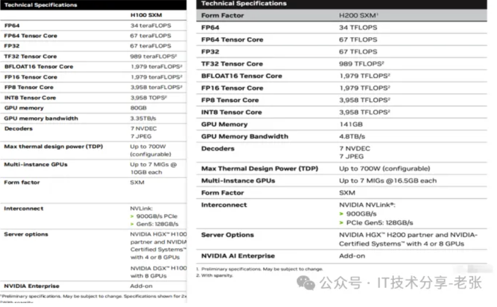
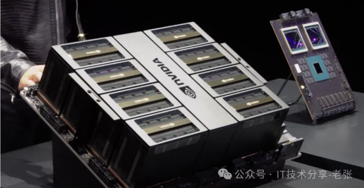
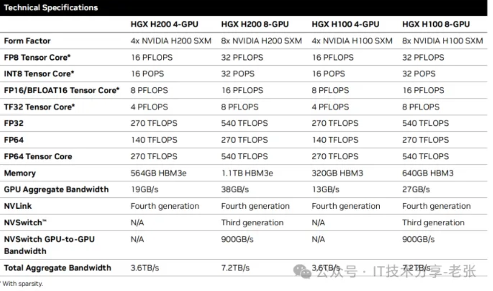

>转载至公众号：IT技术分享-老张

# 前言

最近英伟达GPU热点一直很高，尤其是对H200，B200的讨论，当然也包括GB200，DGX及HGX等，我简单汇总了以下几个问题，我们今天展开聊聊！

- 1、你清楚H200比H100升级了什么吗？B200与B100的区别呢？
- 2、B200和GB200名字看着很像，有何区别与联系呢？
- 3、我们常见到HGX和DGX，他们是什么产品以及两者间的区别和联系？
- 4、HGX H200\B200，DGX H100\B200的官方参数情况

# 一、英伟达H200和H100的变化

作为H100的升级款产品，H200相信大家的关注度挺高，其实从整体参数方面H200只升级了GPU显存相关内容，GPU单卡从80G HBM3升级到了141G HBM3e（显存容量和类型有变化），同时显存带宽从3.35TB/s提升至4.8TB/s，整体参数对比如下：

# 二、英伟达B200和B100的区别

B200和B100都是基于英伟达最新一代Blackwell架构的数据中心GPU，英伟达目前的市场策略是以B200为主，从整体参数上，两者除了显存的规格一致，其他的不同精度的算力、功率有所不同，具体可以见下图，供参考，可以看到B100的TDP是700W，有传言说是为了兼容现有H100的服务器平台（机头）做的设计，但是从综合性能上B200更优，比如FP16算力是H100的2倍以上，同时TDP也提升到了单卡1000W，所以B200的服务器平台需重新设计，与H100的不兼容了。

# 三、B200和GB200，HGX和DGX的区别

1、认识B200和GB200

从名字上看GB200和B200很容易弄混，尤其是新手朋友，便于大家理解我专门找了2张图，最左侧老黄手持就是B200，是标准的英伟达基于Blackwell架构的GPU芯片，而GB200是芯片的“组合”，如中间图所示，是通过一个板子将2颗B200加上一颗Grace CPU（72核心的ARM架构处理器）组合而成，我们一般GPU服务器上是没法用的，定位是专用的“产品”，是英伟达为了搭建NVL72这类GPU“方案级产品”做的设计，如右图所示它是NVL72的算力节点，包括2个GB200。

2、认识HGX和DGX

很多做英伟达GPU生意的朋友肯定都知道HGX，就是我们所说的“模组”，一套HGX 100模组价格高达200w+，如下图所示，HGX产品的核心是8块GPU，通过底板进行整合，同时也集成了NVLink技术和NVLink SW的芯片。这个“大家伙”是英伟达设计的，是H100 SXM GPU直接提供给服务器的厂商的“最小形态”，当然它是无法独立工作的，因为他就是一个“逻辑的大GPU”必须要和服务器平台（机头）组合才能形成一台完整的GPU服务器。

DGX是英伟达品牌的GPU服务器，如下图所示，除了包括最核心的HGX模组外，配套了服务器该有的机箱、主板、电源、CPU、内存、硬盘、网卡等部件。它和我们平时看到的各大服务器厂商推出的基于HGX模组的GPU服务器并无本质区别，英伟达推出DGX 整机和其他服务器厂商形成了竞争关系（又是供应商，又是对手，比较尴尬），一是DGX价格偏高，二是为了避免和服务器厂商的市场冲突，除特定客户外，一般很少见到有主动采购DGX产品的。

# 四、HGX H100和H200的参数情况

以下图片截自英伟达的官方彩页，文章最后我会提供资料获取的方式。

1、HGX H100、HGX H200的参数及对比情况

2、英伟达DGX H100的参数情况

3、英伟达DGX B200的参数情况

