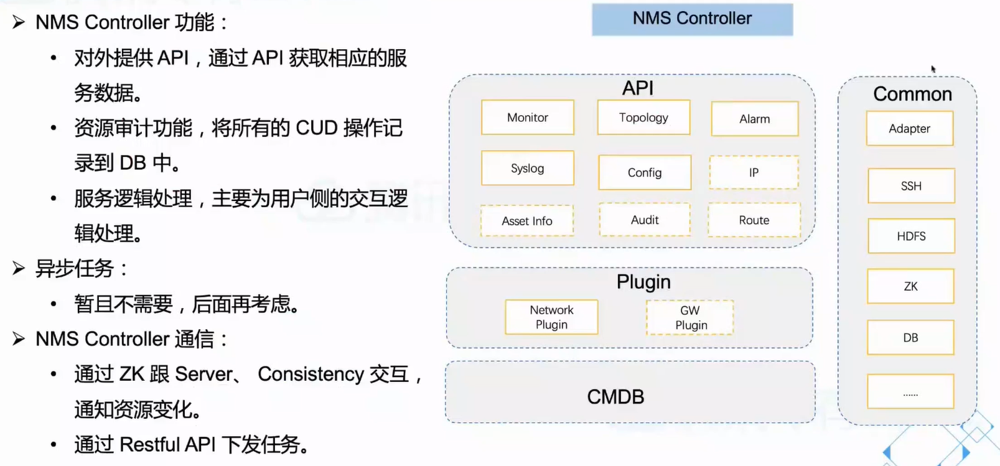
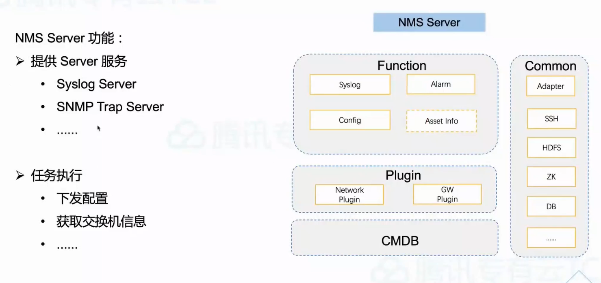
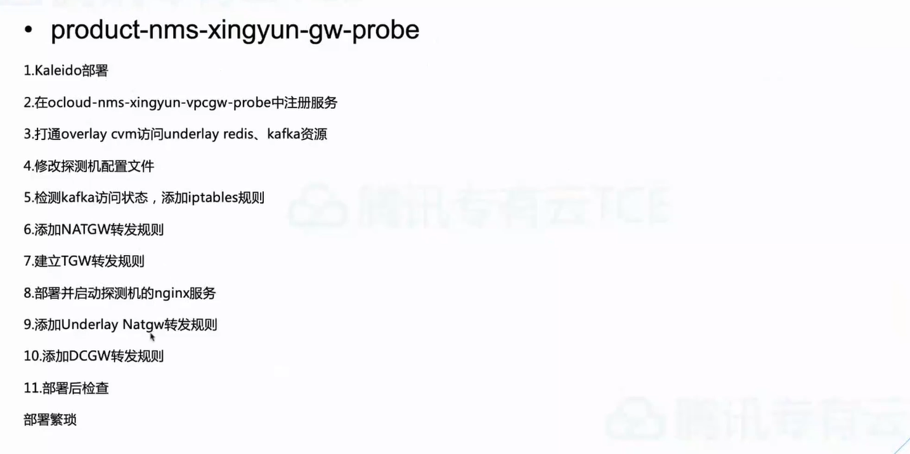
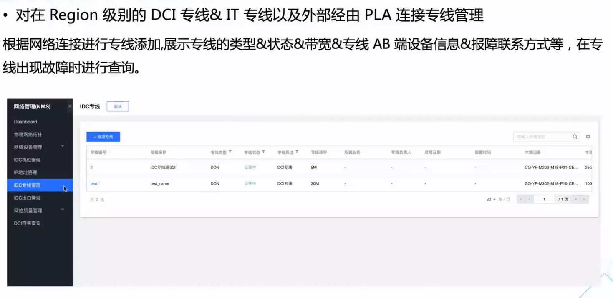

# 网络管理系统-NMS

# 一、产品介绍

## 1.1 产品定义

**定义**：

网络管理（Network Management Service）是集网络设备生命周期和云产品业务配置于一体的管理系统，具有网络设备信息采集、网络设置配置管理、日志管理、告警管理、IP管理、IDC管理等功能。

**场景**：

多用于物理设备配置的信息声明周期管理和物理资源监控等场景

**优势：**

功能丰富、可扩展、高可用

## 1.2 产品功能

## 1.3 应用场景

主要有如下应用场景：

- 物理设备配置的信息生命周期管理：涵盖服务器、网络设置、网络端口、IDC专线等物理信息的声明周期管理
- 物理资源的统一监控与告警

# 二、架构原理

## 2.1 整体架构

## 2.2 NMS Controller

## 2.3 NMS Server

## 2.4 NMS Xinyun

# 三、NMS高可用性

# 四、部署方法

## 4.1 曙光一键部署

## 4.2 生产组件部署

## 4.3 数据导入

## 4.4 配置交换机

# 五、运维管理

## 5.1 控制台Dashboard

## 5.2 物理网络拓扑

## 5.3 网络设备管理

## 5.4 IP地址管理

## 5.5 IDC机位管理

## 5.6 IDC专线管理

## 5.7 IDC出口管理

## 5.8 网络质量管理

## 5.9 DCI容量查询

# 六、常见问题处理

## 6.1 部署操作

问题1

问题2

## 6.2 经典案例

案例1

案例2

