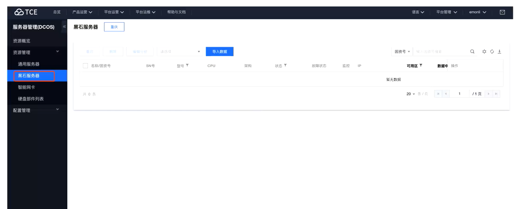
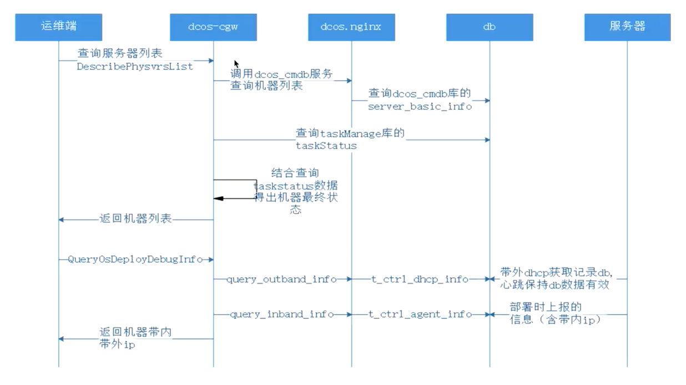
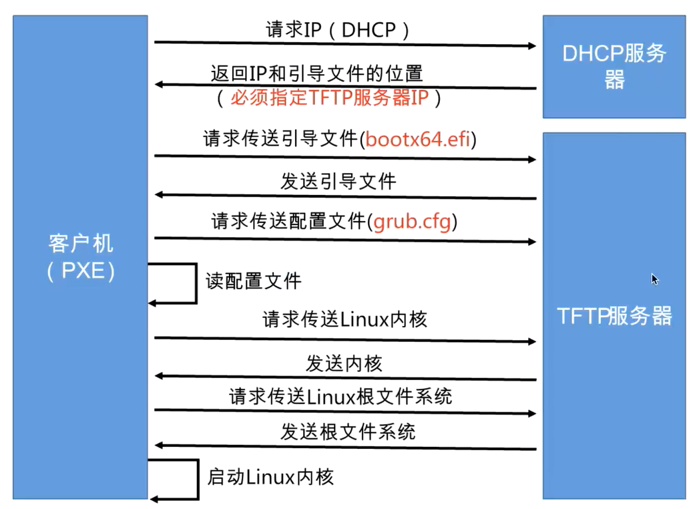
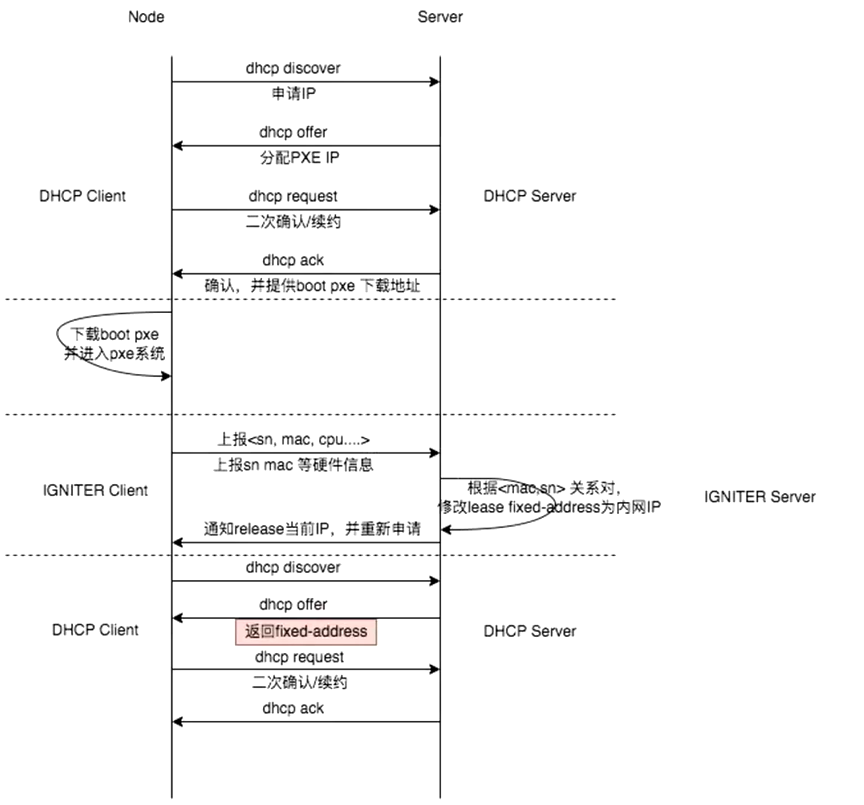
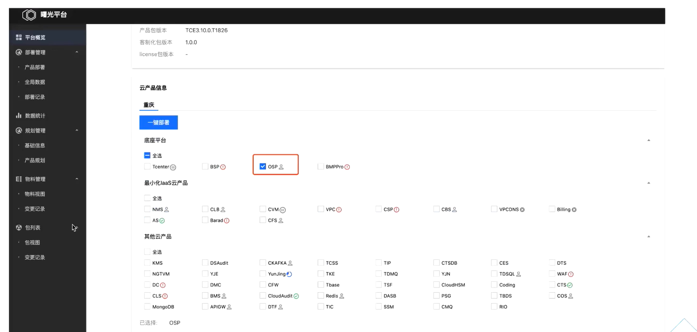
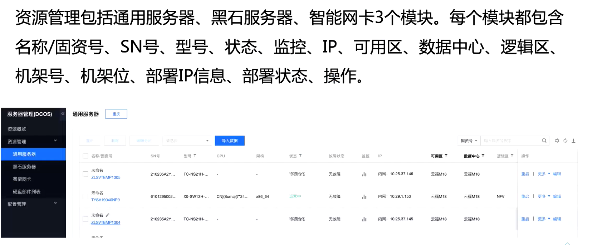
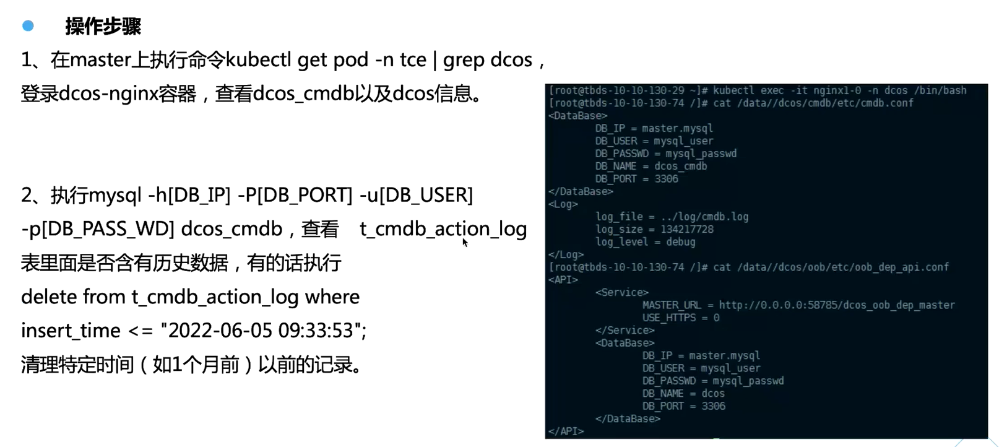
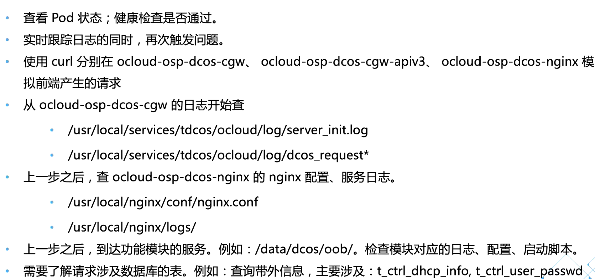

# 基础设施（DCOS）

# 一、产品介绍

## 1.1 DCOS概述

## 1.2 DCOS物理资源生命周期管理

## 1.3 DCOS涉及术语

## 1.4 功能介绍

详细功能

## 1.5 TCE3100新增功能

### 1.5.1 资源概览

### 1.5.2 Igniter部署引擎

### 1.5.3 黑石服务器

# 二、架构原理

## 2.1 整体设计

## 2.2 用户界面设计

## 2.3 网络架构

## 2.4 请求详细流程

### 2.4.1 服务器列表

### 2.4.2 PXE部署

### 2.4.3 开关机、重启、带外重置

### 2.4.4 带外帐号查询

### 2.4.5 PXE启动流程

### 2.4.7 igniter发现流程

### 2.4.8 igniter装机流程

### 2.4.9 对比TCE380架构上的差异

# 三、部署介绍

## 3.1 曙光一键部署

## 3.2 人工操作步骤

第一步

第二步

## 3.3 对比TC380部署差异

# 四、常用操作指导

## 4.1 资源管理

## 4.2 物理服务器配置信息导入

# 五、运维巡检

## 5.1 日常巡检列表

## 5.2 检查容器基本健康状态

## 5.3 检查数据库表定期清理历史数据

## 5.4 查看容器内内存使用情况

## 5.5 检查物理机监控数据是否正常

# 六、应急预案

## 6.1 DCOS双物理节点故障（IP不变）

## 6.2 DCOS双物理节点故障（IP变化）

## 6.3 机房掉电故障

# 七、常见故障&典型案例

## 7.1 DCOS故障处理流程

## 7.2 带外操作等异步任务下发失败

## 7.3 前端无法列出服务器列表

## 7.4 对比T380差异

