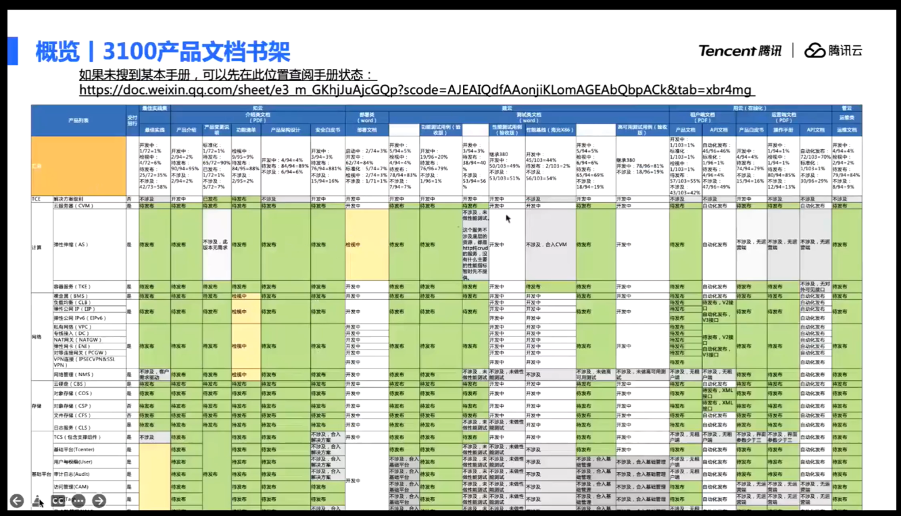
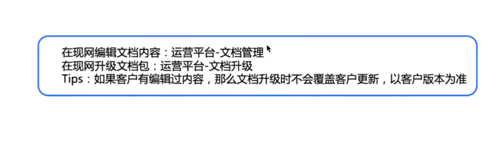
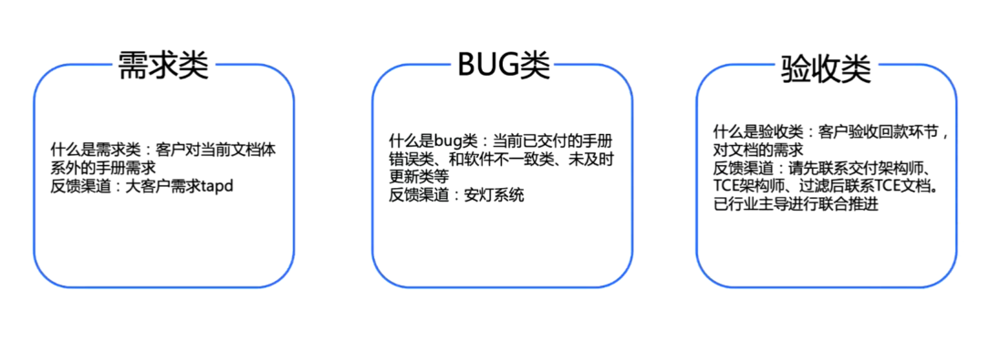
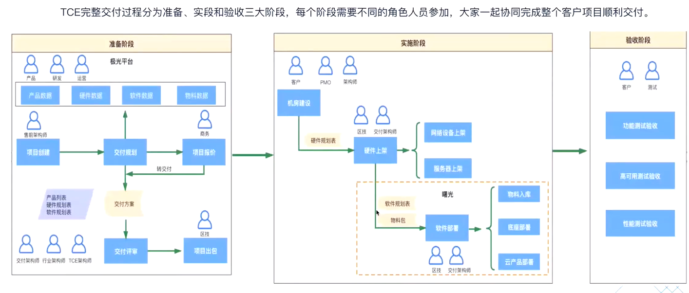

# TCE3100平台

# 一、TCE平台演进

## 1.1 TCE 2022重点版本演进路线

## 1.2 TCE 核心产品能力的演进

## 1.3 其他重点规划方向

# 二、交付文档介绍

## 2.1 概览

### 2.1.1 文档声明周期全景图

交付给客户的文档，其生命周期如下：

### 2.1.2 3100文档书架

发布/未发布的文档目录

### 2.1.3 文档发布位置

### 2.1.4 3100重大更新

更精简、更实用、

## 2.2 交付场景

### 2.2.1 通用阅览	

### 2.2.2 按项目交付

### 2.2.3 客户现网交付

## 2.3 问题定位思路

### 2.3.1 需求类

# 三、交付过程总览

## 3.1 交付框架

### 3.1.1 TCE软件架构

### 3.1.2 TCE交付演进

### 3.1.3 TCE服务级别

### 3.1.4 TCE多AZ部署架构

### 3.1.5 TCE多Region部署架构

## 3.2 TCE交付总览

### 3.2.1 交付过程

### 3.2.2 交付工序

### 3.2.3 交付系统

### 3.2.4 极光交付规划

### 3.2.5 曙光软件部署

### 3.2.6 云产品部署过程

### 3.2.7 自动化测试CTS

## 3.3 项目交付进展图

