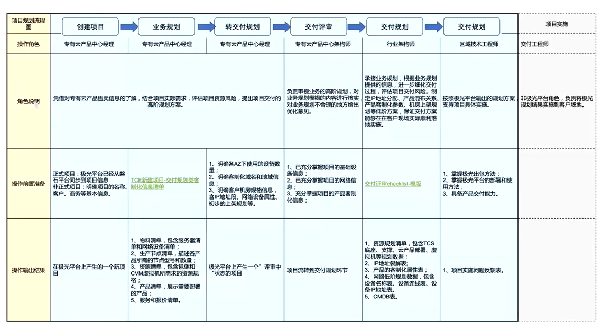
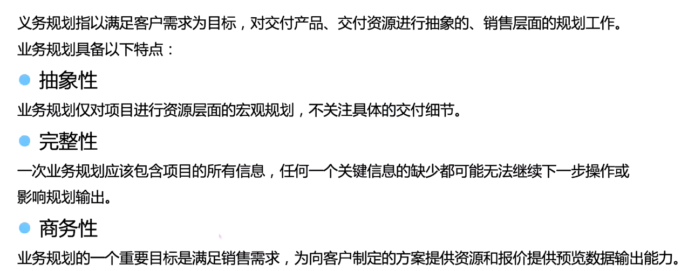
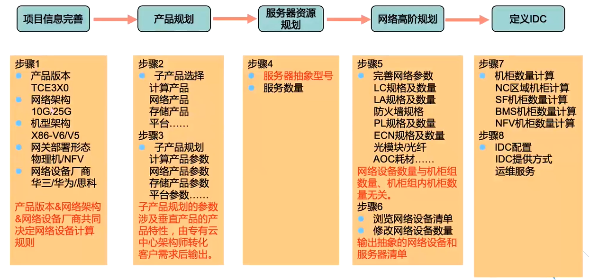
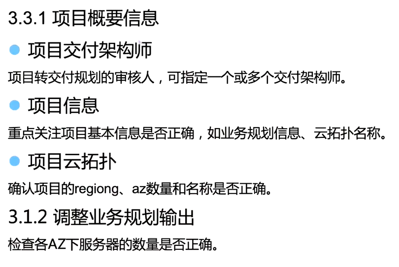
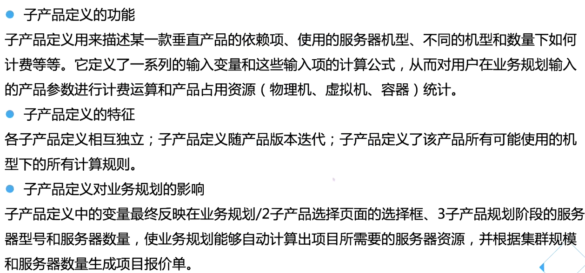
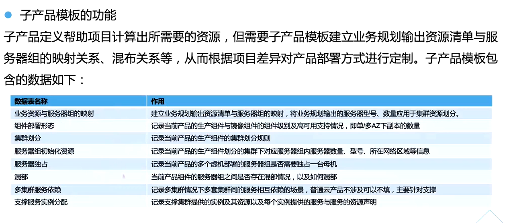
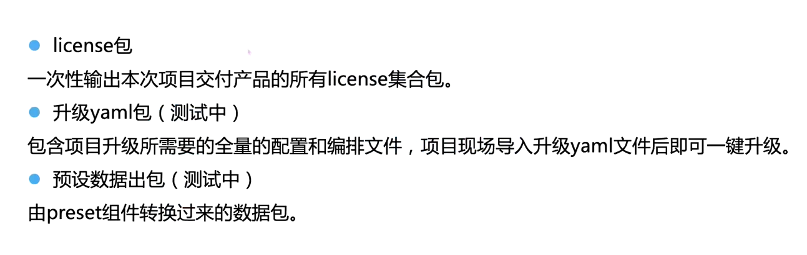
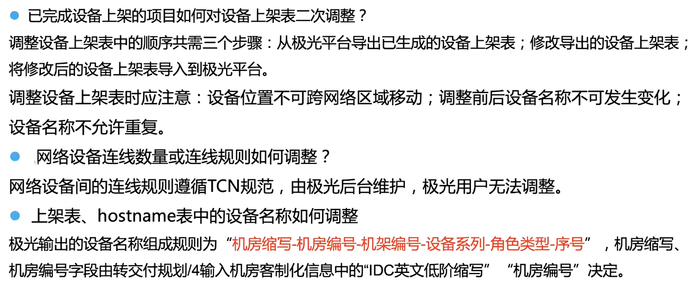
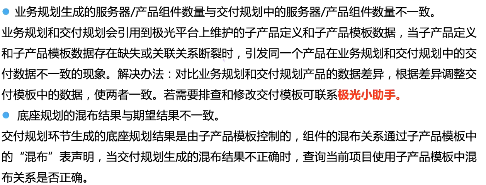

# 极光介绍

# 一、极光介绍

极光有什么用？

## 1.1 数据维护

## 1.2 项目信息管理

项目规划、产品报价

## 1.3 交付支持

# 二、项目规划SOP

## 2.1 极光项目规划角色及职责划分

# 三、业务规划

## 3.1 什么是业务规划

## 3.2 业务规划介绍

## 3.3 制作业务规划

## 3.4 转交付规划

# 四、交付规划

## 4.1 交付规划介绍

## 4.2 制作交付规划

# 五、注意事项

## 5.1 项目规划注意事项

## 5.2 交付规划注意事项

# 六、模板管理

## 6.1 子产品定义介绍

子产品模块介绍

# 七、出包管理

## 7.1 极光出包类型介绍

# 八、常见问题

## 8.1 规划类问题

## 8.2 模版类问题

