---
title: 服务器日志收集与分析
date: 2022-07-06 11:19:52
categories:
- 测试
- 信创POC测试
tags:
- 
---23952000000040761600

# 服务器日志收集与分析

# 一、日志收集

## 1.1 基本信息收集

### 1.1.1 服务器状态确认

服务器故障的6个状态，根据不同的状态来收集日志

| 序   | 机器状态                             | 收集信息                                             | 主要部件                        |
| ---- | :----------------------------------- | ---------------------------------------------------- | ------------------------------- |
| 1    | 无供电输入                           | 机器外观检查（开关面板、主板灯、PSU灯、供电线、PDU） | PSU、主板、PDU                  |
| 2    | 有供电输入，无法启动                 | BMC日志                                              | 主板、CPU、DIMM000内存、BMC     |
| 3    | 可以启动但无法完成POST自检           | BMC日志、串口输出                                    | 主板、内存、CPU、BIOS           |
| 4    | POST自检完成，但没有开始加载操作系统 | BMC日志、串口输出、RAID卡日志                        | PCIE设备、硬盘、操作系统、主板  |
| 5    | 操作系统开始加载，但加载失败         | BMC日志、串口输出                                    | 操作系统、主板、CPU、BIOS、CPLD |
| 6    | 操作系统加载完成，但运行中意外中断   | BMC日志、串口输出、操作系统日志                      | 内存、CPU、主板、操作系统、软件 |

### 1.1.2 日志收集场景

| 故障场景                      | 信息收集                  |
| ----------------------------- | ------------------------- |
| 所有故障                      | BMC一键日志（长城BMC）    |
| 服务器启动异常                | 串口日志                  |
| 操作系统死机-死机状态下       | 检查内存ECC、重传         |
| 操作系统死机-重启恢复后       | 操作系统日志、阵列卡日志  |
| 操作系统意外重启-重启恢复后   | 操作系统日志、阵列卡日志  |
| 操作系统意外重启-安排时间压测 | 检查内存ECC、重传         |
| 硬盘、阵列卡故障              | 阵列卡日志、硬盘SMART日志 |
| 网络相关故障                  | 操作系统日志、网络拓扑图  |

## 1.2 BMC日志

### 1.2.1 BMC一键收集日志

**<font color=red>长城服务器方法</font>**

通过BMC日志一键导出功能，可以拿到日志文件压缩包：

​	文件名例如：bmc_logs_YYYY_MM_DD_hh_mm_ss.tar.gz

日志文件描述和作用如下图所示：

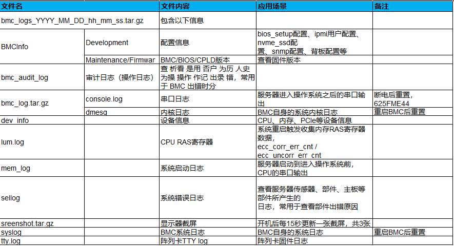

### 1.2.2 传感器事件日志

传感器（SEL）事件日志：主要包含温度、系统、电压、电流、电源和风扇所产生的日志  

#### 1.2.2.1 事件主体

事件主体分为：传感器类型 + 传感器码ID，如图所示：

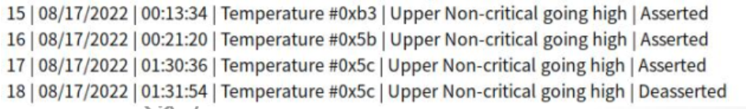

#### 1.2.2.2 传感器代码ID和释义


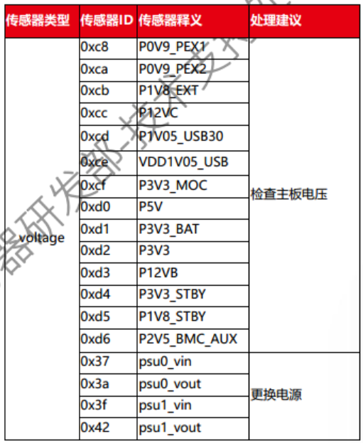


#### 1.2.2.3 事件描述

| 事件描述                         | 构成释义   |
| -------------------------------- | ---------- |
| Lower Non-critical going low     | 低警告     |
| Lower Non-critical going high    | 低警告     |
| Lower Critical going low         | 低严重警告 |
| Lower Critical going high        | 低严重警告 |
| Lower Non-recoverable going low  | 低不可恢复 |
| Lower Non-recoverable going high | 低不可恢复 |
| Upper Non-critical going low     | 高警告     |
| Upper Non-critical going high    | 高警告     |
| Upper Critical going low         | 高严重警告 |
| Upper Critical going high        | 高严重警告 |
| Upper Non-recoverable going low  | 高不可恢复 |
| Upper Non-recoverable going high | 高不可恢复 |

#### 1.2.2.4 事件状态

事件分为两个状态：

- Asserted：已产生
- Deasserted：已处理  

### 1.2.3 部件事件日志

部件事件日志：主要包含硬盘、内存、PSU所产生的日志  


### 1.2.4 审计日志

查看用户历史操作记录，常用 于 BMC 出错时分析是否为人为操作出错  

日志格式：

操作日志主要由操作对象、操作对象信息、操作内容和操作时间构成 。

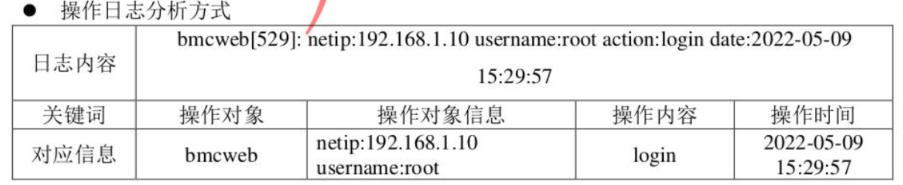

### 1.2.5 串口位置

一般服务器后置设有 CPU0 系统串口, 下图中编号③是RJ45规格的 CPU0 系统串口  

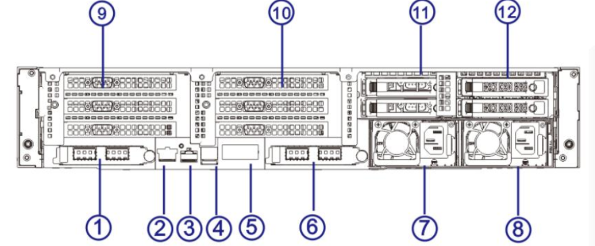


# 二、飞腾S2500 CPU特性和问题排查

## 2.1 CPU架构解释

### 2.1.1 对称多处理器架构

SMP（SymmetricalMulti-Processing）对称多处理器架构

所谓对称多处理器结构，是指服务器中多个CPU对称工作，无主次或从属关系。各CPU共享相同的物理内存，每

个 CPU访问内存中的任何地址所需时间是相同的，因此SMP也被称为一致存储器访问结构(UMA：UniformMemory 

Access)。

例如一个主板能放置4颗CPU，若每颗4核，一共就有16个核心，在这种架构下，多个CPU对应一个内存，内存控制

器也是只有一个的，当其中的一个CPU去与内存控制器进行交互的时候，其它CPU此时此刻不能同时与内存控制器

交互，即每个CPU通过相同的内存总线访问相同的内存资源，因此随着CPU数量的增加，内存访问冲突将迅速增

加，最终会造成CPU资源的浪费，使 CPU性能的有效性大大降低  


### 2.1.2 NUMA架构

NUMA（Non-Uniform Memory Access Architecture，非一致性内存访问）架构

NUMA是一种分布式存储器访问方式,处理器可以同时访问不同的存储器地址，大幅度提高并行性。NUMA 系统的节

点通常是由一组 CPU 和本地内存组成。由于每个节点都有自己的本地内存,因此全系统的内存在物理上是分布的,每

个节点访问本地内存和访问其它节点的内存的延迟是不同的。每个核访问内存的时间取决于内存相对于处理器的位

置，访问本地内存(本节点内)会更快一些。Linux 内核从2.5 版本开始支持 NUMA 架构,现在的操作系统也提供了丰富

的工具和接口,帮助我们完成就近访问内存的优化和配置。操作系统如果可以根据任务所在CPU去分配本地内存，

就是基于CPU NUMA亲和性考虑 。


## 2.2 飞腾CPU特性和问题排查

### 2.2.1 FT2000+ CPU架构

FT2000+/64 处理器芯片集成的 64 个处理器核心，一个芯片共有 8 个 NUMA 节点，分别对应为 Panel0~7。每个 

Panel 中有两个 Cluster(每个 Cluster 包含 4 个处理器核心)、4M 二级 cache、两个本地目录控制部件(DCU)、一个片

上网络路由器节点(Cell)和一个紧密耦合的访存控制器 (mcu)


### 2.2.2 S2500 CPU架构

相对于FT2000+，S2500增加了L3 cache和DLU（直通模块）。同一个 NUMA 节点的两个核通过 cell 内部来通

讯，不同的 Panel 之间通过内部总线来通讯，PCIe控制器挂在 Panel0 上。S2500 支持 2、4、8 路，socket 之间通过 

FIT 来进行通讯 。

NUMA 架构下，不同的核访存性能是有较大的差异的，节点内访问本地内存性能最优，socket 内跨节点访存次之，

跨 socket 访存最差。  


### 2.2.3 飞腾CPU NUMA特性使用注意事项

飞腾 CPU 是遵循 NUMA 架构特征设计的处理器，处理器本身并不支持“关闭 NUMA”的功能。目前，BIOS 或
OS 层面所谓“关闭 NUMA”只是关闭上层软件层面的对 NUMA 特性的感知，硬件的 NUMA 特性依然存在。这种假
的“关闭 NUMA”的软件做法，会导致应用的实际运行性能无法正确体现硬件的真实能力，严重降低系统的实际运行
效率。而且，这种软件错误掩盖硬件 NUMA 特性的使用方式，还会导致系统跨 NUMA 访问操作超出应用正常行为该
有的访问量，对系统的稳定性也会带来一定程度的损害。
因此，要求飞腾 CPU 系统必须打开 NUMA 特性，这是处理器设计、实现的硬件特性，软件无法将其正确关闭  


\1. Linux 内核从 2.5 版本开始支持 NUMA 架构，要求 BIOS 和 OS 根据 CPU 的 NUMA 设计实际情况正确使用
这些特性，特别注意不要直接将这些软件特性关闭。
\2. 使用绑核等措施，利用 cpu 的亲和性和内存的分配策略，让进程与内存的距离“更短”，达到最优性能。绑核
手段包含不限于：内核态的 sched_setaffinity 接口；用户态的 numactrl 工具；典型的业务软件绑核配置，例如
Nginx 的 nginx.conf 文件中的 worker_cpu_affinity 参数
\3. 合理适配内核代码，通过 pcie numa 特性，让外设识别自己的 numa 域，让 DMA 分配“更近”，达到最优
性能。典型的内核接口 set_dev_node(struct device *dev, int node);
\4. 根据业务场景合理配置外设，减少业务数据的跨 Panel，跨 socket 的数据访问  


### 2.2.4 S2500 直连接口 FIT 信号介绍

腾云 S2500 实现了四路直连接口，通过直连接口将多个腾云 S2500 单芯片连接起来，组成一个支持全局数据共
享的系统，并且之间可以共享全局内存地址空间。
腾云 S2500 处理器共 4 个直连接口，每个接口组成为 4 Lane，单 Lane 速率 25Gbps。  

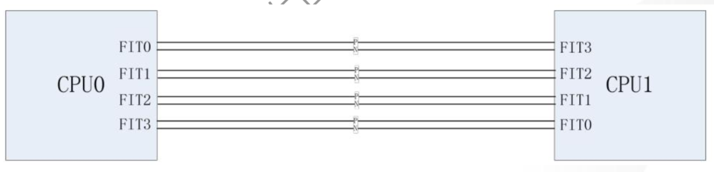

### 2.2.5 FIT误码

FIT 链路的稳定性是机器运行的基础，为避免后期由于主板稳定性而导致的量产出货问题，特此增加误码测试。
误码测试：更新误码测试专用BIOS，重启机器后自动进入误码测试，一个CPU发送伪随机码，另一个CPU接收并
进行判定，通过服务器串口监控误码测试情况。误码标准为：5小时低于20个。  


### 2.2.6 重传次数计数器  

误码测试是在物理层的测试，重传计数是数据链路层记录的。数据经过数据链路层，每发生一次误码，就会使得
数据链路层触发重传。重传主要用于排查片间连接 FIT 时是否发生某些错误信息，协助定位问题点。
重传测试：通过操作系统下跨路stream测试，产生CPU之间的数据流量压力。重传计数可通过带内工具或带外工
具获取，测试开始前后各读取一次重传值，计算重传增长情况。重传标准为：每小时低于10个。  

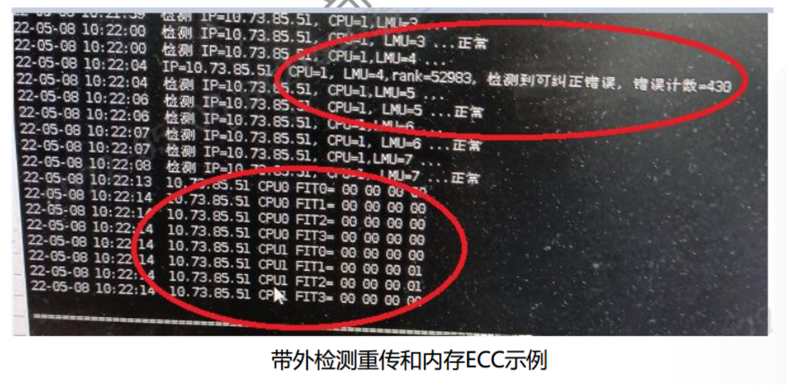

### 2.2.7 FIT 误码问题排查  

F625通用BMC固件625FME50 版本后，加入误码数值超阈值上报BMC事件日志的功能  

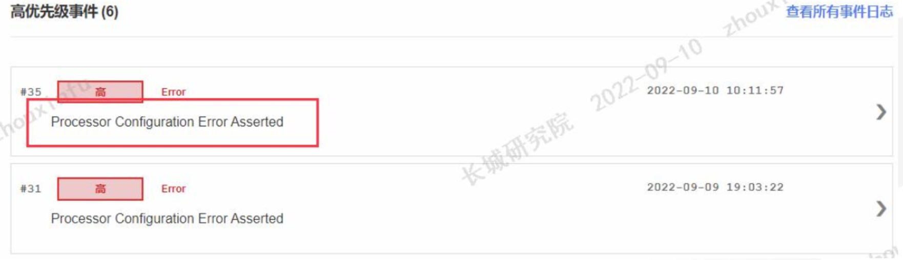


带外、带内脚本监控FIT误码和重传数量的脚本使用方法，参考内存问题排查章节中的“带外内存ECC和重传检
测”。  


如误码或重传测试结果超出标准，针对F625的建议解决方案如下，针对F630则跳过第2、3步。
\1. 检查主板上是否有散热膏等异物沾污，先清理异物；
\2. 使用电源烧录固件V1.4更新电源固件，优化电源固件环参；
\3. 更新BIOS版本至625FBE55GW或以上，优化FIT链路参数；
\4. 重新测试误码、重传，如未解决问题，更换主板  

## 2.3 内存问题排查  

### 2.3.1 内存报错类型  

correctable error & uncorrectable error

 Correctable error，如果错误能被检测和纠正，则认为是可纠正错误。这可以通过重试读取或使用ECC数据计算
正确的存储器内容并将正确的数据写回到存储器中来实现。
CE通常是Single Bit Error，也可能是某些类型的Multi-bit error（Intel X86 CPU支持的SDDC能检查并纠正一位
或多位（最大4位）内存故障）。通常CE是soft error引起的，如果CE长时间存在在同一位置，则可能是潜在的Hard
error。
Uncorrectable error，不可纠正的错误是平台无法纠正的multi-bit错误。 这些可能是由soft errors或hard
errors的任意组合引起的，但通常是由于多个hard errors而发生的。
运行时遇到UCE，可能导致灾难性的处理器崩溃或死机，需要重新启动受影响的服务器，并替换位于错误根源的
组件。  

### 2.3.2 内存问题排查方法  

• 每个内存通道提供ECC错误寄存器，记录可纠正错误和不可纠正错误
• 可通过带内工具或带外工具获取内存ECC计数值
• 重启服务器后内存ECC计数将清零，如遇宕机情况，需要在机器重启前检查ECC计数
• 内存ECC标准：可纠正错误每小时增长少于6000个，不可纠正错误为0  


F625通用BMC固件625FME50 版本后，加入内存ECC报错超阈值上报BMC事件日志的功能。  

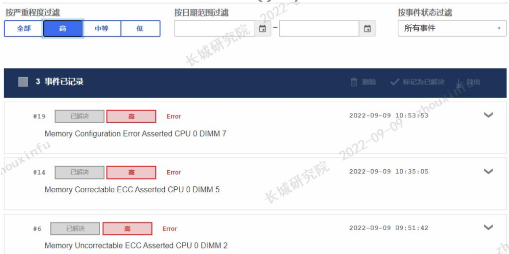


操作系统日志中，Internal error 代码96000210一般由内存硬件故障引起  

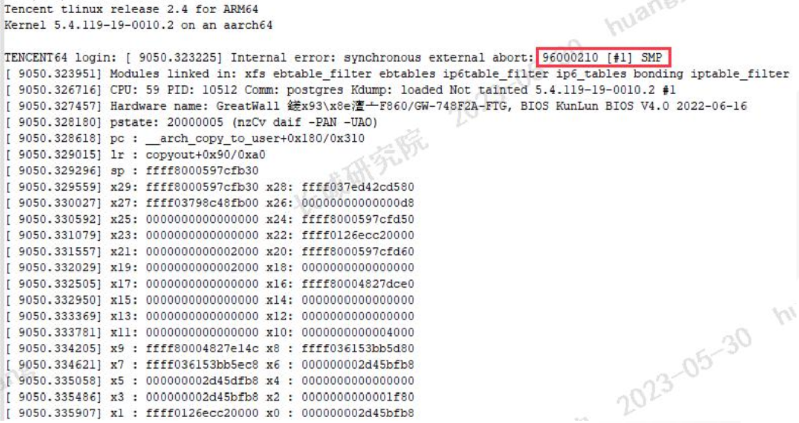

### 2.3.3 内存压测方法

#### 2.3.3.1 带内压测内存和ECC检测（适用所有服务器）  

```shell
一、准备
	1. 固件版本无特殊要求
	2. 操作系统建议是麒麟V10 SP1
	3. ECC误码检测工具脚本工具包:ecc_check.V1.0.10.zip

二、上传检测工具到待测机器
	1. ecc_check.V1.0.10.zip复制到桌面和进入目录，解压
		unzip ecc_check.V1.0.10.zip
	2. 进入解压目录，修改执行权限，依次输入指令：(需要root权限)
	sudo -s //输入root密码
	chmod 751 *  

三、运行脚本
	1. 执行memtester内存压力测试脚本，命令：
	sudo ./start_test.sh
	（压测所需时间和内存容量大小相关，512GB 可能需要4-8小时，
	期间需要暂停系统其他业务）
	如果不需要测memtester内存压力，只查询内存ECC命令：
	./ecc_check.sh
	2. 等待测试完成  
```


#### 2.3.3.1 带外压测内存和ECC检测（适用于F625和F630）

1、将gw_batch_ecc_check脚本拷入到堡垒机中  

2、编辑iplist.txt文件将需要测试的服务器的BMC的IP地址/用户名/密码/ssh端口号(可选, 默认为22) 填入iplist.txt
中，保存退出 


3、修改batch_ecc_check.py的权限，运行sudo ./batch_ecc_check.py，默认一次，可打印  

4、 Result输出相应的log，里面有独立的log和合在total文本，里面记录软硬件版本信息，温度信息，内存型号和
容量以及内存ECC和CPU重传情况，可以单独或者合在一起查看。
每次测完要单独建立一个文件夹保存起来，否则下次执行会被清除掉  


## 2.4 硬盘问题排查

### 2.4.1 硬盘SMART日志  

SMART的目的是监控硬盘的可靠性、预测磁盘故障和执行各种类型的磁盘自检。如今大部分的ATA/SATA、
SCSI/SAS和固态硬盘都搭载内置的SMART系统。作为行业规范，SMART规定了硬盘制造厂商应遵循的标准，满足
SMART标准的条件主要包括  

1. 在设备制造期间完成SMART需要的各项参数、属性的设定；
2.  在特定系统平台下，能够正常使用SMART；通过BIOS检测，能够识别设备是否支持SMART并可显示相关信息，而且能辨别有效和失效的SMART信息；
3.  允许用户自由开启和关闭SMART功能；
4.  在用户使用过程中，能提供SMART的各项有效信息，确定设备的工作状态，并能发出相应的修正指令或警告  

### 2.4.2 收集SMART日志的方法

针对JBOD硬盘，阵列卡基本不会进行管理，硬盘报错将直接传递到操作系统。因此监控JBOD硬盘状态主要依靠
操作系统日志和硬盘SMART日志。  

收集SMART日志方法：smartctl -a /dev/sdX（硬盘对应的盘符）  


针对配置阵列里的硬盘，阵列卡会监控并记录硬盘状态和报错信息，可通过阵列卡日志和硬盘SMART日志分析硬
盘状态。针对阵列里的硬盘，收集SMART日志的方法如下  

1、通过storcli命令查看对应硬盘的did，例如：/storcli /call show all  


2、收集SMART日志，did替换成上一步查询到的did值：smartctl -a -d megaraid,did /dev/sdX  

### 2.4.3 硬盘SMART日志内容

硬盘基本信息：  

包含硬盘厂家、原厂model、SN等基本信息  


硬盘整体状态：  

硬盘的每项SMART信息中都有一个临界值（阈值），SMART针对各项的当前值、最差值和临界值的比较结果以
及数据值进行分析后，提供硬盘当前的评估状态，是判断硬盘健康状态的重要信息。根据SMART的规定，状态一般有
正常、警告、故障或错误三种状态。
SMART判定这三个状态与SMART的 Pre-failure/advisory BIT（预测错误/发现位）参数的赋值密切相关，当
Pre-failure/advisory BIT=0，并且当前值、最差值远大于临界值的情况下，为正常标志。当Pre-failure/advisory
BIT=0，并且当前值、最差值大于但接近临界值时，为警告标志；当Pre-failure/advisory BIT=1，并且当前值、最差
值小于临界值时，为故障或错误标志硬盘整体健康状态结果  

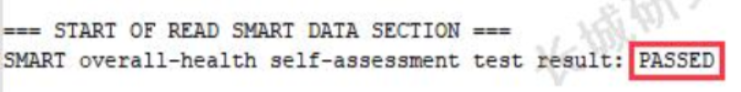


SMART具体检测项 ：

> ID，通常是一个1到255之间的十进制或十六进制的数字，表示硬盘的各项检测参数。各硬盘制造商的绝大部分SMART ID代码所代表的参数含义是一致的，但厂商也可以根据需要使用不同的ID代码，或者根据检测项目的多少增减ID代码，不同厂家可能出现相同ID不同定义。

> ATTRIBUTE_NAME，硬盘制造商
> 定义的属性名，即某一检测项目的名称，
> 是ID代码的文字解释。  

> 当前值（value），当前值是各ID项在硬盘运行时根据实测原始数据（Raw value）通过公式计算的结果，
> 1到253之间（最大正常值通常为100、200或253）。253意味着最好情况，1意味着最坏情况。随着使用损耗或出现错误，当前值会根据实测数据而不断刷新并逐渐减小。当前值接近临界值意味着发生故障的可能性增大，是判定硬盘健康状态或推测寿命的依据之一。  

> 最差值（Worst），最差值是硬盘运行时各ID项曾出现过的最小的value。最差值是对硬盘运行中某项数据变劣的峰值统计，该数值也会不断刷新。通常，最差值与当前值是相等的，如果最差值出现较大的波动（小于当前值），表明硬盘曾出现错误或曾经历过恶劣的工作环境（如温度）。 

> 临界值（Threshold） ，在报告硬盘FAILED状态前，Worst可以允许的最小值。临界值是硬盘厂商指定的表示某一项目可靠性的阈值，通过特定公式计算而得。如果某个参数的当前值接近了临界值，就意味着硬盘将变得不可靠。由于临界值是硬盘厂商根据自己产品特性而确定的，因此用厂商提供的专用检测软件往往会跟第三方软件的检测结果有较大出入。  

> 原始值(RAW_VALUE)，数据值是硬盘运行时各项参数的实测值，大致可以分为三类：
> 1）数据值不直接反映硬盘状态，必须经过硬盘内置的计算公式换算成当前值才能得出结果；
> 2）数据值是直接累计的；
> 3）有些参数的数据是即时数，如Temperature（温度）的数据值是30，表示硬盘的当前温度是30℃。  

> TYPE，属性的类型（Pre-fail或Oldage）。Pre-fail类型的属性可被看成一个关键属性，表示参与磁盘的整体SMART健康评估（PASSED/FAILED）。如果任何Pre-fail类型的属性故障，那么可视为磁盘将要发生故障。另一方面，Oldage类型的属性可被看成一个非关键的属性（如正常的磁盘磨损），表示不会使磁盘本身发生故障。  

> WHEN_FAILED
> 如果VALUE小于等于THRESH，会被设置成“FAILING_NOW”，需要尽快备份重要文件，特别是属性是Prefail类型时。如果WORST小于等于THRESH会被设置成“In_the_past”，代表属性已经故障了，但在运行测试的时候没问题。如果都不是，会被设置成“-”。  


### 2.4.4 Self-test结果

显示硬盘运行SMART test的结果，SMART test可分为offline/short/long等类型，业务机器一般选用short test，
且建议无业务负载下运行。  

SMART short test测试命令：smartctl -t short /dev/sdX  


### 2.4.5 硬盘原厂日志  

批量硬盘本体不良时需要抓取，抓取的日志仅原厂可解读  

- 东芝：tsbdrv工具
- 西数：Hugo工具
- 希捷：SeaDragon 工具

## 2.5 阵列卡问题排查  

阵列卡日志收集方法 : 

```shell
torcli /c0 show alilog 阵列卡属性、事件日志、TTY日志等
storcli /c0 show all 阵列卡及相关部件的概要信息
storcli /c0 show events 事件日志
storcli /c0 show termlog TTY日志（固件日志）
storcli /c0/pall show all PHY链路相关信息
storcli /c0/bbu show all 阵列卡电池相关信息
storcli /c0/cv show all 阵列卡超级电容相关信息
storcli /c0/dall show all 硬盘组相关信息
storcli /c0/eall show all 硬盘背板相关信息
storcli /c0/eall/sall show all 物理硬盘相关信息
storcli /c0/vall show all 虚拟硬盘相关信息  
```

阵列卡日志分析 : 

storcli /c0 show all包含：

- 阵列卡型号
- 序列号
- 阵列卡时间和系统时间
- 固件版本
- 驱动版本
- 默认设置
- 功能  


- 硬盘拓扑  


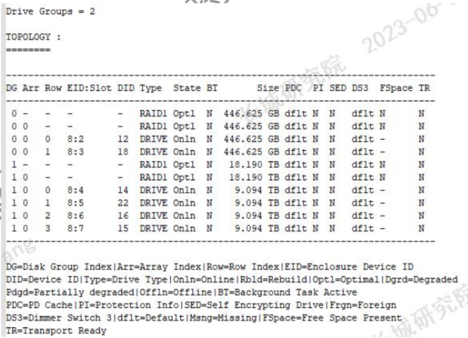

- 虚拟盘清单  


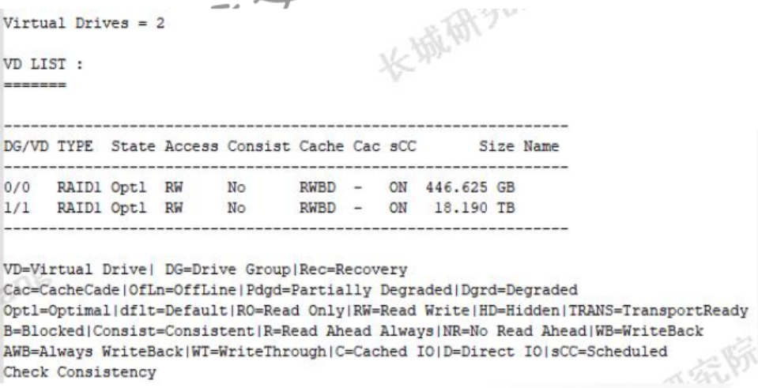

- 物理盘清单  


