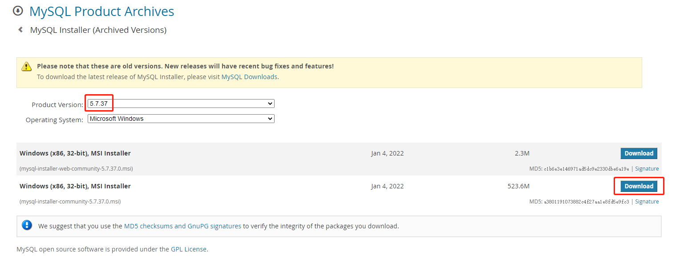

## 1 MySQL数据库的安装

### 1.1 版本获取

版本选择

```shell
目前用的较多的是5.6 / 5.7 / 8.0 三个版本
生产环境大多用5.X
其中5.6版本在2021年2月暂停更新支持，这意味着MySQL 5.6会有安全风险，请及时升级到MySQL 5.7或是MySQL 8系列
本文选用5.7版本
```

windows版本下载地址

```shell
https://downloads.mysql.com/archives/installer/
```



### 1.2 安装


## 2 数据库的基本操作

