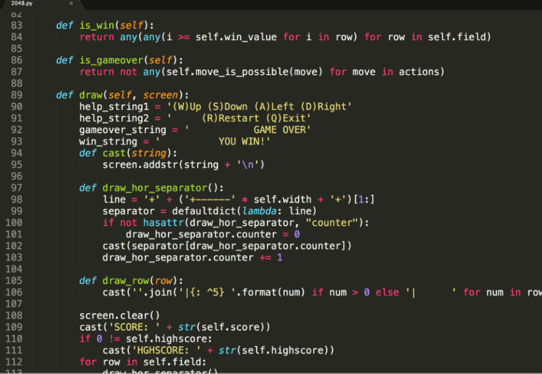

# 目标

- 注释的作用
- 注释的分类及语法
- 注释的特点

# 一、注释的作用

- 没有注释的代码，不明白函数的功能，一眼懵



- 添加注释的代码，条理清晰


> - 说明，这就是注释的作用，能够大大增强程序的可读性。

# 二、注释的分类及语法

注释分为两类：==单行注释== 和 ==多行注释==。

- 单行注释

只能注释一行内容，语法如下：

```python
# 注释内容一
# 注释内容二
```

- 多行注释

可以注释多行内容，一般用在注释一段代码的情况， 语法如下：

```python
"""
	第一行注释
	第二行注释
	第三行注释
"""

'''
	注释1
	注释2
	注释3
'''
```

> 快捷键：`ctrl + /`

## 2.1 快速体验

- 单行注释

``` python
# 输出hello world
print('hello world')

print('hello Python')  # 输出(简单的说明可以放到一行代码的后面，一般习惯代码后面添加两个空格再书写注释文字)
```

- 多行注释

``` python
"""
    下面三行都是输出的作用，输出内容分别是：
    hello Python
    hello itcast
    hello itheima
"""
print('hello Python')
print('hello itcast')
print('hello itheima')


'''
    下面三行都是输出的作用，输出内容分别是：
    hello Python
    hello itcast
    hello itheima
'''
print('hello Python')
print('hello itcast')
print('hello itheima')
```

> 注意：解释器不执行任何的注释内容。

