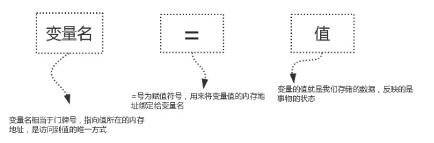

## 一 引入

我们知道学习 **Python** 语言的目的是为了与计算机进行沟通/交流，从而控制计算机帮助我们做一些事情，所以，在 **Python** 语言的所有语法中，每个语法存在的意义都是为了让计算机能够像人类一样，直白地讲，就是让计算机具备我们人类的某一项技能。这是我们理解后续所有 **Python** 语法的根本，一定要熟记。


## 二 变量

## 一、什么是变量？

```python
# 变量就是可以变化的量，量指的是事物的状态，比如人的年龄、性别，游戏角色的等级、金钱等等
```

## 二、为什么要有变量？

```python
# 为了让计算机能够像人一样去记忆事物的某种状态，并且状态是可以发生变化的
# 详细地说：
# 程序执行的本质就是一系列状态的变化，变是程序执行的直接体现，所以我们需要有一种机制能够反映或者说是保存下来程序执行时状态，以及状态的变化。
```


## 三、怎么使用变量（先定义、后使用）

### 3.1、变量的定义与使用

变量的定义由三部分组成，如下图



定义变量示范如下

```python
name = 'Jason' # 记下人的名字为'Jason'
sex = '男'    # 记下人的性别为男性
age = 18      # 记下人的年龄为18岁
salary = 30000.1  # 记下人的薪资为30000.1元
```

解释器执行到变量定义的代码时会申请内存空间存放变量值，然后将变量值的内存地址绑定给变量名，以变量的定义age=18为例，如下图

插图：定义变量申请内存

通过变量名即可引用到对应的值

```python
# 通过变量名即可引用到值，我们可以结合print()功能将其打印出来
print(age) # 通过变量名age找到值18，然后执行print(18),输出：18
```

### 3.2、变量名的命名规范

变量名的命名应该见名知意

```python
# 如果我们要存储的数据18代表的是一个人的年龄，那么变量名推荐命名为age
age = 18 
# 如果我们要存储的数据18代表的是一个人的等级，那么变量名推荐命名为level
level = 18
```

其他详细规范如下

```python
# 命名规范
1. 变量名只能是 字母、数字或下划线的任意组合
2. 变量名的第一个字符不能是数字
3. 关键字不能声明为变量名，常用关键字如下
['and', 'as', 'assert', 'break', 'class', 'continue', 'def', 'del', 'elif', 'else', 'except', 'exec', 'finally', 'for', 'from','global', 'if', 'import', 'in', 'is', 'lambda', 'not', 'or', 'pass', 'print', 'raise', 'return', 'try', 'while', 'with', 'yield']

# 错误示范如下：
*a=123
$b=456
c$=789
2_name='lili'
123='lili'
and=123
年龄=18 # 强烈建议不要使用中文命名

# 正确示范如下
age_of_jason=31
page1='首页'
_class='终极一班'
```

### 3.3、变量名的命名风格

```python
# 风格一：驼峰体
AgeOfTony = 56 
NumberOfStudents = 80
# 风格二：纯小写下划线(在python中，变量名的命名推荐使用该风格)
age_of_tony = 56 
number_of_students = 80
```

### 3.4、变量值的三大特性

变量的值具备三大特性

```python
#1、id
反应的是变量在内存中的唯一编号，内存地址不同id肯定不同

#2、type
变量值的类型

#3、value
变量值
```

查看变量值三大特性的方式如下，我们将会在运算符中用到变量值的三大特性

```python
>>> x='Info Tony:18'
>>> id(x),type(x),x
4376607152，<class 'str'>,'Info Tony:18'
```

了解：[Python是一门解释型的强类型动态语言](https://zhuanlan.zhihu.com/p/113408690)


## 三、常量

## 3.1、什么是常量？

常量指在程序运行过程中不会改变的量

## 3.2、为什么要有常量？

在程序运行过程中，有些值是固定的、不应该被改变，比如圆周率 3.141592653...

## 3.3、怎么使用常量？

在Python中没有一个专门的语法定义常量，约定俗成是用全部大写的变量名表示常量。如：PI=3.14159。所以单从语法层面去讲，常量的使用与变量完全一致。


## 视频链接：

[https://www.bilibili.com/video/av73342471?p=4www.bilibili.com/video/av73342471?p=4](https://link.zhihu.com/?target=https%3A//www.bilibili.com/video/av73342471%3Fp%3D4)