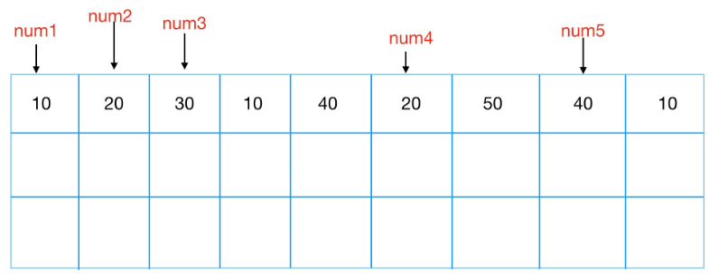
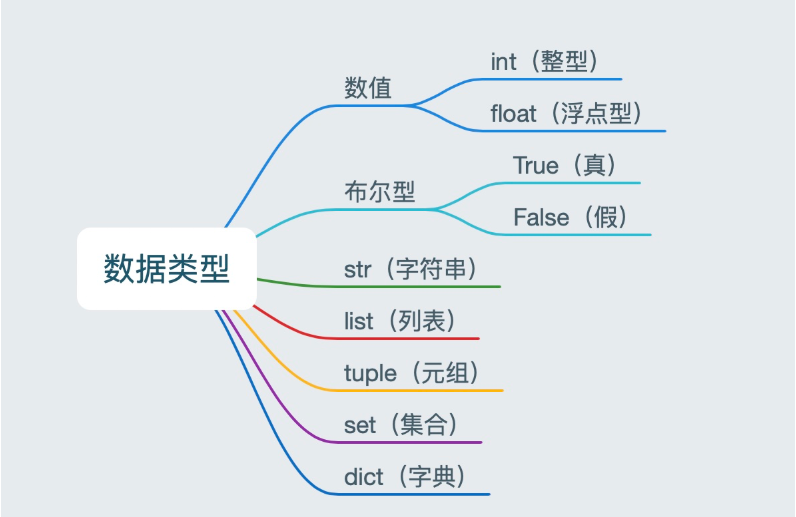

day04 Python变量与数据结构

# 一、注释

## 1.1 注释的作用

没有注释的代码，不明白函数的功能，一眼懵 


添加注释的代码，条理清晰


> 这就是注释的作用，能够大大增强程序的可读性。

## 1.2 注释的分类及语法

注释分为两类：`单行注释`和`多行注释`

- 单行注释，只能注释一行内容，语法如下：

```python
# 注释内容一
# 注释内容二
```

- 多行注释，可以注释多行内容，一般用在注释一段代码的情况， 语法如下：

```python
"""
	第一行注释
	第二行注释
	第三行注释
"""

'''
	注释1
	注释2
	注释3
'''
```

> PyCharm快捷键：`ctrl + /`

案例如下：

- 单行注释

``` python
# 输出hello world
print('hello world')

print('hello Python')  # 输出(简单的说明可以放到一行代码的后面，一般习惯代码后面添加两个空格再书写注释文字)
```

- 多行注释

``` python
"""
    下面三行都是输出的作用，输出内容分别是：
    hello Python
    hello itcast
    hello itheima
"""
print('hello Python')
print('hello itcast')
print('hello itheima')


'''
    下面三行都是输出的作用，输出内容分别是：
    hello Python
    hello itcast
    hello itheima
'''
print('hello Python')
print('hello itcast')
print('hello itheima')
```

> 注意：解释器不执行任何的注释内容。


# 二、变量

## 2.1 什么是变量？

相对于内存而言：

- 变量就是存储数据的的时候，当前数据所在的`内存地址的名字`而已。


对于程序而言：

- 数据都是临时存储在内存中，为了更快速的查找或使用这个数据，通常我们把这个数据在内存中存储之后定义一个名称，这个名称就是变量。


就例如：

图书馆中的`书（数据）`都有一个对应的`编号（内存地址）`，而`变量`就是给这个`编号`起的一个`别名`



## 2.2 使用变量

### 2.2.1 变量的定义与使用

变量的定义由三部分组成，如下图


定义变量：

```python
name = 'Jason' # 记下人的名字为'Jason'
sex = '男'    # 记下人的性别为男性
age = 18      # 记下人的年龄为18岁
salary = 30000.1  # 记下人的薪资为30000.1元
```

使用变量：

```python
# 通过变量名即可引用到值，我们可以结合print()功能将其打印出来
print(age) # 通过变量名age找到值18，然后执行print(18),输出：18
```

### 2.2.2 变量的内存管理

变量的内存管理 --- 垃圾回收机制

什么是垃圾呢？当一个变量值被当值的变量名的个数为0时，该变量无法被访问，被称为垃圾

案例：

```python
# 引用计数增加
x=10	# 值10的引用计数为1
y=x		# 值10的引用计数为2
z=x		# 值10的引用计数为2

# 引用计数减少
del x	# 解除变量名x和值10的绑定关系，值10的引用计数减为2
del y	# 解除变量名y和值10的绑定关系，值10的引用计数减为1
print(z)	# 可以正常输出10

# 重新绑定
z=12345	# 解除变量名z与值10的绑定关系，重新与值12345绑定，值10的引用计数减为0，会当作垃圾回收
```

>补充：
>
>ID不同，值可能相同，也可能不相同
>
>ID相同，值一定相同

### 2.2.3 变量名的命名规范

一个原则，见名知意：

```python
# 如果我们要存储的数据18代表的是一个人的年龄，那么变量名推荐命名为age
age = 18 
# 如果我们要存储的数据18代表的是一个人的等级，那么变量名推荐命名为level
level = 18
```

四个规范：

- 由数字、字母、下划线组成

- 不能数字开头

- 不能使用内置关键字

  ```python
  # 常见的内置关键字
  ['and', 'as', 'assert', 'break', 'class', 'continue', 'def', 'del', 'elif', 'else', 'except', 'exec', 'finally', 'for', 'from','global', 'if', 'import', 'in', 'is', 'lambda', 'not', 'or', 'pass', 'print', 'raise', 'return', 'try', 'while', 'with', 'yield']
  ```

- 严格区分大小写

案例如下：

```python
# 错误示范如下：
*a=123
$b=456
c$=789
2_name='lili'
123='lili'
and=123
年龄=18 # 强烈建议不要使用中文命名

# 正确示范如下
age_of_jason=31
page1='首页'
_class='终极一班'
```

### 2.2.4 变量名的命名风格

- 见名知义
- 大驼峰：即每个单词首字母都大写，例如：`MyName`
- 小驼峰：第二个（含）以后的单词首字母大写，例如：`myName`
- 下划线：例如：`my_name`（多用于：变量名）

### 1.2.4 变量值的三大特征

- ID：变量在内存中的唯一编号，内存地址不同id肯定不同
- Type：变量值的类型
- Value：变量值

案例：

```python
>>> x='Info Tony:18'

# 分别查看ID、Type和Value
>>> id(x),type(x),x
4376607152，<class 'str'>,'Info Tony:18'
```

## 2.3 is与==运算

在Python中`is`与`==`的区别是什么？

is：比较左右两个变量的ID是否相等

==：比较左右两个变量的Value是否相等

案例:

```python
# 定义两个Value相同的变量
>>> x = 888	# id 2255586515312
>>> y = 888	# id 2255586518896

# 用“==”判断Value是否相等
>>> print(x==y)
True

# 用"is"判断ID是否相等
>>> z = x
>>> print(x is y)
False
>>> print(x is z)
True
```

## 2.4 小整数池

前面不是说重新定义变量，会重新分配内存空间吗，为什么像如下的情况，变量`p的ID`和`o的ID`是一样的?

```python
>>> o = 10
>>> p = 10
>>> id(o)
2255585477136
>>> id(p)
2255585477136
```

因为Python解释器从启动的那一刻开始，就会在内存中`事先申请`一系列内存空间，`存放常用的整数`，以节省内存空间提高效率，可见如下案例：

```python
>>> q = 4
>>> w = 6
>>> id(q)
2255585476944
>>> id(w)
2255585477008

# 经历加法后，id变成一样
>>> e = q + 6
>>> r = w + 4
>>> id(e)
2255585477136
>>> id(r)
2255585477136
```

>以上实验在CMD中运行，在PyCharm中会进一步优化，结果可能不同

## 2.4 常量

在程序运行过程中，有些值是固定的、不应该被改变，比如圆周率 3.141592653...

常量就是指像PI这种在程序运行过程中不会改变的量

在Python中没有一个专门的语法定义常量，约定俗成是用`全部大写的变量名`表示常量

```python
# 定义常量
PI=3.14159
```

所以单从语法层面去讲，常量的使用与变量完全一致。


# 三、数据类型简介

为应对不同的业务需求，Python中也把数据分为不同类型



检测数据类型的方法：`type()`，比如

```python
a = 1
print(type(a))  # <class 'int'> -- 整型

b = 1.1
print(type(b))  # <class 'float'> -- 浮点型

c = True
print(type(c))  # <class 'bool'> -- 布尔型

d = '12345'
print(type(d))  # <class 'str'> -- 字符串

e = [10, 20, 30]
print(type(e))  # <class 'list'> -- 列表

f = (10, 20, 30)
print(type(f))  # <class 'tuple'> -- 元组

h = {10, 20, 30}
print(type(h))  # <class 'set'> -- 集合

g = {'name': 'TOM', 'age': 20}
print(type(g))  # <class 'dict'> -- 字典
```

## 3.1 数字类型

### 3.1.1 int整型

用来记录人的年龄，出生年份，学生人数等整数相关的状态

案例如下：

```python
age = 18
birthday = 1990
student_count = 48
```

### 3.1.2 float浮点型

用来记录人的身高，体重，薪资等小数相关的状态

案例如下：

```python
height = 172.3
weight = 103.5
salary = 15000.89
```

### 3.1.3 数字类型的使用

1 、数学运算

```python
>>> a = 1
>>> b = 3
>>> c = a + b
>>> c
4
```

2、比较大小

```python
>>> x = 10
>>> y = 11
>>> x > y
False
```

## 3.2 字符串类型String

作用：用来记录人的名字，家庭住址，性别等描述性质的状态

字符串可以用`单引号`、`双引号`或者`多引号`定义，案例如下：

```python
name = 'Tony'
address = '上海市浦东新区'
sex = '男'
hobby = "篮球"
age = '''
	18岁
	狗年生
'''
```

PS：各种引号定义字符串的注意事项

```python
#1、需要考虑引号嵌套的配对问题
msg = "My name is Tony , I'm 18 years old!" #内层有单引号，外层就需要用双引号

#2、多引号可以写多行字符串
msg = '''
        天下只有两种人。比如一串葡萄到手，一种人挑最好的先吃，另一种人把最好的留到最后吃。
        照例第一种人应该乐观，因为他每吃一颗都是吃剩的葡萄里最好的；第二种人应该悲观，因为他每吃一颗都是吃剩的葡萄里最坏的。
        不过事实却适得其反，缘故是第二种人还有希望，第一种人只有回忆。
'''
```

### 3.2.1 字符串的特殊使用

```python
数字可以进行加减乘除等运算，字符串呢？也可以，但只能进行"相加"和"相乘"运算。
>>> name = 'tony'
>>> age = '18'
>>> name + age #相加其实就是简单的字符串拼接
'tony18'
>>> name * 5 #相乘就相当于将字符串相加了5次
'tonytonytonytonytony'
```

## 3.3 列表list[]

### 3.3.1 作用

用来记录多个同种属性的值（比如同一个班级多个学生的姓名、同一个人的多个爱好等），并且存取

都十分方便

### 3.3.2 定义

```python
>>> stu_names=['张三','李四','王五']
```

### 3.3.3 使用

```python
# 1、列表类型是用索引来对应值，索引代表的是数据的位置，从0开始计数
>>> stu_names=['张三','李四','王五']
>>> stu_names[0] 
'张三'
>>> stu_names[1]
'李四'
>>> stu_names[2]
'王五'

# 2、列表可以嵌套，嵌套取值如下
>>> students_info=[['tony',18,['jack',]],['jason',18,['play','sleep']]]
>>> students_info[0][2][0] #取出第一个学生的第一个爱好
'play'
```

## 3.4 字典dict{}

### 3.4.1 作用

如果我们需要用一个变量记录多个值，但多个值是不同属性的，这就用到字典类型，字典类型是用`key:value`形

式来存储数据，其中key可以对value有描述性的功能

### 3.4.2 定义

```python
>>> person_info={'name':'tony', 'age':18, 'height':185.3}
```

### 3.4.3 使用

```python
# 1、字典类型是用key来对应值，key可以对值有描述性的功能，通常为字符串类型
>>> person_info={'name':'tony','age':18,'height':185.3}
>>> person_info['name']
'tony'
>>> person_info['age']
18
>>> person_info['height']
185.3

# 2、字典可以嵌套，嵌套取值如下(用列表套字典)
>>> students=[
... {'name':'tony','age':38,'hobbies':['play','sleep']},
... {'name':'jack','age':18,'hobbies':['read','sleep']},
... {'name':'rose','age':58,'hobbies':['music','read','sleep']},
... ]
>>> students[1]['hobbies'][1] #取第二个学生的第二个爱好
'sleep'
```


## 3.5 布尔bool

### 5.1 作用

用来记录真假这两种状态

### 3.5.2 定义

```python
>>> is_ok = True
>>> is_ok = False
```

### 3.5.3 使用

```python
通常用来当作判断的条件，我们将在if判断中用到它
```


## 3.6 集合set{}

### 3.6.1 作用

在Python中，集合（set）是无序的、元素不重复的集合

### 3.6.2 定义

```python
set01 = {'num1', 'num2'}
```

### 3.6.3 集合运算

```python
# 1、定义集合
>>> admins = {'Justin', 'caterpillar'}
>>> users = {'momor', 'hamini', 'Justin'}

# 2、使用in判断元素在集合
>>> 'Justin' in admins	
True

# 3、交集
>>> admins & users
{'Justin'}

# 4、并集
>>> admins | users
{'hamini', 'caterpillar', 'Justin', 'momor'}

# 差集
>>> admins - users
{'caterpillar'}

# 对称集
>>> admins ^ users
{'hamini', 'caterpillar', 'momor'}

# 集合比大小
>>> admins > users
False
>>> admins < users
False
>>>
```


## 3.7 元组tuple()

### 3.7.1 作用

`tuple` 可以做什么？有时候想返回一组值，但是这组值又不想定义某个类型，就可以使用元组

### 3.7.2 定义

`tuple` 定义后，里面的值就无法修改

```python
# 1、创建元组的方式-1
>>> 10,
(10,)
>>> 10, 20, 30,
(10, 20, 30)

# 2、创建元组的方式-2
>>> mytup=(1, 2, 3)
>>> mytup
(1, 2, 3)

>>> type(mytup)
<class 'tuple'>

# 尝试修改元组的值
>>> mytup[0] = 3
## 会报错
Traceback (most recent call last):
  File "<stdin>", line 1, in <module>
TypeError: 'tuple' object does not support item assignment
```

