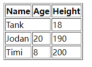

"Python的进阶方向之一：Web开发，在这之前需要了解常用的前端知识，这篇文章主要介绍HTML的简单使用"

# 1 创建表格

> 作用：`table`标签用于展示数据

## 1.1 使用场景

一组数据需要以表格方式展示，例如：

| Name  | Age  | Height |
| ----- | ---- | ------ |
| Tank  | 18   | 172    |
| Jodan | 20   | 190    |
| Timi  | 8    | 200    |

## 1.2 数据表格化

```html
<table>
    <thead>	# 表格头
        <tr>	# 一个tr表示一行
            <th>Name</th>	# th加粗文本
            <th>Age</th>
            <th>Height</th>
        </tr>
    </thead>
    <tbody>	# 表格内容
        <tr>
            <td>Tank</td>	# td正常文本
            <td>18</td>
            <td>172</td>
        </tr>
		....
    </tbody>
</table>
```

效果如下图:


给表格添加外边框

```html
<table border="1">
```

效果如下图：


## 1.3 单元格`(行)`合并

```html
<td colspan="2">Tank</td>
```

效果如下图：



## 1.4 单元格`(列)`合并

```html
<td rowspan="2">20</td>
```

效果如下图:


# 2 创建表单

> 作用：
>
> 获取前端用户输入的数据（用户输入的，用户选择的，用户上传的等）
>
> 基于网络发送给后端服务器

2.1 创建表单

```html
<form action=""></form>
```

其中`action`的作用与参数：

作用：

​	控制数据提交的后端路径(给哪个服务端提交数据)

参数：

- 什么都不写：默认就是朝当前页面所在的url提交数据
- 写全路径：https://www.baidu.com  朝百度服务端提交
- 只写路径后缀`action="/index/"`：  
      自动识别出当前服务端的ip和port拼接到前面，即：`host:port/index/`

## 2.2 input标签

```html
<input type="text" id="username"></input
```

**input标签的常用`type`**

- text:普通文本

- password:密文

- date:日期	

- submit:用来触发form表单提交数据的动作，点击后表单清空，内容被提交

- button:就是一个普普通通的按钮 本身没有任何的功能 但是它是最有用的，学完js之后可以给它自定义各种功能

- reset:重置内容，表单内容清空，内容不提交

- radio:单选

  默认选中要加checked='checked'

  ```html
   <input type="radio" name="gender" checked='checked'>男
  ```

  当标签的属性名和属性值一样的时候可以简写

  ```html
   <input type="radio" name="gender" checked>女
  ```

- checkbox:多选

  ```html
  <input type="checkbox" checked>DBJ
  ```

- file:获取文件  也可以使用`multiple`一次性获取多个文件

  ```html
  <input type="file" multiple>
  ```

- hidden:隐藏当前input框

  

**input标签常用`属性`：**

- value: 添加默认值

  ```html
  <label for="d1">username:<input type="text" id="d1" name="username" value="默认值"></label>
  ```

- disable：禁用控件

  ```html
  <label for="d1">username:<input type="text" id="d1" name="username" value="默认值" disable></label>
  ```

- readonly：控件只读

  ```html
  <label for="d1">username:<input type="text" id="d1" name="username" value="默认值" readonly></label>
  ```


## 2.3 label标签

实现`点击输入框的名称`就能`将光标定位到输入框`

使用案例：

```html
<label for="passwd">Password:
    <input type="password" id="passwd">
</label>
```

## 2.4 select标签

select标签 默认是单选 可以加mutiple参数变多选 默认选中selected

```html
<select name="" id="" multiple>
    <option value="" selected>新垣结衣</option>
    <option value="" selected>斯佳丽</option>
    <option value="">明老师</option>
</select>
```

可以使用`optgroup`标签给选项分组

```html
<select name="" id="">
    <optgroup label="上海">
        <option value="" selected>浦东</option>
        <option value="" selected>黄埔</option>
        <option value="" selected>青埔</option>
    </optgroup>
    <optgroup label="北京">
        <option value="" selected>朝阳</option>
        <option value="" selected>昌平</option>
        <option value="" selected>沙河</option>
    </optgroup>
</select>
```

## 2.5 案例

整合2.1-2.4的案例

```html
<!doctype html>
<html lang="en">
<head>
    <meta charset="UTF-8">
    <meta name="viewport"
          content="width=device-width, user-scalable=no, initial-scale=1.0, maximum-scale=1.0, minimum-scale=1.0">
    <meta http-equiv="X-UA-Compatible" content="ie=edge">
    <title>Document</title>
</head>
<body>
<!--    学习表单标签的使用-->
    <h1>注册页面</h1>
    <form action="">
<!--        创建输入框-->
        <p>
            <!--        label标签的两种用法 &#45;&#45; 不包住的方式-->
            <label for="username">Username</label>
            <input type="text" id="username">
        </p>
        <p>
            <!--        label标签的两种用法 &#45;&#45; 包住的方式-->
            <label for="passwd">Password:
                <input type="password" id="passwd">
            </label>
        </p>
        <p>
            <label for="birthday">Birthday:
                <input type="date" id="birthday">
            </label>
        </p>
        <p>Gender
            <input type="radio" checked="checked" name="gender">boy
            <input type="radio" name="gender">girl
        </p>
        <p>Hobby
            <input type="checkbox" checked name="hobby">video games
            <input type="checkbox" name="hobby">football
            <input type="checkbox" name="hobby">basketball
        </p>
        <p>偶像 <!--选项-->
            <select name="" id="" multiple>
                <option value="" selected>新垣结衣</option>
                <option value="" selected>小明</option>
                <option value="" selected>小花</option>
            </select>
        </p>
        <p>住址 <!--选项分组-->
            <select name="" id="">
                <optgroup label="上海">
                    <option value="" selected>浦东</option>
                    <option value="" selected>黄埔</option>
                    <option value="" selected>青埔</option>
                </optgroup>
                <optgroup label="北京">
                    <option value="" selected>朝阳</option>
                    <option value="" selected>昌平</option>
                    <option value="" selected>沙河</option>
                </optgroup>
            </select>
        </p>
        <p>输入框
            <textarea name="" id="" cols="30" rows="10" maxlength="20">
            </textarea>
        </p>
        <p>文件上传
            <input type="file" multiple>
        </p>
        <p>
            <input type="submit" value="提交">
            <input type="reset" value="清空">
            <input type="button" value="普通按钮">
        </p>
    </form>
</body>
</html>
```

效果：


# 3 Flask框架的基本使用

## 3.1 第一个flask框架后端

使用Flask框架编写一个后端程序，首先需要安装Flask

```python
pip3 install FLASK
```

编写后端代码：

```python
from flask import Flask, request

app = Flask(__name__)

@app.route('/index/', methods=['GET', 'POST'])
def index():
    return 'OK';

app.run()
```

查看运行效果：


## 3.2 Form表单提交数据

修改2.5的前端代码：

```html
...
<!--    学习表单标签的使用-->
    <h1>注册页面</h1>
    <form action="http://127.0.0.1:5000/index" method='post'>
...
```

打开html页面，点击提交，将显示"OK"

>补充:
>
>method方法的`post`和`get`有什么不同？
>
>- post：提交数据隐藏
>
>- get：form表单默认提交数据的方式 是get请求  数据是直接放在url后面的，如下图：
>
>
>
>其中`gender=on`中的`gender`由`name`属性定义，而`on`是其值


## 3.3 Form表单提交"选择标签"的数据

""针对用户选择的标签（如select、radio、checkbox等），光有`name`属性是不够的，还需要提前给这些标签添加内容`value`值“

```html
<p>Gender
	<input type="radio" checked="checked" name="gender" value="boy">boy
	<input type="radio" name="gender" value="girl">girl
</p>
<p>Hobby
    <input type="checkbox" checked name="hobby" value="videogames">video games
    <input type="checkbox" name="hobby" value="football">football
    <input type="checkbox" name="hobby" value="basketball">basketball
</p>
```

后端代码修改，添加输出前端数据的代码：

```python
from flask import Flask, request

app = Flask(__name__)


@app.route('/index/', methods=['Get', 'Post'])
def index():
    print(request.form)	# 输出从前端获取的数据
    return 'OK';


app.run()
```

输出结果如下：

```python
ImmutableMultiDict([('username', 'dsa'), ('password', '321432'), ('birthday', '2022-07-14'), ('gender', 'girl'), ('hobby', 'videogames'), ('hobby', 'football'), ('偶像', '小明'), ('偶像', '小花'), ('dsa', '黄埔'), ('textarea', '       4443243t     ')])
127.0.0.1 - - [29/Jul/2022 14:33:22] "POST /index HTTP/1.1" 308 -
127.0.0.1 - - [29/Jul/2022 14:33:22] "POST /index/ HTTP/1.1" 200 -
```


## 3.4 Form表单提交文件

form表单提交文件需要注意

1. `method`必须是`post`

2. `enctype="multipart/form-data"`

   enctype类似于数据提交的编码格式

   ​			默认是urlencoded 只能够提交普通的文本数据

   ​			formdata 就可以支持提交文件数据

因此需要修改前端代码，添加`entype`属性：

```html
...
<!--    学习表单标签的使用-->
    <h1>注册页面</h1>
    <form action="http://127.0.0.1:5000/index" method="post" enctype="multipart/form-data">
...
```

并给`input`标签添加`name`属性

```html
<p>文件上传
    <input type="file" name="myfile">
</p>
```

后端获取文件，保存到本地：

```python
from flask import Flask, request

app = Flask(__name__)

@app.route('/index/', methods=['GET', 'POST'])
def index():
    # 获取表单提交过来的非文件数据
    print(request.form)

    # 获取文件数据
    print(request.files)
    file_obj = request.files.get('myfile')
    print(file_obj.name)
    file_obj.save(file_obj.name)    # 保存文件

    return 'OK'

app.run()
```


