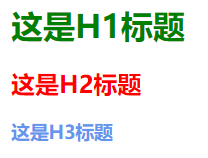
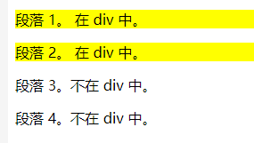

# 1 引入CSS的三种方式

引入CSS共有三种方式，分别是

- style标签内部直接书写（用于演示效果）
- link标签引入外部css文件（最正规、多用的方式）
- 行内式(一般不用)

使用方式如下：

```html
<!--学习css引入CSS的三种方法-->
<!doctype html>
<html lang="en">
<head>
    <meta charset="UTF-8">
    <meta name="viewport"
          content="width=device-width, user-scalable=no, initial-scale=1.0, maximum-scale=1.0, minimum-scale=1.0">
    <meta http-equiv="X-UA-Compatible" content="ie=edge">
    <title>Document</title>
<!--    方式一：通过style引入-->
    <style>
        h1 {
            color: green;
        }
    </style>
<!--    方式三：通过link引入外部文件(使用最多)-->
    <link rel="stylesheet" href="03_被引入的CSS.css">
</head>
<body>
    <h1>这是H1标题</h1>
<!--    方式二：行内式引入-->
    <h2 style="color:red">这是H2标题</h2>
    <h3>这是H3标题</h3>
</body>
</html>
```

其中文件`03_被引入的CSS.css`的内容如下：

```css
/*
这是被引用的CSS文件
这是注释的方法
 */

h3 {
    color: cornflowerblue;
}
```

引用CSS后的效果：



# 2 CSS选择器

选择器共分为三种，分别是

- 基础选择器
- 组合选择器
- 属性选择器

接下来将一一介绍它们的使用方法

## 2.1 基础选择器

基础选择器具分为：

- ID选择器
- 类选择器
- 元素/标签选择器
- 通用选择器

使用方法如下代码所示：

```html
<!--学习CSS选择器的用法-->
<!doctype html>
<html lang="en">
<head>
    <meta charset="UTF-8">
    <meta name="viewport"
          content="width=device-width, user-scalable=no, initial-scale=1.0, maximum-scale=1.0, minimum-scale=1.0">
    <meta http-equiv="X-UA-Compatible" content="ie=edge">
    <title>Document</title>
<!--    引入CSS-->
    <style>
        /*ID选择器*/
        #id01 {
            /*找到id值是"id01"的标签，改变文字颜色*/
            color: blueviolet;
        }

        /*类选择器*/
        .class01 {
            /*找到class值是"class01"的标签，改变文字颜色*/
            color: deeppink;
        }

        span {
            /*找到所有span标签，改变文字颜色*/
            color: blue;
        }

        * {
            /*将html页面所有的标签全部找到，并修改字体类型和大小*/
            font-family: 幼圆;
            font-size: 50px;
        }
    </style>
</head>
<body>
    <div>
        <p id="id01">这是演示文字01</p>
        <p class="class01">这是演示文字02</p>
        <p class="class01">这是演示文字03</p>
        <span>这是演示文字03</span>
        <span>这是演示文字04</span>
    </div>
</body>
</html>
```

选择器效果：


## 2.2 组合选择器

组合选择器分为四种：

- 后代选择器（所有后代）
- 子元素选择器（儿子）
- 相邻兄弟选择器
- 后续兄弟选择器

### 2.2.1 后代选择器：

>选取某元素的后代元素

```html
<!DOCTYPE html>
<html>
<head>
<meta charset="utf-8"> 
<title></title> 
<style>
/*
后代选择器：
修改<div>所有后代<p>的背景色  
*/
div p
{
	background-color:yellow;
}
</style>
</head>
<body>

<div>
	<p>段落 1。 在 div 中。</p>
	<p>段落 2。 在 div 中。</p>
</div>

<p>段落 3。不在 div 中。</p>
<p>段落 4。不在 div 中。</p>

</body>
</html>
```

效果：



### 2.2.2 子元素选择器

>选取某元素的（直接/一级）子元素

```html
<!DOCTYPE html>
<html>
<head>
<meta charset="utf-8">
<title></title>
<style>
/*子元素选择器：*/
/*给<div>的儿子<p>设置背景色*/
div>p
{
	background-color:yellow;
}
</style>
</head>

<body>
<h1>Welcome to My Homepage</h1>
<div>
	<h2>My name is Donald</h2>
	<p>I live in Duckburg.</p>
</div>

<div>
<span><p>I will not be styled.</p></span>
</div>

<p>My best friend is Mickey.</p>
</body>
</html>
```

效果：


### 2.2.3 相邻兄弟选择器

>选择`紧接`在`指定元素`后的元素，且二者有相同父元素。

```html
<!DOCTYPE html>
<html>
<head>
<meta charset="utf-8">
<title></title>
<style>
/*选择紧接在<div>后的<p>，修改背景色*/
div+p
{
	background-color:yellow;
}
</style>
</head>
<body>

<h1>文章标题</h1>

<div>
    <h2>DIV 内部标题</h2>
    <p>DIV 内部段落。</p>
</div>

<p>DIV 之后的第一个 P 元素。</p>
<p>DIV 之后的第二个 P 元素。</p>

</body>
</html>
```

效果：


### 2.2.4 后续兄弟选择器

>选择`指定元素`后的元素，且二者有相同父元素。

```html
<!DOCTYPE html>
<html>
<head>
<meta charset="utf-8">
<title></title>
<style>
/*选择<div>后，跟<div>有相同父亲的<p>*/
div~p
{
	background-color:yellow;
}
</style>
</head>
<body>

<p>之前段落，不会添加背景颜色。</p>
<div>
    <p>段落 1。 在 div 中。</p>
    <p>段落 2。 在 div 中。</p>
</div>

<p>段落 3。不在 div 中。</p>
<p>段落 4。不在 div 中。</p>

</body>
</html>
```

效果：


## 2.3 属性选择器

分为三种：

- 使用【属性】选择
- 使用【属性 + 值】选择
- 使用【属性 + 值 + 标签】选择

```html
<!--学习CSS属性选择器的使用-->

<!doctype html>
<html lang="en">
<head>
    <meta charset="UTF-8">
    <meta name="viewport"
          content="width=device-width, user-scalable=no, initial-scale=1.0, maximum-scale=1.0, minimum-scale=1.0">
    <meta http-equiv="X-UA-Compatible" content="ie=edge">
    <title>Document</title>
    <style>
        /*选择有name=”username“属性的标签，设置背景色*/
        input[name="username"] {
            background-color: pink;
        }

        /*选择有name属性的标签，设置背景色*/
        [name] {
            background-color: yellowgreen;
        }

        /*选择有name=”date“属性的<input>标签，设置背景色*/
        input[name="date"] {
            background-color: cornflowerblue;
        }
    </style>
</head>
<body>
    <div>
        <label for="username">用户名</label>
        <input name="username" id="username">
    </div>
    <div>
        <label for="passwd">密码</label>
        <input type="password" name="passwd" id="passwd">
    </div>
    <div>日期
        <input type="data" name="date">
    </div>

</body>
</html>
```

效果：

