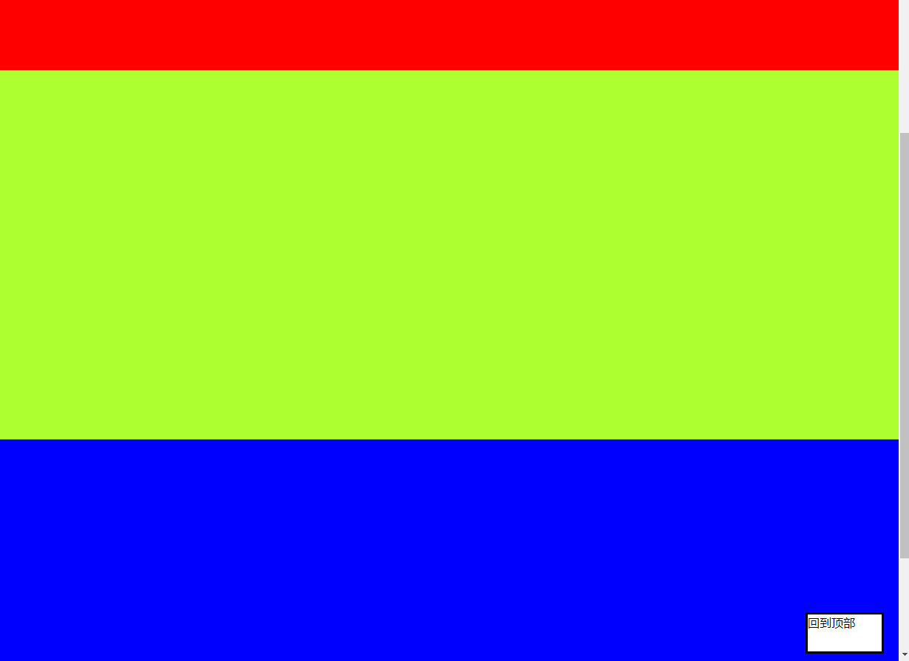
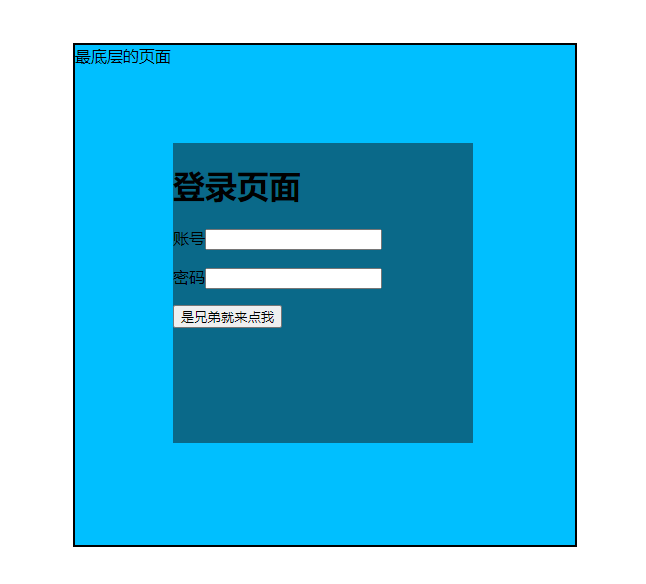

“第53天CSS03学习笔记”

# 1 解决浮动带来的影响

浮动会带来`父标签塌陷`的问题，什么是`父标签塌陷`？

案例代码如下：

```html
<!DOCTYPE html>
<html lang="en">
<head>
    <meta charset="UTF-8">
    <meta http-equiv="X-UA-Compatible" content="IE=edge">
    <meta name="viewport" content="width=device-width, initial-scale=1.0">
    <STYle>
        body {
            margin: 0;
        }

        div {
            border: 5px solid;
            width: 300px
        }

        .P1 {
            background-color: coral;
            height: 100px;
            width: 100px;
            margin: 0;
            float: left;
        }

        span {
            background-color: blue;
            height: 200px;
            width: 100px;
            margin: 0;
            display: block;
            /*左浮动*/
            float: left;	
        }
    </STYle>
    <title>Document</title>
</head>
<body>
    <!-- 创建父标签 -->
    <div>
        <!-- 创建子标签 -->
        <p class="P1"></p>
        <span></span>
    </div>
</body>
</html>
```

在理想情况下，应该是一个黑框包住两个色块，如下图所示：


但是实际情况是这样的, 元素浮动后脱离文档流, 父DIV塌陷了：


有3种方法处理这个问题：

## 1.1 指定父标签的高度

```css
div {
    border: 5px solid;
    width: 300px;
    /* 父标签添加高度 */
    height: 200px;
}
```

## 1.2 利用clear属性

该标签的左边不能有浮动的元素, 

原理: P4标签左边不能有浮动, 实际上是新起了一行, 把父标签撑起来了

```html
<!DOCTYPE html>
<html lang="en">
<head>
    <meta charset="UTF-8">
    <meta http-equiv="X-UA-Compatible" content="IE=edge">
    <meta name="viewport" content="width=device-width, initial-scale=1.0">
    <STYle>
        body {
            margin: 0;
        }

        div {
            border: 5px solid;
            width: 300px
        }

        .P1 {
            background-color: coral;
            height: 100px;
            width: 100px;
            margin: 0;
            float: left;
        }

        span {
            background-color: blue;
            height: 200px;
            width: 100px;
            margin: 0;
            display: block;
            /*左浮动*/
            float: left;	
        }
		
        /*P4标签clear*/
        .P4 {
            clear: left;
        }
    </STYle>
    <title>Document</title>
</head>
<body>
    <!-- 创建父标签 -->
    <div>
        <!-- 创建子标签 -->
        <p class="P1"></p>
        <span></span>
        <!-- 创建P4标签 -->
        <p class="P4"></p>
    </div>
</body>
</html>
```

## 1.3 使用clearfix(推荐)

在写html页面之前 先提前写好处理浮动带来的影响的 css代码

```css
.clearfix:after {
    content: '';
    display: block;
    clear: both;
}
```

谁塌陷就给谁用, 这里用到div元素上面

```html
<body>
    <!-- 创建父标签 -->
    <div class="clearfix">
        <!-- 创建子标签 -->
        <p class="P1" ></p>
        <span></span>
    </div>
</body>
```


# 2 溢出属性

见名知意, 溢出属性用来控制溢出的部分, 案例代码如下:

```html
<!DOCTYPE html>
<html lang="en">
<head>
    <meta charset="UTF-8">
    <meta http-equiv="X-UA-Compatible" content="IE=edge">
    <meta name="viewport" content="width=device-width, initial-scale=1.0">
    <title>Document</title>
    <style>
        p {
            border: 2px solid;
            width: 300px;
            height: 200px;
        }
    </style>
</head>
<body>
    <p>
        童趣
【作者】沈复 【朝代】清译文对照
余忆童稚时，能张目对日，明察秋毫，见藐小之物必细察其纹理，故时有物外之趣。

夏蚊成雷，私拟作群鹤舞于空中，心之所向，则或千或百，果然鹤也；昂首观之，项为之强。又留蚊于素帐中，徐喷以烟，使之冲烟而飞鸣，作青云白鹤观，果如鹤唳云端，为之怡然称快。

余常于土墙凹凸处，花台小草丛杂处，蹲其身，使与台齐；定神细视，以丛草为林，以虫蚁为兽，以土砾凸者为丘，凹者为壑，神游其中，怡然自得。

一日，见二虫斗草间，观之，兴正浓，忽有庞然大物，拔山倒树而来，盖一癞虾蟆，舌一吐而二虫尽为所吞。余年幼，方出神，不觉呀然一惊。神定，捉虾蟆，鞭数十，驱之别院。
    </p>
</body>
</html>
```

可见文字溢出了


通过溢出属性控制:

```css
p {
    border: 2px solid;
    width: 300px;
    height: 200px;
    /* overflow: visible;  默认就是可见 溢出还是展示  */
    /* overflow: hidden;  溢出部分直接隐藏 */
    overflow: scroll;  /* 设置成上下滚动条的形式 */
    /* overflow: auto; */
}
```

比如使用scroll就是如下图样式:


# 3 定位

* 静态

  所有的标签默认都是静态的static，无法改变位置

* 相对定位(了解)

  相对于标签原来的位置做移动relative

* 绝对定位(常用)

  相对于已经定位过的父标签做移动(如果没有父标签那么就以body为参照)

  eg:小米网站购物车

  当你不知道页面其他标签的位置和参数，只给了你一个父标签的参数，让你基于该标签左定位

* 固定定位(常用)

  相对于浏览器窗口固定在某个位置

  eg:右侧小广告

## 3.1 案例1--子绝父相

```html
<!DOCTYPE html>
<html lang="en">
<head>
    <meta charset="UTF-8">
    <title>Title</title>
    <meta name="viewport" content="width=device-width, initial-scale=1">
    <style>
        body {
            margin: 0;
        }
        
        /* d1相对定位：相对于原来的位置，往下移动50px，往右移动50px */
        #d1 {
            height: 100px;
            width: 100px;
            background-color: red;
            left: 50px;  /*从左往右   如果是负数 方向则相反*/
            top: 50px;  /*从上往下    如果是负数 方向则相反*/
            /*position: static;  !*默认是static无法修改位置*!*/
            position: relative;
            /*相对定位
            标签由static变为relative它的性质就从原来没有定位的标签变成了已经定位过的标签
            虽然你哪怕没有动 但是你的性质也已经改变了
            */
        }

        /* d2属性改为相对定位 */
        #d2 {
            height: 100px;
            width: 200px;
            background-color: blue;
            position: relative;  /*已经定位过了*/
        }

        /* d3相对于父标签d2，往右移动200px, 往下移动100px */
        #d3 {
            height: 200px;
            width: 400px;
            background-color: yellowgreen;
            position: absolute;
            left: 200px;
            top: 100px;
        }
    </style>
</head>
<body>
   <div id="d1"></div>

<div id="d2">
   <div id="d3"></div>
</div>

</body>
</html>
```

效果:


## 3.2 案例2--固定定位

```html
<!DOCTYPE html>
<html lang="en">
<head>
    <meta charset="UTF-8">
    <title>Title</title>
    <meta name="viewport" content="width=device-width, initial-scale=1">
    <style>
        body {
            margin: 0;
        }
        
        /* d4设置为固定定位，定在右下角 */
        #d4 {
            position: fixed;  /*写了fixed之后 定位就是依据浏览器窗口*/
            bottom: 10px;
            right: 20px;

            height: 50px;
            width: 100px;
            background-color: white;
            border: 3px solid black;
        }
    </style>
</head>
<body>
<div style="height: 500px;background-color: red"></div>
<div style="height: 500px;background-color: greenyellow"></div>
<div style="height: 500px;background-color: blue"></div>
<div id="d4">回到顶部</div>
</body>
</html>
```

效果:




# 4 浮动和定位是否脱离文档流

浮动/定位后的元素, `原来的位置`是否还保留呢?

- 不脱离文档流
  - 相对定位
- 脱离文档流
  - 绝对定位
  - 固定定位
  - 浮动

# 5 z-index模态框

什么是z-index模态框? 以百度登录界面为例:

百度登陆页面 其实是三层结构

- 最底部是正常内容(z=0)  	最远的
- 黑色的透明区(z=99)  		 中间层
- 白色的注册区域(z=100) 	 离用户最近

z-index其实就是一种`堆叠显示`的的方法,控制`谁在上层,谁在下层`

**<font color="red">数值越大, 越上层</font>**

案例代码如下:

```html
<!DOCTYPE html>
<html lang="en">
<head>
    <meta charset="UTF-8">
    <meta http-equiv="X-UA-Compatible" content="IE=edge">
    <meta name="viewport" content="width=device-width, initial-scale=1.0">
    <title>Document</title>
    <style>
        body {
            margin: 0;
        }

        .cover {
            background-color:deepskyblue;
            border: 2px solid;
            height: 500px;
            width: 500px;
            
            position: fixed;    /* 固定定位，脱离文档流 */
            left: 50%;
            top: 50%;

            margin-left: -250px;
            margin-top: -250px;
            z-index: 99;
        }
        
        .modal {
            background-color: rgba(20, 20, 20, 0.5);
            height: 300px;
            width: 300px;

            /* 将元素左上角定位到页面中心 */
            position: fixed;
            left: 50%;
            top: 50%;

            /* 通过margin将元素的内容挪到中间 */
            margin-left: -150px;
            margin-top: -150px;

            /* 设置显示在最上层 */
            z-index: 100;
        }
        
    </style>
</head>
<body>
    <div class="cover">最底层的页面</div>
    <div class="modal">
        <h1>登录页面</h1>
        <p>账号<input type="text"></p>
        <p>密码<input type="password" name="" id=""></p>
        <p><input type="button" value="是兄弟就来点我"></p>
    </div>
</body>
</html>
```

效果:



# 6 透明度

使用`opacity`设置透明度,案例代码

```css
<!DOCTYPE html>
<html lang="en">
<head>
    <meta charset="UTF-8">
    <meta http-equiv="X-UA-Compatible" content="IE=edge">
    <meta name="viewport" content="width=device-width, initial-scale=1.0">
    <title>Document</title>
    <style>
        p {
            width: 300px;
            height: 300px;
            font-size: 80px;
            background-color: cornflowerblue;
            /* color: rgba(0, 0, 0, 0.5); */
            opacity: 0.5;
        }
    </style>
</head>
<body>
    <p>测试字体TEST</p>
</body>
</html>
```

补充知识: opcity和rgba的区别?

在`没有设置透明`的情况下, 效果如下图:


单独设置`opcity: 0.5`后如下:

```css
opacity: 0.5;
```


单独设置`rgba透明度0.5`后,如下:

```css
color: rgba(0, 0, 0, 0.5);
```


