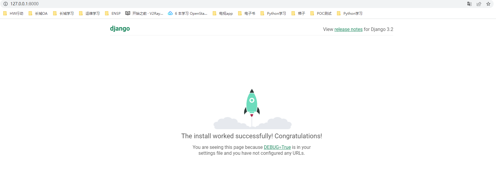
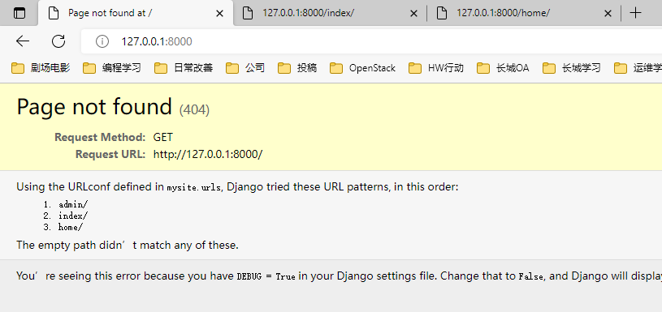
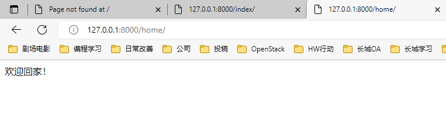

“第59天Django-01学习笔记”

# 1 手写Web框架

在学Web框架之前，复习下HTTP协议

```python
# HTTP协议
"""
网络协议
HTTP协议				数据传输是明文
HTTPS协议				数据传输是密文
websocket协议		数据传输是密文


四大特性
	1.基于请求响应
	2.基于TCP、IP作用于应用层之上的协议
	3.无状态
	4.短/无链接

数据格式
	请求首行
	请求头
	
	请求体

响应状态码
	1XX
	2XX			200
	3XX			
	4XX			403 404
	5XX			500
"""
```

## 1.1 纯手写的Web框架

案例代码如下：

```python
# 案例：纯手写的python Web框架

import socket

# 创建套接字
server = socket.socket()
# 绑定IP和端口
server.bind(('127.0.0.1', 8080))
# 设置监听池大小
server.listen(5)

while True:
    # 开始接收客户端连接
    conn, addr = server.accept()
    # 接收客户端传来的数据(二进制)
    data = conn.recv(1024)
    # 输出data看看是什么东西
    print(data)
    # 将二进制数据转换成字符串
    data = data.decode('utf-8')
    # 向客户端发送数据
    conn.send(b'HTTP/1.1 200 OK\r\n\r\n')
    current_path = data.split(' ')[1]
    # 输出路径看看
    print(current_path)
    # 路径判断
    if current_path == "/index":
        with open(r'templates/index.html', 'rb') as f:
            conn.send(f.read())
    elif current_path == '/login':
        conn.send(b'login page')
    else:
        conn.send(b'Hello World')

    # 关闭套接字
    conn.close()
```

其中`print(data)`输出的内容，`/favicon.ico`可以忽略，通过`data.split(' ')[1]`可以获取访问的路径

```python
# 当访问http://127.0.0.1:8080
b'GET / HTTP/1.1\r\nHost: 127.0.0.1:8080\r\nConnection: keep-alive\r\nCache-Control: max-age=0\r\nsec-ch-ua: "Chromium";v="104", " Not A;Brand";v="99", "Google Chrome";v="104"\r\nsec-ch-ua-mobile: ?0\r\nsec-ch-ua-platform: "Windows"\r\nUpgrade-Insecure-Requests: 1\r\nUser-Agent: Mozilla/5.0 (Windows NT 10.0; Win64; x64) AppleWebKit/537.36 (KHTML, like Gecko) Chrome/104.0.0.0 Safari/537.36\r\nAccept: text/html,application/xhtml+xml,application/xml;q=0.9,image/avif,image/webp,image/apng,*/*;q=0.8,application/signed-exchange;v=b3;q=0.9\r\nSec-Fetch-Site: none\r\nSec-Fetch-Mode: navigate\r\nSec-Fetch-User: ?1\r\nSec-Fetch-Dest: document\r\nAccept-Encoding: gzip, deflate, br\r\nAccept-Language: zh-CN,zh;q=0.9,zh-TW;q=0.8,en-US;q=0.7,en;q=0.6\r\n\r\n'
/
b'GET /favicon.ico HTTP/1.1\r\nHost: 127.0.0.1:8080\r\nConnection: keep-alive\r\nsec-ch-ua: "Chromium";v="104", " Not A;Brand";v="99", "Google Chrome";v="104"\r\nsec-ch-ua-mobile: ?0\r\nUser-Agent: Mozilla/5.0 (Windows NT 10.0; Win64; x64) AppleWebKit/537.36 (KHTML, like Gecko) Chrome/104.0.0.0 Safari/537.36\r\nsec-ch-ua-platform: "Windows"\r\nAccept: image/avif,image/webp,image/apng,image/svg+xml,image/*,*/*;q=0.8\r\nSec-Fetch-Site: same-origin\r\nSec-Fetch-Mode: no-cors\r\nSec-Fetch-Dest: image\r\nReferer: http://127.0.0.1:8080/\r\nAccept-Encoding: gzip, deflate, br\r\nAccept-Language: zh-CN,zh;q=0.9,zh-TW;q=0.8,en-US;q=0.7,en;q=0.6\r\n\r\n'
/favicon.ico

# 当访问http://127.0.0.1:8080/index
b'GET /index HTTP/1.1\r\nHost: 127.0.0.1:8080\r\nConnection: keep-alive\r\nsec-ch-ua: "Chromium";v="104", " Not A;Brand";v="99", "Google Chrome";v="104"\r\nsec-ch-ua-mobile: ?0\r\nsec-ch-ua-platform: "Windows"\r\nUpgrade-Insecure-Requests: 1\r\nUser-Agent: Mozilla/5.0 (Windows NT 10.0; Win64; x64) AppleWebKit/537.36 (KHTML, like Gecko) Chrome/104.0.0.0 Safari/537.36\r\nAccept: text/html,application/xhtml+xml,application/xml;q=0.9,image/avif,image/webp,image/apng,*/*;q=0.8,application/signed-exchange;v=b3;q=0.9\r\nPurpose: prefetch\r\nSec-Fetch-Site: none\r\nSec-Fetch-Mode: navigate\r\nSec-Fetch-User: ?1\r\nSec-Fetch-Dest: document\r\nAccept-Encoding: gzip, deflate, br\r\nAccept-Language: zh-CN,zh;q=0.9,zh-TW;q=0.8,en-US;q=0.7,en;q=0.6\r\n\r\n'
/index
b'GET /favicon.ico HTTP/1.1\r\nHost: 127.0.0.1:8080\r\nConnection: keep-alive\r\nsec-ch-ua: "Chromium";v="104", " Not A;Brand";v="99", "Google Chrome";v="104"\r\nsec-ch-ua-mobile: ?0\r\nUser-Agent: Mozilla/5.0 (Windows NT 10.0; Win64; x64) AppleWebKit/537.36 (KHTML, like Gecko) Chrome/104.0.0.0 Safari/537.36\r\nsec-ch-ua-platform: "Windows"\r\nAccept: image/avif,image/webp,image/apng,image/svg+xml,image/*,*/*;q=0.8\r\nSec-Fetch-Site: same-origin\r\nSec-Fetch-Mode: no-cors\r\nSec-Fetch-Dest: image\r\nReferer: http://127.0.0.1:8080/index\r\nAccept-Encoding: gzip, deflate, br\r\nAccept-Language: zh-CN,zh;q=0.9,zh-TW;q=0.8,en-US;q=0.7,en;q=0.6\r\n\r\n'
/favicon.ico
```

实现的效果：

​	通过不同的路径可以访问到不同的html页面

### 1.1.1 纯手撸的web框架有以下不足：

- 代码重复(服务端代码所有人都要重复写)
- 手动处理http格式的数据 并且只能拿到url后缀 其他数据获取繁琐(数据格式一样处理的代码其实也大致一样 重复写)
- 并发的问题

## 1.2 使用wsgiref模块写Web框架

wsgiref整合了socket框架，不用重新写socket，比纯手写要好点

### 1.2.1 server代码

```python
from wsgiref.simple_server import make_server
from urls import urls
from views import *

def run(env, response):
    """
    :param env: 请求相关的所有数据
    :param response: 响应相关的所有数据
    :return: 返回给浏览器的数据
    """
    # env 大字典 wsgiref模块帮你你处理好Http格式的数据，封装成了字典让你更加方便操作
    # print(env)

    # 响应首行，响应头
    response('200 OK', [])

    # 从env中获取当前访问的路径
    current_path = env.get('PATH_INFO')

    # 定义func变量，存储函数名
    func = None
    for url in urls:
        if current_path == url[0]:
            func = url[1]
            break
    # 判断func是否有值
    if func:
        res = func(env)
    else:
        res = error(env)

    # 返回得到的数据，在此统一编码
    return [res.encode('utf-8')]

if __name__ == '__main__':
    server = make_server('127.0.0.1', 8080, run)
    # 启动服务
    server.serve_forever()
```

>PS：补充，关于`print(env)`的输出
>
>```python
>{'ALLUSERSPROFILE': 'C:\\ProgramData', 'APPDATA': 'C:\\Users\\fr724\\AppData\\Roaming', 'APR_ICONV_PATH': 'D:\\software\\subversion\\iconv', 'COMMONPROGRAMFILES': 'C:\\Program'
> .....
> 'HTTP_UPGRADE_INSECURE_REQUESTS': '1', 'HTTP_USER_AGENT': 'Mozilla/5.0 (Windows NT 10.0; Win64; x64) AppleWebKit/537.36 (KHTML, like Gecko) 
>```
>
>可以看出，其中是大量的<font color=red>环境变量</font>的键值对，主要取其中有用的段`PATH_INFO`来获取访问路径
>
>```python
>'PATH_INFO': '/index'
>```

### 1.2.2 特定文件夹格式

使用wsgi需要特定的文件夹格式：

```python
"""
urls.py						路由与视图函数对应关系
views.py					视图函数(后端业务逻辑)
templates文件夹		专门用来存储html文件
"""
# 按照功能的不同拆分之后 后续添加功能只需要在urls.py书写对应关系然后取views.py书写业务逻辑即可
```

urls.py的内容如下：

```python
from views import *

# url与函数的对应关系
urls = [
    ('/index',index),
    ('/login',login),
    ('/xxx',xxx),
    ('/get_time',get_time),
    ('/get_dict',get_dict),
    ('/get_user',get_user)
]
```

views.py的内容如下：

```python
import datetime

def index(env):
    return 'index'

def login(env):
    return 'login'

def error(env):
    return '404 error'

# 读取html文件的案例
def xxx(env):
    with open(r'templates/myxxx.html', rb) as f:
        return f.read()

# 动态修改html内容的案例 -- 通过文字替换实现
def get_time(env):
    # 获取当前时间
    current_time = datetime.datetime.now().strftime('%Y-%m-%d %X')
    # 通过文字替换将后端获取到的数据'传递到'html文件
    with open(r'templates/mytime.html', 'r', encoding=('utf-8')) as f:
        data = f.read()
        # 处理数据
        data = data.replace('dsadsa', current_time)
        # 返回处理好的数据
        return data

# 动态修改html内容的案例 -- 通过jinja2实现
# 导入jinja2模块
from jinja2 import Template
def get_dict(env):
    # 创建数据变量
    user_dic = {'username':'Goosh', 'age':18, 'hobby':'cook'}
    # 读取html文件
    with open(r'templates/get_dict.html', 'r', encoding=('utf-8')) as f:
        data = f.read()
    # 处理数据变量，渲染成jinja2变量
    tmp = Template(data)
    res = tmp.render(user=user_dic)
    # 返回处理后的结果
    return res

# 动态获取数据库中的数据，传递到html中
import pymysql
def get_user(env):
    # 连接数据库
    conn = pymysql.connect(
        host = '127.0.0.1',
        port = 3306,
        user = 'root',
        password= '',
        db = 'test',
        charset= 'utf8',
        autocommit = True
    )

    # 创建游标
    cursor = conn.cursor(cursor=pymysql.cursors.DictCursor)

    # 要查询的语句
    sql = 'select * from students'

    # 执行语句
    affect_rows = cursor.execute(sql)

    # 将获取的数据保存到变量中
    data_list = cursor.fetchall()

    # 将数据床底给html
    with open(r'templates/get_data.html', 'r', encoding='utf-8') as f:
        data = f.read()

    # jinja2渲染数据
    tmp = Template(data)
    res = tmp.render(user_list=data_list)

    # 返回数据
    return  res

if __name__ == '__main__':
    get_user(111)

```

### 1.2.3 html页面创建

创建html页面，放到`templates`文件夹中

mytime.html

```html
<!DOCTYPE html>
<html lang="en">
<head>
    <meta charset="UTF-8">
    <title>Title</title>
</head>
<body>
    <div>当前时间是: dsadsa</div>
</body>
</html>
```

myxxx.html

```html
<!DOCTYPE html>
<html lang="en">
<head>
    <meta charset="UTF-8">
    <title>Title</title>
</head>
<body>
  <div>这是xxx的页面</div>
</body>
</html>
```

get_dict.html

```html
<!DOCTYPE html>
<html lang="en">
<head>
    <meta charset="UTF-8">
    <title>Title</title>
    <meta name="viewport" content="width=device-width, initial-scale=1">
    <link href="https://cdn.bootcss.com/twitter-bootstrap/3.4.1/css/bootstrap.min.css" rel="stylesheet">
    <script src="https://cdn.bootcss.com/jquery/3.3.1/jquery.min.js"></script>
    <script src="https://cdn.bootcss.com/twitter-bootstrap/3.4.1/js/bootstrap.min.js"></script>
</head>
<body>
<h1>我是一个页面</h1>
{{ user }}
{{ user.get('username')}}
{{ user.age }}
{{ user['hobby'] }}
</body>
</html>
```

get_data.html

```html
<!DOCTYPE html>
<html lang="en">
<head>
    <meta charset="UTF-8">
    <title>Title</title>
</head>
<body>
  {{ user_list }}
</body>
</html>
```

# 2 动态网页和静态网页

什么是动态网页？什么又是静态网页？它们的区别是什么？

- 静态网页
  - 页面上的数据是直接写死的(万年不变)
- 动态网页
  - 数据是实时获取的
  - 例如：
    - 后端获取当前时间展示到html页面上
    - 数据是从数据库中获取的展示到html页面上

动态网页的案例如下：

```python
# 动态网页制作
import datetime
def get_time(env):
    current_time = datetime.datetime.now().strftime('%Y-%m-%d %X')
    # 如何将后端获取到的数据"传递"给html文件？
    with open(r'templates/03 mytime.html','r',encoding='utf-8') as f:
        data = f.read()
        # data就是一堆字符串
    data = data.replace('dwadasdsadsadasdas',current_time)   # 在后端将html页面处理好之后再返回给前端
    return data

# 将一个字典传递给html文件 并且可以在文件上方便快捷的操作字典数据
from jinja2 import Template
def get_dict(env):
    user_dic = {'username':'jason','age':18,'hobby':'read'}
    with open(r'templates/04 get_dict.html','r',encoding='utf-8') as f:
        data = f.read()
    tmp = Template(data)
    res = tmp.render(user=user_dic)
    # 给get_dict.html传递了一个值 页面上通过变量名user就能够拿到user_dict
    return res

# 后端获取数据库中数据展示到前端页面
```


# 3 自定义简易版本web框架请求流程图

```python
"""
wsgiref模块
	1.请求来的时候解析http格式的数据 封装成大字典
	2.响应走的时候给数据打包成符合http格式 再返回给浏览器

"""
```

# 4 python三大主流web框架

## 4.1 三大主流框架

**django**

​	特点:大而全 自带的功能特别特别特别的多 类似于航空母舰

​	不足之处:

​		有时候过于笨重

**flask**

​	特点:小而精  自带的功能特别特别特别的少 类似于游骑兵

​	第三方的模块特别特别特别的多，如果将flask第三方的模块加起来完全可以盖过django

​	并且也越来越像django

​	不足之处:

​		比较依赖于第三方的开发者
​		
**tornado**

​	特点:异步非阻塞 支持高并发

​		牛逼到甚至可以开发游戏服务器

​	不足之处:

​		暂时你不会

## 4.2 三大框架的对比

如果将框架分为三部分

```python
A:socket部分
B:路由与视图函数对应关系(路由匹配)
C:模版语法
```

三个框架之间的对比如下：

**django**

- A用的是别人的		wsgiref模块
- B用的是自己的
- C用的是自己的(没有jinja2好用 但是也很方便)

**flask**

- A用的是别人的		werkzeug(内部还是wsgiref模块)
- B自己写的
- C用的别人的(jinja2)

**tornado**

- A，B，C都是自己写的


### 注意事项

```python
# 如何让你的计算机能够正常的启动django项目
1.计算机的名称不能有中文
2.一个pycharm窗口只开一个项目
3.项目里面所有的文件也尽量不要出现中文
4.python解释器尽量使用3.4~3.6之间的版本
(如果你的项目报错 你点击最后一个报错信息去源码中把逗号删掉)
```

# 5 Django

## 5.1 安装Django

使用`pip`安装Django

```shell
$pip3 install django==3.2
```

验证是否安装成功的方式:

```shell
$ django-admin --version
3.2
```

**Django版本选择**

目前版本主要分为：

	1.X 2.X 3.X 4.X
最新的为4.1，最新的LTS版本是3.2，因此选择3.2版本

## 5.1 创建Django项目

### 5.1.1 方式一：通过命令行创建

1、进入到工作目录，使用命令创建Django项目

```python
django-admin startproject mysite
```

2、查看创建好的项目目录

```shell
$ ls mysite
manage.py*  mysite/

$ ls mysite/mysite/
__init__.py  asgi.py  settings.py  urls.py  wsgi.py
```

好像是一群看不懂得文件，他们的作用是什么？

| 文件        | 作用                                                         |
| ----------- | ------------------------------------------------------------ |
| manage.py   | 一个实用的命令行工具，可让你以各种方式与该 Django 项目进行交互 |
| __init__.py | 一个空文件，告诉 Python 该目录是一个 Python 包               |
| asgi.py     | 一个 ASGI 兼容的 Web 服务器的入口，以便运行你的项目。        |
| settings.py | 该 Django 项目的设置/配置。包括app路径，数据库配置，sql语句，静态文件目录，中间件，session存储的相关配置 |
| urls.py     | 该 Django 项目的 URL 声明，是所有网址的入口，会关联到views中的函数。 |
| wsgi.py     | 一个 WSGI 兼容的 Web 服务器的入口，以便运行你的项目。        |

3、启动项目

进入项目目录，并启动服务

```shell
$ python manage.py runserver
```

 以下是输出

```shell
Watching for file changes with StatReloader
Performing system checks...

System check identified no issues (0 silenced).

You have 18 unapplied migration(s). Your project may not work properly until you apply the migrations for app(s): admin, auth, contenttypes, sessions.
Run 'python manage.py migrate' to apply them.
September 02, 2022 - 14:14:29
Django version 3.2, using settings 'mysite.settings'
Starting development server at http://127.0.0.1:8000/
Quit the server with CTRL-BREAK.
```

访问页面成功即可



4、 创建应用

通过命令行创建应用

```shell
$ python manage.py startapp app01
```

>关于应用的名称:
>
>​	app起名应做到见名知意，如:
>
>​		user、order、web等等
>
>​	这里练习因此使用app01, app02这些名称

查看创建完的文件夹里有些什么？

```shell
$ ls app01/
__init__.py  admin.py  apps.py  migrations/  models.py  tests.py  views.py
```

### 5.1.2 方式二：通过Pycharm创建

1、创建Django项目

```shell
# pycharm界面操作
File -- New Project -- Django
```

2、启动项目

```shell
# 方式一
pycharm终端，使用命令行启动

# 方式二
点击Run -- Run(绿色小箭头)即可
```

3、创建应用

```shell
# 方式一（建议，练习记忆命令）
pycharm提供的终端直接输入完整命令
$ python manage.py startapp app01

# 方式二（不建议。Pycharm界面打开manange.py终端窗口）
tools -- run manage.py task
# 使用起来是一样的
manage.py@mysite > startapp app01
C:\Users\fr724\Desktop\python-learning\01-老男孩Python29期学习\03-Python进阶之前端Web方向\mysite\Scripts\python.exe "D:\software\PyCharm 2021.3.1\plugins\python\helpers\pycharm\django_manage.py" startapp app01 C:/Users/fr724/Desktop/python-learning/01-老男孩Python29期学习/02-Python高级阶段/mysite
Tracking file by folder pattern:  migrations

Following files were affected 
 C:\Users\fr724\Desktop\python-learning\01-老男孩Python29期学习\02-Python高级阶段\mysite\app01\migrations\__init__.py
Process finished with exit code 0
```

4、修改端口号以及创建server（Pycharm操作的优势，这点比命令行方面）

界面操作


里面可以修改


### 5.1.3 命令行与pycharm创建项目的区别

命令行创建:

​	不会自动有template文件夹,需要你自己手动创建

pycharm创建：

​	会自动帮你创建template文件夹且还会自动在配置文件中配置对应的路径

```python
# pycharm创建
TEMPLATES = [
    {
        'BACKEND': 'django.template.backends.django.DjangoTemplates',
        'DIRS': [os.path.join(BASE_DIR, 'templates')]
        ....
]
# 命令行创建
TEMPLATES = [
    {
        'BACKEND': 'django.template.backends.django.DjangoTemplates',
        'DIRS': [],
        ...
]
```

>也就意味着你在用命令创建django项目的时候不单单需要创建templates文件夹还需要去
>
>配置文件中配置路径
>
>'DIRS': [os.path.join(BASE_DIR, 'templates')]

## 5.2 应用的配置和使用

### 5.2.1 什么是应用（APP）

APP的介绍：

- django是一款专门用来开发app的web框架

- django框架就类似于是一所大学(空壳子)
- app就类似于大学里面各个学院(具体功能的app)
- 一个app就是一个独立的功能模块

app内的文件介绍：

```python
app01文件夹
    ---admin.py			django后台管理
    ---apps.py			注册使用
    ---migrations文件夹		数据库迁移记录
    ---models.py		数据库相关的 模型类(orm)
    ---tests.py			测试文件
    ---views.py			视图函数(视图层)
```

### 5.2.2 如何使用应用？

在开始前，先梳理下文件夹路径

```python
$ ls mysite/
app01/  db.sqlite3  manage.py*  mysite/  templates/

# 查看项目文件
$ ls mysite/mysite/
__init__.py  __pycache__/  asgi.py  settings.py  urls.py  wsgi.py

# 查看app文件
$ ls mysite/app01/
__init__.py  __pycache__/  admin.py  apps.py  migrations/  models.py  tests.py  views.py
```

#### 1、注册应用

编辑`mysite/mysite/settings.py`文件，添加`app01`应用

```python
***********************创建的应用一定要去配置文件中注册**********************
INSTALLED_APPS = [
    'django.contrib.admin',
    'django.contrib.auth',
    'django.contrib.contenttypes',
    'django.contrib.sessions',
    'django.contrib.messages',
    'django.contrib.staticfiles',
    'app01.apps.App01Config',  # 全写
  	'app01',			 # 简写
]
# 创建出来的的应用第一步先去配置文件中注册 其他的先不要给我干
ps:你在用pycharm创建项目的时候 pycharm可以帮你创建一个app并且自动注册
***********************************************************************
```

#### 2、添加url路由

编辑`mysite/mysite/urls.py`文件

```python
from django.contrib import admin
from django.urls import path

# 导入app01的views
from app01 import views

urlpatterns = [
    path('admin/', admin.site.urls),
    # 写我们自己的路由与视图关系
    path('index/', views.index),
    path('home/', views.home),
]
```

#### 3、添加views

编辑`mysite/mysite/app01/views.py`文件

```python
from django.shortcuts import render, HttpResponse, redirect

# Create your views here.

def index(request):
    """
    :param request: 请求相关的所有数据对象 比你之前的env更加牛逼
    :return:
    """
    return HttpResponse("哎呀！ 被你发现了")


def home(request):
    return HttpResponse("欢迎回家！")
```

#### 4、访问网站

访问http://127.0.0.1:8080



访问http://127.0.0.1:8080/index


访问http://127.0.0.1:8080/home



## 5.5 django小白必会三板斧

在编辑`app01/views.py`文件时，有三种方式可以返回页面内容，称为三板斧：

使用前需要导入：

```python
from django.shortcuts import render,HttpResponse,redirect
```

### 1、HttpResponse

作用：返回字符串类型的数据

使用：

```python
return HttpResponse("欢迎回家！")
```

### 2、render

作用：返回html文件

使用：

创建`Template/test.html`文件

```html
<!DOCTYPE html>
<html lang="en">
<head>
    <meta charset="UTF-8">
    <title>Title</title>
</head>
<body>
    <h1>哥只是个传说</h1>
</body>
</html>
```

返回html页面

```python
from django.shortcuts import render, HttpResponse, redirect


# Create your views here.

def index(request):
    """
    :param request: 请求相关的所有数据对象 比你之前的env更加牛逼
    :return:
    """
    return render(request, 'test.html')


def home(request):
    return HttpResponse("欢迎回家！")

```

### 3、redirect

作用：重定向页面

使用：

```python
return redirect('https://www.mzitu.com/')
# 或者
return redirect('/home/')
```

# 6 作业

```python
"""
1.整理web框架推导思路
2.安装django并正常启动访问，测试三板斧
3.整理今日日考题，django内容
选做题
1.结合前端，django，MySQL，pymysql模块实现数据库数据动态展示到前端
2.尝试着摸索django模版语法
"""
```

