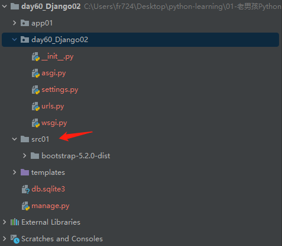
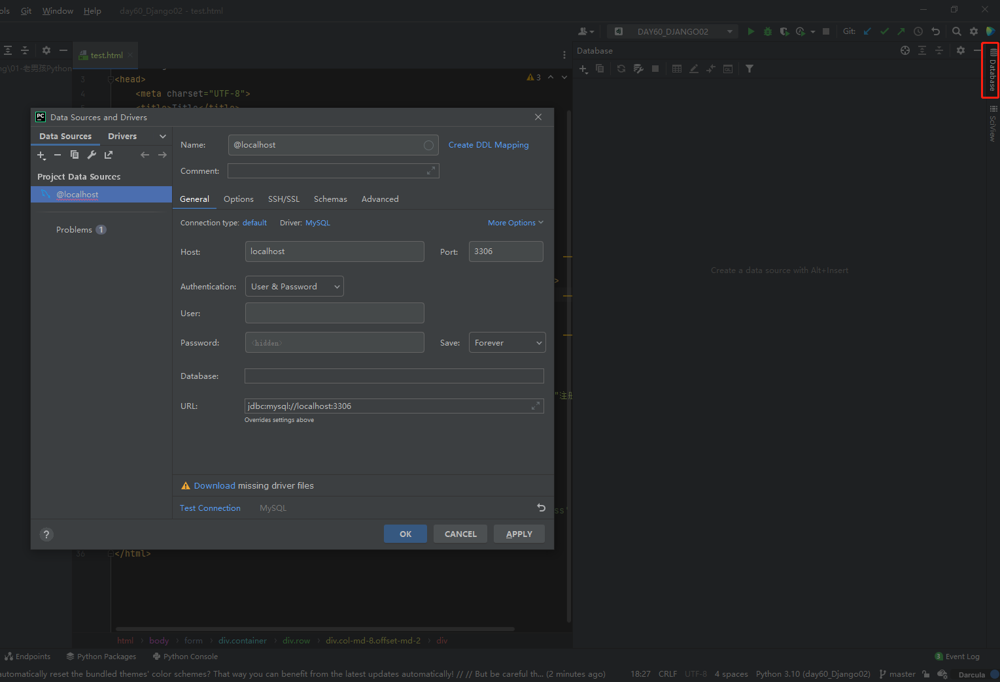
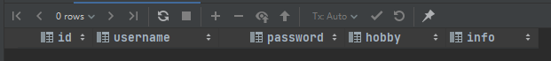
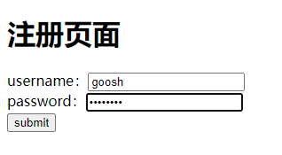

“第60天Django-02学习笔记”

# 1 静态文件配置

## 1.1 静态文件介绍

什么是静态文件？

​	前端已经写好了的 能够直接调用使用的文件，如

- 网站写好的js文件
- 网站写好的css文件
- 网站用到的图片文件
- 第三方前端框架

我们将网站使用的所有`静态文件`默认都放在`static`文件夹中

<font color=red>**static文件夹默认没有，需要手动创建**</font>

```python
一般情况下我们在static文件夹内还会做进一步的划分处理
	-static
  	--js
    --css
    --img
    其他第三方文件
    
"""
在浏览器中输入url能够看到对应的资源
是因为后端提前开设了该资源的接口
如果访问不到资源 说明后端没有开设该资源的接口

http://127.0.0.1:8000/static/bootstrap-3.3.7-dist/css/bootstrap.min.css
"""
```

## 1.2 静态文件配置

### 1.2.1 回顾创建一个普通Django项目

如何在Django项目中设置静态文件？

我们先创建一个普通的Django项目

1、先在Pycharm创建Django项目-`day60_Django02`

2、打开terminal窗口，创建app01

```shell
python manage.py startapp app01
```

3、注册app01应用

编辑setting.py文件

```python
INSTALLED_APPS = [
    'django.contrib.admin',
    'django.contrib.auth',
    'django.contrib.contenttypes',
    'django.contrib.sessions',
    'django.contrib.messages',
    'django.contrib.staticfiles',
    # 注册应用
    'app01',
]
```

4、配置`urls.py`文件和`app01/views.py`文件

```python
from django.contrib import admin
from django.urls import path
from app01 import views

urlpatterns = [
    path('admin/', admin.site.urls),
    path('login/', views.login),
]
```

```python
# app01/views.py内容
from django.shortcuts import render

# Create your views here.
def login(request):
    return render(request, 'test.html')
```

5、创建HTML文件`templates/test.html`

```html
<!DOCTYPE html>
<html lang="en">
<head>
    <meta charset="UTF-8">
    <title>Title</title>
</head>
<body>
    <h1>这是测试文件</h1>
</body>
</html>
```

6、运行项目

访问`http://127.0.0.1:8000/login`可见到`test.html`页面的内容

### 1.2.2 给这个项目配置静态文件

使用静态文件需要先创建`static`文件夹，并将静态文件都放到里面

1、创建`src01`文件夹，把下载并解压的`bootstrap-5.2.0-dist`文件夹放进去

```shell
$ ls static/src01/
bootstrap-5.2.0-dist
```

2、设置静态文件的`访问路径`和`存储路径`

编辑settings.py文件

```shell
# 配置静态文件的访问路径
STATIC_URL = '/bbc/'
# 配置静态文件的存储路径，会在三个文件夹依次寻找
STATICFILES_DIRS = [
    os.path.join(BASE_DIR, 'src01'),
    os.path.join(BASE_DIR, 'src02'),
    os.path.join(BASE_DIR, 'src03'),
]
```

3、静态文件动态解析

给html文件添加动态解析代码

```html
<!DOCTYPE html>
<html lang="en">
<head>
    <meta charset="UTF-8">
    <title>Title</title>
</head>
<body>
    <h1>这是测试文件</h1>
    <button type="button" class="btn btn-primary">Primary</button>

    
    <link rel="stylesheet" href="">
    <script src=""></script>
</body>
</html>
```

4、查看效果

可见Bootstrap已生效


### 1.3 访问路径和存储路径

有个容易迷惑的问题，什么是访问路径？什么又是存储路径？

**访问路径**：

​	通过浏览器访问静态文件的路径，如图：


**存储路径：**

​	静态文件实际存放的路径，如图：




# 2 request对象方法认识

将第一章中的`test.html`修改为一个form表单页面

> 如需获取数据，需要`name`属性

```html
<!DOCTYPE html>
<html lang="en">
<head>
    <meta charset="UTF-8">
    <title>Title</title>
</head>
<body>
    <h1 class="text-center">欢迎来到的德莱联盟，请注册！</h1>
    <form action="" method="post">
        <div class="container">
            <div class="row">
                <div class="col-md-8 offset-md-2">
                    <div>用户名
                        <input  class="form-control" name="username" type="text">
                    </div>
                    <div>密码
                        <input  class="form-control" name="password" type="password">
                    </div>
                    <div>性别
                        <select name="gender">
                            <option value="1">男</option>
                            <option value="0">女</option>
                        </select>
                    </div>
                    <input type="submit" class="btn btn-primary form-control" value="注册">
                 </div>
            </div>
        </div>
    </form>


    
    <link rel="stylesheet" href="">
    <script src=""></script>
</body>
</html>
```

界面效果如下：


## 2.1 GET和POST的区别

Form表单主要有两个参数，`action`和`method`

action参数：

​	1.不写 默认朝当前所在的url提交数据

​	2.全写 指名道姓

​	3.只写后缀 /login/

method参数：

​	1、get

​	2、post

本节主要介绍`GET`和`POST`的区别：

设置GET跟POST是通过html代码中的`method`指定，如:

```html
<form action="" method="GET">
...
</form>
```

### 2.1.1 GET

GET请求会在submit时，明文传递数据，浏览器上会显示，如图


### 2.1.2 POST

而POST请求在submit的时候，传递的是密文数据，浏览器上不会显示，如图


<font color=red>注意：</font>

在前期我们使用django提交post请求的时候 需要取配置文件中注释掉一行代码

```python
MIDDLEWARE = [
    'django.middleware.security.SecurityMiddleware',
    'django.contrib.sessions.middleware.SessionMiddleware',
    'django.middleware.common.CommonMiddleware',
    # 'django.middleware.csrf.CsrfViewMiddleware',
    'django.contrib.auth.middleware.AuthenticationMiddleware',
    'django.contrib.messages.middleware.MessageMiddleware',
    'django.middleware.clickjacking.XFrameOptionsMiddleware',
]
```

否则，submit提交后会出现`403`界面


具体报错信息是：

```python
Quit the server with CTRL-BREAK.
[05/Sep/2022 20:37:32] "GET /login/? HTTP/1.1" 200 1175
Forbidden (CSRF cookie not set.): /login/
[05/Sep/2022 20:37:35] "POST /login/? HTTP/1.1" 403 2870
```

### 2.1.3 通过request获取请求信息

可以获取如下信息:

```python
request.method # 返回请求方式 并且是全大写的字符串形式  <class 'str'>
request.POST  # 获取用户post请求提交的普通数据不包含文件
	request.POST.get()  # 只获取列表最后一个元素
  request.POST.getlist()  # 直接将列表取出
request.GET  # 获取用户提交的get请求数据
	request.GET.get()  # 只获取列表最后一个元素
  request.GET.getlist()  # 直接将列表取出
"""
get请求携带的数据是有大小限制的 大概好像只有4KB左右
而post请求则没有限制
"""
```

使用方法如下：

```python
# app01/views.py文件
from django.shortcuts import render


# Create your views here.
def login(request):
    print(request.POST)
    return render(request, 'test.html')

# 显示
<QueryDict: {'username': ['test'], 'password': ['qwer123'], 'gender': ['1']}>
```

也可以用于GET和POST的判断：

```python
def login(request):
    # 返回一个登陆界面
    """
    get请求和post请求应该有不同的处理机制
    :param request: 请求相关的数据对象 里面有很多简易的方法
    :return:
    """
    # print(type(request.method))  # 返回请求方式 并且是全大写的字符串形式  <class 'str'>
    # if request.method == 'GET':
    #     print('来了 老弟')
    #     return render(request,'login.html')
    # elif request.method == 'POST':
    #     return HttpResponse("收到了 宝贝")
    
    if request.method == 'POST':
        return HttpResponse("收到了 宝贝")
    return render(request, 'login.html')
```


# 3 Pycharm和Django连接MySQL的方法

## 3.1 Pycharm连接MySQL

有三个地方可以找到设置入口：

```python
1、右侧上方database
2、左下方database
3、配置里面的plugins插件搜索安装
```

右上角的设置方式，如图



设置完用户名、密码等信息，连接上之后需要`安装驱动`，之后可以使用语句操作数据库。


## 3.2 Django连接MySQL

1、Django默认用的是sqlite3数据库

```python
DATABASES = {
    'default': {
        'ENGINE': 'django.db.backends.sqlite3',
        'NAME': BASE_DIR / 'db.sqlite3',
    }
}
```

2、需要在`settings.py`文件中修改为mysql，比如：

```python
DATABASES = {
    'default': {
        'ENGINE': 'django.db.backends.mysql',
        'NAME': 'test', # 数据库的名称
        'USER': 'root',	
        'PASSWORD': '',
        'HOST': '127.0.0.1',
        'PORT': 3306,
        'CHARSET': 'utf8'
    }
}
```

3、使用pymysql连接数据库

django默认用的是mysqldb模块链接MySQL，但是该模块的兼容性不好，

需要手动改为用pymysql链接

修改`init.py`文件（在项目名下的init或者任意的应用名下的init文件中书写以下代码都可以）

```python
import pymysql
pymysql.install_as_MySQLdb()
```

# 4 Django ORM

## 4.1 什么是ORM？

ORM称为"关系对象映射"

**作用：**

能够让一个不用sql语句的小白也能够通过python 面向对象的代码简单快捷的操作数据库

**不足之处：**

封装程度太高 有时候sql语句的效率偏低 需要你自己写SQL语句	

## 4.2 创建表

1、编辑`models.py`文件，创建一个表(table)

```python
from django.db import models


# Create your models here.
class User(models.Model):
    # id int primary_key auto_increment
    id = models.AutoField(primary_key=True)
    # username vachar(32)
    username = models.CharField(max_length=32)
    # password int
    password = models.IntegerField()
```

2、同步数据库

```shell
# 将操作记录记录到小本本上(migrations文件夹)
python3 manage.py makemigrations 
# 将操作真正的同步到数据库中
python3 manage.py migrate  

******************************************************************
# 只要你修改了models.py中跟数据库相关的代码 就必须重新执行上述的两条命令 #
******************************************************************
```

3、后续新建表也是一样的，继续往下写class即可

## 4.3 字段的增删改

**1、增：**

修改`models.py`文件

```python
from django.db import models


# Create your models here.
class User(models.Model):
    # id int primary_key auto_increment
    id = models.AutoField(primary_key=True)
    # username vachar(32)
    username = models.CharField(max_length=32)
    # password int
    password = models.IntegerField()
    # info
    info = models.CharField(max_length=100, verbose_name='个人简介', null=True)
    # hobby
    hobby = models.CharField(max_length=32, verbose_name='兴趣爱好', default='study')
```

添加info、hobby两个字段，然后同步数据库

```shell
python3 manage.py makemigrations
python3 manage.py migrate 
```

同步之后查看，（增）成功



**2、删**

删除对应的字段，再保存同步即可，如删除password字段

```python
from django.db import models


# Create your models here.
class User(models.Model):
    # id int primary_key auto_increment
    id = models.AutoField(primary_key=True)
    # username vachar(32)
    username = models.CharField(max_length=32)
    # info
    info = models.CharField(max_length=100, verbose_name='个人简介', null=True)
    # hobby
    hobby = models.CharField(max_length=32, verbose_name='兴趣爱好', default='study')
```

同步后，（删）成功


**3、改**

修改字段信息，再保存同步数据库即可

><font color=red>**注意**</font>
>
>执行完毕之后字段对应的数据也都没有了

## 4.4 数据的增删改查

我们通过注册/登录页面的案例，来学习`Django ORM`数据的增删改查

>案例前提：
>
>先完成3.2连接MYSQL数据库的操作

### 4.4.1 案例思路

基本思路：

​	注册页面：

​		提交注册信息，写入到数据库（增数据）

​	登录页面：

​		提交用户名和密码

​		查询数据库，验证用户名密码是否匹配（查数据）

​		匹配成功返回“登录成功”，否则返回“登录失败”

### 4.4.2 页面编写

创建登录页面`template/login.html`

```html
<!DOCTYPE html>
<html lang="en">
<head>
    <meta charset="UTF-8">
    <title>登录页面</title>
</head>
<body>
    <h1>登录页面</h1>
    <div>
        <form action="" method="post">
            <div>username：<input type="text" name="username"></div>
            <div>password：<input type="password" name="password"></div>
            <div><input type="submit" value="submit"></div>
        </form>
    </div>
</body>
</html>
```

创建注册页面`template/register.html`

```html
<!DOCTYPE html>
<html lang="en">
<head>
    <meta charset="UTF-8">
    <title>注册页面</title>
</head>
<body>
    <h1>注册页面</h1>
    <div>
        <form action="" method="post">
            <div>username：<input type="text" name="username"></div>
            <div>password：<input type="password" name="password"></div>
            <div><input type="submit" value="submit"></div>
        </form>
    </div>
</body>
</html>
```

4.4.2 

### 4.4.3 创建数据表

创建`model.py`文件，并同步数据库

>这一步要谨慎
>
>记住：**迁移文件、数据库中的表以及迁移信息的记录**这三方删除的时候缺一不可，缺少任何一方都会报错。

```python
from django.db import models

# Create your models here.
class MyUser(models.Model):
    id = models.AutoField(primary_key=True, verbose_name='主键')
    username = models.CharField(max_length=32, verbose_name='用户名')
    password = models.CharField(max_length=32, verbose_name='密码')
```

### 4.4.5 设置urls

`urls.py`文件

```python
from django.contrib import admin
from django.urls import path
from app01 import views

urlpatterns = [
    path('admin/', admin.site.urls),
    path('login/', views.login),
    path('register/', views.register),
]
```

### 4.4.6 设置app的views

编辑`app01/views.py`，完成注册登录的逻辑判断

```python
from django.shortcuts import render, HttpResponse


# Create your views here.
def login(request):
    if request.method == "POST":
        # 获取网页submit的数据
        username = request.POST.get('username')
        password = request.POST.get('password')

        # 去数据库查询数据
        from app01 import models
        user_obj = models.MyUser.objects.filter(username=username).first()

        # 如果获取成功
        if user_obj:
            # 对比密码
            if password == user_obj.password:
                return HttpResponse("登录成功")
            else:
                return HttpResponse("登录失败")
        else:
            return HttpResponse("用户不存在")

    # 给用户返回一个登录页面
    return render(request, 'login.html')


def register(request):
    if request.method == "POST":
        # 获取网页submit的数据
        username = request.POST.get('username')
        password = request.POST.get('password')

        # 第一种增加方式
        from app01 import models
        res = models.MyUser.objects.create(username=username, password=password)
        # 返回值就是创建的对象本身
        print(res, res.username, res.password)

        # 第二种增加方式
        # user_obj = models.MyUser(username=username, password=password)
        # user_obj.save()

    # 给用户返回一个注册页面
    return render(request, "register.html")

```

### 4.4.7 测试

注册：



注册成功：

```mysql
mysql> select * from app01_myuser;
+----+----------+----------+
| id | username | password |
+----+----------+----------+
|  1 | test     | test123  |
|  2 | goosh    | admin123 |
+----+----------+----------+
2 rows in set (0.00 sec)
```

登录：


输错密码：


案例完成。

