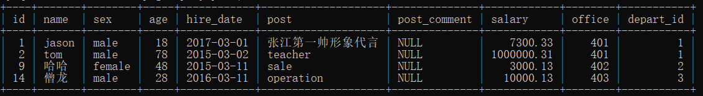

“Day47-数据库(四)学习笔记”

# 一、单表查询

## 1.1 前期表准备

```python
create table emp(
  id int not null unique auto_increment,
  name varchar(20) not null,
  sex enum('male','female') not null default 'male', #大部分是男的
  age int(3) unsigned not null default 28,
  hire_date date not null,
  post varchar(50),
  post_comment varchar(100),
  salary double(15,2),
  office int, #一个部门一个屋子
  depart_id int
);

#插入记录
#三个部门：教学，销售，运营
insert into emp(name,sex,age,hire_date,post,salary,office,depart_id) values
('jason','male',18,'20170301','张江第一帅形象代言',7300.33,401,1), #以下是教学部
('tom','male',78,'20150302','teacher',1000000.31,401,1),
('kevin','male',81,'20130305','teacher',8300,401,1),
('tony','male',73,'20140701','teacher',3500,401,1),
('owen','male',28,'20121101','teacher',2100,401,1),
('jack','female',18,'20110211','teacher',9000,401,1),
('jenny','male',18,'19000301','teacher',30000,401,1),
('sank','male',48,'20101111','teacher',10000,401,1),
('哈哈','female',48,'20150311','sale',3000.13,402,2),#以下是销售部门
('呵呵','female',38,'20101101','sale',2000.35,402,2),
('西西','female',18,'20110312','sale',1000.37,402,2),
('乐乐','female',18,'20160513','sale',3000.29,402,2),
('拉拉','female',28,'20170127','sale',4000.33,402,2),
('僧龙','male',28,'20160311','operation',10000.13,403,3), #以下是运营部门
('程咬金','male',18,'19970312','operation',20000,403,3),
('程咬银','female',18,'20130311','operation',19000,403,3),
('程咬铜','male',18,'20150411','operation',18000,403,3),
('程咬铁','female',18,'20140512','operation',17000,403,3);

# 个别同学的电脑在插入中文的时候还是会出现乱码或者空白的现象 你可以将字符编码统一设置成GBK
```

当表字段特别多 展示的时候错乱 可以使用`\G`分行展示:

```python
select * from emp\G;
```

使用后输出信息分段

```python
....
*************************** 17. row ***************************
          id: 17
        name: 程咬铜
         sex: male
         age: 18
   hire_date: 2015-04-11
        post: operation
post_comment: NULL
      salary: 18000.00
      office: 403
   depart_id: 3
*************************** 18. row ***************************
....
```

## 1.2 几个重要关键字的执行顺序

```python
# 书写顺序
select id,name from emp where id > 3;
# 执行顺序
from
where
select

"""
虽然执行顺序和书写顺序不一致 你在写sql语句的时候可能不知道怎么写
你就按照书写顺序的方式写sql
	select * 先用*号占位
	之后去补全后面的sql语句
	最后将*号替换后你想要的具体字段
	
	明天会一直使用 这里先理解
"""
```

## 1.3 where筛选条件

作用：是对整体数据的一个筛选操作

```python
# 1.查询id大于等于3小于等于6的数据
select id,name,age from emp where id>=3 and id<=6;
select id,name from emp where id between 3 and 6;  # 两者等价

# 2.查询薪资是20000或者18000或者17000的数据
select * from emp where salary=20000 or salary=18000 or salary=17000;
select * from emp where salary in (20000,18000,17000);

# 3.查询员工姓名中包含字母o的员工的姓名和薪资
"""
模糊查询
	like
		%  匹配任意多个字符
		_  匹配任意单个字符
"""
select name,salary from emp where name like '%o%';

# 4.查询员工姓名是由四个字符组成的 姓名和薪资  char_length()   _
select name,salary from emp where name like '____';
select name,salary from emp where char_length(name) = 4;

# 5.查询id小于3或者id大于6的数据
select * from emp where id not between 3 and 6;

# 6.查询薪资不在20000,18000,17000范围的数据
select * from emp where salary not in (20000,18000,17000);

# 7.查询岗位描述为空的员工姓名和岗位名  针对null不用等号 用is
select name,post from emp where post_comment = NULL; # 查不出结果
select name,post from emp where post_comment is NULL;	# 正常
```

## 1.4 group by分组

什么时候需要分组？

​	关键字 ：每个、平均、最高、最低 

分组的应用场景：

- 男女比例
- 部门平均薪资
- 部门秃头率
- 国家之间数据统计

### 1.4.1 按照部门分组（非严格模式，了解即可）

在未设置严格模式的情况下， 可以使用如下命令查询`按照部门分组`的数据

```mysql
mysql> select * from emp group by post;
```

输出数据：



返回的数据实际上是有问题的，返回的是分组之后`每个组的第一条数据`，但是这不符合分组的规范，

分组之后不应该考虑单个数据，而应该`以组为操作单位`(分组之后 没办法直接获取组内单个数据)

<font color=red>在严格模式下，该命令会直接报错</font>

```mysql
mysql> select * from emp group by post;
ERROR 1055 (42000): Expression #1 of SELECT list is not in GROUP BY clause and contains nonaggregated column 'day47.emp.id' which is not functionally dependent on columns in GROUP BY clause; this is incompatible with sql_mode=only_full_group_by
```

### 1.4.2 按照部门分组（严格模式，掌握）

设置严格模式之后，分组默认只能拿到分组的依据，比如：

```mysql
# 按照post分组
select post from emp group by post;  

# 输出
+--------------------+
| post               |
+--------------------+
| 张江第一帅形象代言 |
| teacher            |
| sale               |
| operation          |
+--------------------+
```

按照什么分组就只能拿到分组字段，其他字段不能直接获取，需要借助于一些方法(`聚合函数`)

常用聚合函数：

- max	最大值
- min    最小值
- sum   求和
- count  数量
- avg     平均值

分组查询案例：

```python
# 1.获取每个部门的最高薪资
select post,max(salary) from emp group by post;
select post as '部门',max(salary) as '最高薪资' from emp group by post;	# 推荐
select post '部门',max(salary) '最高薪资' from emp group by post;	# 不推荐
# as可以给字段起别名 也可以直接省略不写 但是不推荐 因为省略的话语意不明确 容易错乱

# 2.获取每个部门的最低薪资
select post,min(salary) from emp group by post;
# 3.获取每个部门的平均薪资
select post,avg(salary) from emp group by post;
# 4.获取每个部门的工资总和
select post,sum(salary) from emp group by post;
# 5.获取每个部门的人数
select post,count(id) from emp group by post;  # 常用 符合逻辑
select post,count(salary) from emp group by post;
select post,count(age) from emp group by post;
select post,count(post_comment) from emp group by post;  null不行

# 6.查询分组之后的部门名称和每个部门下所有的员工姓名 
# group_concat不单单可以支持你获取分组之后的其他字段值 还支持拼接操作
select post,group_concat(name) from emp group by post;
select post,group_concat(name,'_DSB') from emp group by post;
'''
+--------------------+-----------------------------------------------------------------+
| 部门               | 名字                                                            |
+--------------------+-----------------------------------------------------------------+
| operation          | 僧龙_DSB,程咬金_DSB,程咬银_DSB,程咬铜_DSB,程咬铁_DSB            |
| sale               | 哈哈_DSB,呵呵_DSB,西西_DSB,乐乐_DSB,拉拉_DSB                    |
| teacher            | tom_DSB,kevin_DSB,tony_DSB,owen_DSB,jack_DSB,jenny_DSB,sank_DSB |
| 张江第一帅形象代言 | jason_DSB                                                       |
+--------------------+-----------------------------------------------------------------+
'''
select post,group_concat(name,':',salary) from emp group by post;
# concat不分组的时候用 
select concat('NAME:',name),concat('SAL:',salary) from emp;

# 补充 as语法不单单可以给字段起别名 还可以给表临时起别名
select emp.id,emp.name from emp;  
select emp.id,emp.name from emp as t1;   # 报错
select t1.id,t1.name from emp as t1;

# 查询每个人的年薪  12薪
select name,salary*12 from emp;
```

## 1.5 分组注意事项

1. 关键字where和group by同时出现的时候**group by必须在where的后面**

2. where筛选条件不能使用聚合函数

   ```python
   mysql> select id,name,age from emp where max(salary) > 3000;
   ERROR 1111 (HY000): Invalid use of group function
   ```

3. 不分组的情况下使用聚合函数，默认整体就是一组

   ```python
   mysql> select max(salary) from emp;
   +-------------+
   | max(salary) |
   +-------------+
   |  1000000.31 |
   +-------------+
   ```

## 1.6 分组之后的筛选条件(having)

数据分组之后，再进行一遍筛选

```python
"""
having的语法根where是一致的
只不过having是在分组之后进行的过滤操作
即having是可以直接使用聚合函数的
"""
# 统计各部门年龄在30岁以上的员工平均工资并且保留平均薪资大于10000的部门
select post,avg(salary) from emp 
		where age>30 
    	group by post
        having avg(salary) > 10000
        ;
```

## 1.7 distinct去重

必须是完全一样的数据才可以去重！！！

一定不要将主键忽视了，有主键存在的情况下 是不可能去重的

```python
select distinct id,age from emp;	# 因为有主键存在，去重失败
select distinct age from emp;	# age数据一样，去重成功
```

## 1.8 order by排序

```python
select * from emp order by salary;
select * from emp order by salary asc;	# 默认升序，asc可以省略不写
select * from emp order by salary desc; # 降序

# 先按照age降序排  如果碰到age相同 则再按照salary升序排
select * from emp order by age desc,salary asc;


# 统计各部门年龄在10岁以上的员工平均工资并且保留平均薪资大于1000的部门,然后对平均工资降序排序
	select post,avg(salary) from emp 
		where age>10 
    	group by post
        having avg(salary) > 1000
        order by avg(salary) desc
        ;
```

## 1.9 limit限制展示条数

```python
select * from emp;
"""针对数据过多的情况 我们通常都是做分页处理"""
select * from emp limit 3;  # 只展示三条数据

select * from emp limit 0,5;
select * from emp limit 5,5;
'''
第一个参数是起始位置
第二个参数是展示条数
'''
```

## 1.10 正则

where后面也可以接正则表达式

```python
select * from emp where name regexp '^j.*(n|y)$';
```


# 二、多表操作

## 2.1 前期表准备

```python
#建表
create table dep(
id int,
name varchar(20) 
);

create table emp(
id int primary key auto_increment,
name varchar(20),
sex enum('male','female') not null default 'male',
age int,
dep_id int
);

#插入数据
insert into dep values
(200,'技术'),
(201,'人力资源'),
(202,'销售'),
(203,'运营');

insert into emp(name,sex,age,dep_id) values
('jason','male',18,200),
('egon','female',48,201),
('kevin','male',18,201),
('nick','male',28,202),
('owen','male',18,203),
('jerry','female',18,204);
```

## 2.2 联表查询

联表查询：多张表一起查询，获取有用的数据。也可以称为“多表查询”，“拼表查询”

最简单的联表查询：

```python
select * from dep,emp;  # 结果   两个表混一起的`笛卡尔乘积`
"""
了解即可 不知道也没关系
"""
```

正确用法：

```python
select * from emp,dep where emp.dep_id = dep.id;
```

输出：

```python
+----+-------+--------+------+--------+------+----------+
| id | name  | sex    | age  | dep_id | id   | name     |
+----+-------+--------+------+--------+------+----------+
|  1 | jason | male   |   18 |    200 |  200 | 技术     |
|  2 | egon  | female |   48 |    201 |  201 | 人力资源 |
|  3 | kevin | male   |   18 |    201 |  201 | 人力资源 |
|  4 | nick  | male   |   28 |    202 |  202 | 销售     |
|  5 | owen  | male   |   18 |    203 |  203 | 运营     |
+----+-------+--------+------+--------+------+----------+
```

MySQL也知道 你在后面查询数据过程中 肯定会经常用到拼表操作，所以特地开设了对应的方法：

```python
- inner join  内连接
- left join   左连接
- right join  右连接
- union		全连接
```

### 2.2.1 内连接

拼接两张表中的`公有部分`

```python
mysql> select emp.name, dep.name from emp inner join dep on emp.dep_id = dep.id;
+-------+----------+
| name  | name     |
+-------+----------+
| jason | 技术     |
| egon  | 人力资源 |
| kevin | 人力资源 |
| nick  | 销售     |
| owen  | 运营     |
+-------+----------+
```

### 2.2.2 左连接

左表所有的数据都展示出来 没有对应的项就用NULL

```python
mysql> select emp.name, dep.name from emp left join dep on emp.dep_id = dep.id;
+-------+----------+
| name  | name     |
+-------+----------+
| jason | 技术     |
| egon  | 人力资源 |
| kevin | 人力资源 |
| nick  | 销售     |
| owen  | 运营     |
| jerry | NULL     |
+-------+----------+
```

### 2.2.3 右连接

右表所有的数据都展示出来 没有对应的项就用NULL

```python
mysql> select emp.name, dep.name from emp right join dep on emp.dep_id = dep.id;
+-------+----------+
| name  | name     |
+-------+----------+
| jason | 技术     |
| kevin | 人力资源 |
| egon  | 人力资源 |
| nick  | 销售     |
| owen  | 运营     |
+-------+----------+
```

### 2.2.4 全连接

全连接  左右两表所有的数据都展示出来

```python
mysql> select emp.name, dep.name from emp left join dep on emp.dep_id = dep.id
    -> union
    -> select emp.name, dep.name from emp right join dep on emp.dep_id = dep.id;
+-------+----------+
| name  | name     |
+-------+----------+
| jason | 技术     |
| egon  | 人力资源 |
| kevin | 人力资源 |
| nick  | 销售     |
| owen  | 运营     |
| jerry | NULL     |
+-------+----------+
```

## 2.5 子查询

子查询就是我们平时解决问题的思路，将一个查询语句的结果当做另外一个查询语句的条件去用，

查询部门是技术或者人力资源的员工信息案例如下:

```python
# 先获取部门的id号
select id from dep where name='技术' or name = '人力资源';	
+------+
| id   |
+------+
|  200 |
|  201 |
+------+

# 再使用`子查询`去员工表里面筛选出对应的员工
select name from emp where dep_id in (select id from dep where name='技术' or name = '人力资源');
    
# 其实就是相当于
select name from emp where dep_id in (200,201);
```


# 三、作业

```python
1.整理今日内容
2.完成下列分组查询练习题(以课上建表代码为参考)
	1. 查询岗位名以及岗位包含的所有员工名字
	2. 查询岗位名以及各岗位内包含的员工个数
	3. 查询公司内男员工和女员工的个数
	4. 查询岗位名以及各岗位的平均薪资
	5. 查询岗位名以及各岗位的最高薪资
	6. 查询岗位名以及各岗位的最低薪资
	7. 查询男员工与男员工的平均薪资，女员工与女员工的平均薪资
3.练习拼表操作并理解其意义
4.理解子查询思路体会其意义
```


