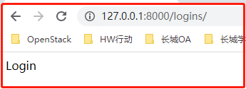
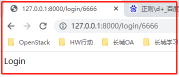
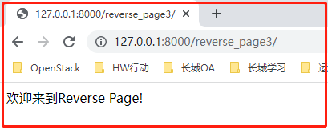
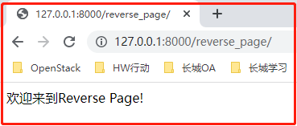
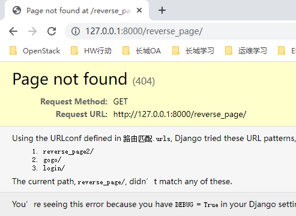

“第61天Django-02学习笔记”

# 一、Django ORM创建表关系

## （TODO补完数据库回来看）

表与表之间的关系分为：

一对多、多对多、一对一、没有关系

这里用一个案例来讲解：

```python
# 案例
图书表
出版社表
作者表
作者详情表

# 相互的关系
图书和出版社是一对多的关系 外键字段建在多的那一方 book
图书和作者是多对多的关系 需要创建第三张表来专门存储
作者与作者详情表是一对一

from django.db import models

# Create your models here.


# 创建表关系  先将基表创建出来 然后再添加外键字段
class Book(models.Model):
    title = models.CharField(max_length=32)
    price = models.DecimalField(max_digits=8,decimal_places=2)
    # 总共八位 小数点后面占两位
    """
    图书和出版社是一对多 并且书是多的一方 所以外键字段放在书表里面
    """
    publish = models.ForeignKey(to='Publish')  # 默认就是与出版社表的主键字段做外键关联
    """
    如果字段对应的是ForeignKey 那么会orm会自动在字段的后面加_id
    如果你自作聪明的加了_id那么orm还是会在后面继续加_id
    
    后面在定义ForeignKey的时候就不要自己加_id
    """


    """
    图书和作者是多对多的关系 外键字段建在任意一方均可 但是推荐你建在查询频率较高的一方
    """
    authors = models.ManyToManyField(to='Author')
    """
    authors是一个虚拟字段 主要是用来告诉orm 书籍表和作者表是多对多关系
    让orm自动帮你创建第三张关系表
    """


class Publish(models.Model):
    name = models.CharField(max_length=32)
    addr = models.CharField(max_length=32)


class Author(models.Model):
    name = models.CharField(max_length=32)
    age = models.IntegerField()
    """
    作者与作者详情是一对一的关系 外键字段建在任意一方都可以 但是推荐你建在查询频率较高的表中
    """
    author_detail = models.OneToOneField(to='AuthorDetail')
    """
    OneToOneField也会自动给字段加_id后缀
    所以你也不要自作聪明的自己加_id
    """

class AuthorDetail(models.Model):
    phone = models.BigIntegerField()  # 或者直接字符类型
    addr = models.CharField(max_length=32)


"""
	orm中如何定义三种关系
		publish = models.ForeignKey(to='Publish')  # 默认就是与出版社表的主键字段做外键关联
		
		authors = models.ManyToManyField(to='Author')
		
		author_detail = models.OneToOneField(to='AuthorDetail')
		
		
		ForeignKey
		OneToOneField
			会自动在字段后面加_id后缀
"""

# 在django1.X版本中外键默认都是级联更新删除的
# 多对多的表关系可以有好几种创建方式 这里暂且先介绍一种
# 针对外键字段里面的其他参数 暂时不要考虑 如果感兴趣自己可以百度试试看
```

# 二、Django请求周期图


# 三、路由层

## 3.1 路由匹配

我们已经在`urls.py`文件中配置过路由匹配，例如：

```python
path('login/', views.login),
path('register/', views.register),
```

或者是老版本Django中的：

```python
url(r'test',views.test),
url(r'testadd',views.testadd)
```

那么，思考一个问题，`path/url方法`到底是什么？

- `url`是`Django 1.x`中的写法，在Django2.1中，开始舍弃Django1.x中的url写法。

- 在`Django2.x`中，描写url配置的有两个函数：`path`和`re_path`

re_path()函数可以看做是django 1.x中得url函数，即可以在路径中使用正则。

### 3.1.1 案例验证路由匹配

我们通过一个案例来验证`re_path`的正则匹配

view.py文件

```python
from django.shortcuts import render, HttpResponse

# Create your views here.
def login(request):
    return HttpResponse("Login")
def register(request):
    return HttpResponse("Register")
def logins(request):
    return HttpResponse("Logins")
```

url.py文件

```python
from django.contrib import admin
from django.urls import path, re_path
from app01 import views

urlpatterns = [
    re_path(r'login', views.login),
    re_path(r'register/', views.register),
    re_path(r'logins/', views.logins)
]
```

尝试访问http://127.0.0.1:8000/logins/，结果却显示"Login"的界面



说明路由匹配是有效的，只是`被截胡了`，匹配到第一条re_path，发现`'logins'`里面正好包含`‘login’`，所以匹配上了，不继续往下匹配。

如果需要刚好匹配上，修改正则即可

```python
urlpatterns = [
    re_path('login/', views.login),	# 可以匹配到Login
    re_path('register/', views.register),
    re_path('logins/', views.logins)	# 可以匹配到Logins
]
```

### 3.1.2 路由匹配的`'/'`

在输入url的时候，默认会加上斜杠，django内部会帮你做到重定向：

- 第一次匹配不到
- url后面加斜杠再来一次

如图：


这个是通过参数控制的，<font color=red>默认为True</font>，可以取消自动加斜杠，修改`setting.py`添加

```python
APPEND_SLASH = False	# 默认是True，自动加斜杠的，改为False可以取消
```

取消后，再次访问http://127.0.0.1:8000/login，访问失败，如图：


### 3.1.3 路由匹配的妙用

我们可以用正则路由匹配实现`首页/尾页(404页面)`的匹配

```python
# Django 2.X
urlpatterns = [
    re_path(r'^$', views.home),
    re_path(r'login/', views.login),
    re_path(r'register/', views.register),
    re_path(r'logins/', views.logins),
    re_path(r'', views.error),
]

# Django 1.X
urlpatterns = [
    url(r'^admin/', admin.site.urls),
    # 首页
    url(r'^$',views.home),
    # 路由匹配
    url(r'^test/$',views.test),
    url(r'^testadd/$',views.testadd),
    # 尾页(了解)
    url(r'',views.error),
]
```

访问首页：


访问不存在的页面（尾页）:


## 3.2 无名分组(位置参数)

什么是分组？

​	就是给某一段正则表达式用小括号扩起来

什么是无名分组？

​	无名分组就是将`括号内`正则表达式`匹配到的内容`当作位置`参数`传递给后面的视图函数

例如：

```python
url(r'^test/(\d+)/',views.test)
```

作用是什么？---  将(\d+)正则配到的内容，当参数传给test视图函数，案例如下:

```python
# urls.py
urlpatterns = [
    re_path(r'^$', views.home),
    re_path(r'login/(\d+)', views.login), # "\d+"正则表达式，匹配一个或多个数字
	....
]

# views.py
def login(request, my_num):
    print(my_num)
    return HttpResponse("Login")
```

测试：

访问http://127.0.0.1:8000/login/336688

后端输出，成功拿到参数


## 3.3 有名分组(关键字参数)

什么是有名分组？

​	将无名分组起个名，就叫有名分组，怎么起名?

```python
(?P<名称>正则)
```

案例如下

```python
# urls.py
urlpatterns = [
    re_path(r'^$', views.home),
    re_path(r'login/(?P<good_name>\d+)', views.login),
]

# views.py
def login(request, good_name):
    print(good_name)
    return HttpResponse("Login")
```

测试：



后台输出，成功拿到参数：


## 3.4 无名有名是否可以混合使用

**<font color=red size=100px>不能！</font>**


## 3.5 反向解析（重要）

什么是反向解析？

​	通过`url标签`或是reverse()方法获取到真实的`url地址`

反向解析的作用是什么（重点理解）？

对于前端而言：

​	需要定义一个a标签跳转到首页，此是首页在后端的urls.py的地址为`index/`

​	按正常逻辑，将a标签写为`<a href="index/">点我跳转</a>`即可

​	但是，假如urls.py中对于首页的地址修改了，改成了`index2/`

​	那么，所有的a标签都得修改，不然，无法正常访问到页面

​	此时需要反向代理，通过类似于`<a href=>点我跳转</a>`的标签

​	可以实现后台地址的`动态解析`, 即``可以动态解析成`index/`或是`index2/`

对于后端而言：

​	需要render或是redirect重定向到一个页面，此时也需要写一个url地址，

​	通过使用反向解析，也能动态获取url地址

### 3.5.1 后端反向解析

案例：访问http://127.0.0.1:8000/gogo/跳转到http://127.0.0.1:8000/reverse_page/

先正常定义，是能正常跳转的

```python
# urls.py
from django.contrib import admin
from django.urls import path, re_path
from app01 import views

urlpatterns = [
    re_path(r'reverse_page/', views.reverse_page), # 这里的路径改了怎么办？
    re_path(r'gogo/', views.gogo),
]

# views.py
from django.shortcuts import render, HttpResponse, reverse, redirect

# Create your views here.
def reverse_page(request):
    return HttpResponse("欢迎来到Reverse Page!")

def gogo(request):
    return redirect('/reverse_page/')
```

但是假如`url.py`中的路径改了

```python
re_path(r'reverse_page/', views.reverse_page),
# 改为
re_path(r'reverse_page2/', views.reverse_page),
```

再次访问会跳转失败，返回404找不到页面，除非把`views.py`中的路径改过来

此时就需要使用`反向解析`来处理这个问题。

#### 3.5.1.1 无参数反向解析

修改配置项：

```python
# urls.py
from django.contrib import admin
from django.urls import path, re_path
from app01 import views

urlpatterns = [
    # 添加反向解析名name
    re_path(r'reverse_page2/', views.reverse_page, name="reverse_name"),	
    re_path(r'gogo/', views.gogo),
]

# views.py
from django.shortcuts import render, HttpResponse, reverse, redirect

# Create your views here.
def reverse_page(request):
    return HttpResponse("欢迎来到Reverse Page!")

# 使用reverse()方法反向解析，传入在urls.py定义的name
def gogo(request):
    url = reverse('reverse_name')
    return redirect(url)
```

此时再去测试访问http://127.0.0.1:8000/gogo/

无论`urls.py`中的路径怎么变，都能正常跳转

测试改成`reverse_page3/`



再测试改成`xxxx/`


#### 3.5.1.2 带参数（有分组）的反向解析

如果我们需要跳转的页面是带参数的怎么办？

比如http://127.0.0.1:8000/gogo/要跳转到http://127.0.0.1:8000/reverse_page/33/44

##### 对于位置参数（无名分组）：

`urls.py`配置如下：

```python
from django.contrib import admin
from django.urls import path, re_path
from app01 import views

urlpatterns = [
    # 添加【位置参数】和【反向解析名】
    re_path(r'xxxx/(\d+)/(\d+)', views.reverse_page, name="reverse_name"),
    re_path(r'gogo/', views.gogo),
]
```

`views.py`配置如下：

```python
from django.shortcuts import render, HttpResponse, reverse, redirect

# Create your views here.
def reverse_page(request, arg1, arg2):
    return HttpResponse("<p>欢迎来到Reverse Page!</p>传来的参数是" + ": " + arg1 + " 和 " + arg2)

def gogo(request):
    # 反向解析处理
    url = reverse('reverse_name', args=(11, 22))
    return redirect(url)
```

测试访问http://127.0.0.1:8000/gogo/：


##### 对于关键字参数（有名分组）：

`urls.py`配置如下：

```python
from django.contrib import admin
from django.urls import path, re_path
from app01 import views

urlpatterns = [
    # 添加【关键字参数】和【反向解析名】
    re_path(r'xxxx/(?P<arg1>\d+)/(?P<arg2>\d+)', views.reverse_page, name="reverse_name"),
    re_path(r'gogo/', views.gogo),
]
```

`views.py`的配置如下：

```python
from django.shortcuts import render, HttpResponse, reverse, redirect

# Create your views here.
def reverse_page(request, arg1, arg2):
    return HttpResponse("<p>欢迎来到Reverse Page!</p>传来的参数是" + ": " + arg1 + " 和 " + arg2)

def gogo(request):
    # 反向解析处理
    url = reverse('reverse_name', kwargs={'arg1': 33, 'arg2': 44})
    return redirect(url)
```

测试访问http://127.0.0.1:8000/gogo/：


### 3.6.1 前端反向解析

案例：前端点击login页面中的`a标签`，要跳转到http://127.0.0.1:8000/reverse_page/

按普通的写法：

url.py定义路由

```python
urlpatterns = [
    re_path(r'reverse_page/', views.reverse_page),
    re_path(r'gogo/', views.gogo),
    re_path(r'login/', views.login),
]
```

views.py定义视图

```python
# Create your views here.
def reverse_page(request):
    return HttpResponse("<p>欢迎来到Reverse Page!")

# 定义Login页面标签a标签
def login(request):
    return render(request, 'login.html')
```

login.html 页面代码：

```html
<!DOCTYPE html>
<html lang="en">
<head>
    <meta charset="UTF-8">
    <title>Title</title>
</head>
<body>
<h1>Login页面</h1>
<a href="/reverse_page">不要点我</a></p>
</body>
</html>
```

测试，访问Login页面，点击a标签


成功跳转



修改`urls.py`

```python
urlpatterns = [
    # re_path(r'reverse_page/', views.reverse_page), 修改为
    re_path(r'reverse_page2/', views.reverse_page),
    re_path(r'gogo/', views.gogo),
    re_path(r'login/', views.login),
]
```

再次操作，访问失败，404页面



那么，也要通过反向解析来解决问题。


#### 3.6.1.1 无参数反向解析

修改`urls.py`添加反向解析名

```python
urlpatterns = [
    # 加个反向解析name
    re_path(r'reverse_page2/', views.reverse_page, name="reverse_name"),
    re_path(r'gogo/', views.gogo),
    re_path(r'login/', views.login),
]
```

修改`login.html`代码

```html
<!DOCTYPE html>
<html lang="en">
<head>
    <meta charset="UTF-8">
    <title>Title</title>
</head>
<body>
<h1>Login页面</h1>
# 使用反向解析
<a href=>不要点我</a></p>
</body>
</html>
```

将`url改为reverse2/`测试访问：


将`url改为xxxxx/`测试访问：


#### 3.6.1.2 带参数（有分组）的反向解析

案例：前端点击login页面中的`a标签`，要跳转到http://127.0.0.1:8000/reverse_page/111/222

##### 对于位置参数（无名分组）

`urls.py`修改：

```python
urlpatterns = [
    re_path(r'xxxx/(\d+)/(\d+)', views.reverse_page, name="reverse_name"),
    re_path(r'gogo/', views.gogo),
    re_path(r'login/', views.login),
]
```

`login.html`修改:

```python
<!DOCTYPE html>
<html lang="en">
<head>
    <meta charset="UTF-8">
    <title>Title</title>
</head>
<body>
<h1>Login页面</h1>
<a href=>不要点我</a></p>
</body>
</html>
```

`views.py`修改：

```python
def reverse_page(request, arg1, arg2):
    return HttpResponse("<p>欢迎来到Reverse Page!</p>传来的参数是" + ": " + arg1 + " 和 " + arg2)
```

测试显示解析成功：


##### 对于关键字参数（有名分组）

`urls.py`修改：

```python
urlpatterns = [
    # 定义关键字参数
    re_path(r'reverse_page/(?P<arg1>\d+)/(?P<arg2>\d+)', views.reverse_page, name="reverse_name"),
    re_path(r'gogo/', views.gogo),
    re_path(r'login/', views.login),
]
```

`login.html`修改:

```python
<!DOCTYPE html>
<html lang="en">
<head>
    <meta charset="UTF-8">
    <title>Title</title>
</head>
<body>
<h1>Login页面</h1>
# 传入参数
<a href=>不要点我</a></p>
</body>
</html>
```

测试显示解析成功：


