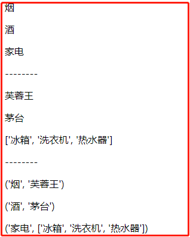

“Day63 模板语法 学习笔记”


# 一、模板语法

什么是模板语法？

模板语法是一种写在HTML中的标记语法，常用有两种方式：

```python
{{  }}	# 双括号形式，主要用于变量相关
  # 括号+%形式，主要用于逻辑相关
```

作用： 

- 将后端定义的变量传递给前端
- 处理后端传过来的数据

## 1.1 模板语法传值

### 1.1.1 传递基本数据类型

模板语法可接收后端传递过来的所有基本数据类型。

案例如下：

后端`views.py`定义变量，并传递给前端

```python
from django.shortcuts import render


# Create your views here.
def index(request):
    # 传递基本数据类型
    n = 123	# 整型
    f = 11.11	# 浮点
    s = '我是谁，我在哪？'	# 字符串
    b = True	# 布尔
    l = ['小一', '小儿', '小啊啊']	# 列表
    t = ('锄禾', '日', '当午')	# 元组
    d = {'aa': 'A', 'bb': 'B'}	# 字典
    s = {1, '左右', 3}	# 集合

    # 返回Index页面, 并将变量传递给前端

    # 传递的方法一：一个个传
    # (可以给变量起别名，比如将's'改名为'my_set', 前端使用{{ my_set }}调用)
    # return render(request, 'index.html', {'n': n, 'my_set': s})

    # 传递方法二：传所有
    return render(request, 'index.html', locals())

```

前端使用`模板语法`调用

```html
<!DOCTYPE html>
<html lang="en">
<head>
    <meta charset="UTF-8">
    <title>Title</title>
</head>
<body>
{#接收基本数据类型#}
<p>{{ n }}</p>
<p>{{ f }}</p>
<p>{{ s }}</p>
<p>{{ b }}</p>
<p>{{ l }}</p>
<p>{{ d }}</p>
<p>{{ t }}</p>
<p>{{ se }}</p>
</body>
</html>
```

HTML页面输出：

```python
123

11.11

{1, '左右', 3}

True

['小一', '小儿', '小啊啊']

{'aa': 'A', 'bb': 'B'}

('锄禾', '日', '当午')
```

### 1.1.2 传递类方法

模板语法可接收后端传递过来的类方法返回值，但是调用类方法`不能传参数`

案例如下：

后端`views.py`定义变量

```python
from django.shortcuts import render

# Create your views here.
def index(request):
    # 定义类
    class My_Class(object):	
        def get_self(self):	# 普通类方法
            return 'self'

        @staticmethod	# 静态方法
        def get_func():
            return 'func'

        @classmethod	# 类方法
        def get_class(self):
            return 'class'

        def __str__(self):	# 魔法方法
            return "__str__显示"

    # 实例化
    obj = My_Class()

    # 传递所有
    return render(request, 'index.html', locals())
```

前端使用`模板语法`调用

```html
<!DOCTYPE html>
<html lang="en">
<head>
    <meta charset="UTF-8">
    <title>Title</title>
</head>
<body>
{#接收基本数据类型#}
<p>{{ obj }}</p>
<p>{{ obj.get_self }}</p>
<p>{{ obj.get_func }}</p>
<p>{{ obj.get_class }}</p>
</body>
</html>
```

HTML页面输出：

```python
__str__显示

self

func

class
```

### 1.1.3 通过`.`获取值

Django模版语法的取值是`固定的格式`，只能采用“句点符” `.`

案例如下：

```python
# views.py
from django.shortcuts import render

# Create your views here.
def index(request):
    my_dict = {'aa': 'A', 'bb': [1, 2, '牛逼Plus']}	

    # 传递方法二：传所有
    return render(request, 'index.html', locals())
```

怎么通过模板语法，从里面拿到"牛逼Plus"?

```html
<p>{{ my_dict.bb.2 }}</p>
```

先拿到字典键'bb'的值，再从里面取下标为2的值。即可以点键也可以点索引 还可以两者混用

## 1.2 模板语法过滤器

可以理解为`shell中的管道`，对数据进行二次处理。

Django内置有60多种过滤器，这里介绍10个左右

案例如下：

变量定义与传递`views.py`

```python
from django.shortcuts import render
from datetime import datetime

# Create your views here.
def index(request):
    # 定义变量
    aa = 'str12345'
    bb = False
    cc = 1000000
    dd = datetime.now()
    ee = ['1', '2', '3', '4', '5']
    ff = '长空 破浪 会 有时'
    gg = 'abcd1234'
    hh = '<h1>你好</h1>'
    # 传递变量
    return render(request, 'index.html', locals())
```

HTML获取值

```html
<!DOCTYPE html>
<html lang="en">
<head>
    <meta charset="UTF-8">
    <title>Title</title>
</head>
<body>
{#过滤器的使用#}
<p>统计长度：{{ aa | length }}</p>
<p>设置默认值：{{ bb | default:'默认值' }}</p>
<p>文件大小：{ cc | filesizeformat }}</p>
<p>日期格式化：{{ dd | date:'Y-m-d H:i:s' }}</p>
<p>切片操作：{{ ee | slice:'0:4:2' }}</p>
<p>切取单词（按空格分割）:{{ ff | truncatewords:3 }}</p>
<p>切取字符： {{ gg | truncatechars:4 }}</p>
<p>拼接操作(分隔符)：{{ gg | join:"$" }}</p>
<p>拼接操作(加法-用于数字)：{{ bb | add:20 }}</p>
<p>拼接操作(加法-用于字符串)：{{ ff | add:gg }}</p>
<p>转义：{{ hh | safe }}</p>

</body>
</html>
```

测试访问：


### 1.2.1 转义补充

除了前端可以使用`|safe`过滤器转义，Django后端也可以转义

```python
# 后端views.py
from django.utils.safestring import mark_safe
ii = '<h2>我是后端的转义</h2>'
res = mark_safe(ii)

# 前端调用
{{ res }}
```

页面效果：


## 1.3 标签

### 1.3.1 for循环

后端：

```python
# 后端
my_list = ['11', '22', '33', '44']
```

前端：

```html

    <p>{{ forloop }}</p>	# 显示本次循环的信息
    <p>{{ i }}</p>	# 输出值

```

结果

```python
{'parentloop': {}, 'counter0': 0, 'counter': 1, 'revcounter': 4, 'revcounter0': 3, 'first': True, 'last': False}
11
{'parentloop': {}, 'counter0': 1, 'counter': 2, 'revcounter': 3, 'revcounter0': 2, 'first': False, 'last': False}
22
{'parentloop': {}, 'counter0': 2, 'counter': 3, 'revcounter': 2, 'revcounter0': 1, 'first': False, 'last': False}
33
{'parentloop': {}, 'counter0': 3, 'counter': 4, 'revcounter': 1, 'revcounter0': 0, 'first': False, 'last': True}
44
```

### 1.3.2 if判断

后端：

```python
old_zhao = False
old_wang = True
```

前端：

```html

    <p>今晚不行</p>

    <p>可以可以！</p>

    <p>也还凑合</p>

```

页面输出：

```python
可以可以！
```

### 1.3.3 标签混用

前端：

```html

    
        <p>这是我的第一次</p>
    
        <p>最后一次，下不为例</p>
    
        <p>{{ foo }}</p>
    
    
        <p>for循环的可迭代对象内部没有元素 根本没法循环</p>

```

页面输出：

```python
这是我的第一次

22

33

最后一次，下不为例
```

### 1.3.4 处理字典

后端定义字典：

```python
my_dic = {'烟': '芙蓉王', '酒': '茅台', '家电': ['冰箱', '洗衣机', '热水器']}
```

前端：

```python
{#输出键#}

    <p>{{ i }}</p>


<p>--------</p>

{#输出值#}

    <p>{{ i }}</p>


<p>--------</p>

{#输出键值对#}

    <p>{{ i }}</p>

```

页面输出：



### 1.3.5 with起别名

我们过滤*1.3.4*节的字典，比如从里面获取'热水器'这个值，一般的写法是：

```python
{{ my_dic.家电.2 }}

# 补充：没看错，家电确实不要加'引号'
```

如果觉得这么写太长，可以给它取个别名：

```html

    <p>{{ 别名 }}</p>

```

照样输出`热水器`

## 1.4 自定义过滤器、标签、Inclusion_tag

### 1.4.1 准备工作

无论是自定义过滤器、标签还是inclusion_tag，都需要进行如下准备工作：

1、在应用下创建名叫`templatetags`的文件夹（必须这个名字）

2、在该文件夹内，创建任意的`py`文件

3、在`py`文件中，需要导入模块

```python
from django import template
register = template.Library()
```

### 1.4.1 自定义过滤器

后端定义过滤器，实现两个数相加的功能

```python
# 导入模块
from django import template

register = template.Library()


# 自定义过滤器
@register.filter(name="baby")
def my_sum(x, y):
    return x + y
```

前端调用

```html
	# 加载模块
{{ cc|baby:666 }}	
```

### 1.4.2 自定义标签

后端定义

```python
# 自定义标签
@register.simple_tag(name='plus')
def index(a, b, c, d):
    return '%s-%s-%s-%s' % (a, b, c, d)
```

前端调用

```python
<p></p>
```

页面输出

```python
goodman-332-678-NB
```

### 1.4.3 自定义inclusion_tag

作用：

当html页面某一个地方的页面（`局部页面`）需要传参数才能够`动态的渲染`出来，并且在多

个页面上都需要使用到该局部页面，那么就考虑将该局部页面做成inclusion_tag形式

内部原理：

- 先定义一个方法 
- 在页面上调用该方法 并且可以传值
- 该方法会生成一些数据然后传递给一个html页面
- 之后将渲染好的结果放到调用的位置

图解：


**案例：**

后端定义：

```python
@register.inclusion_tag('left_menu.html')
def left(n):
    data = ['第{}项'.format(i) for i in range(n)]
    # 第一种
    # return {'data':data}  # 将data传递给left_menu.html
    # 第二种
    return locals()  # 将data传递给left_menu.html
```

局部页面：`left_menu.html`定义

```html
<ul>
    
        <li>{{ foo }}</li>
    
</ul>
```

主页面调用（既将局部页面插入主页面）：

```html

```

效果（主页面中插入了left_menu.html页面）：


## 1.5 模板的继承(TODO)

这里有个例子要做（TODO）

```python
"""
你们有没有见过一些网站
	这些网站页面整体都大差不差 只是某一些局部在做变化	
"""
# 模版的继承 你自己先选好一个你要想继承的模版页面


# 继承了之后子页面跟模版页面长的是一模一样的 你需要在模版页面上提前划定可以被修改的区域

	模版内容


# 子页面继承父页面的


# 子页面就可以声明想要修改哪块划定了的区域

	子页面内容	



# 一般情况下模版页面上应该至少有三块可以被修改的区域
	1.css区域
  2.html区域
  3.js区域
  

	
  
  

	
  
  

	
  # 每一个子页面就都可以有自己独有的css代码 html代码 js代码
  
"""
一般情况下 模版的页面上划定的区域越多 那么该模版的扩展性就越高
但是如果太多 那还不如自己直接写
"""
```

## 1.6 模板的导入

```html
"""
将页面的某一个局部当成模块的形式
哪个地方需要就可以直接导入使用即可
"""

```


# 二、CBV源码分析

```python
# 你自己不要修改源码 除了bug很难找

# 突破口在urls.py
url(r'^login/',views.MyLogin.as_view())
# url(r'^login/',views.view)  FBV一模一样
# CBV与FBV在路由匹配上本质是一样的 都是路由 对应 函数内存地址
"""
函数名/方法名 加括号执行优先级最高
猜测
    as_view()
        要么是被@staicmethod修饰的静态方法
        要么是被@classmethod修饰的类方法  正确
        
    @classonlymethod
    def as_view(cls, **initkwargs):
        pass
"""

    @classonlymethod
    def as_view(cls, **initkwargs):
        """
        cls就是我们自己写的类   MyCBV
        Main entry point for a request-response process.
        """
        def view(request, *args, **kwargs):
            self = cls(**initkwargs)  # cls是我们自己写的类
            # self = MyLogin(**initkwargs)  产生一个我们自己写的类的对象
            return self.dispatch(request, *args, **kwargs)
            """
            以后你们会经常需要看源码 但是在看python源码的时候 一定要时刻提醒自己面向对象属性方法查找顺序
                先从对象自己找
                再去产生对象的类里面找
                之后再去父类找
                ...
            总结:看源码只要看到了self点一个东西 一定要问你自己当前这个self到底是谁
            """
        return view
      
		# CBV的精髓
    def dispatch(self, request, *args, **kwargs):
        # 获取当前请求的小写格式 然后比对当前请求方式是否合法
        # get请求为例
        # post请求
        if request.method.lower() in self.http_method_names:
            handler = getattr(self, request.method.lower(), self.http_method_not_allowed)
            """
            反射:通过字符串来操作对象的属性或者方法
                handler = getattr(自己写的类产生的对象,'get',当找不到get属性或者方法的时候就会用第三个参数)
                handler = 我们自己写的类里面的get方法
            """
        else:
            handler = self.http_method_not_allowed
        return handler(request, *args, **kwargs)
        """
        自动调用get方法
        """

# 要求掌握到不看源码也能够描述出CBV的内部执行流程(******)
```

