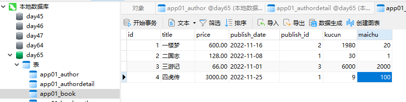
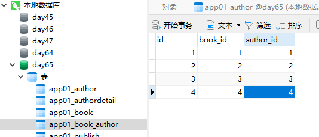

“Day65 Django ORM 操作数据库 进阶用法（二）  学习笔记”


# 今日考题

```python
"""
今日考题
1.必知必会N条都有哪些，每个都是干啥使的
2.简述神奇的双下划线查询都有哪些方法，作用是什么
3.针对多对多外键字段的增删改查方法有哪些，各有什么特点？
4.什么是正反向的概念，及查询口诀，你能否总结一下正反向查询不同情况下点击不同字段的规律
"""
```

# 上周内容回顾

* 单表的增删改查

  ```python
  # 增
  1.create()
  2.对象.save()
  
  # 查
  1.all()				查所有
  2.filter()		筛选条件，括号内多个参数之间逗号隔开并且默认是and关系
  3.get()				筛选条件，条件不存在直接报错 所以不推荐使用
  
  # 改
  1.update() 		queryset对象帮你封装的批量更新
  2.对象.save()
  
  # 删
  1.delete()		queryset对象帮你封装的批量删除
  2.对象.delete()		
  """
  在实际的项目中 数据是不可能真正删除的 一般情况下都用一个字段来标记是否删除
  """
  ```

* 测试环境准备

  ```python
  # 你如果只想测试django某一个py文件(大部分情况下就是models.py)
  
  # 在应用下的tests.py或者自己新建一个任意名称py文件(tests.py)
  """
  1.去manage.py拷贝前四行
  
  2.自己书写两行
  	import django
  	django.setup()
  """
  ```

* 如何查看orm内部的sql语句

  ```python
  # 1.queryset对象可以直接点query查看
  	queryset对象.query
  
  # 2.配置文件配置日志相关代码即可(不要记 直接拷贝使用即可)
  	参考笔记或者博客自己保存好
  ```

* 必知必会N多条

  ```python
  # 1.all()
  
  # 2.filter()
  	我们在利用数据的主键字段筛选数据的时候，可以不考虑主键字段叫什么，直接使用pk代替
  
  # 3.get()
  
  # 4.values()
  	获取指定字段对应的数据 返回的结果是一个queryset对象(列表套字典的形式)
  
  # 5.values_list()
  	获取指定字段对应的数据 返回的结果是一个queryset对象(列表套元祖的形式)
  
  # 6.count()
  	统计查询出来的数据个数
    
  # 7.first()
  	
  # 8.last()
  
  # 9.order_by()
  	默认是升序，你可以在字段前面加一个负改为降序
  
  # 10.reverse()
  	前面必须是已经排讯过了 才能生效
  
  # 11.exclude()
  	排除...在外
   
  # 12.distinct()
  	去重(主键一定不要忘了)
  
  # 13.exists()
  	判断数据集是否有值 返回布尔值
  ```

* 神奇的双下划线查询

  ```python
  # 价格大于 小于 大于等于 小于等于
  price__gt
  price__lt
  price__gte
  price__lte
  
  # 成员查询
  price__in
  
  # 范围查询
  price__range
  
  # 模糊查询
  title__contains		默认是区分大小写的
  title__icontains	忽略大小写
  
  # 只按照年份或者月份或者...
  create_time__year
  craete_time__month
  ```

* 外键字段的增删改查

  ```python
  # 一对多
  publish_id = 1
  punlish = publish_obj
  
  # 多对多
  add
  remove
  	上述两个方法括号内即可以传数字也可以传对象并且都支持多个
  set
  	括号内必须传一个可迭代对象 可迭代对象里面的元素可以数字也可以对象并且都支持多个
  clear
  	括号内无需给任何参数，直接清空对应的关系数据
  ```

* 多表查询

  ```python
  # 正反向的概念
  	正向
    	外键字段就在我手中
    反向
    	外键字段不再我手中
  # 小口诀
  	正向查询按外键字段
    反向查询按表名小写
    								_set
      							.all()
  # 温馨提示
  	书写orm语句跟书写sql语句一样，不要试图一次性写完，可以分步书写
    
  """
  多表操作
  	1.子查询
  		
  	2.联表操作
  		inner join
  		left join
  		right join
  		union
  
  Django orm中
  	1.基于对象的跨表查询
  		子查询
  			1.先拿到一个数据对象
  			2.对象点点点 
  	
  	2.基于双下划线的跨表查询
  		联表操作
  """
  1.基于对象的跨表查询
  	book_obj.publish
    book_obj.authors.all()
    author_obj.author_detail
    
    publish_obj.book_set  # App01.Book.None
    publish_obj.book_set.all()
    author_obj.book_set.all()
    author_detail.author
  
  2.基于双下划线的跨表查询
  	models.Book.objects.filter(pk=1).values('title','publish__name')
    models.Publish.objects.filter(book__id=1).values('book__title','name')
    
    # 利用双下划线的跨表查询可以帮助你跨N多张表，只要有外键字段
    models.Book.objects.filter(pk=1).values('authors__author_detail__phone')
    
  
  # 图书管理系统 图书的增删改查
  ```


# 今日内容概要

* 聚合查询(聚合函数的使用)aggregate

  max、min、sum、count、avg

* 分组查询(group by的使用)annotate

* F与Q查询

* django中如何开启事务

* orm中常用字段及参数

* 数据库查询优化(only与defer、select_related与prefetch_related)

* 图书管理系统作业讲解


# 一、环境准备

## 1.1 创建数据库

参考`day64`的`1.1`节创建Django项目、数据库、app应用	

http://localhost:4000/2022/09/15/03_Python/05_Django/day64%E7%AC%94%E8%AE%B0-DjangoORM%E8%BF%9B%E9%98%B6-01/#1-1-%E5%9F%BA%E7%A1%80%E5%87%86%E5%A4%87

## 1.2 创建测试脚本

编辑`test.py`文件

```python
from django.test import TestCase

# Create your tests here.

import os
import sys

if __name__ == '__main__':
    os.environ.setdefault("DJANGO_SETTINGS_MODULE", 'day65_DjangoORM_02.settings')
    import django

    django.setup()
    # 在这个代码块的下面就可以测试django里面的单个py文件了
    # 所有的代码必须等环境准备完毕之后才能书写

    from app01 import models

    models.User.objects.all()

```

## 1.3 创建数据表

编辑`models.py`创建ORM对象

```python
class Book(models.Model):
    title = models.CharField(max_length=32)
    price = models.DecimalField(max_digits=8, decimal_places=2)
    publish_date = models.DateField(auto_now=True)

    # 添加表关系
    # 一对多
    publish = models.ForeignKey(to='Publish', on_delete=models.CASCADE)
    # 多对多
    author = models.ManyToManyField(to='Author')


class Publish(models.Model):
    name = models.CharField(max_length=32)
    addr = models.CharField(max_length=64)
    email = models.EmailField()  # 默认是varchar(254)


class Author(models.Model):
    name = models.CharField(max_length=32)
    age = models.IntegerField()

    # 添加表关系：一对一
    author_detail = models.OneToOneField(to='AuthorDetail', on_delete=models.CASCADE)


class AuthorDetail(models.Model):
    phone = models.BigIntegerField()
    addr = models.CharField(max_length=64)

```


## 1.4 插入数据

**author表:**


**authordetail表：**


**book表：**



**book_author表：**



**publish表：**


# 二、查询方法

## 2.1 聚合查询（agreegate）

>聚合查询通常情况下都是配合分组一起使用的，只要是跟数据库相关的模块 
>
>基本上都在`django.db.models`里面
>
>如果上述没有那么应该在`django.db`里面

案例一：查询所有书的平均价格 （在`test.py`中测试）

```python
from app01 import models

from django.db.models import Avg
# 查询所有书的平均价格
res = models.Book.objects.aggregate(Avg('price'))
print(res)

# 输出
{'price__avg': Decimal('948.500000')}
```

案例二：使用多种方法一起查询

```python
from app01 import models

from django.db.models import Max,Min,Sum,Count,Avg
# 多种方法一起上
res = models.Book.objects.aggregate(Max('price'), Min('price'), Sum('price'), Count('price'), Avg('price'))
print(res)

# 输出：
{'price__max': Decimal('3000.00'), 'price__min': Decimal('66.00'), 'price__sum': Decimal('3794.00'), 'price__count': 4, 'price__avg': Decimal('948.500000')}
```

## 2.2 分组查询（annotate）

>MySQL分组查询都有哪些特点
>
>分组之后默认只能获取到分组的依据 组内其他字段都无法直接获取了
>
> 严格模式：ONLY_FULL_GROUP_BY

**案例一：统计每一本书的作者个数**

```python
from django.db.models import Max, Min, Sum, Count, Avg

"""
models后面点什么 就是按什么分组
author_num是我们自己定义的字段 用来存储统计出来的每本书对应的作者个数
"""

# 按Book分组，统计每一本书的author数量
res = models.Book.objects.annotate(author_num=Count('author')).values('title', 'author_num')
# 按Book分组，统计每一本书的author__id数量
res1 = models.Book.objects.annotate(author_num=Count('author__id')).values('title', 'author_num')
print(res)
print(res1)

# 输出
<QuerySet [{'title': '一楼梦', 'author_num': 1}, {'title': '二国志', 'author_num': 1}, {'title': '三游记', 'author_num': 1}, {'title': '四虎传', 'author_num': 1}]>
<QuerySet [{'title': '一楼梦', 'author_num': 1}, {'title': '二国志', 'author_num': 1}, {'title': '三游记', 'author_num': 1}, {'title': '四虎传', 'author_num': 1}]>
```

**案例二：统计每个出版社卖的最便宜的书的价格**

```python
from django.db.models import Max, Min, Sum, Count, Avg

res = models.Publish.objects.annotate(min_price=Min('book__price')).values('name', 'min_price')
print(res)

# 输出
<QuerySet [{'name': '还OK出版社', 'min_price': Decimal('128.00')}, {'name': '不高兴出版社', 'min_price': Decimal('600.00')}, {'name': '没头脑出版社', 'min_price': Decimal('66.00')}]>
```

**案例三：统计不止一个作者的书**

先修改数据库数据，给id为1、2的书添加作者


```python
"""
思路
1.先按照图书分组 求每一本书对应的作者个数(Count)
2.过滤出不止一个作者的图书(filter)
"""
from app01 import models
from django.db.models import Max, Min, Sum, Count, Avg

res = models.Book.objects.annotate(author_num=Count('author')).filter(author_num__gt=1).values('title', 'author_num')
print(res)

# 输出
<QuerySet [{'title': '一楼梦', 'author_num': 3}, {'title': '二国志', 'author_num': 2}]>

# 补充
# 只要你的orm语句得出的结果还是一个queryset对象
# 那么它就可以继续无限制的点queryset对象封装的方法
```

**案例四：查询每个作者出的书的总价格**

```python
from app01 import models

from django.db.models import Max, Min, Sum, Count, Avg

res = models.Author.objects.annotate(sum_price=Sum('book__price')).values('name', 'sum_price')
print(res)

# 输出
<QuerySet [{'name': '刘一', 'sum_price': Decimal('728.00')}, {'name': '赵二', 'sum_price': Decimal('128.00')}, {'name': '张三', 'sum_price': Decimal('666.00')}, {'name': '李四', 'sum_price': Decimal('3600.00')}]>
```

>补充：
>
>1、如果我想按照指定的字段分组该如何处理呢？
>
> ```python
>models.Book.objects.values('price').annotate()
> ```
>
>后续BBS作业会使用
>
>
>
>2、机器上如果出现分组查询报错的情况
>需要修改数据库严格模式

## 2.3 F查询

>F查询能直接获取到表中某个字段对应的数据

案例一：查询卖出数大于库存数的书籍

```python
from django.db.models import F

res = models.Book.objects.filter(maichu__gt=F('kucun')).values('title', 'kucun', 'maichu')
print(res)

# 输出
<QuerySet [{'title': '四虎传', 'kucun': 9, 'maichu': 100}]>
```

案例二：将所有书籍的价格提高500块

```python
from django.db.models import F

res = models.Book.objects.update(price = F('price') + 500)
print(res)

# 查询数据库显示价格已调整
mysql> select * from app01_book;
+----+--------+---------+--------------+------------+-------+--------+
| id | title  | price   | publish_date | publish_id | kucun | maichu |
+----+--------+---------+--------------+------------+-------+--------+
|  1 | 一楼梦 | 1100.00 | 2022-11-16   |          2 |  1980 |     20 |
|  2 | 二国志 |  628.00 | 2022-11-08   |          1 |    30 |      1 |
|  3 | 三游记 |  566.00 | 2022-11-01   |          3 |  6000 |   2000 |
|  4 | 四虎传 | 3500.00 | 2022-11-25   |          1 |     9 |    100 |
+----+--------+---------+--------------+------------+-------+--------+
4 rows in set (0.00 sec)
```

案例三：将所有书名后面加上“爆款”两个字

```python
from django.db.models import Max, Min, Sum, Count, Avg
from django.db.models.functions import Concat
from django.db.models import F, Value

# 注意：不能直接使用"+"号追加，需要使用Concat和Value
# 如果models.Book.objects.update(title=F('title') + '爆款')  # 所有的名称会全部变成空白
res = models.Book.objects.update(title=Concat(F('title'), Value('爆款')))	
print(res)

# 查询数据库，确实加上了
mysql> select * from app01_book;
+----+------------+---------+--------------+------------+-------+--------+
| id | title      | price   | publish_date | publish_id | kucun | maichu |
+----+------------+---------+--------------+------------+-------+--------+
|  1 | 一楼梦爆款 | 1100.00 | 2022-11-16   |          2 |  1980 |     20 |
|  2 | 二国志爆款 |  628.00 | 2022-11-08   |          1 |    30 |      1 |
|  3 | 三游记爆款 |  566.00 | 2022-11-01   |          3 |  6000 |   2000 |
|  4 | 四虎传爆款 | 3500.00 | 2022-11-25   |          1 |     9 |    100 |
+----+------------+---------+--------------+------------+-------+--------+
4 rows in set (0.00 sec)
```

## 2.4 Q查询

> 让过滤指定多个条件时，可以使用与、或、非  

基本使用案例：查询卖出数大于100或者价格小于600的书籍

filter基本功能，括号内的多个参数是`and`关系

```python
res = models.Book.objects.filter(maichu__gt=100, price__lt=600).values('title')
print(res)	# 默认是“与”

# 输出
<QuerySet [{'title': '三游记爆款'}]>
```

使用Q查询，也使用`and`关系

```python
res = models.Book.objects.filter(Q(maichu__gt=100), Q(price__lt=600)).values('title')
# 输出
<QuerySet [{'title': '三游记爆款'}]>
```

使用Q查询，改成`or`关系

```python
res = models.Book.objects.filter(Q(maichu__gt=100) | Q(price__lt=600)).values('title')
# 输出
<QuerySet [{'title': '三游记爆款'}]>
```

使用Q查询，改成'not'关系，查询卖出数`非>100`即`<=100`的书

```python
res = models.Book.objects.filter(~Q(maichu__gt=100)).values('title')
# 输出
<QuerySet [{'title': '一楼梦爆款'}, {'title': '二国志爆款'}, {'title': '四虎传爆款'}]>
```

高阶使用

```python
# Q的高阶用法  能够将查询条件的左边也变成字符串的形式
q = Q()
q.connector = 'or'
q.children.append(('maichu__gt',100))
q.children.append(('price__lt',600))
res = models.Book.objects.filter(q)  # 默认还是and关系
print(res)

# 输出
<QuerySet [<Book: Book object (2)>, <Book: Book object (3)>, <Book: Book object (4)>]>
```


# 三、Django中如何开启事务

```python
"""
事务
	ACID
		原子性
			不可分割的最小单位
		一致性
			跟原子性是相辅相成
		隔离性
			事务之间互相不干扰
		持久性
			事务一旦确认永久生效
	
	事务的回滚 
		rollback
	事务的确认
		commit
"""
# 目前你只需要掌握Django中如何简单的开启事务
# 事务
    from django.db import transaction
    try:
        with transaction.atomic():
            # sql1
            # sql2
            ...
            # 在with代码快内书写的所有orm操作都是属于同一个事务
    except Exception as e:
        print(e)
    print('执行其他操作')
```


# 四、orm中常用字段及参数

## 4.1 常用字段

```python
AutoField
	主键字段 primary_key=True
  
CharField				varchar
	verbose_name	字段的注释
  max_length		长度
  
IntegerField			int
BigIntegerField		bigint

DecimalField
	max_digits=8
  decimal_places=2

EmailFiled				varchar(254)

DateField					date
DateTimeField			datetime
	auto_now:每次修改数据的时候都会自动更新当前时间
  auto_now_add:只在创建数据的时候记录创建时间后续不会自动修改了
    
BooleanField(Field)				- 布尔值类型
	该字段传布尔值(False/True) 	数据库里面存0/1

TextField(Field)					- 文本类型
	该字段可以用来存大段内容(文章、博客...)  没有字数限制
  后面的bbs作业 文章字段用的就是TextField


FileField(Field)					- 字符类型
   upload_to = "/data"
  给该字段传一个文件对象，会自动将文件保存到/data目录下然后将文件路径保存到数据库中
  /data/a.txt
  后面bbs作业也会涉及


# 外键字段及参数
unique=True
	ForeignKey(unique=True)   ===			OneToOneField()
  # 你在用前面字段创建一对一 orm会有一个提示信息 orm推荐你使用后者但是前者也能用
  
db_index
	如果db_index=True 则代表着为此字段设置索引
  (复习索引是什么)

to_field
	设置要关联的表的字段  默认不写关联的就是另外一张的主键字段

on_delete
	当删除关联表中的数据时，当前表与其关联的行的行为。
  """
  django2.X及以上版本 需要你自己指定外键字段的级联更新级联删除
  """
```

更多字段可以参考：https://www.cnblogs.com/Dominic-Ji/p/9203990.html

## 4.2 自定义字段

django除了给你提供了很多字段类型之外 还支持你自定义字段

定义方法：

```python
class MyCharField(models.Field):
    def __init__(self,max_length,*args,**kwargs):
        self.max_length = max_length
        # 调用父类的init方法
        super().__init__(max_length=max_length,*args,**kwargs)  # 一定要是关键字的形式传入

    def db_type(self, connection):
        """
        返回真正的数据类型及各种约束条件
        :param connection:
        :return:
        """
        return 'char(%s)'%self.max_length
```

使用自定义字段：

```python
# 自定义字段使用
myfield = MyCharField(max_length=16,null=True)
```

# 五、数据库查询优化

为了展示效果，需要先设置显示SQL语句，编辑`settings.py`文件，加入

```python
LOGGING = {
    'version': 1,
    'disable_existing_loggers': False,
    'handlers': {
        'console':{
            'level':'DEBUG',
            'class':'logging.StreamHandler',
        },
    },
    'loggers': {
        'django.db.backends': {
            'handlers': ['console'],
            'propagate': True,
            'level':'DEBUG',
        },
    }
}

```

## 5.1 ORM语句的特点

**特点：惰性查询**

如果仅是写了orm语句，在后面根本没有用到该语句所查询出来的参数，那么orm会自动识别，直接不执行

案例：只写查询语句，不调用，并没有执行查询操作（惰性了）

```python
res = models.Book.objects.all()
```

如图：


增加`print`可以看到查询语句才执行了

```python
res = models.Book.objects.all()
print(res)  # 要用数据了才会走数据库
```

如图：


## 5.2 only与defer

### 5.2.1 only和defer的基本使用

想要获取书籍表中`所有书的名字`，一般是这样查询

```python
res = models.Book.objects.values('title')
for i in res:
    print(i.get('title'))
    
# 输出：
一楼梦爆款
二国志爆款
三游记爆款
四虎传爆款
```

改用`only`，不用`get`可以直接用`.`获取

```python
res = models.Book.objects.only('title')
for i in res:
    print(i.title)
    
# 输出相同
```

改用`defer`，不用`get`可以直接用`.`获取

```python
res = models.Book.objects.defer('title')
for i in res:
    print(i.title)
   
# 输出相同
```

并且可以输出非指定的字段

```python
res = models.Book.objects.only('title')
for i in res:
    print(i.price)

res = models.Book.objects.defer('title')
for i in res:
    print(i.price)
    
# 正常输出
1100.00
628.00
566.00
3500.00
```

### 5.2.2 only、defer和all的区别

`all()`查询，每次都要重新走一遍数据库

`only()`查询，查询only()内指定的字段不会走数据库，而查询以外的会重新走一遍数据库

`defer()`查询，和`only`正好相反，查询defer()内指定的字段会重走一遍数据库，而查询以外的不会重走

## 5.3 select_related与prefetch_related

>多用于跨表操作

### 5.3.1 普通查询

每循环一次就要走一次数据库，浪费资源

案例：

```python
# 查询
res = models.Book.objects.all()
    for i in res:
         print(i.publish.name)  # 每循环一次就要走一次数据库查询
            
# 输出
(0.000) 
                SELECT VERSION(),
                       @@sql_mode,
                       @@default_storage_engine,
                       @@sql_auto_is_null,
                       @@lower_case_table_names,
                       CONVERT_TZ('2001-01-01 01:00:00', 'UTC', 'UTC') IS NOT NULL
            ; args=None
(0.000) SET SESSION TRANSACTION ISOLATION LEVEL READ COMMITTED; args=None
(0.000) SELECT `app01_book`.`id`, `app01_book`.`title`, `app01_book`.`price`, `app01_book`.`publish_date`, `app01_book`.`kucun`, `app01_book`.`maichu`, `app01_book`.`publish_id` FROM `app01_book`; args=()
(0.016) SELECT `app01_publish`.`id`, `app01_publish`.`name`, `app01_publish`.`addr`, `app01_publish`.`email` FROM `app01_publish` WHERE `app01_publish`.`id` = 2 LIMIT 21; args=(2,)
(0.000) SELECT `app01_publish`.`id`, `app01_publish`.`name`, `app01_publish`.`addr`, `app01_publish`.`email` FROM `app01_publish` WHERE `app01_publish`.`id` = 1 LIMIT 21; args=(1,)
(0.000) SELECT `app01_publish`.`id`, `app01_publish`.`name`, `app01_publish`.`addr`, `app01_publish`.`email` FROM `app01_publish` WHERE `app01_publish`.`id` = 3 LIMIT 21; args=(3,)
(0.000) SELECT `app01_publish`.`id`, `app01_publish`.`name`, `app01_publish`.`addr`, `app01_publish`.`email` FROM `app01_publish` WHERE `app01_publish`.`id` = 1 LIMIT 21; args=(1,)
不高兴出版社
还OK出版社
没头脑出版社
还OK出版社

Process finished with exit code 0
```

### 5.3.2 select_related查询（内联查询）

效率优于普通查询

```python
# 查询
res = models.Book.objects.select_related('publish')  # INNER JOIN
for i in res:
    print(i.publish.name)
    
# 输出
(0.000) 
                SELECT VERSION(),
                       @@sql_mode,
                       @@default_storage_engine,
                       @@sql_auto_is_null,
                       @@lower_case_table_names,
                       CONVERT_TZ('2001-01-01 01:00:00', 'UTC', 'UTC') IS NOT NULL
            ; args=None
(0.000) SET SESSION TRANSACTION ISOLATION LEVEL READ COMMITTED; args=None
(0.000) SELECT `app01_book`.`id`, `app01_book`.`title`, `app01_book`.`price`, `app01_book`.`publish_date`, `app01_book`.`kucun`, `app01_book`.`maichu`, `app01_book`.`publish_id`, `app01_publish`.`id`, `app01_publish`.`name`, `app01_publish`.`addr`, `app01_publish`.`email` FROM `app01_book` INNER JOIN `app01_publish` ON (`app01_book`.`publish_id` = `app01_publish`.`id`); args=()
还OK出版社
还OK出版社
不高兴出版社
没头脑出版社

"""
    select_related内部直接先将book与publish连起来 然后一次性将大表里面的所有数据
    全部封装给查询出来的对象
        这个时候对象无论是点击book表的数据还是publish的数据都无需再走数据库查询了

    select_related括号内只能放外键字段    一对多 一对一
        多对多也不行
"""
```

### 5.3.3 prefetch_related查询（子查询）

效率优于普通查询

```python
# 查询
res = models.Book.objects.prefetch_related('publish')  # 子查询
"""
    prefetch_related该方法内部其实就是子查询
        将子查询查询出来的所有结果也给你封装到对象中
        给你的感觉好像也是一次性搞定的
    """
for i in res:
    print(i.publish.name)
 
# 输出
(0.000) 
                SELECT VERSION(),
                       @@sql_mode,
                       @@default_storage_engine,
                       @@sql_auto_is_null,
                       @@lower_case_table_names,
                       CONVERT_TZ('2001-01-01 01:00:00', 'UTC', 'UTC') IS NOT NULL
            ; args=None
(0.000) SET SESSION TRANSACTION ISOLATION LEVEL READ COMMITTED; args=None
(0.000) SELECT `app01_book`.`id`, `app01_book`.`title`, `app01_book`.`price`, `app01_book`.`publish_date`, `app01_book`.`kucun`, `app01_book`.`maichu`, `app01_book`.`publish_id` FROM `app01_book`; args=()
(0.015) SELECT `app01_publish`.`id`, `app01_publish`.`name`, `app01_publish`.`addr`, `app01_publish`.`email` FROM `app01_publish` WHERE `app01_publish`.`id` IN (1, 2, 3); args=(1, 2, 3)
不高兴出版社
还OK出版社
没头脑出版社
还OK出版社
```

# 六、作业

```python
"""
1.整理今日内容到博客
2.熟练掌握数据库常用字段及参数以及应用场景
3.总结数据库查询优化的两组方法，尝试用自己的语言表述
4.完成图书管理系统
	书籍表的增删改查(尽量将之前的知识点全部融入进去)
"""
```


