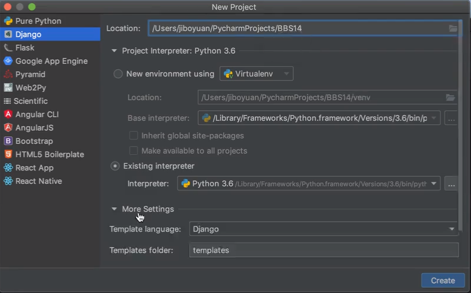
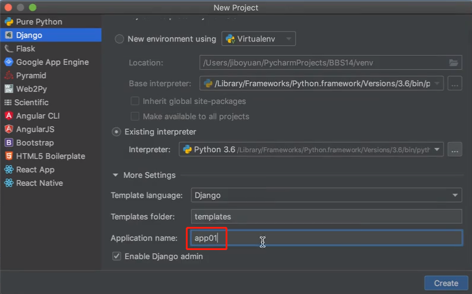
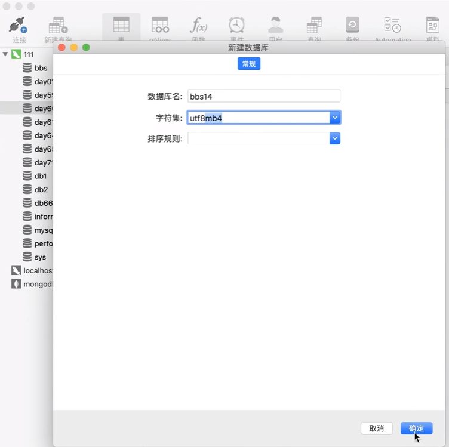
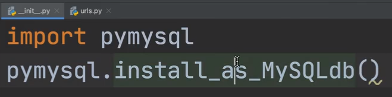
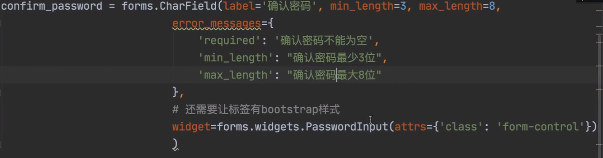
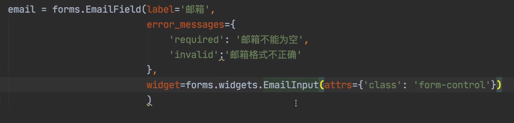
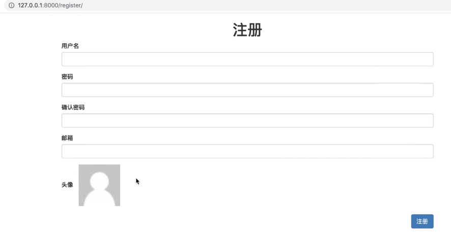

“第72天BBS项目01学习笔记”


# 一、数据库创建及表同步 

>使用mysql替代自带的sqlite库

##  1.1 PyCharm创建项目

填写项目名



 填写创建的app名，点击create创建



## 1.2 Navicat创建数据库

新建数据库，填写完点击确定



## 1.3 项目数据库配置

数据表整体设计


### 1.3.1 设置数据库参数

编辑`settings.py`文件


编辑`__init__.py`文件



### 1.3.2 创建数据库模型(Models)

编辑`models.py`创建`UserInfo`表字段（用户表）


往`create_time...`下面补充

```python
blog = models.OneToOneField(to='Blog', null=True)
```

编辑`setting.py`配置


编辑`models.py`文件分别创建`Blog、Category、Tag、Article、UpAndDown、Comment`表字段


Category和Tag`两个下`都要补充

```python
blog = models.ForeignKey(to='Blog', null=True)
```


Article往下补充外键字段


### 1.3.2 迁移数据库创建表

make migrations

make migrate

## 1.4 foms组件代码编写

>如果你的项目至始至终只用到一个fomrs组件，那么写一个py文件即可，但是如果要用多个forms.py组件，那么可以创建一个文件夹，在文件夹内根据forms组件的功能的不同创建不同的py文件

编辑`urls.py`文件


编辑`views.py`文件


`templates`文件夹新建`注册页面`


新建`myforms.py`文件，针对用户表的`forms`组件代码（为了 解耦合）







## 1.5 搭建注册页面

导入forms组件


编辑注册页面`register.html`


再加


## 1.6 用户头像实时展示

修改上传图片的标签


效果



但是选择图片，头像不实时显示，需要再改


效果：


## 1.7 注册事件初步实现


编辑`views.py`

