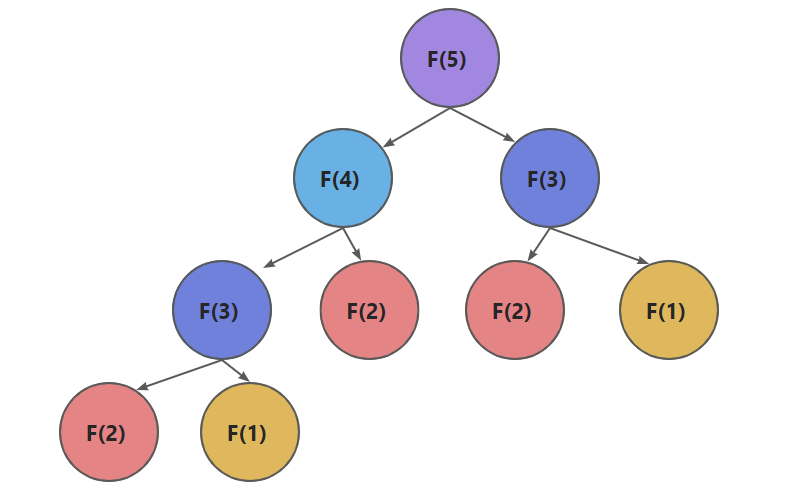

“C语言部分-Day05”

# 一、函数

函数的构成

```c
/*
返回值类型	函数名(形参) ｛
	xxxx    
｝
*/
    
int func(int num) {
    return 0;
}
```

其中返回值类型不能为数组

## 1.1 值传递和引用传递

### 1.1.1 值传递

值传递分为：

- 值传递（值作为形参）
- 指针传递（指针作为形参）

**值传递案例一：交换案例**

当我们按以下方法写swap函数，发现swap函数并没有交换成功

```c
#include <stdio.h>

// 值交换
void swap(int a, int b) {	// 传值
	int temp = 0;
	temp = b;
	b = a;
	a = temp;
}

int main(void) {
	int a = 10;
	int b = 20;

	swap(a, b);
	printf("a = %d, b = %d\n", a, b);	// a = 10, b = 20，没有交换成功

	return 0;
}
```

因为swap函数中的`int a和int b`实际上是复制了一份，放在栈里（临时存储在内存中），用完即被释放，称为值传递，如何解决这个问题？第一种方法是使用**指针传递**，如下代码：

```c
#include <stdio.h>

// 值交换
void swap(int *a, int *b) {	// 传指针
	int temp = 0;
	temp = *b;	// 注意，这里也要加“解引用“
	*b = *a;
	*a = temp;
}

int main(void) {
	int a = 10;
	int b = 20;

	swap(&a, &b);
	printf("a = %d, b = %d\n", a, b);	// a = 20, b = 10，交换成功

	return 0;
}
```

**值传递案例二：一维数组作为参数**

```c
// 一维数组作为参数
int sum_array(int arr[], int len) {		// 此时数组名将退化成指针
	int sum = 0;
	for (int i = 0; i < len; i++) {
		sum += arr[i];
	}
	return sum;
}

int main(void) {
    int arr[] = { 1,2,3,4,5 };
    // 普通调用
    printf("sum = %d\n", sum_array(arr, 5));	// sum = 15
    // 还能限制范围，调用更加灵活
    printf("sum = %d\n", sum_array(arr + 3, 2));	// sum = 9 
    return 0;
}
```

**值传递案例二：二维数组作为参数**

```c
// 二维数组作为参数
int sum_binarray(int arr[][4], int len) {		// 只能省略行，不能省略列
	int sum = 0;
	for (int i = 0; i < len; i++) {
		for (int j = 0; j < 4; j++) {
			sum += arr[i][j];
		}
	}
	return sum;
}

int main(void) {
    int binarr[][4] = { {1,2,3,4}, {5,6,7,8}, {9,10,11,12} };
	printf("binsum = %d\n", sum_binarray(binarr, 3));	// 输出78
	return 0;
}
```


### 1.1.2 引用传递

解决1.1.1值传递交换案例不成功的第二种方法，就是使用引用传递

```c
// 值交换
void swap(int &a, int &b) {	// 传引用
	int temp = 0;
	temp = b;
	b = a;
	a = temp;
}

int main(void) {
	int a = 10;
	int b = 20;

	swap(a, b);
	printf("a = %d, b = %d\n", a, b);	// a = 20, b = 10，交换成功

	return 0;
}
```

>注意事项：
>
>在VS中，以上main.c源码文件使用C编译器报错：存在正文时不允许未命名的原型参数
>
>
>
>解决方法：改成main.cpp


## 1.2 程序的终止

程序的开始和结束：

- 操作系统调用main函数 ----> 程序的开始
- main函数将状态码返回给操作系统 -----> 程序的终止

如果不想在main函数终止，如何提前终止呢？

```c
#include <stdlib.h>	

void foo() {
    // 提前结束
    exit(EXIT_SUCCESS);
}

int main(void) {
    return 0;
}
```


# 二、局部变量和全局变量

## 2.1 定义局部和全局变量

分为全局和局部（外部）变量：

- 局部变量：定义在函数里面的变量（默认在自动存储期限，可以用static指定为静态）
- 全局变量：定义在函数外面的变量

```c
#include <stdio.h>

// 全局变量
int GLOBAL_NUM = 10;

void foo() {
	// 局部变量
	int i = 20;
	printf("i = %d\n", i);
}

int main(void) {
	// 全局变量能随意调用和计算
	printf("global_num = %d\n", GLOBAL_NUM + 1);

	// 局部变量只能在函数内部调用
	 // i = 30;	// Error!
	foo();
	return 0;
}
```

## 2.2 存储期限（※※※）

存储期限分为：

- 自动存储期限：存在栈里面的数据，变量的生命周期随栈帧的入栈开始，出栈而结束
- 静态存储期限：拥有永久的存储时间，在程序整个执行期间都存在

自动存储单元的案例（*该案例仅能在部分Linux中编译执行，实测效果不同*）：

```c
#include <stdio.h>

void foo() {
        int i;
        printf("%d\n", i++);
}

int main(void) {
        foo();	
        foo();
        foo();
        return 0;
}

// 输出结果不一致，证明累加生效，临时存储生效
65535
65536
65537
```

如果改成：

```c
int main(void) {
        foo();	
        foo();
        foo();
        return 0;
}

// 输出结果一致，说明累加不生效了，临时存储被printf打断
65535
65535
65535    
```

再改成静态存储：

```c
#include <stdio.h>

void foo() {
    	// 改成静态存储
        static int i;	
        printf("%d\n", i++);
}

int main(void) {
        foo();	
        foo();
        foo();
        return 0;
}

// 输出结果不一致，证明累加又生效了，静态存储生效
65535
65536
65537
```


# 三、递归（※※※※）

## 3.1 斐波那契数列（TODO 补充递归优化版本）

斐波那契（Fibnaci）数列，从第三个数开始，后面的数值为前2个数值之和：

0，1，1，2，3，5，8，13......

递归实现：

```c
long long fib(int n) {
	if (n == 0) return 0;
	if (n == 1) return 1;
	return fib(n - 1) + fib(n - 2);
}
```

不过递归这样写，算法效率非常低，存在大量重复运算符（如图，同色的为重复运算），时间复杂度是O(2^n)。



改良的方法是使用循环实现，时间复杂度是O(n)，效率比递归高很多

```c
long long fib2(int n) {
	if (n == 0) return 0;
	if (n == 1) return 1;
	int a = 0, b = 1;
	for (int i = 2; i <= n; i++) {
		int tmp = a + b;
		a = b;
		b = tmp;
	}
	return b;
}
```


## 3.2 约瑟夫环（TODO）

给定人数、起点、方向、要跳过的数字


# 四、指针（※※※※）

## 4.1 指针的基础

几个基础知识：

- 字节：计算机最小的寻址单位
- 变量的地址：变量的第一个字节的地址
- 指针：指针就是地址
- 指针变量：存放地址的变量，有时候吧指针变量称为指针

### 4.1.1 通过指针访问对象

如何通过指针访问到其指向的对象：

```c
int num = 10;
// 定义指针
int* p = &num;
// 解引用
printf("num = %d\n", *p);
```

>注意事项：
>
>int *p, q;	// p是指针int\*类型，q是int类型
>
>int *p, *q;	// p、q都是int\*类型

### 4.1.2 野指针的问题

什么是野指针？

- 指向未知区域的指针

  ```c
  int *p = 0x7F; // 未知区域
  ```

- 未初始化的指针

  ```c
  int *p;	// 未初始化
  ```

>注意事项：
>
>对野指针进行解引用行为，将导致编译器报错：如，读取访问权限异常

### 4.1.3 指针变量的赋值

```c
int num = 10;
int *p1,*p2;
p1 = &num;

// 指针变量赋值
p2 = p1;	
```

### 4.1.4 指针作为参数（※）

```c
// 交换2个数的值
void swap(int *a, int *b) {
    int tmp = *a;
    *a = *b;
    *b = tmp;
}
```

指针作为参数的好处：

- 值传递不能改变实参的值，而指针可以

**练习：找出数组中的最大值和最小值**

```c
#include <stdio.h>

void find_min_max(int arr[], int n, int* min, int* max) {
	*min = arr[0];
	*max = arr[0];
	for (int i = 0; i < n; i++) {
		if (*min > arr[i]) {
			*min = arr[i];
		}
		if (*max < arr[i]) {
			*max = arr[i];
		}
	}
}

int main(void) {
	int max = 0;
	int min = 0;

	int arr[] = { 1,2,3,4,5,5,6,7,8,9 };
	find_min_max(arr, 10, &min, &max);
	printf("max = %d, min = %d\n", max, min);

	return 0;
}
```

## 4.2 指针和数组

### 4.2.1 指针运算

指针运算包含：

- 指针加上一个整数
- 指针减去一个整数
- 两个指针相减（指向同一数组里的元素）

指针运算以元素大小为单位，而不是以字节位单位。案例如下：

```c
int arr[] = { 0,1,5,3,4,5,6,7,8,9 };
int* p = &arr[2];
int* q = &arr[5];
printf("%d\n", *(p + 2));	// 4 等于arr[5]
printf("%d\n", p - q);	// -3 代表间隔3个int类型
printf("%d\n", q - p);	// 3  
```

指针变量p1减p2的意义为：

-  如果是正值 ， 则表示在内存中p1比p2靠后
-  如果是负值 ， 则表示 在内存中 p1比p2靠前
-  结果的数字表示 ， 两个地址在内存中间隔多少个指针类型的字节倍数 

### 4.2.2 使用指针遍历数组

for循环方式

```c
int arr[] = { 2,2,3,4,5,6,7,8 };

for (int* p = &arr[0]; p < &arr[8]; p++) {
    printf("%d ", *p);
}
printf("\n");
```

while循环方式

```c
int arr[] = { 2,2,3,4,5,6,7,8 };

int* p = &arr[0];
while (p < &arr[8]) {
    printf("%d ", *p);
    p++;
}
printf("\n");
```

### 4.2.3 *和++的组合

四中组合的含义：

```c
int num[7] = {0,5,8,7,3,2,1};
int* p = &num[0];
```

- ***p++ 或 *(p++)**	:	

  ```c
  printf("%d\n", *(p++));	// 表达式的值为*p，输出0
  printf("%d\n", *p); //  副作用p自增, 输出5
  ```

- **(*p)++**：

  ```c
  printf("%d\n", (*p)++);	// 表达式的值为*p，输出0
  printf("%d\n", *p); //  副作用*p自增, 0+1,输出1
  ```

- ***++p或\*(++p)**    ： 

  ```c
  printf("%d\n", *(++p));	// 表达式的值为*(p+1) = p[1]，输出5
  printf("%d\n", *p); //  副作用p自增 = p[1], 输出5
  ```

- **++\*p或++(*p)**   : 

  ```c
  printf("%d\n", ++(*p));	// 表达式的值为(*p + 1) = 0 + 1, 输出1
  printf("%d\n", *p); //  副作用*p自增, 输出1
  ```

*和--也有类似的组合


### 4.2.4 指针作为数组名使用

案例如下：

```c
int num[7] = {0,5,8,7,3,2,1};
int* p = &num[0];
printf("%d\n", *(p + 4)); // 等同于p[4], 输出3
```


