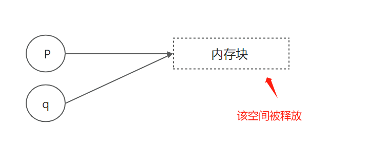
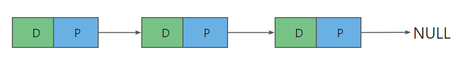

“C语言部分-Day07”

# 一、命令行参数

给程序传递参数，以main函数为例子

```c
#include <stdio.h>

int main(int argc, char* argv[]) {

	// 输出参数的个数
	printf("argc = %d\n", argc);

	// 输出每个参数
	printf("argv = ");
	for (int i = 0; i < argc; i++) {
		printf("%s ", argv[i]);
	}
	printf("\n");
	
	return 0;
}
```

以上代码的执行结果：

```c
argc = 1
argv = D:\C++\C++学习代码\01-C语言\Day07\x64\Debug\01_命令行参数.exe
```

**默认调用1个参数，即程序本身**，因此默认argc的个数为1，argv为程序本身

>**注意事项：**
>
>如何在VS中给程序加参数？
>
>**【项目】--【属性】--【调试】--【命令参数】**
>
>
>
>设置之后的运行结果：
>
>```c
>argc = 4
>argv = D:\C++\C++学习代码\01-C语言\Day07\x64\Debug\01_命令行参数.exe arg1 arg2 arg3
>```


# 二、结构体（※※※）

C语言的结构体，相当于其它高级语言中的类，但是C语言只能在结构体中定义数据，不能定义方法。

如表示一个学生：

```c
struct student {
    int number;	// 学号
    char name[25];	// 姓名
    bool gender;	// 性别	
    int chinese;	// 语文
    int math;	// 数学
    int english;	// 英语
}
```

使用结构体创建对象：

```c
// 创建对象
struct student stu1 = { 1, "大圣", true, 89, 22, 67 };
```


## 2.1 结构体的内存布局

以上面的学生数据结构为例，它在内存中的存储布局如下：

```c
number	name	gender	[...]	chinese		math	english
4		25		1		2		4			4		4
```

为何占用44字节空间，而不是42字节？

- 多出来的`[...]`是填充的`padding`，用于对齐 ---- 方便早期CPU寻址
- 因为number + name + gender = 30，而后面的chinese是4，为方便对齐，前面需要是4的倍数，因此+2


## 2.2 结构体对象的初始化

结构体的初始化方式：

```c
// 1、一次性给所有属性赋值
struct student stu1 = { 1, "大圣", true, 89, 22, 67 };
// 2、缺省初始化，省略的值自动赋值为0
struct student stu2 = { 1, "大圣", true };
// 3、按属性赋值
stu2.gender = 30;
```

对结构体的操作

```c
// 1、获取成员
stu2.name
    
// 结构体赋值
stu3 = stu1;

// 打印结构体的数据（值传递）
void printStu(struct student s) {
    printf("name = %s\n", s.name);
}
```

>**注意事项：**
>
>- 当结构体作为参数或返回值时，会拷贝整个结构体的数据（值传递）
>
>- 函数内的修改，不影响实参
>
>- 为了避免拷贝数据，一般会传指针
>- 指针传递时，`.`符号将变为`->`符号，`s->name`相当于`(*s).name`的简写
>
>```c
>void printStu(struct student *s) {
>    printf("name = %s\n", s->name);
>}
>```


## 2.3 结构体取别名

如2.1中定义的结构体，当我们使用它时，每次都需要在前面加上`struct`标识，比较麻烦：

```c
struct student stu3 = .....
```

这时候，我们可以用`typedef`给该结构体取个别名，使用起来会方便一些

```c
// 使用typedef取别名
typedef struct student {	
    int number;	// 学号
    char name[25];	// 姓名
    bool gender;	// 性别	
    int chinese;	// 语文
    int math;	// 数学
    int english;	// 英语
} STU;
```

再使用结构体：

```c
// 创建对象
STU stu4 = {4， "小明", false, 22, 33, 44};

// 函数定义
void printStu(STU *s) {
    printf("name = %s\n", s->name);
}
```

**还能再精简**

```c
// student都可以去掉
typedef struct {	
    int number;	// 学号
    char name[25];	// 姓名
    bool gender;	// 性别	
    int chinese;	// 语文
    int math;	// 数学
    int english;	// 英语
} STU;
```


# 三、枚举

## 3.1 枚举类型的使用

以扑克牌花色为例，如果使用宏定义，代码如下：

```c
// 宏定义扑克牌花色
#define SUIT int
#define SPADE 0 // 黑
#define HEART 1 // 红
#define CLUB 2	// 梅
#define DIANMOND 3 // 方

int main(void) {
	// 使用宏定义
	SUIT suit = SPADE;
	return 0;
}
```

改用枚举的代码如下：

```c
// 枚举扑克牌花色
enum suit { SPADE, HEART, CLUB, DIANMOND };

// 使用枚举
enum suit s = SPADE;
```

## 3.2 使用typdedef取别名

简化枚举的使用

```c
// 枚举扑克牌花色
typedef enum suit{ 
    SPADE, 
    HEART, 
    CLUB, 
    DIANMOND 
}SUIT;

// 使用枚举
SUIT s2 = HEART;
```

>**注意事项：**
>
>枚举类型的值，本质上都是一些整数，默认从0开始，可以手动指定
>
>```c
>typedef enum suit{ 
>    SPADE = 6, 
>    HEART = 8, 
>    CLUB = 19, 
>    DIANMOND = 20 
>}SUIT;
>```
>
>如果混合使用，下一个元素的值默认为上一个元素的值+1，案例如下：
>
>```c
>typedef enum suit{ 
>    SPADE = 6, 
>    HEART,	// 7 
>    CLUB = 19, 
>    DIANMOND	// 20
>}SUIT;
>```


# 四、指针的高级应用

## 4.1 动态内存分配

所谓动态内存分配即是在**堆上分配内存**，它在C语言中有举足轻重的地位，因为它是链式结构的基础。在头文件`stdlib.h`中定义有三个动态内存分配的函数，分别是：

- malloc
- calloc
- realloc

### 4.1.1 malloc的使用

定义：

```c
void * malloc(size_t size);
```

作用：

- 分配size个字节的内存空间
- 内存块不会清零
- 若分配不成功，返回空指针

使用案例：

```c
// malloc在堆上开辟空间
int* p = (int*)malloc(sizeof(int));
*p = 10;
printf("p = %d\n", *p);
```


### 4.1.2 calloc的使用

定义：

```c
void * calloc(size_t num, size_t size);
```

作用：

- 为num个元素分配内存空间，每个元素的大小为size字节
- 对内存块清零
- 若分配不成功，返回空指针

使用案例：

```c
// calloc开辟空间
int* p2 = (int*)calloc(4, sizeof(int));
p2[0] = 12;	
p2[1] = 22;
p2[2] =	32;
p2[3] = 42;
```


### 4.1.3 realloc的使用

定义：

```c
void * realloc(void *ptr, size_t new_size);
```

作用：

- 调整先前分配的内存块的大小
- 如分配成功，返回新内存的地址
- 分配失败，返回空指针

**注意：ptr应指向的先前使用动态内存函数分配的内存块**

使用案例：

```c
int* new_p = realloc(p, sizeof(int) * 4);
```


### 4.1.4 空指针的概念

不指向任何对象的指针，称为空指针，用宏NULL表示，其值为0

```c
int *ptr = NULL;
```


### 4.1.5 案例

编写一个函数，把两个字符串拼接起来，且不改变其中任何一个字符串

```c
char* my_strcat(const char *str1, const char *str2) {
	// 开辟空间
	char* s = (char*)malloc(strlen(str1) + strlen(str2));
	// 复制str1
	strcpy(s, str1);
	// 拼接str2
	strcat(s, str2);
	// 返回
	return s;
}

int main(void) {
	// 拼接字符串案例
	char *str1 = "Hello ";
	char* str2 = "World";
	puts(my_strcat(str1, str2));
	
	return 0;
}
```


## 4.2 释放内存空间

### 4.2.1 内存泄漏的问题

如果动态申请的内存没有被释放，则会产生内存泄漏的问题，如以下代码：

```c
int *p = (int *)malloc(sizeof(int));
int *q = (int *)malloc(sizeof(int));
p = q;
```

图示为：


长时间的内存泄漏，容易造成`out of memory`的问题。如何释放内存呢？需要使用到free函数。

定义：

```c
void *free(void *ptr);
```

案例：

```c
int* p = (int*)malloc(sizeof(int));
int* q = (int*)malloc(sizeof(int));
free(p);
p = q;
free(q);
q = NULL;
```

>Q1：ptr只是指向申请内存块的首地址，那么free函数是如何知道该释放多大的内存？
>
>因为实际申请的内存空间会稍大一些，里面自带关键信息，比如：
>
>```c
>// 内存块
>| size |     实际内容     |
>```


### 4.2.2 悬空指针的问题

使用free函数可以避免内存泄漏的问题，但是会引用新的问题：悬空指针，即某指针指向一片内存空间，但是该空间已经被释放，代码如下：

```c
int* p = (int*)malloc(sizeof(int));
int* q = p;	// q指针成为悬空指针
free(p);
p = NULL;
```

图示：



>注意事项：
>
>悬空指针的问题**非常难发现**，因此使用的时候需注意


## 4.3 链表

用一条链，将所有节点串联



### 4.3.1 结点

链表结点分为：

- 数据域：存放数据
- 指针域：存放另一个节点的地址

定义结点代码：

```c
typedef struct nodes {
    int val;
    struct nodes *next;
}Node;
```


### 4.3.2 链表分类

分类如下：

- 单向链表
- 单向循环链表
- 双向链表
- 双向循环链表

循环链表在实际生产中用的比较少，但是在处理环状数据的时候特别有用，像约瑟夫环


### 4.3.3 单向链表案例

如何实现一个单向链表：

```c

```

## 4.4 二级指针

二级指针，即指向指针的指针，其定义方式如下：

```c
int num = 10;
int *p = &num;

// 二级指针
int **pp = &p;
```

常用于在函数中修改指针变量的值，比如

```c
void add_to_list(Node **ptr_list, int val);
```

## 4.5 函数指针

即指向函数的指针	（函数也有地址）

案例如下：

```c
#include <stdio.h>

int sum(int a, int b) {
	return a + b;
}

int max(int a, int b) {
	return a > b ? a : b;
}

// 定义函数指针
int(*myfunc)(int, int);

int main(void) {
	// 调用1
	myfunc = &sum;
	int num1 = (*myfunc)(6, 8);
	// 调用2
	myfunc = &max;
	int num2 = (*myfunc)(6, 8);

	// 输出14, 8
	printf("sum = %d, max = %d\n", num1, num2);

	return 0;
}
```

## 4.6 qsort函数

可以对任意类型的数组进行排序（不管元素类型是什么）

排序的目的是什么？

- 通过比较来排序，达到方便查找的目的

qsort函数的定义：

```c
qsort(
    void*  _Base,	// 指向要排序的数组
    size_t _NumOfElements,	// 数组中元素的个数
    size_t _SizeOfElements,	// 元素的大小
    _CoreCrtNonSecureSearchSortCompareFunction _CompareFunction·// 比较函数
)

/*
 *	比较函数规则
 *	第一个参数大于第二个，返回正值
 *	第一个参数小于第二个，返回负值
 *  第一个参数等于第二个，返回0
*/
```


**案例：给student结构体数组排序**

```c
#include <stdio.h>
#include <stdlib.h>
#include <string.h>

// 宏定义：计算数组大小
#define Size(a) (sizeof(a) /  sizeof(a[0]))

// 定义学生结构体
typedef struct student {
	char name[64];
	int number;
	int chinese;
	int math;
	int english;
}Student;

// 定义排序方法
int mycompare(const void *a, const void *b) {
	Student* stu1 = (Student*)a;
	Student* stu2 = (Student*)b;

	// 计算总分
	int total1 = stu1->chinese + stu1->english + stu1->math;
	int total2 = stu2->chinese + stu2->english + stu2->math;

	// 先对比总分
	if (total1 != total2){
		//printf("%d %d\n", total1, total2);
		return total2 - total1;
	}
	// 再对比语文
	if (stu1->chinese != stu2->chinese) {
		return stu2->chinese - stu1->chinese;
	}
	// 再对比数学
	if (stu1->math != stu2->math) {
		return stu2->math - stu1->math;
	}
	// 在对比英语
	if (stu1->english != stu2->english) {
		return stu2->english - stu1->english;
	}

	// 都相等，对比名字
	return strcmp(stu1->name, stu2->name);
}

int main(void) {
	// 对比总分
	//Student mystu[5] = { {"A1", 1, 88, 77, 66}, {"A2", 2, 89, 77, 66}, {"A3", 3, 88, 77, 66},
	//{"A4", 4, 88, 77, 66}, {"A5", 5, 100, 77, 66} };

	// 总分相同，对比语文
	Student mystu[5] = { {"A1", 1, 85, 77, 66}, {"A2", 2, 88, 77, 66}, {"A3", 3, 67, 77, 66},
	{"A4", 4, 99, 77, 66}, {"A5", 5, 33, 77, 66} };

	// 排序前输出
	for (int i = 0; i < 5; i++) {
		printf("%s ", mystu[i].name);
	}
	printf("\n ------------ \n");

	// 排序
	qsort(mystu, Size(mystu), sizeof(Student), mycompare);

	// 排序后输出
	for (int i = 0; i < 5; i++) {
		printf("%s ", mystu[i].name);
	}

	return 0;
}
```

