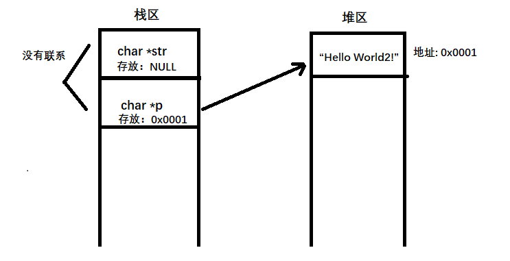

“C高级编程第一天学习笔记”

# 1 常用关键字

## 1.1 使用typedef

### 1.1.1 简化创建结构体变量

`typdef`可以用于起别名，比如创建结构体变量，普通创建方式如下：

```c
#include <stdio.h>

struct Person {
        char name[20];
        int age;
};


int main() {
        // 创建结构体变量的普通方法
        struct Person p1 = {"张三", 18};
        return 0;
}

```

而使用typedef之后可以简化：

```c
#include <stdio.h>

struct Person {
        char name[20];
        int age;
};

typedef struct Person MyPerson;


/* 简写方式
typedef struct Person {
        char name[20];
        int age;
}MyPerson;

*/


int main() {
        // 创建结构体变量-已简化
        MyPerson p1 = {"张三", 18};
        printf("姓名：%s，年龄：%d\n", p1.name, p1.age);
        return 0;
}
```

### 1.1.2 简化创建指针变量

当需要创建多个指针变量的时候，首先想到的方法是这样：

```c
char * p1, p2;
```

但实际上这样创建的出来的并不是两个指针变量，p1是指针，p2是char类型

```c++
// C++代码
#include <iostream>
using namespace std;

int main() {
        char * p1, p2;

        printf("%s\n%s\n", typeid(p1).name(), typeid(p2).name());

        return 0;
}

/*
    运行结果：
    test@greatwall-GW-001M1A-FTF:~/C_Code/day09$ ./a.out
    Pc	-- char指针
    c	-- char类型
*/
```

使用typedef可以使指针变量的创建更加方便：

```c++
#include <iostream>
using namespace std;

int main() {
        // 起别名
    	typedef char * PCHAR;
        // 创建指针变量
    	PCHAR p1, p2;

        printf("%s\n%s\n", typeid(p1).name(), typeid(p2).name());

        return 0;
}

/*
    运行结果：
    test@greatwall-GW-001M1A-FTF:~/C_Code/day09$ ./a.out
    Pc	-- char指针
    Pc	-- char类型
*/
```

## 1.2 使用void

`void`的作用：

​	1、约束函数返回值、参数

​	2、万能指针

### 1.2.1 约束函数

案例如下：

```c
#include <stdio.h>

void func(void) {
        printf("hello\n");
        return 10; // 报警告：warning: ‘return’ with a value, in function returning void
}

int main() {
        func();
        // func(10); 出错结束
        return 0;
}
```

### 1.2.2 万能指针

普通类型指针转换会报警告，而万能指针转换不会报警报

```c
#include <stdio.h>

int main() {
        void * p1 = NULL;
        char * p2 = NULL;
        int * p3 = NULL;

        p2 = p3; // 普通类型转换报警告:warning: assignment to ‘char *’ from incompatible pointer type ‘int *
        p2 = p1; // 万能指针转换不报警告

        return 0;
}
```

## 1.3 使用sizeof

`sizeof`不是函数，是一个操作符，它主要用于统计变量/数组的长度，返回值类型是`unsigned int`，案例如下：

```c
#include <stdio.h>

int main() {
        int nums[] = {1,2,3,4,5,6};
        printf("数组nums的大小是: %d\n", sizeof(nums));
}

// 输出：数组nums的大小是: 24
```

拓展：两个unsigned int类型相减，结果会怎样？

```c
#include <stdio.h>

int main() {
        unsigned int num = 10;
        if (num - 20 > 0) {
                printf("大于0\n");
        } else {
                printf("小于0\n");
        }
        return 0;
}
```

以上案例的输出居然是`大于0`，可见unsigned int进行计算，默认输出unsigned int的类型。

# 2 变量的修改方式

变量修改分为间接修改个直接修改

```c
#include <stdio.h>

struct Person {
        char a;
        int b;
        char c;
        int d;
};

int main()
{
        /* 1.普通变量 */
        int a = 10;

        // 直接修改
        a = 20;
        printf("a = %d\n", a);

        // 间接修改
        int *p = &a;
        *p = 300;
        printf("a = %d\n", a);


        /* 2.结构体 */
        struct Person per = {'A', 10, 'B', 20};
        printf("---------\n");
        printf("结构体Person占的内存大小是%d字节\n其中:\nchar a占%d字节\nint b占%d字节\nchar c占%d字节\nint d占%d字节\n可见存在内存补齐\n---------\n", sizeof(per), sizeof(per.a), sizeof(per.b), sizeof(per.c), sizeof(per.d));

        // 直接修改结构体变量per.b
        per.b = 300;
        printf("%d\n", per.b);

        // 间接修改结构体变量per.b
        struct Person *pper = &per;
        pper->b = 400;
        printf("%d\n", per.b);

        // 根据地址偏移间接修改变量per.b
        char *ca = &per;
        *(int *)(ca + 4) = 500;
        printf("%d\n", per.b);

        return 0;
}
```

输出如下：

```c
a = 20
a = 300
---------
结构体Person占的内存大小是16字节
其中:
char a占1字节
int b占4字节
char c占1字节
int d占4字节
可见存在内存补齐
---------
300
400
500
```

# 3 内存分区（补）

代码运行前：

- 代码区	共享	只读
- 数据区	存放数据：全局变量、静态变量、常量
  - 已初始化数据区	data
  - 未初始化数据区    bss

代码运行后

- 栈	先进后出	编译器自动分配和释放，有限容量
- 堆	容量远大于栈，但不是无限，手动malloc开辟，free释放

## 3.1 栈区

由系统进行内存的管理。

主要存放函数的参数以及局部变量。在函数完成执行，系统自行释放栈区内存，不需要用户管理。

案例如下：

```c
#include <stdio.h>
#include <stdlib.h>
#include <string.h>

char * func() {
        // 局部变量存放在栈区
        char str[] = "This String!";
        printf("%s\n", str);
        return str;
}


int main() {
        char *p = NULL;
        p = func();
        printf("func: %s\n", p);
        return 0;
}
```

输出：

```c
This String!	// 正常输出
func: (null)	// 已被释放
```

结论：

不要返回局部变量，局部变量在函数执行后就被释放了，释放后的内存就没有权限去操作。

## 3.2 堆区

有程序员手动申请，手动释放。

如果不手动释放，程序结束后由系统回收，生命周期是整个程序运行期间。

使用`malloc`和`new`进行堆的申请，`free`释放

案例如下：

```c
#include <stdio.h>
#include <stdlib.h>
#include <string.h>

char *func() {
        char * str = malloc(100);
        strcpy(str, "hello World!");
        printf("%s\n", str);
        return str;
}

void test01() {
        char *p = NULL;
        p = func(); // 堆区分配不自动释放，输出"hello World!"
        printf("test01: %s\n", p);
}

void allocateSpace(char *p) {	// p存在栈区
        p = malloc(100); // 分配100字节大小空间
        strcpy(p, "Hello World2!");
        printf("%s\n", p);
}

int main() {
        test01();
        char *str = NULL;
        allocateSpace(str);	// 形参不影响实参，形参被释放，输出null
        printf("main: %s\n", str);
    
    	free(str);
    	str = NULL;
        return 0;
}
```

输出

```c
hello World!
test01: hello World!
Hello World2!
main: (null)
```

## 3.3 堆区分配内存的注意事项

在3.2节的案例中，allocateSpace函数没有达到想要的效果，怎么解决这个问题呢？

给指针开辟内存的时候，传入的函数不要用`同级`的指针，需要传入指针的`地址`，函数中接收这个地址后再开辟内

存，如下案例：

```c
#include <stdio.h>
#include <stdlib.h>
#include <string.h>

char *func() {
        char * str = malloc(100);
        strcpy(str, "hello World!");
        printf("%s\n", str);
        return str;
}

void test01() {
        char *p = NULL;
        p = func(); // 堆区分配不自动分配
        printf("test01: %s\n", p);
}

void allocateSpace(char **p) { // 传入二级指针（指针的地址）
        *p = malloc(100);
        strcpy(*p, "Hello World2!");
        printf("%s\n", *p);
}

int main() {
        test01();
        char *str = NULL;
        allocateSpace(&str);
        printf("main: %s\n", str);

        free(str);
        str = NULL;
        return 0;
}
```

输出

```c
hello World!
test01: hello World!
Hello World2!
main: Hello World2!	// 正常了
```

图解：

3.2案例图解



3.3案例图解


# 4 static和extern

static和extern的区别

## 4.1 static

申明静态变量，静态变量可以分为全局和局部

- 全局静态变量：

  运行前分配内存，生命周期到程序执行结束，在**文件内**生效

- 局部静态变量：

  运行前分配内存，生命周期到程序执行结束，在**函数内**有效，但是也可以通过指针等方法操作内存

```c
#include <stdio.h>

static int A = 500; // 全局静态变量

int * func() {
        static int B = 300; // 局部静态变量
        printf("B = %d\n", B);
        return &B;
}

int main() {
        printf("A = %d\n", A);
        A = 501; // 全局静态变量可以直接改
        printf("A = %d\n", A);

        int *p = NULL;
        p = func(); // 300
        // B = 301; // 局部静态变量直接改ERR
        *p = 301; // 通过指针改OK
        func(); // 301
        return 0;
}

// 输出
A = 500
A = 501
B = 300
B = 301
```

## 4.2 extern

申明外部变量

```c
// 03-extern.c

#include <stdio.h>

int main() {
        extern int global_a;	// 申明外部变量
        printf("global_a = %d\n", global_a);
}

// 03-extern-2.c
int global_a = 300;	// 默认加了extern

// 输出
global_a = 300
```

# 5 常量

常量分为：

- const修饰的常量
- 字符串常量

## 5.1 const常量

C语言中const修饰的常量是**<font color=red>伪常量</font>**，不能初始化数组。

- 全局变量

  直接修改-失败，间接修改-语法通过，运行失败，受到常量区保护

- 局部变量

  直接修改-失败。间接修改成功，实际放在栈上

案例如下：

```c
#include <stdio.h>

const int a = 300;

int main() {
        int *p = &a;
        // *p = 301;
        // printf("a = %d\n", a); // 修改全局const变量运行报段错误

        const int b = 400;
        // b = 401; // 直接修改err, 报错read-only

        int *p2 = &b;
        *p2 = 401;
        printf("b = %d\n", b); // 输出401，修改成功，局部const的是伪常量
}

```

## 5.2 字符串常量

ANSI并没有指定字符串是否可以修改的标准，根据编译器的不同，最终结果也可能不同

字符串常量可以多次引用，防止重复定义浪费空间

```c
#include <stdio.h>

int main() {
        char str1[] = "Hello World"; // 这就是字符串常量
        char str2[] = "Hello World"; // 都是引用相同的字符串常量
        char str3[] = "Hello World"; // 都是引用相同的字符串常量
        char str4[] = "Hello World"; // 都是引用相同的字符串常量

        printf("%p\n", str1);
        printf("%p\n", str2);
        printf("%p\n", str3);
        printf("%p\n", str4);

        return 0;
}


// 输出地址一致
0x7ff259dca8
0x7ff259dcb8
0x7ff259dcc8
0x7ff259dcd8
```


