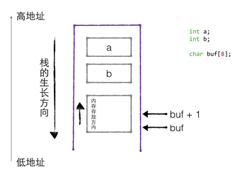

“C高级编程第2天学习笔记”

# 1 函数

## 1.1 宏函数

实际上是“宏替换”，定义的代码会展开

案例如下：

```c
#include <stdio.h>

#define MYADD(x, y) ((x) + (y)) // 不加括号会怎么样？

int main() {
        printf("%d\n", MYADD(2, 3) * 10);
}

```

宏函数在运行中会展开，即：

```c
printf("%d\n", MYADD(2,3));

// 会展开成
printf("%d\n", ((2) + (3) * 10); // 结果：50
```

如果定义的时候不加括号

```c
// 如下定义
#define MYADD(x, y) x + y

// 则会展开成
printf("%d\n", 2 + 3 * 10); // 结果：32
```

宏函数的特点：

1. 宏函数需要使用给小括号修饰，保证运算的完整性
2. 通常会将频繁、短小的函数写成宏函数
3. 宏函数比普通函数在一定程度上要效率高些，省去普通函数入栈、出栈的时间开销（以空间换时间）

## 1.2 普通函数的调用模型

普通函数的调用是需要入栈、出栈的，用同1.1的宏函数相同作用的例子来分析：

```c
#include <stdio.h>

int addnum(int x, int y) {  // x,y入栈
        int xx = x;     // xx 入栈
        int yy = y;     // yy 入栈
        return xx + yy; // 结果暂存到寄存器
}

int main() {
        int sum = 0; // sum入栈
        sum = addnum(2, 5); // 调用结束，从寄存器获取返回值，x、y、xx、yy出栈
        printf("sum = %d\n", sum);
        return 0; // 程序结束，sum出栈
}
```

C/C++下默认调用惯例：`cdecl`

- 规则：从右到左入栈，主调函数管理出栈

代码里面其实隐藏加了调用惯例（示例，再加编译会报错）

```c
__cdecl int addnum(int x, int y) {  // x,y入栈
        int xx = x;     // xx 入栈
        int yy = y;     // yy 入栈
        return xx + yy; // 结果暂存到寄存器
}
```

## 1.3 函数变量传递分析

如图所示五种情况下的函数变量传递：


# 2 栈的生长方向和内存的存放方向

用一个例子来分析栈的生长方向和内存的存放方向，案例如下：

```c
//1. 栈的生长方向
void test01(){

	int a = 10; // 栈底
	int b = 20;
	int c = 30;
	int d = 40; // 栈顶

	printf("a = %d\n", &a);
	printf("b = %d\n", &b);
	printf("c = %d\n", &c);
	printf("d = %d\n", &d);

	//a的地址大于b的地址，故而生长方向向下
}

//2. 内存生长方向(小端模式)
void test02(){
	
	//高位字节 -> 地位字节
	int num = 0xaabbccdd;
	unsigned char* p = &num;

	//从首地址开始的第一个字节
	printf("%x\n",*p);	// dd
	printf("%x\n", *(p + 1));	// cc
	printf("%x\n", *(p + 2));	// bb
	printf("%x\n", *(p + 3));	// aa
}
```

解析：

栈的生长方向（视频中windows是这样，但是我在linux试验，栈的生长方向相反！）：

- 栈底 --- 高地址
- 栈顶 --- 低地址

内存存放方向（小端对齐模式，大端则相反）：

- 高位字节数据 -- 高地址
- 低位字节数据 -- 低地址

如图所示：



# 3 指针强化

## 3.1 指针是一种数据结构

### 3.1.1 指针变量

指针是一种数据类型，占用内存空间（8个字节），用来保存内存地址

```c
#include <stdio.h>

int main() {
        // 指针是有大小的，占用内存空间
        int *p1 = 0x12345;
        int ***p2 = 0x11111;
        printf("p1 size: %d\n", sizeof(p1));	// 8
        printf("p2 size: %d\n", sizeof(p2));	// 8

        // 指针也可以被赋值
        int a = 10;
        p1 = &a;
        printf("p1 address: %p\n", p1); // p1 address: 0x7fea5a7e34
        printf("p2 address: %p\n", p2); // p2 address: 0x11111
        printf("a address: %p\n", &a); // a address: 0x7fea5a7e34
}
```

### 3.1.2 空指针

空指针又称为NULL指针，是一个特殊的指针变量，表示不指向任何地址，要使指针为空指针，可以给它赋NULL值

```c
// 创建一个空指针
int *p = NULL;
```

空指针注意事项：**不允许**向**空指针和非法内存地址**拷贝数据

```c
#include <stdio.h>
#include <string.h>

int main() {
        // 创建指针
        char *p1 = NULL; // 空指针
        char *p2 = 0; // 空指针
        char *p3 = 0x1122; // 非法指针

        // 赋值
        strcpy(p1, "Hello"); // 段错误
        strcpy(p2, "Hello"); // 段错误
        strcpy(p3, "Hello"); // 段错误

        return 0;
}
```

### 3.1.3 野指针

野指针是指向一个**已经被删除的对象**或者是**未申请访问受限内存区域**的指针

什么情况下会产生野指针？

- 指针变量未初始化（根据编译器来，有的会自动优化成NULL）
  - 未初始化的指针会乱指，而不是默认赋值为NULL，为了安全需要初始化指针
- 指针释放后未置为NULL
  - free和delete只是把指针指向的内存干掉，并没干掉指针本身，释放后指针会指向垃圾内存，需要置NULL
- 指针操作超越变量作用域
  - 不要返回指向栈内存的指针或引用，因为栈内存在函数结束后会被释放

操作野指针的案例：

```c
#include <stdio.h>

int main() {
        int *p = 0x12321; // 模拟野指针
        printf("p address : %p\n", p);
        *p = 100; // err 操作非法内存，段错误
}
```

### 3.1.4 指针解引用

指针解引用，也叫**间接访问内存**

```c
#include <stdio.h>

int main() {
        // 间接引用输出变量的值
        int *p = NULL;
        int a = 10;
        p = &a;
        printf("%d\n", *p); // 解引用，输出10
}
```

### 3.1.5 指针的步长

指针是一种数据结构，是指它指向的内存空间的数据类型。指针所指向的内存空间决定了 指针的步长。

步长：指针+1时，移动了多少字节单位

案例如下：

```c
#include <stdio.h>

int main() {
        int a = 0xaabbccdd;
        unsigned int *p1 = &a;
        unsigned char *p2 = &a;

        printf("%x\n", *p1); // aabbccdd
        printf("%x\n", *p2); // dd

        printf("p1 = %d\n", p1); // -843135676
        printf("p1 + 1 = %d\n", p1+1); // -843135672 移动4个字节
        printf("p2 = %d\n", p2); // -843135676
        printf("p2 + 1 = %d\n", p2+2); // -843135674 移动2个字节
}
```

## 3.2 指针的意义-简介赋值

### 3.2.1 间接赋值的三大条件

三个条件：

1. 2个变量，可以有如下两种
   - 一个普通变量，一个指针
   - 一个实参，一个形参
2. 建立关系
3. 通过*操作指向的内存

案例如下：

```c
#include <stdio.h>

int main() {
        int num = 300; // 定义普通变量
        int *p = NULL; // 定义指针变量
        p = &num; // 建立关系
    	*p = 500; // 操作内存
        printf("%d\n", *p); // 通过*解引用，输出500
}

```