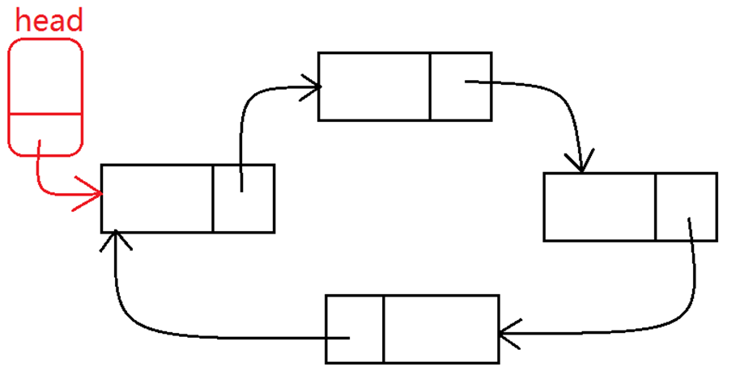

“C高级编程第5天学习笔记”

# 1 文件操作

## 1.1 流

### 1.1.1 流的概念

什么是流？

流是一个动态的概念，可以将一个字节形象的比喻成一滴水，字节在设备、文件和程序之间的传输就是流，类似于水在管道中传输。C语言中，I/O操作可以简单地看作从程序移入或移出字节，这种搬运的过程便称为流（stream）

### 1.1.2 流的分类

流分为文本流和二进制流两类。

- 文本流：
  - 以文本模式读取文件。涉及`换行符`
- 二进制流：
  - 二进制流中的字节将完全根据程序编写它们的形式写入到文件中，而且完全根据它们从文件或设备读取的形式读入到程序中。它们并未做任何改变。这种类型的流适用于非文本数据

但是C语言在处理这两种流的时候并不区分，都是看成`字符流`，按字节处理

**<font color=red>我们程序中，经常看到的文本方式打开文件和二进制方式打开文件仅仅体现在换行符的处理上。</font>**

比如说，在widows下，文件的换行符是\r\n，而在Linux下换行符则是\n.

当对文件使用文本方式打开的时候，读写的windows文件中的换行符\r\n会被替换成\n读到内存中，当在windows下

写入文件的时候，\n被替换成\r\n再写入文件。如果使用二进制方式打开文件，则不进行\r\n和\n之间的转换。 那

么由于Linux下的换行符就是\n,所以文本文件方式和二进制方式无区别。

## 1.2 文件操作方式

### 1.2.1 文件读写函数

文件读写函数，按分类主要有以下这些：

```c
按照字符读写文件：fgetc(), fputc()

按照行读写文件：fputs(), fgets()

按照块读写文件：fread(), fwirte()

按照格式化读写文件：fprintf(), fscanf()

按照随机位置读写文件：fseek(), ftell(), rewind()   
```

#### 1.2.1.1 按字符读写

函数使用方法

```c
int fputc(int ch, FILE * stream);
功能：将ch转换为unsigned char后写入stream指定的文件中
参数：
	ch：需要写入文件的字符
	stream：文件指针
返回值：
	成功：成功写入文件的字符
	失败：返回-1

int fgetc(FILE * stream);
功能：从stream指定的文件中读取一个字符
参数：
	stream：文件指针
返回值：
	成功：返回读取到的字符
	失败：-1

int feof(FILE * stream);
功能：检测是否读取到了文件结尾
参数：
	stream：文件指针
返回值：
	非0值：已经到文件结尾
	0：没有到文件结尾
```

使用案例（**这个案例执行有问题**）：

```c
#include <stdio.h>
#include <string.h>

void test(){

        //写文件
        FILE* fp_write= NULL;
        //写方式打开文件
        fp_write = fopen("./mydata.txt", "w+");
        if (fp_write == NULL){
                return;
        }

        char buf[] = "this is a test for pfutc!";
        for (int i = 0; i < strlen(buf);i++){
                fputc(buf[i], fp_write);
        }

        fclose(fp_write);

        //读文件
        FILE* fp_read = NULL;
        fp_read = fopen("./mydata.txt", "r");
        if (fp_read == NULL){
                return;
        }

#if 1
        //判断文件结尾 注意：多输出一个空格
        while (!feof(fp_read)){
                printf("%c",fgetc(fp_read));
        }
#else
        char ch;
        while ((ch = fgetc(fp_read)) != EOF){
                printf("%c", ch);
        }
#endif
}


int main() {
        test();
        return 0;
}

/* 
将把流指针fp指向的文件中的一个字符读出，并赋给ch，当执行fgetc()函数时，若当时文件指针指到文件尾，即遇
到文件结束标志EOF(其对应值为-1)，该函数返回一个 -1 给ch，在程序中常用检查该函数返回值是否为 -1 来判断是
否已读到文件尾，从而决定是否继续。
*/

```


#### 1.2.1.2 按行读写

函数使用方法

```c
int fputs(const char * str, FILE * stream);
功能：将str所指定的字符串写入到stream指定的文件中， 字符串结束符 '\0'  不写入文件。 
参数：
	str：字符串
	stream：文件指针
返回值：
	成功：0
	失败：-1

char * fgets(char * str, int size, FILE * stream);
功能：从stream指定的文件内读入字符，保存到str所指定的内存空间，直到出现换行字符、读到文件结尾或是已读了size - 1个字符为止，最后会自动加上字符 '\0' 作为字符串结束。
参数：
	str：字符串
	size：指定最大读取字符串的长度（size - 1）
	stream：文件指针
返回值：
	成功：成功读取的字符串
	读到文件尾或出错： NULL
```

使用案例：

```c
#include <stdio.h>
#include <string.h>

void test() {
        // 写文件
        FILE * fp_write = NULL;

        fp_write = fopen("./mydata.txt", "w+");
        if (fp_write == NULL) {
                perror("fopen-01:");
                return;
        }

        char *buf[] = {
                "01 this is a test for putc!\n",
                "02 this is a test for putc!\n",
                "03 this is a test for putc!\n",
                "04 this is a test for putc!\n",
                "05 this is a test for putc!\n",
        };

        for (int i = 0; i < 5; i++) {
                fputs(buf[i], fp_write);
        }

        fclose(fp_write);

        // 读文件
        FILE * fp_read = NULL;
        fp_read = fopen("./mydata.txt", "r");
        if (fp_read == NULL) {
                perror("fopen-02:");
                return;
        }

        while (!feof(fp_read)) {
                char  temp[2048] = {0};
                fgets(temp, 1024, fp_read);
                printf("%s", temp);
        }

        fclose(fp_read);
}

int main() {
        test();
        return 0;
}

// 执行结果
01 this is a test for putc!
02 this is a test for putc!
03 this is a test for putc!
04 this is a test for putc!
05 this is a test for putc!
```

#### 1.2.1.3 按块读写

函数说明：

```c
size_t fwrite(const void *ptr, size_t size, size_t nmemb, FILE *stream);
功能：以数据块的方式给文件写入内容
参数：
	ptr：准备写入文件数据的地址
	size： size_t 为 unsigned int类型，此参数指定写入文件内容的块数据大小
	nmemb：写入文件的块数，写入文件数据总大小为：size * nmemb
	stream：已经打开的文件指针
返回值：
	成功：实际成功写入文件数据的块数，此值和nmemb相等
	失败：0

size_t fread(void *ptr, size_t size, size_t nmemb, FILE *stream);
功能：以数据块的方式从文件中读取内容
参数：
	ptr：存放读取出来数据的内存空间
	size： size_t 为 unsigned int类型，此参数指定读取文件内容的块数据大小
	nmemb：读取文件的块数，读取文件数据总大小为：size * nmemb
	stream：已经打开的文件指针
返回值：
	成功：实际成功读取到内容的块数，如果此值比nmemb小，但大于0，说明读到文件的结尾。
	失败：0
```

块读写案例：

```c
#include <stdio.h>
#include <string.h>

// 创建结构体
typedef struct __TEACHER {
        char name[64];
        int age;
}Teacher;

void test() {
        // 写文件
        FILE *fp_write = NULL;
        fp_write = fopen("./mydata.txt", "wb");
        if (fp_write == NULL) {
                perror("fopen:");
                return;
        }

        Teacher teachers[4] = {
                {"老王", 18},
                {"老李", 33},
                {"老赵", 56},
                {"老陈", 21},
        };

        for (int i = 0; i < 4; i++) {
                fwrite(&teachers[i], sizeof(Teacher), 1, fp_write);
        }

        fclose(fp_write);

        // 读文件
        FILE *fp_read = NULL;
        fp_read = fopen("./mydata.txt", "r");
        if (fp_read == NULL) {
                perror("fopen:");
                return;
        }

        Teacher temps[4];
        fread(&temps, sizeof(Teacher), 4, fp_read);
        for (int i = 0; i < 4; i++) {
                printf("Name %s Age %d\n", temps[i].name, temps[i].age);
        }

        fclose(fp_read);
}

int main() {
        test();
        return 0;
}

// 执行结果：
Name 老王 Age 18
Name 老李 Age 33
Name 老赵 Age 56
Name 老陈 Age 21
```

#### 1.2.1.4 格式化读写函数

函数说明：

```c
int fprintf(FILE * stream, const char * format, ...);
功能：根据参数format字符串来转换并格式化数据，然后将结果输出到stream指定的文件中，指定出现字符串结束符 '\0'  为止。
参数：
	stream：已经打开的文件
	format：字符串格式，用法和printf()一样
返回值：
	成功：实际写入文件的字符个数
	失败：-1

int fscanf(FILE * stream, const char * format, ...);
功能：从stream指定的文件读取字符串，并根据参数format字符串来转换并格式化数据。
参数：
	stream：已经打开的文件
	format：字符串格式，用法和scanf()一样
返回值：
	成功：实际从文件中读取的字符个数
	失败： - 1
```

> **注意**：fscanf遇到空格和换行时结束。

使用案例：

```c
#include <string.h>

void test() {
        // 写文件
        FILE *fp_write = NULL;
        fp_write = fopen("./mydata.txt", "w+");
        if (fp_write == NULL) {
                perror("fopen:");
                return;
        }

        fprintf(fp_write, "hello world %d!", 10);

        fclose(fp_write);

        // 读文件
        FILE *fp_read = NULL;
        fp_read = fopen("./mydata.txt", "r");
        if (fp_read == NULL) {
                perror("fopen:");
                return;
        }

        char temps[1024] = {0};
        while (!feof(fp_read)) {
                fscanf(fp_read, "%s", temps);
                printf("%s", temps);
        }

        fclose(fp_read);
}


int main() {
        test();
        return 0;
}

// 输出
hello world 10!
```

#### 1.2.1.5 随机读写函数

使用说明

```c
int fseek(FILE *stream, long offset, int whence);
功能：移动文件流（文件光标）的读写位置。
参数：
	stream：已经打开的文件指针
	offset：根据whence来移动的位移数（偏移量），可以是正数，也可以负数，如果正数，则相对于whence往右移动，如果是负数，则相对于whence往左移动。如果向前移动的字节数超过了文件开头则出错返回，如果向后移动的字节数超过了 文件末尾，再次写入时将增大文件尺寸。
	whence：其取值如下：
		SEEK_SET：从文件开头移动offset个字节
		SEEK_CUR：从当前位置移动offset个字节
		SEEK_END：从文件末尾移动offset个字节
返回值：
	成功：0
	失败：-1

long ftell(FILE *stream);
功能：获取文件流（文件光标）的读写位置。
参数：
	stream：已经打开的文件指针
返回值：
	成功：当前文件流（文件光标）的读写位置
	失败：-1

void rewind(FILE *stream);
功能：把文件流（文件光标）的读写位置移动到文件开头。
参数：
	stream：已经打开的文件指针
返回值：
	无返回值
```

使用案例：

```c
#include <stdio.h>
#include <string.h>

typedef struct __TEACHER {
        char name[64];
        int age;
}Teacher;

void test() {
        // 打开文件
        FILE *fp_write = NULL;
        fp_write = fopen("./mydata.txt", "w+");
        if (fp_write == NULL) {
                perror("fopen:");
                return;
        }

        // 准备数据
        Teacher teachers[4] = {
                {"老李",18},
                {"老王",28},
                {"老照",38},
                {"老钱",48}
        };

        // 写入文件
        for (int i = 0; i < 4; i++) {
                fwrite(&teachers[i], sizeof(Teacher), 1, fp_write);
        }

        // 关闭文件
        fclose(fp_write);

        // 读文件
        FILE *fp_read = NULL;
        fp_read = fopen("./mydata.txt", "r");
        if (fp_read == NULL) {
                perror("fopen:");
                return;
        }

        Teacher temp;
        // 读第三个数组
        fseek(fp_read, sizeof(Teacher) * 2, SEEK_SET);
        fread(&temp, sizeof(Teacher), 1, fp_read);
        printf("Name:%s Agae:%d\n", temp.name, temp.age);
        memset(&temp, 0, sizeof(Teacher));

        fseek(fp_read, -(int)sizeof(Teacher), SEEK_END);
        fread(&temp, sizeof(Teacher), 1, fp_read);
        printf("Name:%s Agae:%d\n", temp.name, temp.age);

        rewind(fp_read);
        fread(&temp, sizeof(Teacher), 1, fp_read);
        printf("Name:%s Agae:%d\n", temp.name, temp.age);

        fclose(fp_read);
}


int main() {
        test();
        return 0;
}

// 输出
Name:老照 Agae:38
Name:老钱 Agae:48
Name:老李 Agae:18
```

## 1.3 文件读写案例

准备配置文件：

`#`号用于注释，只获取`:`左右的值，分别对应`key`和`value`

```c
#英雄的ID
heroID:1
#英雄的名字
heroName:德玛西亚
#英雄的攻击力
heroAtk:1000
#英雄的防御力
heroDef:500
#英雄简介
heroInfo:前排坦克
```

案例代码

```c
#include <stdio.h>
#include <string.h>
#include <stdlib.h>

// 创建结构体，用于存储数据
struct ConfigInfo
{
        char key[64];
        char value[64];
};

// 获取文件有效行数
int getFileLine(const char  * filePath)
{
        FILE * file = fopen(filePath, "r");
        char buf[1024] = {0};
        int lines = 0;
    	// 按行读取，直到读取完毕
        while (fgets(buf,1024,file) != NULL)
        {
                if (isValidLine(buf))
                {
                        lines++;
                }
            	// buf置为0，释放空间
                memset(buf, 0, 1024);
        }

        fclose(file);

        return lines;

}

// 解析文件
void parseFile(const char  * filePath, int lines, struct ConfigInfo** configInfo)
{
		// 创建结构体变量指针（代表一个数组），并分配内存
        struct ConfigInfo * pConfig =  malloc(sizeof(struct ConfigInfo) * lines);

        if (pConfig == NULL)
        {
                return;
        }

		// 打开文件
        FILE * file = fopen(filePath, "r");
    	char buf[1024] = { 0 };
        int index = 0;
        
    	// 按行读取文件
    	while (fgets(buf, 1024, file) != NULL)
        {
                if (isValidLine(buf))
                {
                        //解析数据到struct ConfigInfo中
                        memset(pConfig[index].key, 0, 64);
                        memset(pConfig[index].value, 0, 64);
                        char * pos = strchr(buf, ':');
                        strncpy(pConfig[index].key, buf, pos - buf);
                        strncpy(pConfig[index].value, pos + 1, strlen(pos + 1) - 1); // 从第二个单词开始截取字符串，并且不截取换行符
                        // printf("key = %s\n", pConfig[index].key);
                        // printf("value = %s\n", pConfig[index].value);
                        index++;
                }
                memset(buf, 0, 1024);
        }


        *configInfo = pConfig;

}

//获取指定的配置信息
char * getInfoByKey(char * key, struct ConfigInfo*configInfo ,int lines)
{
        for (int i = 0; i < lines;i++)
        {
                if (strcmp(key, configInfo[i].key) == 0)
                {
                        return configInfo[i].value;
                }
        }
        return NULL;
}

//释放配置文件信息
void freeConfigInfo(struct ConfigInfo*configInfo)
{
        free(configInfo);
        configInfo = NULL;
}

//判断当前行是否为有效行
int isValidLine(char * buf)
{
        if (buf[0] == '0' || buf[0] == '\0' || strchr(buf,':') == NULL)
        {
                return 0;// 如果行无限 返回假
        }
        return 1;
}

int main(){

        char * filePath = "./config.txt";
        int lines = getFileLine(filePath);
        printf("文件有效行数为：%d\n", lines);

        struct ConfigInfo * config = NULL;
        parseFile(filePath, lines, &config);

        printf("heroId = %s\n", getInfoByKey("heroID", config, lines));
        printf("heroName: = %s\n", getInfoByKey("heroName", config, lines));
        printf("heroAtk = %s\n", getInfoByKey("heroAtk", config, lines));
        printf("heroDef: = %s\n", getInfoByKey("heroDef", config, lines));
        printf("heroInfo: = %s\n", getInfoByKey("heroInfo", config, lines));


        freeConfigInfo(config);
        config = NULL;

        return EXIT_SUCCESS;
}
```

# 2 链表

## 2.1 什么是链表

链表简介：

- 链表是一种常用的数据结构，它通过指针将一些列数据节点，连接成一个数据链。相对于数组，链表具有更好的动态性（非顺序存储）。链表的组成如图所示：


- 链表节点分为数据域和指针域，数据域用来存储数据，指针域用于简历与下一个节点的联系。
- 建立链表时无需预先知道数据总量的，可以随机的分配空间，可以高效的在链表中的任意位置实时插入或删除数据。
- 链表的开销，主要是访问顺序性和组织链的空间损失。

链表和数组的区别

|          | 链表                                     | 数组                                   |
| -------- | ---------------------------------------- | -------------------------------------- |
| 内存分配 | 分配n块存储数据的结点，通过指针建立关系  | 一次性分配一块连续的存储空间           |
| 优点     | 不用要一块连续存储空间，删除和插入效率高 | 随机访问效率高                         |
| 缺点     | 随机访问效率低                           | 需要一块连续内存空间，删除和插入效率低 |

## 2.2 链表节点

链表由一系列的节点组成，那么如何表示一个包含数据域和指针域的节点呢？

链表的节点实际上是`结构体变量`，此结构体包含数据域和指针域：

- 数据域：用来存数据
- 指针域：用于建立与下一个节点的关系（当此节点为尾节点时，指针域的值为NULL）

一个链表节点的C代码表示如下：

```c
typedef struct __Node {
    // 数据域
    char name[50];
    int id;
    // 指针域
    struct Node *next;
}Node;
```

通过指针域指定节点，将各个节点相连，即一个链表


## 2.3 链表的分类

### 2.3.1 动态链表和静态链表

链表按数据存储方式分为两类：

- 静态链表
  - 所有节点都在程序中定义，不是临时开辟的，也不在用完之后释放
- 动态链表
  - 程序执行过程中从无到有地创建一个链表，即一个个地开辟节点，输入数据，建立连接关系

静态链表的案例如下：

```c
#include <stdio.h>

// 静态链表案例

// 1.定义节点
typedef struct __NODE
{
	// 数据域
	char name[50];
	int age;

	// 指针域
	struct __NODE *next;
}Node;

void test() {
	// 2.创建节点，并建立联系
	Node n1 = { "大王", 18, NULL };
	Node n2 = { "小新", 20, NULL };
	Node n3 = { "真好", 38, NULL };

	n1.next = &n2;
	n2.next = &n3;

	// 3.遍历节点
	Node* p = &n1;
	while (p != NULL) {
		printf("name = %s, age = %d\n", p->name, p->age);
		p = p->next;
	}
}

int main() {
	test();
	return 0;
}

/*
执行结果：
name = 大王, age = 18
name = 小新, age = 20
name = 真好, age = 38
*/
```

动态链表的案例如下：

```c
#define _CRT_SECURE_NO_WARNINGS		// 消除strcpy的报错

#include <stdio.h>
#include <malloc.h>		// 消除malloc未被定义的报错
#include <string.h>

// 创建节点结构体
typedef struct __NODE {
	char name[50];
	int age;

	struct __NODE* next;
}Node;


void test1() {
	// 开辟空间创建节点
	Node* n1 = (Node*)malloc(sizeof(Node));
	strcpy(n1->name, "BigWang");
	n1->age = 18;

	Node* n2 = (Node*)malloc(sizeof(Node));
	strcpy(n2->name, "LittleXin");
	n2->age = 28;

	Node* n3 = (Node*)malloc(sizeof(Node));
	strcpy(n3->name, "MoMo");
	n3->age = 38;

	// 建立联系
	n1->next = n2;
	n2->next = n3;
	n3->next = NULL;

	// 输出
	Node* p = n1;
	while (p != NULL) {
		printf("name = %s, age = %d\n", p->name, p->age);
		p = p->next;
	}

	// 释放空间
	p = n1;
	Node* tmp = NULL;
	while (p != NULL) {
		tmp = p;
		p = p->next;

		free(tmp);
		tmp = NULL;
	}

}

int main() {
	test1();
	return 0;
}

/*
输出：
name = BigWang, age = 18
name = LittleXin, age = 28
name = MoMo, age = 38
*/
```

### 2.3.2 带头和不带头链表

补充一个概念，什么是带头的节点，什么是不带头的节点？

- 带头的节点：

  - 头节点固定不动，其数据域不保存有效数据，起一个标志位的作用

  

- 不带头的节点：

  - 头节点不固定，更具实际需要变换头节点（比如前面新插入一个节点，就会成为新的头节点）

  

### 2.3.3 单向链表、双向链表、循环链表

单向链表：


双向链表：


循环链表：



## 2.4 链表的增删改查

通过案例了解如何创建链表、新增节点、删除节点以及查询数据

```c
#define _CRT_SECURE_NO_WARNINGS
#include <stdio.h>
#include <malloc.h>
#include <string.h>

// 节点结构体
typedef struct __NODE {
	int id;
	struct __NODE * next;
}Node;

// 遍历链表函数
void foreach_linklist(Node* headnode) {
	if (headnode == NULL || headnode->id != -1) {
		printf("链表不存在\n");
		return;
	}
	Node* temp_node = headnode->next;
	while (temp_node != NULL) {
		printf("%d ", temp_node->id);
		temp_node = temp_node->next;
	}
	printf("\n");
}

// 创建链表函数
Node* init_list() {
	// 创建头节点
	Node* head_node = NULL;
	
	// 给头节点分配内存
	head_node = (Node*)malloc(sizeof(Node));
	// 容错判断
	if (head_node == NULL) {
		return NULL;
	}

	// 头节点赋值
	head_node->id = -1;
	head_node->next = NULL;

	// 保存头节点
	Node* current_node = head_node;
	int data = -1;
	
	// 循环插入节点
	while (1) {
		printf("please input data: ");
		scanf("%d", &data);

		// 如果输入-1,退出循环
		if (data == -1) {
			break;
		}

		// 创建新节点
		Node* node = (Node*)malloc(sizeof(Node));
		if (node == NULL) {
			break;
		}
		// 赋值
		node->id = data;
		node->next = NULL;

		// 指针域指向下一节点
		current_node->next = node;
		current_node = node;
	}

	// 返回头节点
	return head_node;
}

// 插入节点函数(在指定值val后面插入数据data，如果值val不存在，则在尾部插入)
void insert_node(Node* headnode, int val, int data) {
	if (headnode == NULL || headnode->id != -1) {
		printf("插入失败，链表不存在！");
		return;
	}

	Node* pre_node = headnode;
	Node* current_node = headnode->next;

	while (current_node != NULL) {
		if (current_node->id == val) {
			break;
		}

		pre_node = current_node;
		current_node = pre_node->next;
	}

	if (current_node == NULL) {
		printf("插入失败，不存在值为%d的节点\n", val);
		return;
	}

	// 创建新的节点
	Node* newnode = (Node*)malloc(sizeof(Node));
	newnode->id = data;
	newnode->next = NULL;

	// 新节点入链表
	Node* nextnode = current_node->next;
	current_node->next = newnode;
	newnode->next = nextnode;
}

// 删除节点函数(删除第一个值为val的节点)
void remove_linklist(Node *head, int val) {
	Node* pre_node = head;
	Node* current_node = head->next;

	// 通过循环找节点
	while (current_node != NULL) {
		// 已经找到停止循环
		if (current_node->id == val) {
			break;
		}
		// 没找到继续
		pre_node = current_node;
		current_node = pre_node->next;
	}

	// 如果遍历完都没找到
	if (current_node == NULL) {
		return;
	}

	// 删除节点
	pre_node->next = current_node->next;
	// 释放内存
	free(current_node);
}


// 销毁链表函数
void destory_linklist(Node* head) {
	if (head == NULL) {
		return;
	}

	if(head->id != -1) {
		return;
	}

	Node* current_node = head;
	while (current_node != NULL) {
		// 缓存当前节点的下一个节点
		Node* next = current_node->next;
		free(current_node);
		current_node = next;
		next = NULL;
	}
}


void test() {
	int opt = 1;
	int num = 0;
	Node* head = NULL;
	while (opt == 1) {
		printf("-----------------------\n");
		printf("欢迎来到链表的增删改查\n");
		printf("1-创建链表\n");
		printf("2-插入数据\n");
		printf("3-查询数据\n");
		printf("4-销毁链表\n");
		printf("5-退出\n");
		printf("-----------------------\n");
		printf("请输入执行项: ");
		scanf("%d", &num);

		int data = 0;
		int val = 0;

		switch (num)
		{
		case 1:
			printf("---创建链表---\n");
			head = init_list();
			break;
		case 2:
			printf("---插入数据---\n");
			printf("请输入需要插在那个值的后面: ");
			scanf("%d", &val);
			printf("请输入插入的值: ");
			scanf("%d", &data);
			insert_node(head, val, data);
			break;
		case 3:
			printf("---查询数据---\n");
			foreach_linklist(head);

			break;
		case 4:
			printf("---销毁链表---");
			destory_linklist(head);
			break;
		case 5:
			opt = 0;
			break;
		default:
			break;
		}
	}
}

int main() {
	test();
	return 0;
}
```

