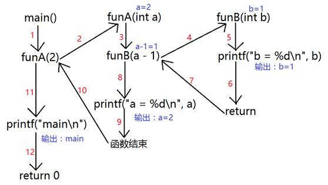

day07 -- 递归函数、面向接口编程

## 一、递归函数

### 1.1 递归函数的基本概念

递归函数就是直接或者间接调用自身的函数，C通过**运行时堆栈**来支持递归函数的实现。

### 1.2 函数调用流程

对比普通函数和递归函数的调用流程

#### 1.2.1 普通函数的调用流程

如下普通函数代码

```c
void funB(int b){
	printf("b = %d\n", b);
}

void funA(int a){
	funB(a - 1);
	printf("a = %d\n", a);
}

int main(void){
	funA(2);
    printf("main\n");
	return 0;
}
```

它的调用流程是



可见：main -> funcA() -> funcB()的普通流程

#### 1.2.2 递归函数的调用流程

如下递归函数代码

```c
void fun(int a){
	if (a == 1){
		printf("a = %d\n", a);
		return; //中断函数很重要
	}
	fun(a - 1);
	printf("a = %d\n", a);
}

int main(void){
	fun(2);
	printf("main\n");
	return 0;
}
```

它的调用流程是：


可见main -> fun() -> func()的递归调用流程，函数调用了自己

### 1.3 递归函数案例

1、按位打印数

>递归实现给出一个数8793，依次打印千位数字8、百位数字7、十位数字9、个位数字3。

```c
#include <stdio.h>

void test01(int val) {
	// 到最后只剩3的时候，3 / 10 = 0, 返回
	/*
		递归：
		val = 8793
		val = 879
		val = 87
		val = 8
		val = 0
	*/
	printf("val = %d\n", val);
	if (val == 0) {
		return;
	}
		
	int ret = val / 10;
	test01(ret);
	printf("%d ", val % 10);
}

int main() {
	test01(8793);
	printf("\n");
	return 0;
}
```

2、递归实现字符串反转

```c
#define _CRT_SECURE_NO_WARNINGS

#include <stdio.h>
#include <string.h>

// 方法一: 按字符输出
int reverse1(char *str) {
	// 中断处理
	if (str == NULL) {
		return -1;
	}

	if (*str == '\0') {
		return 0;
	}

	// 递归
	reverse1(str + 1);
	// 逻辑代码
	printf("%c", *str);
	return 0;
}

// 方法二：将字符存到字符串中
char buf[1024] = { 0 };
int reverse2(char* str) {
	if (str == NULL) {
		return -1;
	}
	if (*str == '\0') {
		return 0;
	}
	
	reverse2(str + 1);
	strncat(buf, str, 1);
	return 0;
}

int main() {
	reverse1("I'm stronger! AAA");
	printf("\n");

	reverse2("I'm stronger! BBB");
	printf("%s\n", buf);

	return 0;
}

输出：
    AAA !regnorts m'I
	BBB !regnorts m'I
```

## 二、面向接口编程