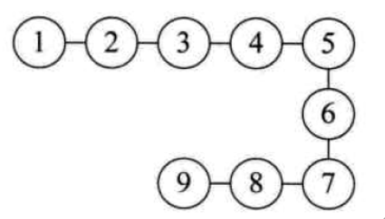
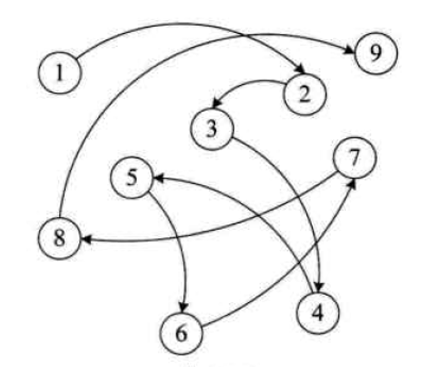
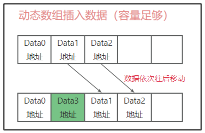
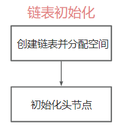
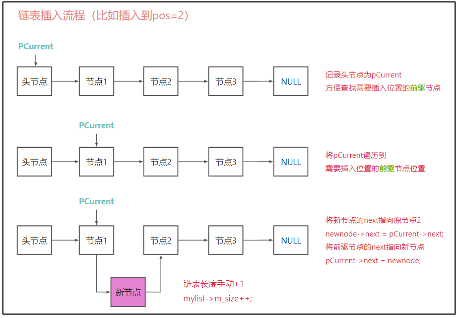
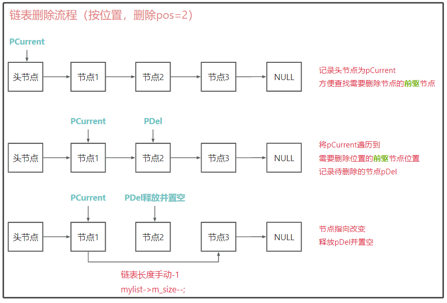

# <font color=blue>一、数据结构理论</font>

## <font color=darkyellow>1.1 数据和数据结构</font>

什么是数据？

>数据是描述客观事物的符号，是计算机中可以操作的对象，是能被计算机识别，并输入给计算机处理的符号集合。数据不仅仅包括整型、实型等数值类型，还包括字符及声音、图像、视频等非数值类型。

什么是数据结构？

>数据结构是计算机存储、组织数据的方式。数据结构是指相互之间存在一种或多种特定关系的数据元素的集合。通常情况下，精心选择的数据结构可以带来更高的运行或者存储效率。数据结构往往同高效的检索算法和索引技术有关。

## <font color=darkyellow>1.2 数据结构分类</font>

数据结构分为**逻辑结构**和**物理结构**

### 1.2.1 逻辑结构

#### 1.2.1.1 集合

​	集合结构中的数据元素，除了同属一个集合外，各元素之间没有其他关系。

​	各个数据元素是平等的，他们共同属于同一个集合

如下图所示


#### 1.2.1.2 线性结构

线性结构中的数据元素之间是一对一的关系，如下图所示：




#### 1.2.1.3 树形结构

树形结构是数据元素之间存在的一种一对多的层次关系，如图所示：


#### 1.2.1.4 图形结构

图形结构的数据元素之间是多对多的关系，如图所示：


### 1.2.2 物理结构

物理结构也称为存储结构，是指数据的逻辑结构在计算机中的存储形式，分为**顺序存储**和**链式存储**、

#### 1.2.2.1 顺序存储

什么是顺序存储？

把数据元素存放在地址连续的存储单元里，其数据的逻辑关系和物理关系是一致的，如图所示：


如果所有的数据结构都很简单又有规律，那就好办了，可实际上就像在路上开车，总有人想插队或者放弃排队，对应在元素集合中就是添加、删除成员，显然面对这样经常需要变化的结构，顺序存储是不科学的，这就需要用到链式存储。

#### 1.2.2.2 链式存储

什么是链式存储？

把数据存放在任意的存储单元里，这组存储单元可以是连续的，也可以是不连续的，数据元素使用指针存放数据元素的地址，通过地址可以找到相关元素的位置，如图所示：



## <font color=darkyellow>1.3 算法概念</font>

什么是算法？

算法是对特定问题求解步骤的描述，再计算机种表现为指令的有限序列，算法是独立存在的一中解决问题的方法和思想。

### 1.3.1 算法和数据结构的区别

数据结构和算法相辅相成

数据结构：

- 只是静态的描述数据元素之间的关系
- 是算法需要处理的问题载体

算法：

- 高效的程序需要在数据结构的基础上设计和选择算法
- 为了解决实际问题而设计的

### 1.3.2 为什么需要算法

比如我们需要写一个求1+2+3+...100结果程序，应该怎么写呢？

按照普通的写法是这样：

```c
#include <stdio.h>

int main() {
	int sum = 0;
	for (int i = 0; i < 100; i++) {
		sum = sum + i + 1;
	}

	printf("sum = %d", sum); // sum = 5050
	return 0;
}
```

如果按照算法的写法是这样（数学大师--高斯）：

```c
#include <stdio.h>

int main() {
	int sum = 0;
	int n = 100;
	
	sum = (1 + n) * n / 2;

	printf("sum = %d", sum); // sum = 5050
	return 0;
}
```

显然，无论是从人算的角度还是计算机算的角度，高斯的算法效率都会高很多，为什么需要算法？因为一个好的算法能让程序更加高效！

### 1.3.3 算法的特性

算法有**5个**基本特性：输入、输出、又穷性、确定性和可行性

- 输入输出：算法有0个或者多个输入，至少有1个或者多个输出
- 有穷性：算法在执行有限的步骤后，会自动结束，而不会出现无限循环，并且每一个步骤在可接受的时间内完成
- 确定性：算法的每一步骤都有确定的含义，不会出现二义性
- 可行性：算法的每一步都必须是可行的，每一步都能通过执行有限次数完成

# <font color=Blue>二、线性表</font>

## <font color=darkyellow>2.1 线性表的基本概念</font>

线性结构是一种最简单且常见用的数据结构，其基本特点是节点与节点之间满足线性关系，节点中有且只有一个开始节点和终端节点，线性表是零个或者多个数据元素的有限序列，**数据元素之间是有顺序的**，**数据元素个数是有限的**，**数据元素的类型必须相同**，常见线性表分为：

- 动态数组
- 链表
- 栈
- 队列

图示线性结构，可见星座图：


> 线性表的性质：
>
> 1. a0 为线性表的第一个元素，只有一个后继。
> 2. an 为线性表的最后一个元素，只有一个前驱。
> 3. 除 a0 和 an 外的其它元素 ai，既有前驱，又有后继。
> 4. 线性表能够逐项访问和顺序存取。

线性表的常见操作：

```c
// // 初始化，建立一个空的线性表L。
InitList(*L);
// 若线性表为空，返回true，否则返回false
ListEmpty(L);
// 将线性表清空
ClearList(*L);
// 将线性表L中的第i个位置的元素返回给e
GetElem(L, i, *e);
// 在线性表L中的第i个位置插入新元素e
ListInsert(*L, i, e);
// 删除线性表L中的第i个位置元素，并用e返回其值
ListDelete(*L, i, *e);
// 返回线性表L的元素个数
ListLength(L);
// 销毁线性表
DestroyList(*L);
```

## <font color=darkyellow>2.2 线性表的顺序存储</font>

线性表按存储方式可以分为**顺序存储**和**链式存储**：

顺序存储：将元素一个接一个的存储在一块连续的存储区域中，这种顺序存储的线性表也称为**顺序表**

链式存储：将元素存在非连续的内存空间中，通过指针连接

### 2.2.1 动态数组的设计与实现

线性表顺序存储的案例：动态数组

#### 2.2.1.1 动态数组结构体

将遇到的问题：

- 无法确定用户的数据类型 --- 采用void*存储
- 无法确定数据分配的具体位置 
- 不管常见在哪，不管是什么数据类型，放在内存中都会有数据的地址

解决问题，设计动态数组结构体


```c
// 定义动态数组结构体
struct dynamicArray {
	void **pAddr 	// 维护真实在堆区的数据地址
	int opacity 	// 数组的容量
	int size	 	// 数组实际大小
}
```

#### 2.2.1.2 动态数组初始化

```c
// 函数--初始化动态数组
struct DynamicArray* initDynamicArray(int opacity) {
	// 容错判断
	if (opacity <= 0) {
		return NULL;
	}

	// 分配空间
	struct DynamicArray * myDyarr = malloc(sizeof(struct DynamicArray));
	if (myDyarr == NULL) {
		return NULL; // 容错，需记住！
	}

	// 给数组初始化
	myDyarr->pAddr = malloc(sizeof(void*) * opacity);
	myDyarr->opacity = opacity;
	myDyarr->size = 0;

	// 返回初始化的数组
	return myDyarr;
}
```

#### 2.2.1.3 插入数据 

核心步骤：

1、插入数据，判断空间是否足够，如足够则直接插入数据：



2、如空间不够，需要**重新开辟内存空间**，并将数据拷贝过去：


3、**释放原空间**，并更新数组大小

插入部分的代码如下：

```c
// 函数--插入数据（需要插入数据的数组地址，插入位置，插入的数据）
void insert_DynamicArray(struct DynamicArray* array, int pos, void* data) {
	if (array == NULL) {
		return;
	}
	if (data == NULL) {
		return;
	}

	// 无效位置，尾部插入
	if (pos <0 || pos > array->size) {
		pos = array->size;
	}

	// 判断是否满了，如满了需要动态扩展
	if (array->size == array->opacity) {
		// 1、计算新空间的大小（扩大一倍）
		int new_opacity = array->opacity * 2;
		// 2、创建新空间
		void** newSpace = malloc(sizeof(void*) * new_opacity);
		// 3、将原有数据拷贝到新空间下(memcpy(目标空间，源空间起点地址，源空间大小）)
		memcpy(newSpace, array->pAddr, sizeof(void*) * array->opacity);
		// 4、释放原有空间
		free(array->pAddr);
		// 5、更新空间指向
		array->pAddr = newSpace;
		// 6、更新容量
		array->opacity = new_opacity;
	}

	// 插入新元素
	// 1、移动元素，进行插入新元素
	for (int i = array->size - 1; i >= pos; i--) 
	{
		// 后面的元素一个个往后挪
		array->pAddr[i + 1] = array->pAddr[i];
	}
	// 2、pos位插入元素
	array->pAddr[pos] = data;
	// 更新大小
	array->size++;
}
```

#### 2.2.1.4 遍历数组

- 判断线性表是否合法
- 判断插入位置是否合法
- 遍历数组元素

遍历数组代码如下：

```c
void foreach_DynamicArray(struct DynamicArray* array, void(*myPrint)(void*)) {
	if (array == NULL) {
		return;
	}
	if (myPrint == NULL) {
		return;
	}

	for (int i = 0; i < array->size; i++) {
		myPrint(array->pAddr[i]);
	}
}
```

#### 2.2.1.5 删除数据

- 判断线性表是否合法
- 判断删除位置是否合法
- 将元素取出
- 将删除位置后的元素分别向前移动一个位置
- 线性表长度减1

删除操作如图所示


删除数据的代码如下：

```c
// 删除数据--按位置
void deletePos(struct DynamicArray* array, int pos) {
	if (array == NULL) {
		return;
	}

	if (pos < 0 || pos > array->size) {
		return;
	}

	// 数据往前挪，就可以删除数据
	for (int i = pos; i < array->size - 1; i++) {
		array->pAddr[i] = array->pAddr[i + 1];
	}

	// size减少
	array->size--;
}

// 删除数据--按值
void deleteValue(struct DynamicArray *array, void* data, int(*mycompare)(void*, void*))
{
	// 容错判断
	if (array == NULL) {
		return;
	}

	if (data == NULL) {
		return;
	}

	for (int i = 0; i < array->size - 1; i++) 
	{
		if (mycompare(array->pAddr[i], data)) 
		{
			// 如果找到，就删除
			deletePos(array, i);
			break;
		}
	}
};
```

#### 2.2.1.6 销毁数组

```c
// 销毁数组
void destory_DynamicArray(struct DynamicArray* array) {
	if (array == NULL) {
		return;
	}

	if (array->pAddr != NULL) {
		free(array->pAddr);
		array->pAddr = NULL;
	}

	free(array);
	array = NULL;
}
```

#### 2.2.1.7 案例总览

```c
#include <stdio.h>
#include <malloc.h>
#include <memory.h>
#include <string.h>

// 定义动态数组结构体
struct DynamicArray {
	void** pAddr;	// 维护真实在堆区创建的数组的指针
	int opacity;	// 数组容量
	int size;	// 数组大小
}dyarr;

// 函数--初始化动态数组（容量大小）
struct DynamicArray* initDynamicArray(int opacity) {
	// 容错判断
	if (opacity <= 0) {
		return NULL;
	}

	// 分配空间
	struct DynamicArray * myDyarr = malloc(sizeof(struct DynamicArray));
	if (myDyarr == NULL) {
		return NULL; // 容错，需记住！
	}

	// 给数组初始化
	myDyarr->pAddr = malloc(sizeof(void*) * opacity);
	myDyarr->opacity = opacity;
	myDyarr->size = 0;

	// 返回初始化的数组
	return myDyarr;
}

// 函数--插入数据（需要插入数据的数组地址，插入位置，插入的数据）
void insert_DynamicArray(struct DynamicArray* array, int pos, void* data) {
	if (array == NULL) {
		return;
	}
	if (data == NULL) {
		return;
	}

	// 无效位置，尾部插入
	if (pos <0 || pos > array->size) {
		pos = array->size;
	}

	// 判断是否满了，如满了需要动态扩展
	if (array->size == array->opacity) {
		// 1、计算新空间的大小（扩大一倍）
		int new_opacity = array->opacity * 2;
		// 2、创建新空间
		void** newSpace = malloc(sizeof(void*) * new_opacity);
		// 3、将原有数据拷贝到新空间下(memcpy(目标空间，源空间起点地址，源空间大小）)
		memcpy(newSpace, array->pAddr, sizeof(void*) * array->opacity);
		// 4、释放原有空间
		free(array->pAddr);
		// 5、更新空间指向
		array->pAddr = newSpace;
		// 6、更新容量
		array->opacity = new_opacity;
	}

	// 插入新元素
	// 1、移动元素，进行插入新元素
	for (int i = array->size - 1; i >= pos; i--) 
	{
		// 后面的元素一个个往后挪
		array->pAddr[i + 1] = array->pAddr[i];
	}
	// 2、pos位插入元素
	array->pAddr[pos] = data;
	// 更新大小
	array->size++;
}

// 遍历数组
void foreach_DynamicArray(struct DynamicArray* array, void(*myPrint)(void*)) {
	if (array == NULL) {
		return;
	}
	if (myPrint == NULL) {
		return;
	}

	for (int i = 0; i < array->size; i++) {
		myPrint(array->pAddr[i]);
	}
}

// 删除数据--按位置
void deletePos(struct DynamicArray* array, int pos) {
	if (array == NULL) {
		return;
	}

	if (pos < 0 || pos > array->size) {
		return;
	}

	// 数据往前挪，就可以删除数据
	for (int i = pos; i < array->size - 1; i++) {
		array->pAddr[i] = array->pAddr[i + 1];
	}

	// size减少
	array->size--;
}

// 删除数据--按值
void deleteValue(struct DynamicArray *array, void* data, int(*mycompare)(void*, void*))
{
	// 容错判断
	if (array == NULL) {
		return;
	}

	if (data == NULL) {
		return;
	}

	for (int i = 0; i < array->size - 1; i++) 
	{
		if (mycompare(array->pAddr[i], data)) 
		{
			// 如果找到，就删除
			deletePos(array, i);
			break;
		}
	}
};

// 销毁数组
void destory_DynamicArray(struct DynamicArray* array) {
	if (array == NULL) {
		return;
	}

	if (array->pAddr != NULL) {
		free(array->pAddr);
		array->pAddr = NULL;
	}

	free(array);
	array = NULL;
}

// 测试
struct Person
{
	char name[40];
	int age;
};

void myPrintPerson(void* data) {
	struct  Person* p = data;
	printf("name: %s, age: %d\n", p->name, p->age);
}

void myCompare(void* data1, void* data2) {
	struct Person *p1 = data1;
	struct Person *p2 = data2;

	return strcmp(p1->name, p2->name) == 0 && p1->age == p2->age;
}

void test() {
	// 初始化数组
	struct DynamicArray* arr = initDynamicArray(5);
	printf("初始化--动态数组的容量是%d，大小是%d\n", arr->opacity, arr->size);

	// 准备数据
	struct Person p1 = { "亚瑟", 19 };
	struct Person p2 = { "张飞", 20 };
	struct Person p3 = { "李四", 32 };
	struct Person p4 = { "吉平", 40 };
	struct Person p5 = { "大朗", 22 };
	struct Person p6 = { "山本", 78 };
	struct Person p7 = { "汤姆", 96 };

	// 插入数据
	insert_DynamicArray(arr, 0, &p1);
	insert_DynamicArray(arr, 0, &p2);
	insert_DynamicArray(arr, 1, &p3);
	insert_DynamicArray(arr, 0, &p4);
	insert_DynamicArray(arr, -1, &p5);
	insert_DynamicArray(arr, 0, &p6);
	insert_DynamicArray(arr, 3, &p7);
	printf("插入数据后--动态数组的容量是%d，大小是%d\n", arr->opacity, arr->size);

	// 遍历数据
	foreach_DynamicArray(arr, myPrintPerson);

	// 删除pos=5的元素
	deletePos(arr, 5);
	
	printf("----删除pos=5之后---\n");
	// 遍历数据
	foreach_DynamicArray(arr, myPrintPerson);

	// 删除value=3的元素
	deleteValue(arr, &p3, myCompare);

	printf("----删除value=p3（李四）之后---\n");
	// 遍历数据
	foreach_DynamicArray(arr, myPrintPerson);

	// 销毁数组
	destory_DynamicArray(arr);

	printf("----销毁之后---\n");
	// 遍历数据
	foreach_DynamicArray(arr, myPrintPerson);
}

int main() {
	test();
	return 0;
}
```

### 2.2.2 动态数组分文件编写

在第3节中编写的动态数组代码全在一坨不方便复用，这里将它分成三个文件

- 头文件：dynamicarray.h
- 源文件：dynamicarray.c
- 测试文件：main.c

**dynamicarray.h**

```c
#pragma once
#include <stdio.h>
#include <malloc.h>
#include <memory.h>
#include <string.h>

// 头文件只要声明，不要实现

// 定义动态数组结构体
struct DynamicArray {
	void** pAddr;	// 维护真实在堆区创建的数组的指针
	int opacity;	// 数组容量
	int size;	// 数组大小
}dyarr;

// 函数--初始化动态数组（容量大小）
struct DynamicArray* initDynamicArray(int opacity);

// 函数--插入数据（需要插入数据的数组地址，插入位置，插入的数据）
void insert_DynamicArray(struct DynamicArray* array, int pos, void* data); 

// 遍历数组
void foreach_DynamicArray(struct DynamicArray* array, void(*myPrint)(void*));

// 删除数据--按值
void deleteValue(struct DynamicArray* array, void* data, int(*mycompare)(void*, void*));

// 销毁数组
void destory_DynamicArray(struct DynamicArray* array); 
```

**dynamicarray.c**

```c
#include "dynamicarray.h"

// 函数--初始化动态数组（容量大小）
struct DynamicArray* initDynamicArray(int opacity) {
	// 容错判断
	if (opacity <= 0) {
		return NULL;
	}

	// 分配空间
	struct DynamicArray* myDyarr = malloc(sizeof(struct DynamicArray));
	if (myDyarr == NULL) {
		return NULL; // 容错，需记住！
	}

	// 给数组初始化
	myDyarr->pAddr = malloc(sizeof(void*) * opacity);
	myDyarr->opacity = opacity;
	myDyarr->size = 0;

	// 返回初始化的数组
	return myDyarr;
}

// 函数--插入数据（需要插入数据的数组地址，插入位置，插入的数据）
void insert_DynamicArray(struct DynamicArray* array, int pos, void* data) {
	if (array == NULL) {
		return;
	}
	if (data == NULL) {
		return;
	}

	// 无效位置，尾部插入
	if (pos <0 || pos > array->size) {
		pos = array->size;
	}

	// 判断是否满了，如满了需要动态扩展
	if (array->size == array->opacity) {
		// 1、计算新空间的大小（扩大一倍）
		int new_opacity = array->opacity * 2;
		// 2、创建新空间
		void** newSpace = malloc(sizeof(void*) * new_opacity);
		// 3、将原有数据拷贝到新空间下(memcpy(目标空间，源空间起点地址，源空间大小）)
		memcpy(newSpace, array->pAddr, sizeof(void*) * array->opacity);
		// 4、释放原有空间
		free(array->pAddr);
		// 5、更新空间指向
		array->pAddr = newSpace;
		// 6、更新容量
		array->opacity = new_opacity;
	}

	// 插入新元素
	// 1、移动元素，进行插入新元素
	for (int i = array->size - 1; i >= pos; i--)
	{
		// 后面的元素一个个往后挪
		array->pAddr[i + 1] = array->pAddr[i];
	}
	// 2、pos位插入元素
	array->pAddr[pos] = data;
	// 更新大小
	array->size++;
}

// 遍历数组
void foreach_DynamicArray(struct DynamicArray* array, void(*myPrint)(void*)) {
	if (array == NULL) {
		return;
	}
	if (myPrint == NULL) {
		return;
	}

	for (int i = 0; i < array->size; i++) {
		myPrint(array->pAddr[i]);
	}
}

// 删除数据--按位置
void deletePos(struct DynamicArray* array, int pos) {
	if (array == NULL) {
		return;
	}

	if (pos < 0 || pos > array->size) {
		return;
	}

	// 数据往前挪，就可以删除数据
	for (int i = pos; i < array->size - 1; i++) {
		array->pAddr[i] = array->pAddr[i + 1];
	}

	// size减少
	array->size--;
}

// 删除数据--按值
void deleteValue(struct DynamicArray* array, void* data, int(*mycompare)(void*, void*))
{
	// 容错判断
	if (array == NULL) {
		return;
	}

	if (data == NULL) {
		return;
	}

	for (int i = 0; i < array->size - 1; i++)
	{
		if (mycompare(array->pAddr[i], data))
		{
			// 如果找到，就删除
			deletePos(array, i);
			break;
		}
	}
};

// 销毁数组
void destory_DynamicArray(struct DynamicArray* array) {
	if (array == NULL) {
		return;
	}

	if (array->pAddr != NULL) {
		free(array->pAddr);
		array->pAddr = NULL;
	}

	free(array);
	array = NULL;
}
```

**main.c**

```c
#include "dynamicarray.h"

// 测试
struct Person
{
	char name[40];
	int age;
};

void myPrintPerson(void* data) {
	struct  Person* p = data;
	printf("name: %s, age: %d\n", p->name, p->age);
}

void myCompare(void* data1, void* data2) {
	struct Person *p1 = data1;
	struct Person *p2 = data2;

	return strcmp(p1->name, p2->name) == 0 && p1->age == p2->age;
}

void test() {
	// 初始化数组
	struct DynamicArray* arr = initDynamicArray(5);
	printf("初始化--动态数组的容量是%d，大小是%d\n", arr->opacity, arr->size);

	// 准备数据
	struct Person p1 = { "亚瑟", 19 };
	struct Person p2 = { "张飞", 20 };
	struct Person p3 = { "李四", 32 };
	struct Person p4 = { "吉平", 40 };
	struct Person p5 = { "大朗", 22 };
	struct Person p6 = { "山本", 78 };
	struct Person p7 = { "汤姆", 96 };

	// 插入数据
	insert_DynamicArray(arr, 0, &p1);
	insert_DynamicArray(arr, 0, &p2);
	insert_DynamicArray(arr, 1, &p3);
	insert_DynamicArray(arr, 0, &p4);
	insert_DynamicArray(arr, -1, &p5);
	insert_DynamicArray(arr, 0, &p6);
	insert_DynamicArray(arr, 3, &p7);
	printf("插入数据后--动态数组的容量是%d，大小是%d\n", arr->opacity, arr->size);

	// 遍历数据
	foreach_DynamicArray(arr, myPrintPerson);

	// 删除pos=5的元素
	deletePos(arr, 5);
	
	printf("----删除pos=5之后---\n");
	// 遍历数据
	foreach_DynamicArray(arr, myPrintPerson);

	// 删除value=3的元素
	deleteValue(arr, &p3, myCompare);

	printf("----删除value=p3（李四）之后---\n");
	// 遍历数据
	foreach_DynamicArray(arr, myPrintPerson);

	// 销毁数组
	destory_DynamicArray(arr);

	printf("----销毁之后---\n");
	// 遍历数据
	foreach_DynamicArray(arr, myPrintPerson);
}

int main() {
	test();
	return 0;
}
```

### 2.2.3 顺序存储的优缺点

| 优点                                   | 缺点                           |
| -------------------------------------- | ------------------------------ |
| 无需为线性表中的逻辑关系增加额外的空间 | 插入和删除操作需要移动大量元素 |
| 可以快速的获取表中合法位置的元素。     |                                |

## <font color=darkyellow>2.3 线性表的链式存储</font>

### 2.3.1 单向链表的实现

单向链表如图所示：


#### 2.3.1.1 节点和链表的结构体

```c
//节点结构体
struct LinkNode
{
	//数据域
	void * data;
	//指针域
	struct LinkNode * next;
};

//链表结构体
struct LList
{
	//头节点
	struct LinkNode pHeader;
	//链表长度
	int m_size;
};
```

#### 2.3.1.2 初始化链表

初始化的步骤如图所示



初始化单向链表的代码如下：

```c
LinkList init_LinkList()
{
	 struct LList * myList = malloc(sizeof(struct LList));

	 if (myList == NULL)
	 {
		 return NULL;
	 }

     // 初始化头节点
	 myList->pHeader.data = NULL;	
	 myList->pHeader.next = NULL;
	 myList->m_size = 0;

	 return myList;
}
```

#### 2.3.1.3 链表插入数据

插入流程如下图所示



#### 2.3.1.4 删除数据（按位置）

按位置删除数据的流程如下图所示



#### 2.3.1.5 删除数据（按数据值）

流程如下图所示：


#### 2.3.1.5 清空链表

清空链表的流程如下图所示：


#### 2.3.1.2 案例总览

```c
#define _CRT_SECURE_NO_WARNINGS
#include<stdio.h>
#include<string.h>
#include<stdlib.h>

//节点结构体
struct LinkNode
{
	//数据域
	void * data;
	//指针域
	struct LinkNode * next;
};

//链表结构体
struct LList
{
	//头节点
	struct LinkNode pHeader;
	//链表长度
	int m_size;
};

typedef void * LinkList;


//初始化链表
LinkList init_LinkList()
{
	 struct LList * myList = malloc(sizeof(struct LList));

	 if (myList == NULL)
	 {
		 return NULL;
	 }

	 myList->pHeader.data = NULL;
	 myList->pHeader.next = NULL;
	 myList->m_size = 0;

	 return myList;
}

//插入链表
void insert_LinkList(LinkList list, int pos, void * data)
{
	if (list == NULL)
	{
		return;
	}
	if ( data == NULL)
	{
		return;
	}
	//将list还原成 struct LList数据类型
	struct LList * myList = list;
	if (pos < 0 || pos >myList->m_size)
	{
		//无效位置 强制做尾插
		pos = myList->m_size;
	}

	//找到插入节点的前驱节点位置
	struct LinkNode * pCurrent = &myList->pHeader;

	for (int i = 0; i < pos;i++)
	{
		pCurrent = pCurrent->next;
	}
	//pCurrent 要插入节点的前驱

	//创建新节点

    struct LinkNode * newNode = malloc(sizeof(struct LinkNode));
	newNode->data = data;
	newNode->next = NULL;

	//建立节点关系
	newNode->next = pCurrent->next;
	pCurrent->next = newNode;

	//更新链表长度
	myList->m_size++;

}

//遍历链表
void foreach_LinkList(LinkList list, void(*myForeach)(void *))
{
	if (list ==NULL)
	{
		return;
	}

	struct LList * mylist = list;

	struct LinkNode* pCurrent = mylist->pHeader.next;

	for (int i = 0; i < mylist->m_size;i++)
	{
		myForeach(pCurrent->data);
		pCurrent = pCurrent->next;
	}

}


//删除链表  按位置
void removeByPos_LinkList(LinkList list, int pos)
{
	if ( list == NULL)
	{
		return;
	}

	struct LList * mylist = list;

	if (pos < 0 || pos > mylist->m_size - 1)
	{
		return;
	}

	//找到待删除节点的前驱节点
	struct LinkNode * pCurrent = &mylist->pHeader;
	for (int i = 0; i < pos;i++)
	{
		pCurrent = pCurrent->next;
	}

	//记录待删除的节点
	struct LinkNode * pDel = pCurrent->next;

	//重新建立节点关系
	pCurrent->next = pDel->next;

	free(pDel);
	pDel = NULL;

	//更新链表长度
	mylist->m_size--;
}

//按照值删除链表
void removeByValue_LinkList(LinkList list , void * data ,  int(*myCompare)(void * ,void *) )
{
	if (list == NULL)
	{
		return;
	}
	if ( data == NULL)
	{
		return;
	}

	struct LList * mylist = list;
	//创建两个辅助指针
	struct LinkNode * pPrev = &mylist->pHeader;
	struct LinkNode * pCurrent = pPrev->next;

	for (int i = 0; i < mylist->m_size;i++)
	{
		//pCurrent->data  data 将两个指针比较利用回调 交给用户
		if (myCompare (pCurrent->data,data))
		{
			pPrev->next = pCurrent->next;

			free(pCurrent);
			pCurrent = NULL;

			mylist->m_size--;
			break;
		}

		//辅助指针后移
		pPrev = pCurrent;
		pCurrent = pCurrent->next;
	}
}

//清空链表
void clear_LinkList(LinkList list)
{
	if (list == NULL)
	{
		return;
	}

	struct LList * mylist = list;

	struct LinkNode * pCurrent = mylist->pHeader.next;

	for (int i = 0; i < mylist->m_size;i++)
	{
		struct LinkNode * pNext = pCurrent->next;

		free(pCurrent);

		pCurrent = pNext;
	}

	mylist->pHeader.next = NULL;
	mylist->m_size = 0;

}

//返回链表长度
int  size_LinkList(LinkList list)
{
	if (list == NULL)
	{
		return -1;
	}

	struct LList * mylist = list;

	return mylist->m_size;
}

//销毁链表
void destroy_Linklist(LinkList list)
{
	if (list == NULL)
	{
		return ;
	}

	//清空链表
	clear_LinkList(list);

	free(list);

	list = NULL;

}

//测试 
struct Person
{
	char name[64];
	int age;
};

void myPrintPerson(void * data)
{
	struct Person * p = data;
	printf("姓名：%s  年龄：%d\n", p->name, p->age);
}

int myComparePerson(void * data1, void *data2)
{
	struct Person * p1 = data1;
	struct Person * p2 = data2;

	return strcmp(p1->name, p2->name) == 0 && p1->age == p2->age;
}

void test01()
{
	//准备数据
	struct Person p1 = { "亚瑟", 18 };
	struct Person p2 = { "妲己", 20 };
	struct Person p3 = { "安琪拉", 19 };
	struct Person p4 = { "凯", 21 };
	struct Person p5 = { "孙悟空", 999 };
	struct Person p6 = { "李白", 999 };

	//初始化链表
	LinkList mylist = init_LinkList();

	printf("链表长度为：%d\n", size_LinkList(mylist));

	//插入数据
	insert_LinkList(mylist, 0, &p1);
	insert_LinkList(mylist, 0, &p2);
	insert_LinkList(mylist, -1, &p3);
	insert_LinkList(mylist, 0, &p4);
	insert_LinkList(mylist, 1, &p5);
	insert_LinkList(mylist, 0, &p6);


	// 李白 凯 孙悟空 妲己 亚瑟 安琪拉

	//遍历
	foreach_LinkList(mylist, myPrintPerson);

	printf("链表长度为：%d\n", size_LinkList(mylist));

	//测试删除 
	removeByPos_LinkList(mylist, 4);

	printf("------------------\n");

	foreach_LinkList(mylist, myPrintPerson);
	printf("链表长度为：%d\n", size_LinkList(mylist));

	struct Person p = { "孙悟空", 999 };
	removeByValue_LinkList(mylist, &p, myComparePerson);

	printf("------------------\n");

	foreach_LinkList(mylist, myPrintPerson);
	printf("链表长度为：%d\n", size_LinkList(mylist));

	//测试清空
	clear_LinkList(mylist);

	//返回链表长度
	printf("链表长度为：%d\n", size_LinkList(mylist));

	//销毁
	destroy_Linklist(mylist);
	mylist = NULL;
}

int main(){

	test01();

	system("pause");
	return EXIT_SUCCESS;
}
```

### 2.3.2 链式存储的优缺点

| 优点                                                         | 缺点                                           |
| ------------------------------------------------------------ | ---------------------------------------------- |
| 无需一次性指定链表的容量（空间自由，随意扩展、缩减）         | 数据元素必须保存后继元素的位置信息             |
| 插入和删除操作不需要移动元素（内存空间不连续，删除元素后改变指针指向就行） | 获取指定元素的数据，需要先顺序访问到之前的元素 |

### 2.3.3 单向链表（企业版）

**企业版**和**普通单向链表**有什么区别？

- 普通单向链表：
  - 需要管理数据域，而多数情况下数据都是由用户管理的

- 企业版单向链表：
  - 不用管理数据域，只维护指针域

案例代码如下：

```c
// 单向链表企业版

#define _CRT_SECURE_NO_WARNINGS
#include <stdio.h>
#include <stdlib.h>
#include <string.h>

// 节点结构体
struct LinkNode {
	// 只维护指针域
	struct LinkNode* next;
};

// 链表结构体
struct LList {
	struct LinkNode pHeader; // 头节点
	int m_size;
};

// 该链表能接受任意类型的数据
typedef void* LinkList;

// 初始化链表
LinkList init_LinkList() {
	// 分配内存空间
	struct LList* mylist = malloc(sizeof(struct LList));

	// 容错
	if (mylist == NULL) {
		return NULL;
	}

	// 头节点、链表大小初始化
	mylist->pHeader.next = NULL;
	mylist->m_size = 0;

	// 返回链表
	return mylist;
}

// 插入数据
void insert_LinkList(LinkList list, int pos, void* data) {
	if (list == NULL) {
		return;
	}

	if (data == NULL) {
		return;
	}

	struct LList* mylist = list;
	
	// 超出范围，尾插
	if (pos <0 || pos > mylist->m_size - 1) {
		// 无效位置尾插
		pos = mylist->m_size;
	}

	// 用户数据前4个字节，由我们来使用（不同的地方）
	struct LinkNode* myNode = data;

	// 找插入节点的前驱节点
	struct LinkNode* pCurrent = &mylist->pHeader;
	for (int i = 0; i < pos; i++) {
		pCurrent = pCurrent->next;
	}

	// 更改指针指向
	myNode->next = pCurrent->next;
	pCurrent->next = myNode;

	// 链表大小+1
	mylist->m_size++;
}

// 删除节点(按位置)
void removeByPos_LinkList(LinkList list, int pos) {
	if (list == NULL) {
		return;
	}

	struct LList* mylist = list;

	if (pos < 0 || pos > mylist->m_size - 1) {
		return;
	}

	// 设置前驱节点
	struct LinkNode* pCurrent = &mylist->pHeader;

	// 前驱节点遍历到pos之前
	for (int i = 0; i < pos; i++) {
		pCurrent = pCurrent->next;
	}

	// 记录待删除的节点
	struct LinkNode* pDel = pCurrent->next;

	// 重新指向
	pCurrent->next = pDel->next;

	// 删除节点(数据是用户管理开辟的，用户管理释放)
	//free(pDel);
	//pDel = NULL;

	// 数量减一
	mylist->m_size--;
}

// 删除节点（通过值）数据不归我们管，因此不写

// 遍历节点
void foreach_LinkList(LinkList list, void(*myPrint)(void*)) {
	if (list == NULL) {
		return;
	}

	struct LList* mylist = list;
	struct LinkNode* mynode = mylist->pHeader.next;

	for (int i = 0; i < mylist->m_size; i++) {
		myPrint(mynode);
		mynode = mynode->next;
	}
}

// 销毁数组
void destory_LinkList(LinkList list) 
{
	if (list == NULL) {
		return;
	}
	
	free(list);
	list = NULL;
}


// 测试
struct Person {
	void* node;	// 节点地址（不同之处）
	char name[64]; // 姓名
	int age;	// 年龄
};

void myPrintPerson(void* data) {
	struct Person* p = data;
	printf("name = %s, age = %d\n", p->name, p->age);
}

void test01() {
	// 初始化
	LinkList list = init_LinkList();

	// 创建数据
	struct Person p1 = { NULL, "张三", 8 };
	struct Person p2 = { NULL, "bbb", 81 };
	struct Person p3 = { NULL, "ccc", 2 };
	struct Person p4 = { NULL, "ddd", 3 };
	struct Person p5 = { NULL, "eee", 44 };
	struct Person p6 = { NULL, "fff", 56 };

	// 插入数据
	insert_LinkList(list, 0,&p2);
	insert_LinkList(list, 1,&p3);
	insert_LinkList(list, 2,&p4);
	insert_LinkList(list, 3,&p5);
	insert_LinkList(list, 4,&p6);
	insert_LinkList(list, 5,&p1);

	// 遍历
	foreach_LinkList(list, myPrintPerson);

	//删除 ddd
	removeByPos_LinkList(list, 2);
	printf("-----------------------\n");
	foreach_LinkList(list, myPrintPerson);

	//销毁数组
	destory_LinkList(list);
	list = NULL;
}

int main() {
	test01();
	return 0;
}

/*
输出：
    name = bbb, age = 81
    name = ccc, age = 2
    name = ddd, age = 3
    name = eee, age = 44
    name = fff, age = 56
    name = 张三, age = 8
    -----------------------
    name = bbb, age = 81
    name = ccc, age = 2
    name = eee, age = 44
    name = fff, age = 56
    name = 张三, age = 8
*/
```


