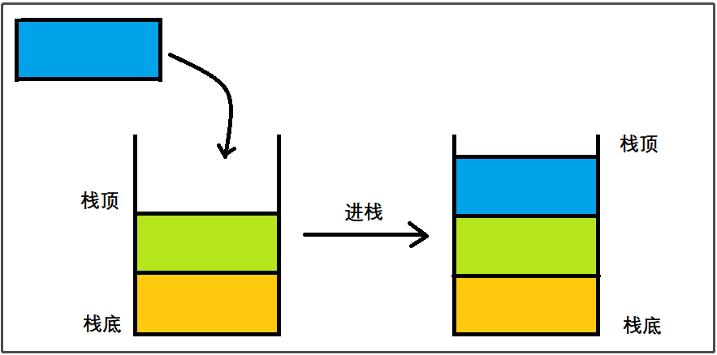
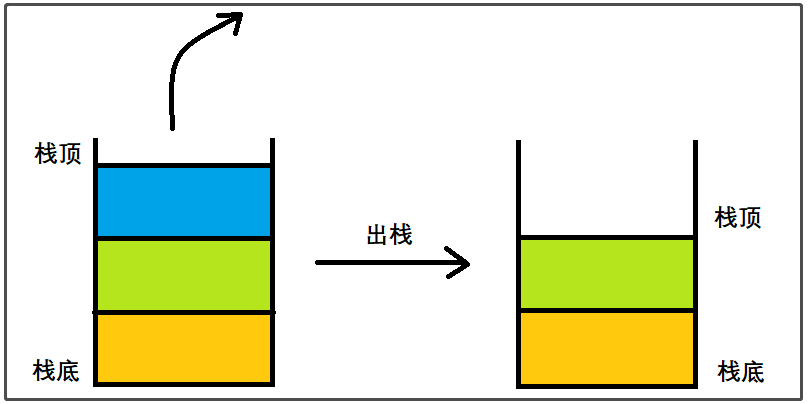

# <font color=blue>一、受限线性表</font>

## <font color=darkyellow>1.1 栈</font>（Stack）

### <font color=green>1.1.1 栈的基本概念</font>

什么是栈？

- 栈是一种特殊的线性表，也有前驱和后继的关系。
- 栈在表尾进行插入和删除操作，注意这里的**表尾**是指**栈顶**

栈的特性：

- 限制了线性表的插入和删除的位置，始终只在栈顶进行
- 栈底是固定的，最先进栈的只能在栈底，即**后进先出**

栈的操作：

- 进栈（插入）
- 出栈（删除）

进栈操作如图所示



出栈操作如图所示



### <font color=green>1.1.2 栈的顺序存储</font>

栈的顺序存储称为**顺序栈**

它的存储结构是：使用一组**连续**的内存空间，依次存储从栈底到栈顶的数据

#### <span id="1.1.2.1">1.1.2.1 实现顺序栈</span>

代码如下:

```c
// 栈的顺序存储

#include <stdio.h>
#include <string.h>
#include <stdlib.h>

#define MAX 1024

struct SStack
{
	void* data[MAX]; // 数组 -- 存放栈的数据
	int m_Size;	// 栈当前大小
};

typedef void* SeqStack;

// 初始化栈
SeqStack init_SeqStack()
{
	// 分配内存空间
	struct SStack* mystack = malloc(sizeof(struct SStack));

	if (mystack == NULL) {
		return NULL;
	}

	// 初始化数据
	memset(mystack->data, 0, sizeof(void*) * MAX);
	// void *memset(void *str, int c, size_t n)
	/*
		str -- 指向要填充的内存块。
		c -- 要被设置的值。该值以 int 形式传递，但是函数在填充内存块时是使用该值的无符号字符形式。
		n -- 要被设置为该值的字符数。
	*/


	// 初始化栈的大小
	mystack->m_Size = 0;

	// 返回栈
	return mystack;
}

// 入栈
void push_SeqStack(SeqStack stack, void * data) 
{
	// 容错判断
	if (stack == NULL) 
	{
		return;
	}

	if (data == NULL)
	{
		return;
	}

	struct SStack * mystack = stack;

	if (mystack->m_Size == MAX) 
	{
		return;
	}

	// 栈顶（表的尾部）插入数据
	mystack->data[mystack->m_Size] = data;
	// 栈大小+1
	mystack->m_Size++;
}

// 出栈
void pop_SeqStack(SeqStack stack)
{
	// 容错判断
	if (stack == NULL)
	{
		return;
	}

	struct SStack* mystack = stack;

	// 如果栈内数据已经没有了，返回
	if (mystack->m_Size == 0) {
		return;
	}

	// 将数据置位NULL，不用free，保留内存空间
	mystack->data[mystack->m_Size - 1] = NULL;
	
	// 大小减一
	mystack->m_Size--;
}

// 返回栈顶(的数据)
void* top_SeqStack(SeqStack stack)
{
	if (stack == NULL) {
		return;
	}

	struct SStack* mystack = stack;

	if (mystack->m_Size == 0) {
		return NULL;
	}

	return mystack->data[mystack->m_Size - 1];
}

// 返回栈大小
int size_SeqStack(SeqStack stack) {
	if (stack == NULL) {
		return -1;
	}

	struct SStack* mystack = stack;
	return mystack->m_Size;
}

// 判断栈是否为空
int isEmpty_SeqStack(SeqStack stack) {
	if (stack == NULL) {
		return -1;	// 返回-1代表真空栈
	}

	struct SStack* mystack = stack;
	
	if (mystack->m_Size == 0) {
		return 1;
	}

	return 0;
}

// 销毁栈
void destory_SeqStack(SeqStack stack) {
	if (stack == NULL) {
		return;
	}
	struct SStack* mystack = stack;
	free(stack);
	stack = NULL;
}

// 遍历数据
void foreach_SeqStack(SeqStack stack, void(*myprint)(void *data)) {
	if (stack == NULL) {
		return;
	}

	struct SStack* mystack = stack;

	for (int i = 0; i < mystack->m_Size; i++) {
		myprint(mystack->data[i]);
	}
}

// 测试
struct Person {
	char name[64];
	int age;
};

void myprint(void *data) {
	struct Person* p = data;
	printf("name =  %s, age = %d\n", p->name, p->age);
}

int main() {
	// 初始化栈
	SeqStack mystack = init_SeqStack();
	// 创建数据
	struct Person p1 = {"张三", 18};
	struct Person p2 = {"李四", 82};
	struct Person p3 = {"王五", 38};
	struct Person p4 = {"刘六", 84};
	struct Person p5 = {"赵七", 58};
	struct Person p6 = {"明八", 86};
	
	// 入栈
	push_SeqStack(mystack, &p1);
	push_SeqStack(mystack, &p2);
	push_SeqStack(mystack, &p3);
	push_SeqStack(mystack, &p4);
	push_SeqStack(mystack, &p5);
	push_SeqStack(mystack, &p6);

	// 显示数据
	printf("---入栈后---\n");
	foreach_SeqStack(mystack, myprint);

	// 出栈
	pop_SeqStack(mystack);

	// 显示数据
	printf("---出栈1次后---\n");
	foreach_SeqStack(mystack, myprint);

	pop_SeqStack(mystack);
	printf("---出栈2次后---\n");
	foreach_SeqStack(mystack, myprint);

	// 栈大小为
	printf("栈大小为: %d\n", size_SeqStack(mystack));

	// 返回栈顶数据
	struct Person* data = top_SeqStack(mystack);
	printf("栈顶数据: name = %s, age = %d\n", data->name, data->age);

	// 判断是否为空
	printf("Is Empty? %d\n", isEmpty_SeqStack(mystack));

	// 销毁栈
	destory_SeqStack(mystack);

	// 栈大小为
	printf("栈大小为: %d\n", size_SeqStack(mystack));

	return 0;
}

/*
执行结果：
    ---入栈后---
    name =  张三, age = 18
    name =  李四, age = 82
    name =  王五, age = 38
    name =  刘六, age = 84
    name =  赵七, age = 58
    name =  明八, age = 86
    ---出栈1次后---
    name =  张三, age = 18
    name =  李四, age = 82
    name =  王五, age = 38
    name =  刘六, age = 84
    name =  赵七, age = 58
    ---出栈2次后---
    name =  张三, age = 18
    name =  李四, age = 82
    name =  王五, age = 38
    name =  刘六, age = 84
    栈大小为: 4
    栈顶数据: name = 刘六, age = 84
    Is Empty? 0
    栈大小为: -572662307
*/

```

### <font color=green>1.1.3 栈的链式存储</font>

栈的链式存储简称为**链式栈**

>思考问题：栈顶应该放在链表的头部还是尾部？
>
>单链表有头指针，而栈也必须要栈顶指针，那么这两个干脆就可以合二为一，所以比较好的方法就是把栈顶放在单链表的头部

头指针和头节点的图示：


链式栈的图示：


#### 1.1.3.1 实现链式栈

实践中两次遇到输出乱码的错：

```c
name = @鲝b? age = 6
name = 婿廱? age = 5
name = `鰪b? age = 4
name = 瘐廱? age = 3
name = €鯊b? age = 2
name = , age = 1
```

怎么解决？设定数据结构体的时候，一定要记得设置前四个字节的指针

```c
struct Person
{
	void* node; // 重要！省略了就会乱码
	char name[64]; 
	int age;
};
```

链式栈的代码为：

```c

#define _CRT_SECURE_NO_WARNINGS
#include <stdio.h>
#include <stdlib.h> // 导入free

// 节点结构体
struct stackNode {
	struct stackNode* next;
};

// 栈的结构
struct LStack {
	struct stackNode pHeader;
	int m_size;
};

typedef void* LinkStack;

// 初始化
LinkStack init_LinkStack() {
	struct LStack* myStack = malloc(sizeof(struct LStack));
	if (myStack == NULL) {
		return NULL;
	}
	
	myStack->pHeader.next = NULL;
	myStack->m_size = 0;

	return myStack;
}

// 入栈
void push_LinkStack(LinkStack stack, void* data) {
	if (stack == NULL) {
		return;
	}

	if (data == NULL) {
		return;
	}

	struct LStack* myStack = stack;

	// 将用户数据取出前四个字节
	struct stackNode* myNode = data;

	// 更改指针指向
	myNode->next = myStack->pHeader.next;
	myStack->pHeader.next = myNode;

	myStack->m_size++;
}

// 出栈
void pop_LinkStack(LinkStack stack) {
	if (stack == NULL) {
		return;
	}
	
	struct LStack* mystack = stack;

	if (mystack->m_size == 0) {
		printf("栈里没数据了！\n");
		return;
	}

	struct stackNode* pDel = mystack->pHeader.next;
	
	mystack->pHeader.next = pDel->next;

	// 数据交由用户去释放，我们只管理前4个字节的数据
	// free(pDel);
	// pDel = NULL;

	mystack->m_size--;
}

// 返回栈顶元素
void * top_LinkStack(LinkStack stack) {
	if (stack == NULL) {
		return NULL;
	}

	struct LStack* mystack = stack;

	if (mystack->m_size == 0) {
		printf("我都被榨干了！一滴不剩啊！\n");
		return NULL;
	}

	return mystack->pHeader.next;
}

// 返回栈的个数
int size_LinkStack(LinkStack stack) {
	if (stack == NULL) {
		return -1;
	}

	struct LStack* mystack = stack;

	return mystack->m_size;
}

// 判断是否为空
int isEmpty_LinkStack(LinkStack stack) {
	if (stack == NULL) {
		return -1;
	}

	struct LStack* mystack = stack;

	if (mystack->m_size == 0) {
		return 1;
	}

	return 0;
}

// 销毁
void destory_LinkStack(LinkStack stack) {
	if (stack == NULL) {
		return;
	}

	free(stack);
	stack = NULL;
}

// 遍历
void foreach_LinkStack(LinkStack stack, void(*myprint)(void *)) {
	if (stack == NULL) {
		return;
	}

	struct LStack* mystack = stack;
	struct stackNode * node = mystack->pHeader.next;

	for (int i = 0; i < mystack->m_size; i++) {
		myprint(node);
		node = node->next;
	}
}

// 测试
struct Person
{
	void* node; // 重要！
	char name[64]; 
	int age;
};

void myprint(void* data) {
	struct Person* p = data;
	printf("name = %s, age = %d\n", p->name, p->age);
}

void test() {
	// 初始化
	LinkStack stack = init_LinkStack();

	// 准备数据
	struct Person p1 = {NULL, "A1", 1};
	struct Person p2 = {NULL, "A2", 2 };
	struct Person p3 = {NULL, "A3", 3 };
	struct Person p4 = {NULL, "A4", 4 };
	struct Person p5 = {NULL, "A5", 5 };
	struct Person p6 = {NULL, "A6", 6 };

	// 插入
	push_LinkStack(stack, &p1);
	push_LinkStack(stack, &p2);
	push_LinkStack(stack, &p3);
	push_LinkStack(stack, &p4);
	push_LinkStack(stack, &p5);
	push_LinkStack(stack, &p6);

	// 遍历
	printf("插入数据后：\n");
	foreach_LinkStack(stack, myprint);

	// 弹出
	printf("弹出1次后：\n");
	pop_LinkStack(stack);
	foreach_LinkStack(stack, myprint);

	// 大小
	printf("弹出2次后：\n");
	pop_LinkStack(stack);
	foreach_LinkStack(stack, myprint);
	printf("栈大小为：%d\n", size_LinkStack(stack));

	// 销毁
	destory_LinkStack(stack);
	stack = NULL;
}


int main() {
	test();
	return 0;
}

/* 执行结果
插入数据后：
name = A6, age = 6
name = A5, age = 5
name = A4, age = 4
name = A3, age = 3
name = A2, age = 2
name = A1, age = 1
弹出1次后：
name = A5, age = 5
name = A4, age = 4
name = A3, age = 3
name = A2, age = 2
name = A1, age = 1
弹出2次后：
name = A4, age = 4
name = A3, age = 3
name = A2, age = 2
name = A1, age = 1
栈大小为：4
*/
```

### <font color=green>1.1.4 栈的应用案例</font>

#### 1.1.4.1 就近匹配

实现效果：匹配`(`和`)`，如不能匹配上，就暴露出错误

思路：

1. 从第一个字符开始扫描
2. 当遇见普通字符时忽略，
3. 当遇见左括号时压入栈中
4. 当遇见右括号时从栈中弹出栈顶符号，并进行匹配
5. 匹配成功：继续读入下一个字符
6. 匹配失败：立即停止，并报错
7. 结束：
8. 成功: 所有字符扫描完毕，且栈为空
9. 失败：匹配失败或所有字符扫描完毕但栈非空

使用顺序栈实现就近匹配案例：

使用[1.1.2.1](#1.1.2.1)小节的代码准备顺序栈头文件：seqstack.h

```c
#include <stdio.h>
#include <string.h>
#include <stdlib.h>

#define MAX 1024

struct SStack
{
	void* data[MAX]; // 数组 -- 存放栈的数据
	int m_Size;	// 栈当前大小
};

typedef void* SeqStack;

// 初始化栈
SeqStack init_SeqStack();

// 入栈
void push_SeqStack(SeqStack stack, void* data);
....
```

顺序栈实现代码：seqstack.c

```c
#include "seqstack.h"

// 初始化栈
SeqStack init_SeqStack()
{
	// 分配内存空间
	struct SStack* mystack = malloc(sizeof(struct SStack));

	if (mystack == NULL) {
		return NULL;
	}
....
```

就近匹配的实现：main.c

```c
// 栈的应用-就近匹配

#include "seqstack.h"

int isLeft(char ch) {
	return ch == '(';
}

int isRight(char ch) {
	return ch == ')';
}

// 输出异常括号的位置
void printError(char* str, char* errMsg, char* pos) {
	printf("错误信息: %s\n", errMsg);
	printf("%s\n", str);

	// 计算打印空格数量
	int num = (int)pos - (int)str;

	for (int i = 0; i < num; i++) {
		printf(" ");
	}

	printf("|\n");
}

void test() {
	char* str = "5+5*(6)+9/3*1(-(1+3(";
	char* p = str;

	// 初始化栈
	SeqStack myStack = init_SeqStack();

	while (*p != '\0') {
		// 如果是左括号，入栈
		if (isLeft(*p)) {
			push_SeqStack(myStack, p);
		}

		if (isRight(*p)) {
			if (size_SeqStack(myStack) > 0) {
				pop_SeqStack(myStack);
			}
			else {
				// 右括号没有匹配到对应的左括号，立即停止
				printError(str, "右括号没有匹配到对应的左括号!", p);
				break;
			}
		}
		p++;
	}
	// 遍历结束 判断是否有左括号没有匹配到右括号
	while (size_SeqStack(myStack)) {
		printError(str, "左括号没有匹配到对应的右括号!", top_SeqStack(myStack));
		pop_SeqStack(myStack);
	}

	// 销毁栈
	destory_SeqStack(myStack);
	myStack = NULL;
}


int main() {
	test();
	return 0;
}
```

执行结果：

```c
错误信息: 左括号没有匹配到对应的右括号!
5+5*(6)+9/3*1(-(1+3(
                   |
错误信息: 左括号没有匹配到对应的右括号!
5+5*(6)+9/3*1(-(1+3(
               |
错误信息: 左括号没有匹配到对应的右括号!
5+5*(6)+9/3*1(-(1+3(
             |
```

#### 1.1.4.2 基于后缀表达式计算

##### 1.1.4.2.1 中缀和后缀表达式的概念

1）什么是中缀表达式？

我们常见的数学式子可以理解为中缀表达式，计算符号放在数字中间**符合人类思考习惯**，例如：

```c
5 + 4 
1 + 2 * 3
8 +( 3 – 1 ) * 5
```

2）什么是后缀表达式？

后缀表达式的特征是计算符放在数字后面，**适合计算机运算**，例如将上面的3个式子转换为后缀表达式：

```c
5 + 4  ==>  5 4 +
1 + 2 * 3  ==>  1 2 3 * +	
8 +( 3 – 1 ) * 5  =>  8 3 1 - 5 * + 
```

3）这是一套怎样的算法呢？

遍历中缀表达式中的数字和符号：

- 对于数字：直接输出
- 对于符号：
  - 左括号：进栈 
  - 运算符号：与栈顶符号进行优先级比较
  - 若栈顶符号优先级低：此符号进栈 
  - （默认栈顶若是左括号，左括号优先级最低）
  - 若栈顶符号优先级不低：将栈顶符号弹出并输出，之后进栈
  - 右括号：将栈顶符号弹出并输出，直到匹配左括号,将左括号和右括号同时舍弃
- 遍历结束：将栈中的所有符号弹出并输出

流程图示如下：


##### 1.1.4.2.1 实现基于后缀表达式计算

计算机是如何基于后缀表达式计算的？

- 对于数字：进栈
- 对于符号：
  - 从栈中弹出右操作数
  - 从栈中弹出左操作数
  - 根据符号进行运算
  - 将运算结果压入栈中
- 遍历结束：栈中的唯一数字为计算结果

实现Code:

```c
#include "seqstack.h"
#include <ctype.h>

// 函数-获取计算结果
int getResult(SeqStack mystack, int leftnum, int rightnum, char flag) {
	switch (flag){
	case '+':
		return  leftnum + rightnum;
	case '-':
		return  leftnum - rightnum;
	case '*':
		return  leftnum * rightnum;
	case '/':
		return  leftnum / rightnum;
	default:
		return -1;
	}
}

void test() {
	char* str = "8 3 1 - 5 * + "; // 中缀表达式：8 +( 3 – 1 ) * 5 = 18
	char* p = str;

	// 初始化栈
	SeqStack mystack = init_SeqStack();
	int rightNum = 0;
	int leftNum = 0;
	int result = 0;

	// 循环判断字符
	while (*p != '\0') {
		// 如果不是空格，进行处理
		if (!(isspace(*p))) {
			// 如果是数字，进栈
			if (isdigit(*p)) {
				// *p 是 char类型，转换为int类型，使用*p - '0'
				printf("数字:%d入栈\n", *p - '0');
				push_SeqStack(mystack, *p - '0');
			}
			else {
                // 如果是运算符，取出数字进行计算
				rightNum = top_SeqStack(mystack);
				pop_SeqStack(mystack);
				leftNum = top_SeqStack(mystack);
				pop_SeqStack(mystack);
				result = getResult(mystack, leftNum, rightNum, *p);
				printf("运算: %d %c %d = %d，结果入栈\n", leftNum, *p, rightNum, result);
				push_SeqStack(mystack, result);
			}
		}
		p++;
	}

	printf("从栈中取出最后的计算结果 = %d\n", (int)top_SeqStack(mystack));
    
    // 销毁栈
	destory_SeqStack(mystack);
	mystack = NULL;
}

int main() {
	test();
	return 0;
}
```

运行结果：

```c
// 计算8 +( 3 – 1 ) * 5
数字:8入栈
数字:3入栈
数字:1入栈
运算: 3 - 1 = 2，结果入栈
数字:5入栈
运算: 2 * 5 = 10，结果入栈
运算: 8 + 10 = 18，结果入栈
从栈中取出最后的计算结果 = 18
```

## <font color=darkyellow>1.2 队列</font>（Queue）

### <font color=green>1.2.1 队列的基本概念</font>

队列是一种特殊的受限线性表：

- 只允许在一端进行插入操作
- 只允许在另一端进行删除操作

队列的特征是**先进先出**，数据走向如图所示：


### <font color=green>1.2.2 队列的顺序存储</font>

用线性表的顺序存储来模拟队列

```c
#include <stdio.h>
#include <string.h>
#include <stdlib.h>
#include "dynamicArray.h" // 需要使用到动态数组

#define MAX 1024

typedef void* seqQueue;

// 初始化队列
seqQueue init_SeqQueue() {
	struct dynamicArray* arr = init_DynamicArray(MAX);
	// 返回队列
	return arr;
}

// 入队
void push_SeqQueue(seqQueue queue, void *data) {
	// 本质是尾插
	if (queue == NULL) {
		return;
	}

	if (data == NULL) {
		return;
	}

	struct dynamicArray* myQueue = queue;

	// 如果队列已满，返回
	// 报错: 取消对NULL值myQueue的引用
	if (myQueue->m_size == MAX) {
		return;
	}

	// 队列没满，尾插
	insert_DynamicArray(myQueue, myQueue->m_size, data);
}

// 出队
void pop_SeqQueue(seqQueue queue) {
	// 本质是头删
	if (queue == NULL) {
		return;
	}

	struct dynamicArray* myQueue = queue;

	// 如果队列大小<=0，返回
	if (myQueue->m_size <= 0) {
		return;
	}

	// 删除头
	removeByPos_DynamicArray(myQueue, 0);
}

// 获取队列大小
int size_SeqQueue(seqQueue queue) {
	if (queue == NULL) {
		return -1;
	}

	struct dynamicArray* myQueue = queue;
	return myQueue->m_size;
}

// 判断队列是否为空
int isEmpty_SeqQueue(seqQueue queue) {
	if (queue == NULL) {
		return -1;
	}
	
	struct dynamicArray* myQueue = queue;

	if (myQueue->m_size == 0) {
		return 1;
	}

	return 0;
}

// 返回队头元素
void* front_SeqQueue(seqQueue queue)
{
	if (queue == NULL)
	{
		return NULL;
	}
	struct dynamicArray* myQueue = queue;

	return myQueue->pAddr[0];
}

// 返回队尾元素
void* back_SeqQueue(seqQueue queue)
{
	if (queue == NULL)
	{
		return NULL;
	}
	struct dynamicArray* myQueue = queue;

	return myQueue->pAddr[myQueue->m_size - 1];
}

// 销毁队列
void destroy_SeqQueue(seqQueue queue)
{
	if (queue == NULL)
	{
		return;
	}

	destroy_DynamicArray(queue);

}

// 测试
struct Person {
	char name[64];
	int age;
};

void myprintf(void * data) {
	if (data == NULL) {
		return;
	}

	struct Person* p = data;
	printf("name = %s, age = %d\n", p->name, p->age);
}


void test() {
	// 初始化队列
	seqQueue myQueue = init_SeqQueue();
	printf("--已初始化队列--\n");
	printf("size = %d\n", size_SeqQueue(myQueue));

	// 准备数据
	struct Person p1 = { "张1", 18 };
	struct Person p2 = { "张2", 28 };
	struct Person p3 = { "张3", 38 };
	struct Person p4 = { "张4", 48 };
	struct Person p5 = { "张5", 58 };
	struct Person p6 = { "张6", 68 };

	push_SeqQueue(myQueue, &p1);
	push_SeqQueue(myQueue, &p2);
	push_SeqQueue(myQueue, &p3);
	push_SeqQueue(myQueue, &p4);
	push_SeqQueue(myQueue, &p5);
	push_SeqQueue(myQueue, &p6);

	printf("--已插入数据--\n");
	printf("size = %d\n", size_SeqQueue(myQueue));
	foreach_DynamicArray(myQueue, myprintf);

	pop_SeqQueue(myQueue);
	printf("--出队1次--\n");
	printf("size = %d\n", size_SeqQueue(myQueue));
	foreach_DynamicArray(myQueue, myprintf);

	pop_SeqQueue(myQueue);
	printf("--出队2次--\n");
	printf("size = %d\n", size_SeqQueue(myQueue));
	foreach_DynamicArray(myQueue, myprintf);

	struct Person*  fp = front_SeqQueue(myQueue);
	printf("此时队头的元素是：name: %s, age: %d\n", fp->name, fp->age);

	struct Person* bp = back_SeqQueue(myQueue);
	printf("此时队尾的元素是：name: %s, age: %d\n", bp->name, bp->age);

	printf("队列是否为空？ %d\n", isEmpty_SeqQueue(myQueue));

	printf("--多出列几次--\n");
	pop_SeqQueue(myQueue);
	pop_SeqQueue(myQueue);
	pop_SeqQueue(myQueue);
	pop_SeqQueue(myQueue);
	pop_SeqQueue(myQueue);

	printf("队列是否为空？ %d\n", isEmpty_SeqQueue(myQueue));

	destroy_SeqQueue(myQueue);
	printf("--队列已销毁--\n");
}


int main() {
	test();
	return 0;
}
```

输出如下：

```c
--已初始化队列--
size = 0
--已插入数据--
size = 6
name = 张1, age = 18
name = 张2, age = 28
name = 张3, age = 38
name = 张4, age = 48
name = 张5, age = 58
name = 张6, age = 68
--出队1次--
size = 5
name = 张2, age = 28
name = 张3, age = 38
name = 张4, age = 48
name = 张5, age = 58
name = 张6, age = 68
--出队2次--
size = 4
name = 张3, age = 38
name = 张4, age = 48
name = 张5, age = 58
name = 张6, age = 68
此时队头的元素是：name: 张3, age: 38
此时队尾的元素是：name: 张6, age: 68
队列是否为空？ 0
--多出列几次--
队列是否为空？ 1
--队列已销毁--
```

**错误处理：**

> **错误1**：在实现案例时，以下部分的代码报错：**取消对NULL值myQueue的引用**
>
> ```c
>// 入队
> void push_SeqQueue(seqQueue queue, void *data) {
> 	// 本质是尾插
> 	if (queue = NULL) {
> 		return;
> 	}
> 
> 	if (data == NULL) {
> 		return;
> 	}
> 
> 	struct dynamicArray* myQueue = queue;
> 
> 	// 如果队列已满，返回
> 	// 报错: 取消对NULL值myQueue的引用
> 	if (myQueue->m_size == MAX) {
> 		return;
> 	}
> 
> 	// 队列没满，尾插
> 	insert_DynamicArray(myQueue, myQueue->m_size, data);
> }
> ```
> 
> 原因是什么？
>
> ```c
>...
> if (queue = NULL) {	// 少写一个"="号
> ...
> 
> // 应是
> if (queue == NULL) {
> ```
> 
> 引以为戒！！
>
> 
>
> **错误2**：队头和队尾的函数报错出了问题
>
> ```c
>// 返回队头元素
> void* front_SeqQueue(seqQueue queue)
> {
> 	if (queue == NULL)
> 	{
> 		return NULL;
> 	}
> 	struct dynamicArray* myQueue = queue;
> 
> 	return myQueue->pAddr[0]; // 引发了未经处理的异常:读取访问权限冲突。
> 							 // myQueue->pAddr 是 0xFFFFFFFFFFFFFFF7
> }
> ```
> 
> 什么原因呢？调用的时候参数传错了，因为参数是void *类型，并不会报参数类型异常，需要注意！
>
> ```c
>struct Person*  fp = front_SeqQueue(myprintf); 
> // 应是
> struct Person*  fp = front_SeqQueue(myQueue); 
> ```
> 

### <font color=green>1.2.3 队列的链式存储</font>

用线性表的链式存储来模拟队列，链式队列对比普通队列，多了一个**尾指针**，其结构可如图所示：


案例分为三个文件，分别是

- 链式栈头文件：linkQueue.h
- 链式栈实现文件：linkQueue.c
- 链式栈测试文件：main.c

头文件

```c
#pragma once

#include <stdio.h>
#include <stdlib.h>

// 节点结构体
struct QueueNode {
	struct QueueNode* next;
};

// 队列结构体
struct LQueue {
	struct QueueNode header;	// 头节点
	struct QueueNode *pTail;	// 尾指针
	int m_size;
};

// 通用定义
typedef void* LinkQueue;

// 初始化队列
LinkQueue init_LinkQueue();
// 入队
void push_LinkQueue(LinkQueue queue, void * data);
// 出队
void pop_LinkQueue(LinkQueue queue);
// 获取队列长度
int size_LinkQueue(LinkQueue queue);
// 获取头数据
void * front_LinkQueue(LinkQueue queue);
// 获取尾数据
void* back_LinkQueue(LinkQueue queue);
// 销毁队列
void destroy_LinkQueue(LinkQueue queue);
// 遍历队列
void foreach_LinkQueue(LinkQueue queue);
// 判断队列是否为空
int isEmpty_LinkQueue(LinkQueue queue);
```

实现文件

```c
#include "linkQueue.h"

// 初始化队列
LinkQueue init_LinkQueue() {
	// 分配空间
	struct LQueue* myqueue = malloc(sizeof(struct LQueue));

	if (myqueue == NULL) {
		return NULL;
	}
	
	// 初始化
	myqueue->header.next = NULL;
	myqueue->pTail = &myqueue->header; // 尾指针指向头节点
	myqueue->m_size = 0;

	return myqueue;
}

// 入队
void push_LinkQueue(LinkQueue queue, void* data) {
	if (queue == NULL) {
		return;
	}

	if (data == NULL) {
		return;
	}

	struct LQueue* myqueue = queue;

	struct QueueNode* node = data;

	// 更新指针指向
	myqueue->pTail->next = data;
	node->next = NULL;

	// 更新新的尾节点
	myqueue->pTail = node;


	// 更新大小
	myqueue->m_size++;
}


// 出队
void pop_LinkQueue(LinkQueue queue) {
	if (queue == NULL) {
		return;
	}

	struct LQueue* myqueue = queue;

	// 没有节点，不操作
	if (myqueue->m_size == 0) {
		return;
	}

	// 只有一个节点，改变尾节点的指向
	if (myqueue->m_size == 1) {
		myqueue->header.next = NULL;
		myqueue->pTail = &myqueue->header;
		myqueue->m_size--;
		return;
	}

	// 记录第一个有数据的节点
	struct QueueNode* pFirst = myqueue->header.next;

	// 更改指针指向
	myqueue->header.next = pFirst->next;
	
	myqueue->m_size--;
}

// 获取队列长度
int size_LinkQueue(LinkQueue queue) {
	if (queue == NULL) {
		return -1;
	}
	
	struct LQueue* myqueue = queue;

	return myqueue->m_size;
}

// 获取头数据
void* front_LinkQueue(LinkQueue queue) {
	if (queue == NULL) {
		return -1;
	}

	struct LQueue* myqueue = queue;

	return myqueue->header.next;
}

// 获取尾数据
void* back_LinkQueue(LinkQueue queue) {
	if (queue == NULL) {
		return -1;
	}

	struct LQueue* myqueue = queue;

	return myqueue->pTail;
}

// 销毁队列
void destroy_LinkQueue(LinkQueue queue) {
	if (queue == NULL) {
		return -1;
	}

	struct LQueue* myqueue = queue;

	free(myqueue);
	myqueue = NULL;
}

// 遍历队列
void foreach_LinkQueue(LinkQueue queue, void(*myprint)(void *)) {
	if (queue == NULL) {
		return -1;
	}

	struct LQueue* myqueue = queue;
	struct QueueNode* pCurrent = myqueue->header.next;

	for (int i = 0; i < myqueue->m_size; i++) {
		myprint(pCurrent);
		pCurrent = pCurrent->next; // 这里不能用pCurrent++;
	}	
}


// 判断队列是否为空
int isEmpty_LinkQueue(LinkQueue queue) {
	if (queue == NULL) {
		return -1;
	}

	struct LQueue* myqueue = queue;

	if (myqueue->m_size == 0) {
		return 1;
	}

	return 0;
}
```

测试文件

```c
#include "linkQueue.h"

// 测试
struct Person {
	void* node;
	char name[64];
	int age;
};

void myprintf(void* data) {
	if (data == NULL) {
		return;
	}

	struct Person* p = data;
	printf("name = %s, age = %d\n", p->name, p->age);
}

void test() {
	// 初始化队列
	LinkQueue myQueue = init_LinkQueue();
	printf("--已初始化队列--\n");
	printf("size = %d\n", size_LinkQueue(myQueue));

	// 准备数据
	struct Person p1 = { NULL, "张1", 18 };
	struct Person p2 = { NULL,  "张2", 28 };
	struct Person p3 = { NULL,  "张3", 38 };
	struct Person p4 = { NULL,  "张4", 48 };
	struct Person p5 = { NULL,  "张5", 58 };
	struct Person p6 = { NULL,  "张6", 68 };

	push_LinkQueue(myQueue, &p1);
	push_LinkQueue(myQueue, &p2);
	push_LinkQueue(myQueue, &p3);
	push_LinkQueue(myQueue, &p4);
	push_LinkQueue(myQueue, &p5);
	push_LinkQueue(myQueue, &p6);

	printf("--已插入数据--\n");
	printf("size = %d\n", size_LinkQueue(myQueue));
	foreach_LinkQueue(myQueue, myprintf);

	pop_LinkQueue(myQueue);
	printf("--出队1次--\n");
	printf("size = %d\n", size_LinkQueue(myQueue));
	foreach_LinkQueue(myQueue, myprintf);

	pop_LinkQueue(myQueue);
	printf("--出队2次--\n");
	printf("size = %d\n", size_LinkQueue(myQueue));
	foreach_LinkQueue(myQueue, myprintf);

	struct Person* fp = front_LinkQueue(myQueue);
	printf("此时队头的元素是：name: %s, age: %d\n", fp->name, fp->age);

	struct Person* bp = back_LinkQueue(myQueue);
	printf("此时队尾的元素是：name: %s, age: %d\n", bp->name, bp->age);

	printf("队列是否为空？ %d\n", isEmpty_LinkQueue(myQueue));

	printf("--多出列几次--\n");
	pop_LinkQueue(myQueue);
	pop_LinkQueue(myQueue);
	pop_LinkQueue(myQueue);
	pop_LinkQueue(myQueue);
	pop_LinkQueue(myQueue);

	printf("队列是否为空？ %d\n", isEmpty_LinkQueue(myQueue));

	destroy_LinkQueue(myQueue);
	printf("--队列已销毁--\n");
}


int main() {
	test();
	return 0;
}
```

输出：

```c
--已初始化队列--
size = 0
--已插入数据--
size = 6
name = 张1, age = 18
name = 张2, age = 28
name = 张3, age = 38
name = 张4, age = 48
name = 张5, age = 58
name = 张6, age = 68
--出队1次--
size = 5
name = 张2, age = 28
name = 张3, age = 38
name = 张4, age = 48
name = 张5, age = 58
name = 张6, age = 68
--出队2次--
size = 4
name = 张3, age = 38
name = 张4, age = 48
name = 张5, age = 58
name = 张6, age = 68
此时队头的元素是：name: 张3, age: 38
此时队尾的元素是：name: 张6, age: 68
队列是否为空？ 0
--多出列几次--
队列是否为空？ 1
--队列已销毁--
```


