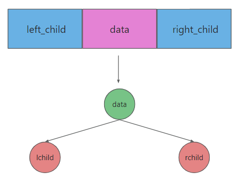

# <font color=blue>一、树和二叉树</font>

## <font color=darkyellow>1.1 树</font>

### <font color=green>1.1.1 树的基本概念</font>

#### 1.1.1.1 树的定义

什么是树？

- 由一个或多个(n≥0)结点组成的有限集合T，有且仅有一个结点称为根（root）

- 当n>1时，其余的结点分为m(m≥0)个互不相交的有限集合T1,T2，…，Tm。每个集合本身又是棵树，被称作这个根的子树 。

  

#### 1.1.1.2 树的结构特点

结构特点有哪些？

- 非线性结构，有一个直接前驱，但可能有多个直接后继（1:n）
- 树的定义具有递归性，树中还有树。
- 树可以为空，即节点个数为0。

#### 1.1.1.3 常用术语

区分各术语：

- **根** --- 即根结点(没有前驱)
- **叶子** --- 即终端结点(没有后继)
- 森林 --- 指m棵不相交的树的集合(例如删除A后的子树个数)
- 有序树 --- 结点各子树从左至右有序，不能互换（左为第一）
- 无序树 --- 结点各子树可互换位置。
- **双亲** --- 即上层的那个结点(直接前驱) parent
- **孩子** --- 即下层结点的子树 (直接后继) child
- 兄弟 --- 同一双亲下的同层结点（孩子之间互称兄弟）sibling
- 堂兄弟 --- 即双亲位于同一层的结点（但并非同一双亲）cousin
- 祖先 --- 即从根到该结点所经分支的所有结点
- 子孙 --- 即该结点下层子树中的任一结点

- 结点 --- 即树的数据元素                       
- **结点的度** --- 结点挂接的子树数（有几个直接后继就是几度）
  - 示例图中，对于root（中国）结点的度是4，对于广东省结点的度是2
- **结点的层次** --- 从根到该结点的层数（根结点算第一层） 
  - 示例图中：对于长沙市这个结点，在第3层
- 终端结点 --- 即度为0的结点，即叶子       
- 分支结点 --- 除树根以外的结点（也称为内部结点）
- **树的度** --- 所有结点度中的最大值（Max{各结点的度}）
  - 示例图中：树的度是4    
- **树的深度(或高度)** --- 指所有结点中最大的层数（Max{各结点的层次}）
  - 示例图中：树的深度是4

### <font color=green>1.1.2 树的表示方式</font>

树的表示方式有三种：

- 图形表示法（图）：

  - 用图形表示：如1.1.1中的图，将树用图画出来

- 广义表示法（文字）：

  - 用广义表示法表示1.1.1的图为：

    中国（湖南（长沙，益阳），山西（太原），广东（广州，深圳），四川）

- 左孩子右兄弟表示法（方便写代码）：

  - 比如使用该方法可以将一颗多叉树转换为二叉树（最多两个叉的树）

    

  结点结构为：

  | 左指针--指向子结点 | 数据 | 右指针--指向兄弟结点 |
  | ------------------ | ---- | -------------------- |
  | LPointer           | Data | RPointer             |

## <font color=darkyellow>1.2 二叉树</font>

### <font color=green>1.2.1 二叉树的基本概念</font>

什么是二叉树？

- 二叉树是一个有n个结点的有限集合（n>=0），由**一个根结点**和两棵互不相交的、分别称为**左子树和右子树**的二叉树组成 。

二叉树的基本特征：

- 每个结点最多只有两棵子树
- 左子树和右子树的次序不能颠倒（有序树）

### <font color=green>1.2.2 二叉树的性质</font>

二叉树有5条性质，其中通用性质3条：

1. 在二叉树的第`i`层上至多有`2^i-1`个结点（i>0）
2. 深度为`k`的二叉树至多有`2^k-1`个结点（k>0）
3. 对于任何一棵二叉树，若度为2的结点数有`n2`个，则叶子数`n0`必定为`n2＋1` （即`n0=n2+1`）

完全二叉树性质2条：

1. 具有n个结点的完全二叉树的深度必为`[log2n] + 1`
2. 对完全二叉树，若从上至下、从左至右编号，则编号为`i `的结点，其左孩子编号必为`2i`，其右孩子编号必为`2i＋1`；其双亲的编号必为`i/2`（i＝1 时为根,除外）

### <font color=green>1.2.3 满二叉树和完全二叉树</font>

#### 1.2.3.1 满二叉树

一棵深度为`k`，且有`2^k-1`个结点的二叉树

它的特点：每层都“充满”了结点，如图所示，它有`2^4-1 = 15`个结点


#### 1.2.3.1 完全二叉树

定义：

前`k-2`层：每个节点都有两个孩子，`节点饱和`

前`k-1`层：节点肯定是`饱和的`—>到达了最大值

第`k-1`层：不一定所有的节点都有孩子节点，如果有孩子节点，至少要是左孩子节点，有可能出现不饱和节点


### <font color=green>1.2.4 二叉树的表示</font>

#### 1.2.4.1 二叉链表示法

一般从根结点开始存储。相应的，访问树中结点时也只能从根开始

存储结构如图所示：



代码中定义其结构体：

```c
// 二叉链表
typdef struct BiTNode {
    int data;
    struct BitNode, *lchild, *rchild;
}BiTNode, *BiTree
```

#### 1.2.4.2 三叉链表示法

存储结构如图所示：


代码中定义其结构：

```c
// 三叉链表
typdef struct TriTNode {
    int data;
    // 左右孩子指针
    struct TriTNode *lchild, *rchild;
    struct TriTNode *parent;
}TriTNode, *TriTree;
```

### <font color=green>1.2.5 二叉树的遍历</font>

🧒什么是遍历？

遍历：按照某条搜索路线，访问每个结点，且不重复访问

用途：遍历是树结构插入、删除、修改、查找和排序等运算的前提，是二叉树一切运算的核心

#### 1.2.5.1 二叉树的遍历方法

牢记原则：对每个结点的查看都是**<font color=red>先左后右</font>**

在这个原则之下，树的遍历有三种实现方案：

- **<font color=red>D</font>LR**	前（根）序遍历，先根，再左，再右
- **L<font color=red>D</font>R**	中（根）序遍历，先左，再根，再右
- **LR<font color=red>D</font>**	后（根）序遍历，先左，再右，再根

D：Root根，L：左孩子结点，R：右孩子结点

通过一个案例来了解二叉树的遍历，我们遍历的二叉树如图所示：


该图分别使用三种方式遍历的结果：

- 按照前序遍历：ABCDEFGH
- 按照中序遍历：BDCEAFHG
- 按照后序遍历：DECBHGFA

用代码实现如下：

```c
// 二叉链，二叉树的递归遍历
#define _CRT_SECURE_NO_WARNINGS
#include <stdio.h>
#include <string.h>
#include <stdlib.h>

struct BinaryNode {
	// 数据域
	char ch;
	// 指针域
	struct BinaryNode* lchild;
	struct BinaryNode* rchild;
};

// 递归
void recursion(struct BinaryNode* root) {
	if (root == NULL) {
		return;
	}

	// 遍历顺序（后序）
	recursion(root->lchild); // 左
	recursion(root->rchild); // 右
	printf("%c", root->ch);	// 中
}

// 测试
void test01() {
	// 创建结点
	struct BinaryNode nodeA = { 'A', NULL, NULL };
	struct BinaryNode nodeB = { 'B', NULL, NULL };
	struct BinaryNode nodeC = { 'C', NULL, NULL };
	struct BinaryNode nodeD = { 'D', NULL, NULL };
	struct BinaryNode nodeE = { 'E', NULL, NULL };
	struct BinaryNode nodeF = { 'F', NULL, NULL };
	struct BinaryNode nodeG = { 'G', NULL, NULL };
	struct BinaryNode nodeH = { 'H', NULL, NULL };
	
	// 建立关系
	nodeA.lchild = &nodeB;
	nodeA.rchild = &nodeF;
	
	nodeB.rchild = &nodeC;
	
	nodeC.lchild = &nodeD;
	nodeC.rchild = &nodeE;

	nodeF.rchild = &nodeG;

	nodeG.lchild = &nodeH;

	// 递归遍历
	recursion(&nodeA);
}

int main() {
	test01();
	printf("\n");
	return 0;
}
```

输出：

```c
DECBHGFA
```

### <font color=green>1.2.6 二叉树编程实践</font>

编程实现3个目标：

- 计算二叉树的叶子结点数目

  - 从根开始
  - 判断当前节点的左子树和右子树是否都为空，如果是则为叶子节点，计数+1
  - 否则继续递归遍历左子树和右子树

  <details>

  ```c
  // 计算叶子结点的数量
  void calculateLeafNum(struct BinaryNode* root, int* p) {
  	if (root == NULL) {
  		return;
  	}
  
  	if (p == NULL) {
  		return;
  	}
  
  	// 如果结点的左子树和右子树同时为空，则为叶子结点
  	if (root->lChild == NULL && root->rChild == NULL) {
  		// 判断为叶子结点,数量+1
  		(*p)++;
  	}
  	
  	// 否则，继续遍历左子树和右子树
  	calculateLeafNum(root->lChild, p);
  	calculateLeafNum(root->rChild, p);
  }
  ```

- 计算二叉树的深度（高度）

  - 求根结点左子树的深度，根结点右子树的深度，比较子树得到最大高度H，再H+1就是树的深度
  - 若左子树还是树，重复步骤1；若右子树还是树，重复步骤1

  ```c
  // 获取树的深度（高度）
  int getTreeHigh(struct BinaryNode* root) {
  	if (root == NULL) {
  		return 0;
  	}
  
  	// 递归计算左子树的高度
  	int lHeight = getTreeHigh(root->lChild);
  	// 递归计算右子树的高度
  	int rHeight = getTreeHigh(root->rChild);
  
  	// 左右子树高度比较，大的就是树的高度
  	int height = lHeight > rHeight ? lHeight + 1 : rHeight + 1;
  
  	return height;
  }
  ```

- 拷贝二叉树

  - malloc新结点
  - 拷贝左子树，拷贝右子树，让新结点连接左子树和右子树
  - 若左子树还是树，重复步骤1、2；若右子树还是树，重复步骤1、2

  ```c
  // 拷贝二叉树
  struct BinaryNode* copyTree(struct BinaryNode* root) {
  	if (root == NULL) {
  		return NULL;
  	}
  
  	// 开辟新空间
  	struct BinaryNode* newNode = malloc(sizeof(struct BinaryNode));
      
      // 先拷贝左子树
  	struct BinaryNode* lChild = copyTree(root->lChild);
  	// 再拷贝右子树
  	struct BinaryNode* rChild = copyTree(root->rChild);
      
  	// 拷贝节点
  	newNode->ch = root->ch;
  	newNode->lChild = lChild;
  	newNode->rChild = rChild;
  
  	return newNode;
  }
  ```

完整代码如下：

```c
#define _CRT_SECURE_NO_WARNINGS

#include <stdio.h>
#include <string.h>
#include <stdlib.h>

// 结点结构体
struct BinaryNode {
	// 数据与
	char ch;

	// 指针域
	struct BinaryNode* lChild;
	struct BinaryNode* rChild;
};

// 计算叶子结点的数量
void calculateLeafNum(struct BinaryNode* root, int* p) {
	if (root == NULL) {
		return;
	}

	if (p == NULL) {
		return;
	}

	// 如果结点的左子树和右子树同时为空，则为叶子结点
	if (root->lChild == NULL && root->rChild == NULL) {
		// 判断为叶子结点,数量+1
		(*p)++;
	}
	
	// 否则，继续遍历左子树和右子树
	calculateLeafNum(root->lChild, p);
	calculateLeafNum(root->rChild, p);
}

// 获取树的深度（高度）
int getTreeHigh(struct BinaryNode* root) {
	if (root == NULL) {
		return 0;
	}

	// 递归计算左子树的高度
	int lHeight = getTreeHigh(root->lChild);
	// 递归计算右子树的高度
	int rHeight = getTreeHigh(root->rChild);

	// 左右子树高度比较，大的就是树的高度
	int height = lHeight > rHeight ? lHeight + 1 : rHeight + 1;

	return height;
}

// 拷贝二叉树
struct BinaryNode* copyTree(struct BinaryNode* root) {
	if (root == NULL) {
		return NULL;
	}

    // 开辟新空间
	struct BinaryNode* newNode = malloc(sizeof(struct BinaryNode));
    
	// 先拷贝左子树
	struct BinaryNode* lChild = copyTree(root->lChild);
	// 再拷贝右子树
	struct BinaryNode* rChild = copyTree(root->rChild);

	// 拷贝节点
	newNode->ch = root->ch;
	newNode->lChild = lChild;
	newNode->rChild = rChild;

	return newNode;
}

// 遍历节点
void recursion(struct BinaryNode* root) {
	if (root == NULL) {
		return;
	}
	// 前序遍历
	printf("%c", root->ch);
	recursion(root->lChild);
	recursion(root->rChild);
}

// 释放
void freeTree(struct BinaryNode* root) {
	if (root == NULL) {
		return;
	}

	// 先释放左子树
	freeTree(root->lChild);
	// 再释放右子树
	freeTree(root->rChild);
	// 释放根
	printf("%c被释放了\n", root->ch);
	free(root);
}

// 测试
void test() {
	struct BinaryNode nodeA = { 'A', NULL, NULL };
	struct BinaryNode nodeB = { 'B', NULL, NULL };
	struct BinaryNode nodeC = { 'C', NULL, NULL };
	struct BinaryNode nodeD = { 'D', NULL, NULL };
	struct BinaryNode nodeE = { 'E', NULL, NULL };
	struct BinaryNode nodeF = { 'F', NULL, NULL };
	struct BinaryNode nodeG = { 'G', NULL, NULL };
	struct BinaryNode nodeH = { 'H', NULL, NULL };

	//建立关系
	nodeA.lChild = &nodeB;
	nodeA.rChild = &nodeF;

	nodeB.rChild = &nodeC;

	nodeC.lChild = &nodeD;
	nodeC.rChild = &nodeE;

	nodeF.rChild = &nodeG;

	nodeG.lChild = &nodeH;

	// 求叶子结点数量
	int num = 0;
	calculateLeafNum(&nodeA, &num);
	printf("叶子结点数量为：%d\n", num);

	// 求树的高度
	int height = getTreeHigh(&nodeA);
	printf("树的高度为:%d\n", height);

	// 遍历树
	printf("原树的数据: ");
	recursion(&nodeA);
	printf("\n");

	// 拷贝树
	struct BinaryNode *newNode = NULL;
	newNode = copyTree(&nodeA);
	printf("拷贝树的数据: ");
	recursion(newNode);
	printf("\n");

	// 释放拷贝树创建的空间
	free(newNode);
	newNode = NULL;
}

int main() { 
	test();
	return 0;
}
```

执行结果

```c
叶子结点数量为：3
树的高度为:4
原树的数据: ABCDEFGH
拷贝树的数据: ABCDEFGH
```

### <font color=green>1.2.7 二叉树的非递归遍历</font>

🧒如何实现二叉树的非递归遍历？

**利用栈！**

首先将每个结点都设置一个标志，默认标志为0（False），根据结点的状态进行如下流程：

1. 将根结点压入栈中
2. 进入循环，只要栈中元素大于0，进行循环操作：
   1. 获取栈顶元素
   2. 栈顶元素出栈
   3. 如果这个栈顶元素标志为1，输出这个元素并执行下一次循环
   4. 如果这个栈顶元素标志为0，将结点的标志设置为1
   5. 将该结点的右子树、左子树、根压入栈中
   6. 执行下一次循环

执行上述流程，可以得到先序遍历的结果，如果想得到其他二叉树遍历结果，修改2.4步骤即可。

```c
#define _CRT_SECURE_NO_WARNINGS
#include <stdio.h>
#include <string.h>
#include <stdlib.h>
#include "seqStack.h" // 需要用到顺序栈的代码

// 创建结点的结构体
struct BinaryNode {
	// 数据与
	char ch;
	// 指针域
	struct BinaryNode* lChild;
	struct BinaryNode* rChild;
	// 标志
	int flag;
};

/*
1、将根节点 入栈
2、只要栈中元素个数大于 0  执行循环
	获取栈顶元素
	出栈
	如果标志位真  直接输出  并且执行下一次循环
	如果为假 将标志改为真
	将右子树  左子树 根 入栈
	执行下一次循环
*/

void noRecursion(struct BinaryNode* root) {
	// 初始化栈
	SeqStack myStack = init_SeqStack();

	// 1、将根节点 入栈
	push_SeqStack(myStack, root); 

	// 2、只要栈中元素个数大于 0  执行循环
	while (size_SeqStack(myStack) > 0) {
		// 获取栈顶元素
		struct BinaryNode* pTop = top_SeqStack(myStack);

		// 出栈
		pop_SeqStack(myStack);

		// 如果标志位真  直接输出  并且执行下一次循环
		if (pTop->flag == 1) {
			printf("%c", pTop->ch);
			continue;
		}

		// 如果为假 将标志改为真
		pTop->flag = 1;

		// 将右子树  左子树 根 入栈
		if (pTop->rChild != NULL) {
			push_SeqStack(myStack, pTop->rChild);
		}

		if (pTop->lChild != NULL) {
			push_SeqStack(myStack, pTop->lChild);
		}

		push_SeqStack(myStack, pTop);
	}

	// 销毁栈
	destory_SeqStack(myStack);
}

void test01() {
	struct BinaryNode nodeA = { 'A', NULL, NULL,0 };
	struct BinaryNode nodeB = { 'B', NULL, NULL,0 };
	struct BinaryNode nodeC = { 'C', NULL, NULL,0 };
	struct BinaryNode nodeD = { 'D', NULL, NULL,0 };
	struct BinaryNode nodeE = { 'E', NULL, NULL,0 };
	struct BinaryNode nodeF = { 'F', NULL, NULL,0 };
	struct BinaryNode nodeG = { 'G', NULL, NULL,0 };
	struct BinaryNode nodeH = { 'H', NULL, NULL,0 };

	//建立关系
	nodeA.lChild = &nodeB;
	nodeA.rChild = &nodeF;

	nodeB.rChild = &nodeC;

	nodeC.lChild = &nodeD;
	nodeC.rChild = &nodeE;

	nodeF.rChild = &nodeG;

	nodeG.lChild = &nodeH;

	// 非递归遍历
	noRecursion(&nodeA);
}

int main() {
	test01();
}
```

输出：

```c
ABCDEFGH
```

此案例仍然使用`1.2.5.1`节中的树，其遍历过程如图所示：


