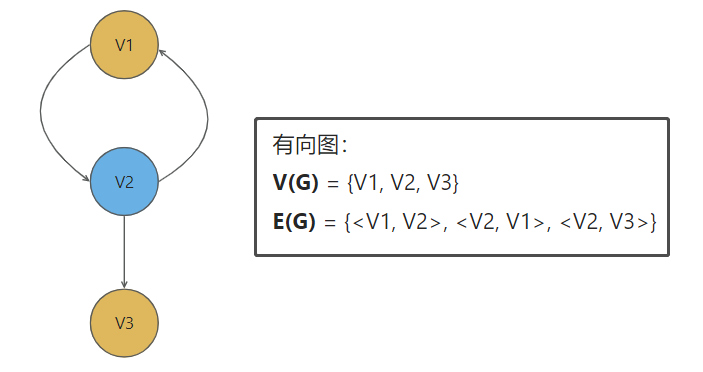
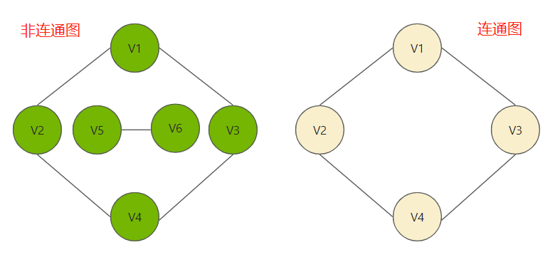
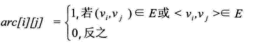
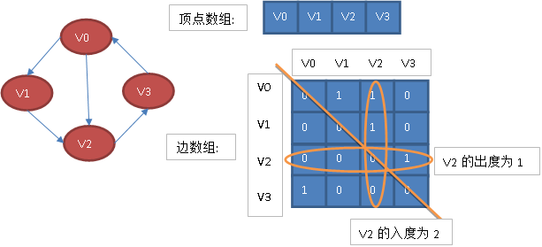
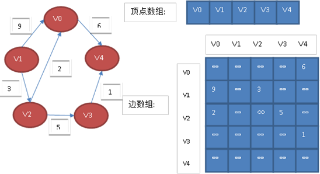
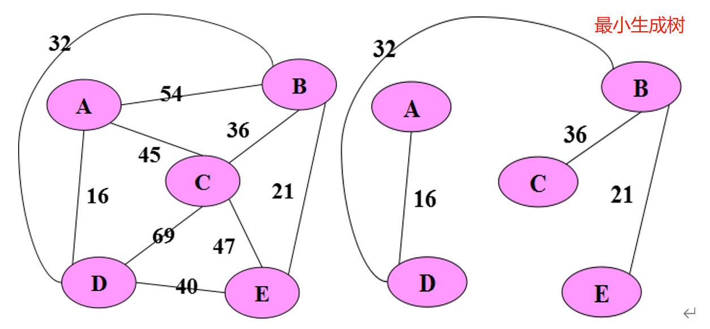

# 数据结构 - 图

## <font color=darkyellow>一、图的概念</font>

### <font color=green>1.1 图的定义</font>

- 什么是**图**：

  - 图是由**顶点的有穷非空集合**和**顶点之间的边的集合**组成，通常表示为：

    `G = (V, E)`，其中G表示一个图，V是图G中顶点的集合，E是图G中边的集合。

- 什么是**无向边**？

  - 若顶点`Vi`到顶点`Vj`的边没有方向，则称这条边为无向边，用无序偶对`(vi, vj)`来表示

- 什么是**有向边**？

  - 若顶点`Vi`到顶点`Vj`的边有方向，则称这条边为有向边，也称为**弧(Arc)**，用有序偶对`<vi, vj>`来表示。
  - `vi`称为弧尾（Tail -- 初始点），`vj`称为弧头（Head -- 终端点）
  - 注意：`<vi, vj>`和`<vj, vi>`是两条不同的有向边

- 什么是**无向图**？

  - 如果图中任意两个顶点之间的边都是无向边，则该图称为无向图

  

- 什么是**有向图**？

  - 如果任意顶点之间的边都是有向边，则称该图为有向图

  

- 什么是**无向完全图**？

  - 在无向图中，如果任意两个顶点之间都存在**边**，则称该图为无向完全图。
  - 含有`n`个顶点的无向完全图总共有`n(n-1)/2`条边
  - 由上述点可知：含有`n`个顶点的无向图，边数`e`的范围为`0 <= e <= n(n-1)/2`

  

- 什么是**有向完全图**？

  - 在有向图中，如果任意两个顶点之间都存在方向互相相反的两条**弧**，则称该图为有向完全图。
  - 含有`n`个顶点的有向完全图总共有`n(n-1)`条边
  - 由上述点可知：含有`n`个顶点的有向图，边数`e`的范围为`0 <= e <= n(n-1)`

  

- 什么是稀疏图？

  - 有很少条边（弧）的图

- 什么是稠密图？

  - 有很多条边（弧）的图

- 什么是权？

  - 有时图的边（弧）具有与它相关的数，这种`和图的边相关的数`叫做权

- 什么是网？

  - 带权的图称为网

- 什么是度？

  - 顶点的度是指和该顶点关联的边的数目

- 什么是入度？

  - 有向图中以顶点（v）为头的弧的数量，称为（v）的入度

- 什么是出度？

  - 有向图中以顶点（v）为尾的弧的数量，称为（v）的出度

- 什么是邻接点？

  - 对于无向图，同一边上的两个顶点称为邻接点

- 什么是子图？

  - 假设两个图`G = (V, E)`和`G1 = (V1, E1)`，如果`V1⊆V`且`E1⊆E`则`G1`为`G`的子图

- 什么是路径的长度？

  - 路径上的边（弧）的数量

### <font color=green>1.2 连通图的相关术语</font>

在无向图G=(V, E)中，如果从顶点v到顶点w有路径，则称v和w是相通的，

如果对于图中任意两个顶点Vi和Vj属于E，且两个顶点是连通的，则称G是连通图

如图所示：



#### 1.2.1 连通图生成树

连通图的生成树是一个**极小**的连通**子图**，他含有图的全部的**n个顶点**，但只有足以构成一棵树的**n-1条边**

极小连通子图是相对于连通图来说的，图示普通图和连通图生成树的差别：


## <font color=darkyellow>二、图的存储结构（看不懂）</font>

图分为多种存储结构

### <font color=green>2.1 邻接矩阵（顺序存储）</font>

#### 2.1.1 图的邻接矩阵

图的邻接矩阵的存储方式是**用两个数组来表示图**

- 一个一维数组：存储图中顶点的信息
- 一个二维数组（邻接矩阵），存储图中边（弧）的信息

设图G有n个顶点，则邻接矩阵是一个`n*n`的方阵，定义为：



按边的不同，图的邻接矩阵又分为**无向图**和**有向图**

##### 2.1.1.1 **无向图邻接矩阵**

下图是一个无向图和它的邻接矩阵：


从上面可以看出，**无向图的边数组是一个对称矩阵**。所谓对称矩阵就是n阶矩阵的元满足`arc[i][j] = a[j][i]`，如图中：`arc[v3][v0] = arc[v0][v3]`。即从矩阵的左上角到右下角的主对角线为轴，右上角的元和左下角相对应的元全都是相等的。

从这个矩阵中，可以获取以下信息。

1. 判断任意两顶点是否有边无边 --- 通过0、1区分

2. 某个顶点的度，其实就是这个顶点vi在邻接矩阵中第i行或第i列的元素之和

3. 求顶点`vi`的所有邻接点就是将矩阵中第`i`行元素扫描一遍，`arc[i][j] = 1`就是邻接点，

   如顶点V1和V2互为邻接点，在矩阵中`arc[V1][V2] = 1`;

##### 2.1.1.2 **有向图邻接矩阵**

有向图讲究入度和出度，如下图中：

- 顶点v2的入度为2，正好是第i列各数之和。
- 顶点v2的出度为1，即第i行的各数之和。



C++代码实现有向图邻接矩阵：

```c
#define _CRT_SECURE_NO_WARNINGS
#include<iostream>
using namespace std;

#define MaxVertex 50
typedef char VertexInfo[9];

// 定义图的结构
struct Graph
{
	// 顶点数组 - 存储顶点的名字
	VertexInfo vertex[MaxVertex];
	// 边的数组
	int edge[MaxVertex][MaxVertex];
	// 顶点的个数
	int vertexNum;
	// 边的条数
	int edgeNum;
};

// 求用户输入的顶点在顶点数组中的位置
int LocalVertex(Graph &g, VertexInfo v)
{
	// 遍历顶点数组
	for (int i = 0; i < g.vertexNum; ++i)
	{
		if (strcmp(v, g.vertex[i]) == 0)
		{
			// 找到了,返回元素的下标
			return i;
		}
	}
	// 没找到
	return -1;
}

// 构建一个图
void CreateGraph(Graph &g)
{
	cout << "请输入图的顶点数和边数: 顶点 边" << endl;
	cin >> g.vertexNum >> g.edgeNum;
	cout << "请输入" << g.vertexNum << "个顶点的值" << endl;
	for (int i = 0; i < g.vertexNum; ++i)
	{
		cin >> g.vertex[i];
	}

	// 初始化所有边都不存在
	for (int i = 0; i < g.vertexNum; ++i)
	{
		for (int j = 0; j < g.vertexNum; ++j)
		{
			g.edge[i][j] = INT_MAX;
		}
	}
	// <B, A>
	cout << "请输入" << g.edgeNum << "条边, 弧尾 弧头 权重" << endl;
	int w;
	VertexInfo v1, v2;
	for (int i = 0; i < g.edgeNum; ++i)
	{
		cin >> v1 >> v2 >> w;
		// 求用户输入的顶点在顶点数组中的位置
		int m = LocalVertex(g, v1);
		int n = LocalVertex(g, v2);

		// 边对应的二维数组赋值
		g.edge[m][n] = w;
	}
}
// 打印图 - 
void PrintGraph(Graph& g)
{
	// 水平表头
	cout << "\t";
	for (int i = 0; i < g.vertexNum; ++i)
	{
		cout << g.vertex[i] << "\t";
	}
	for (int i = 0; i < g.vertexNum; ++i)
	{
		cout << endl;
		// 垂直的
		cout << g.vertex[i] << "\t";
		for (int j = 0; j < g.vertexNum; ++j)
		{
			if (g.edge[i][j] == INT_MAX)
			{
				cout << "∞" << "\t";
			}
			else
			{
				cout << g.edge[i][j] << "\t";
			}
		}
	}
	cout << endl;
}

void test01()
{
	Graph g;
	CreateGraph(g);
	PrintGraph(g);

}

int main(){

	test01();

	system("pause");
	return EXIT_SUCCESS;
}
```

#### 2.1.2 网的邻接矩阵

什么被称为网？

- 边（弧）带权值的图称为网

若图G是**网图**，有n个顶点，则邻接矩阵是一个n*n的方阵，定义为：


这里的wij表示(vi,vj)上的权值。无穷大表示一个计算机允许的、大于所有边上权值的值，也就是一个不可能的极限值。下面左图就是一个有向网图，右图是它的邻接矩阵。




### <font color=green>2.2 邻接表（链式存储）</font>

邻接矩阵是一种不错的图存储结构，但是对于边数相对顶点较少的图，这种结构对存储空间有极大的浪费，一次找到一中**数组和链表相结合的存储方法**，称为**邻接表**，邻接表的存储方式如下：

- 一个一维数组：存储图中顶点的信息。（也可以用单链表存储，不过数组读取更方便）
- 每个顶点vi的所有邻接点构成一个线性表，由于邻接点的个数不定，所以，用单链表存储，无向图称为顶点vi的边表，有向图则称为顶点vi作为弧尾的出边表。

邻接表的数据结构定义：


#### 2.2.1 图的邻接表

下图是无向图的邻接表结构：


从图中可以看出，顶点表的各个结点由data和firstedge两个域表示：

- data是数据域，存储顶点的信息
- firstedge是指针域，指向边表的第一个结点，即此顶点的第一个邻接点

边表结点由adjvex和next两个域组成。

- adjvex是邻接点域，存储某顶点的邻接点在顶点表中的下标
- next则存储指向边表中下一个结点的指针。

#### 2.2.2 网的邻接表

对于带权值的网图，可以在边表结点定义中再增加一个weight的数据域，存储权值信息即可。如下图所示。


## <font color=darkyellow>三、图的遍历</font>

图的遍历和树的遍历类似，希望从图中某一顶点出发访遍图中其余顶点，且使每一个顶点仅被访问一次，这一过程

就叫图的遍历。对于图的遍历来说，如何避免因回路陷入死循环，就需要科学地设计遍历方案，通常有两种遍历次

序方案：**深度优先遍历**和**广度优先遍历**。

### <font color=green>3.1 深度优先遍历 </font>

**深度优先遍历，也有称为深度优先搜索，简称DFS**。其实，就像是一棵树的前序遍历。

它从图中某个结点v出发，访问此顶点，然后从v的未被访问的邻接点出发深度优先遍历图，直至图中所有和v有路

径相通的顶点都被访问到。若图中尚有顶点未被访问，则另选图中一个未曾被访问的顶点作起始点，重复上述过

程，直至图中的所有顶点都被访问到为止。下图显示了深度优先搜索顶点被访问的顺序：


使用栈实现，算法流程如下：

1. 如果可能，访问一个邻接的未访问顶点，标记它，并把它放入栈中。
2. 当不能执行规则1时，如果栈不空，就从栈中弹出一个顶点。
3. 如果不能执行规则1和规则2，就完成了整个搜索过程。

使用递归实现，算法流程如下：

1. 以任意顺序选择一个未被访问的节点作为起点。
2. 访问该节点，并将其标记为已访问。
3. 对于每个与该节点相邻的未被访问的节点，重复步骤2-3，直到所有相邻节点都被访问过。
4. 如果存在未被访问的节点，则跳转到其中一个未被访问的节点，重复步骤2-3；否则回溯到上一个节点，重复步骤2-3。

深度优先遍历代码 -- 递归版：

```c
#include <stdio.h>
#define MAXN 100 // 最大节点数

int n; // 节点数目
int graph[MAXN][MAXN]; // 邻接矩阵
int visited[MAXN]; // 标记节点是否已经被访问过

// 深度优先遍历函数
void dfs(int u) {
    printf("%d ", u); // 访问节点u
    visited[u] = 1; // 标记节点u为已访问

    for (int i = 0; i < n; i++) {
        if (graph[u][i] && !visited[i]) { // 如果节点u和节点i之间有边，并且节点i还未被访问过
            dfs(i); // 递归访问节点i
        }
    }
}

int main() {
    int m; // 边数目

    printf("输入节点数目和边数目: ");
    scanf("%d %d", &n, &m);

    printf("输入每条边连接的两个节点:\n");
    for (int i = 0; i < m; i++) {
        int u, v; // 表示一条边连接的两个节点
        scanf("%d %d", &u, &v);
        graph[u][v] = graph[v][u] = 1; // 对称地标记矩阵元素
    }

    printf("深度优先遍历结果:\n");
    dfs(0); // 从节点0开始进行深度优先遍历

    return 0;
}

```

### <font color=green>3.2 广度优先遍历 </font>

**广度优先遍历，又称为广度优先搜索，简称BFS。**图的广度优先遍历就类似于树的层序遍历了。

在深度优先搜索中，算法表现得好像要尽快地远离起始点似的。相反，在广度优先搜索中，算法好像要尽可能地靠近起始点。它首先访问起始顶点的所有邻接点，然后再访问较远的区域

下面图中的数字显示了广度优先搜索顶点被访问的顺序。


广度优先遍历通常使用队列实现，算法流程如下：

1. 将起点加入队列。
2. 如果队列不为空，取出队首节点并访问之。
3. 对于该节点的每一个未曾访问的邻居节点，将其加入队列。
4. 重复步骤2和3，直到队列为空。

广度优先遍历代码：

```c
#include <stdio.h>
#define MAXN 100 // 最大节点数

int n; // 节点数目
int graph[MAXN][MAXN]; // 邻接矩阵
int visited[MAXN]; // 标记节点是否已经被访问过
int queue[MAXN], front = 0, rear = 0; // 队列

// 广度优先遍历函数
void bfs(int u) {
    printf("%d ", u); // 访问节点u
    visited[u] = 1; // 标记节点u为已访问
    queue[rear++] = u; // 将节点u加入队列

    while (front < rear) { // 队列不为空时循环
        int v = queue[front++]; // 取出队首节点v
        for (int i = 0; i < n; i++) {
            if (graph[v][i] && !visited[i]) { // 如果节点v和节点i之间有边，并且节点i还未被访问过
                printf("%d ", i); // 访问节点i
                visited[i] = 1; // 标记节点i为已访问
                queue[rear++] = i; // 将节点i加入队列
            }
        }
    }
}

int main() {
    int m; // 边数目

    printf("输入节点数目和边数目: ");
    scanf("%d %d", &n, &m);

    printf("输入每条边连接的两个节点:\n");
    for (int i = 0; i < m; i++) {
        int u, v; // 表示一条边连接的两个节点
        scanf("%d %d", &u, &v);
        graph[u][v] = graph[v][u] = 1; // 对称地标记矩阵元素
    }

    printf("广度优先遍历结果:\n");
    bfs(0);s
```

### <font color=green>3.3 最小生成树 </font>

什么是生成树？

- 一个连通图的生成树是它的极小连通子图，在**n**个顶点的情形下，有**n-1**条边。生成树是对连通图而言的，是连通图的极小连通子图，包含图中的所有顶点，有且仅有**n-1**条边。

什么是最小生成树？

- 在图论中，常常将树定义为一个无回路连通图。对于一个带权的无向连通图，其每个生成树所有边上的权值之和可能不同，我们把**所有边上权值之和最小的生成树称为图的最小生成树**。

#### 3.3.1 造价最优问题

造价最优问题就是一个最小生成树问题，例如铺设煤气管道问题（图形结构）

假设要在某个城市的n个居民区之间铺设煤气管道，则在这**n**个居民区之间只要铺设**n-1**条管道即可。

假设**任意两个居民区之间**都可以架设管道，在众多可选边中，如何选择**n-1**条边，使总代价最小？

这就是求该网络最小生成树问题。如下图中，右边的图就是左图的最小生成树



#### 3.3.2 普里姆算法

Prim算法基本思想：

设`G=(V, E)`是具有n个顶点的连通网，`T=(U, TE)`是`G`的最小生成树，T的初始状态为`U={u0}（u0∈V）`，`TE={}`，如图所示：


重复执行下述操作：

- 从连通网络` G = { V, E }`中的某一顶点 `u0` 出发，选择与它关联的具有最小权值的边`(u0, v)`，将其顶点加入到生成树的顶点集合U中。

  以上图为例：从顶点`A`出发，选择与它关联的最小权值的边`(A, D)`, 将其顶点`D`加到生成树的顶点集合U中，顶点集合由`U = {A}`变为`U = {A, D}`

- 以后每一步从：一个顶点在U中、而另一个顶点不在U中的各条边中选择权值最小的边`(u, v)`，把它的顶点加入到集合U中。如此继续下去，直到网络中的所有顶点都加入到生成树顶点集合U中为止。

  以上图为例：以后每一步，选择一个在U中的顶点，再选择一个不在U中的顶点，如`U = (A, D)`之后可选`(D, C)、(D, B)、(D, E)`三条边，选择里面权值最小的边即`(D, B)`，然后把顶点B加到集合U中，此时

  `U = (A, D, B)`，如此往复，最后选择出最小生成树的顶点集合`U = (A, D, B, E, C)`，而选择的边则保存到TE中，作为最小生成树边的集合。

此时，TE中必有n-1条边，T=(V，TE)为G的最小生成树。

Prim算法的核心： 始终保持TE中的边集构成一棵生成树。

思路可见下图：


Prim算法实现最小生成树：

```c
#include <stdio.h>
#define MAXN 100 // 最大节点数
#define INF 1000000 // 代表正无穷的值

int n; // 节点数目
int graph[MAXN][MAXN]; // 邻接矩阵
int visited[MAXN]; // 标记节点是否已经被访问过

// 普利姆算法函数
void prim(int s) {
    int dist[MAXN], parent[MAXN];
    for (int i = 0; i < n; i++) {
        dist[i] = INF; // 初始化距离数组为正无穷
        parent[i] = -1; // 初始化父节点为-1
    }
    dist[s] = 0; // 初始节点的距离为0

    for (int i = 0; i < n; i++) {
        int u = -1;
        for (int j = 0; j < n; j++) { // 找到未访问节点中距离最小的节点
            if (!visited[j] && (u == -1 || dist[j] < dist[u])) {
                u = j;
            }
        }

        visited[u] = 1; // 标记节点u为已访问
        if (parent[u] != -1) { // 如果节点u不是起点，则将(u, parent[u])加入生成树
            printf("(%d, %d)\n", u, parent[u]);
        }

        for (int v = 0; v < n; v++) { // 更新与节点u相邻的节点的距离
            if (graph[u][v] && !visited[v] && graph[u][v] < dist[v]) {
                dist[v] = graph[u][v];
                parent[v] = u;
            }
        }
    }
}

int main() {
    int m; // 边数目

    printf("输入节点数目和边数目: ");
    scanf("%d %d", &n, &m);

    printf("输入每条边连接的两个节点及边权:\n");
    for (int i = 0; i < m; i++) {
        int u, v, w; // 表示一条边连接的两个节点及边权
        scanf("%d %d %d", &u, &v, &w);
        graph[u][v] = graph[v][u] = w; // 对称地标记矩阵元素
    }

    printf("最小生成树的边为:\n");
    prim(0); // 从节点0开始进行普利姆算法

    return 0;
}

```

#### 3.3.3 克鲁斯卡尔算法

基本思想：

- 设无向连通网为G＝(V, E)，令G的最小生成树为T＝(U, TE)，其初态为U＝V，TE＝{ }
- 然后，按照边的权值由小到大的顺序，考察G的边集E中的各条边。若被考察的边的两个顶点属于T的两个不同的连通分量，则将此边作为最小生成树的边加入到T中，同时把两个连通分量连接为一个连通分量；若被考察边的两个顶点属于同一个连通分量，则舍去此边，以免造成回路。
- 如此下去，当T中的连通分量个数为1时，此连通分量便为G的一棵最小生成树。

思路可见下图：


鲁斯卡尔算法实现最小生成树：

```c
#include <stdio.h>
#include <stdlib.h>
#define MAXN 100 // 最大节点数
#define MAXM 1000 // 最大边数
#define INF 1000000 // 代表正无穷的值

int n, m; // 节点数目和边数目
struct Edge {
    int u, v, w; // 边的两个端点及边权
} edges[MAXM]; // 存储边的信息
int parent[MAXN]; // 记录每个节点的父节点

// 比较函数，用于对边按边权排序
int cmp(const void* a, const void* b) {
    return ((Edge*)a)->w - ((Edge*)b)->w;
}

// 查找祖先节点
int find(int x) {
    if (x != parent[x]) {
        parent[x] = find(parent[x]);
    }
    return parent[x];
}

// 克鲁斯卡尔算法函数
void kruskal() {
    qsort(edges, m, sizeof(Edge), cmp); // 将边按边权排序
    for (int i = 0; i < n; i++) {
        parent[i] = i; // 初始化每个节点的父节点为自身
    }

    for (int i = 0; i < m; i++) {
        int p1 = find(edges[i].u), p2 = find(edges[i].v);
        if (p1 != p2) { // 如果边的两个端点不在同一个连通块中，则将该边加入生成树
            printf("(%d, %d)\n", edges[i].u, edges[i].v);
            parent[p1] = p2; // 将两个连通块合并
        }
    }
}

int main() {
    printf("输入节点数目和边数目: ");
    scanf("%d %d", &n, &m);

    printf("输入每条边连接的两个节点及边权:\n");
    for (int i = 0; i < m; i++) {
        scanf("%d %d %d", &edges[i].u, &edges[i].v, &edges[i].w);
    }

    printf("最小生成树的边为:\n");
    kruskal();

    return 0;
}

```

#### 3.3.4 两种算法总结

Prim算法适合稠密图，其时间复杂度为O(n2)，其时间复杂度与边的数目无关

kruskal算法适合稀疏图，其时间复杂度为O(nlogn)跟边的数目有关

### <font color=green>3.4 最短路径</font>

什么是**最短路径**？

- 从图中某一顶点（源点）到达另一顶点（终点）找到一条路径，沿此路径上各边的权值总和（称为路径长度）达到最小。

什么是**单源最短路径**？

- 已知有向带权图(简称有向网)G=(V，E)，找出从某个源点s∈V到V中其余各顶点的最短路径。
- 习惯上称路径开始顶点为源点，路径的最后一个顶点为终点。

最短路径的最优子结构性质：

该性质描述为：如果P(i,j)={Vi....Vk..Vs...Vj}是从顶点i到j的最短路径，k和s是这条路径上的一个中间顶点，那么P(k,s)必定是从k到s的最短路径。下面证明该性质的正确性。

假设P(i,j)={Vi....Vk..Vs...Vj}是从顶点i到j的最短路径，则有P(i,j)=P(i,k)+P(k,s)+P(s,j)。而P(k,s)不是从k到s的最短距离，那么必定存在另一条从k到s的最短路径P'(k,s)，那么P'(i,j)=P(i,k)+P'(k,s)+P(s,j)<P(i,j)。则与P(i,j)是从i到j的最短路径相矛盾。因此该性质得证。(如图)


#### 3.4.1 迪杰斯特拉算法

Dijkstra算法，由上述性质可知，如果存在一条从i到j的最短路径(Vi.....Vk,Vj)，Vk是Vj前面的一顶点。那么(Vi...Vk)也必定是从i到k的最短路径。为了求出最短路径，Dijkstra就提出了**以最短路径长度递增，逐次生成最短路径的算法**。譬如对于源顶点V0，首先选择其直接相邻的顶点中长度最短的顶点Vi，那么当前已知可得从V0到达Vj顶点的最短距离dist[j]=min{dist[j],dist[i]+matrix[i][j]}。根据这种思路，假设存在G=<V,E>，源顶点为V0，U={V0},dist[i]记录V0到i的最短距离，path[i]记录从V0到i路径上的i前面的一个顶点。

- 从V-U中选择使dist[i]值最小的顶点i，将i加入到U中；
- 更新与i直接相邻顶点的dist值。(dist[j]=min{dist[j],dist[i]+matrix[i][j]})
- 直到U=V，停止。

案例

交通网络可以画成带权的图，图中顶点表示城市，边代表城市间的公路，边上的权表示公路的长度。对于这样的交通网络常常提出这样的问题：两地之间是否有公路可通？在有几条路可通的情况下，哪一条路最短？以上提出的问题就是在带权图中求最短路径问题，此时路径的长度不是路径上边的数目，而是路径上的边所带权值的总和。

在下面图中找出 A 城到 D 城最近的一条公路。

本次用于分析的拓扑图如下：(A为起点，D为终点，边上的数字为权值)


>Dijkstra算法是一种常见的最短路径算法，可以在加权图（边带有权值）中找到从起点到其他各个顶点的最短路径。下面是Dijkstra算法的实现步骤：
>
>1. 创建一个数组dist[]，用于存储从起点到各个顶点的距离。初始化时，将起点的距离设为0，其他顶点的距离设为无穷大。
>
>2. 创建一个集合visited[]，用于存储已经访问过的顶点。初始时，将起点加入visited[]。
>
>3. 从起点开始，遍历邻接点，并更新其距离。具体过程如下：
>
>   a. 遍历与当前顶点相邻的所有顶点，如果该顶点不在visited[]中，则将其加入visited[]中，并计算从起点到该顶点的距离dist[]。
>
>   b. 如果新计算得到的距离dist[v]比原先的dist[v]更小，则更新dist[v]的值。
>
>4. 重复第3步，直至visited[]包含所有顶点。
>
>5. 到这里，我们已经得到了从起点到其他各个顶点的最短路径。我们可以通过检查dist[]数组的值来确定最短路径。
>
>需要注意的是，Dijkstra算法只适用于非负权重的加权图。如果图中存在负权重的边，则需要使用其他算法，例如Bellman-Ford算法。
>
>此外，对于大型图的情况，Dijkstra算法的时间复杂度可能较高，因此需要进行优化，例如使用堆数据结构来管理未访问的顶点，以便快速找到距离最近的顶点。

以下是Dijkstra算法的C代码实现，假设顶点编号从0开始，图用邻接矩阵表示，数组dist[]存储起点到各个顶点的距离，数组visited[]用于标记已经访问过的顶点。

```c
// 代码将输出从第一个顶点（0号）到其他各个顶点的最短距离
#include <stdio.h>
#include <limits.h>

#define V 6

int minDistance(int dist[], int visited[]) {
    int min = INT_MAX, min_index;

    for (int v = 0; v < V; v++) {
        if (visited[v] == 0 && dist[v] <= min) {
            min = dist[v];
            min_index = v;
        }
    }

    return min_index;
}

void dijkstra(int graph[V][V], int src, int dist[]) {
    int visited[V] = { 0 };

    for (int i = 0; i < V; i++) {
        dist[i] = INT_MAX;
    }

    dist[src] = 0;

    for (int count = 0; count < V - 1; count++) {
        int u = minDistance(dist, visited);

        visited[u] = 1;

        for (int v = 0; v < V; v++) {
            if (!visited[v] && graph[u][v] && dist[u] != INT_MAX && dist[u] + graph[u][v] < dist[v]) {
                dist[v] = dist[u] + graph[u][v];
            }
        }
    }
}

int main() {
    int graph[V][V] = {{0, 5, 10, 0, 0, 0},
                       {5, 0, 3, 9, 2, 0},
                       {10, 3, 0, 1, 6, 0},
                       {0, 9, 1, 0, 4, 8},
                       {0, 2, 6, 4, 0, 7},
                       {0, 0, 0, 8, 7, 0}};
    int dist[V];

    dijkstra(graph, 0, dist);

    printf("Vertex   Distance from Source\n");
    for (int i = 0; i < V; i++) {
        printf("%d \t\t %d\n", i, dist[i]);
    }

    return 0;
}

```

#### 3.4.2 Prim算法和Dijkstra算法的异同

主要有以下几点：

- Prim是计算最小生成树的算法，比如为N个村庄修路，怎么修花销最少。
- Dijkstra是计算最短路径的算法，比如从a村庄走到其他任意村庄的距离。

- Prim算法中有一个统计总len的变量，每次都要把到下一点的距离加到len中；
- Dijkstra算法中却没有，只需要把到下一点的距离加到cls数组中即可；

- Prim算法的更新操作更新的low是已访问集合到未访问集合中各点的距离；      
- Dijkstra算法的更新操作更新的dist是源点到未访问集合中各点的距离，已经访问过的相当于已经找到源点到它的最短距离了；

 