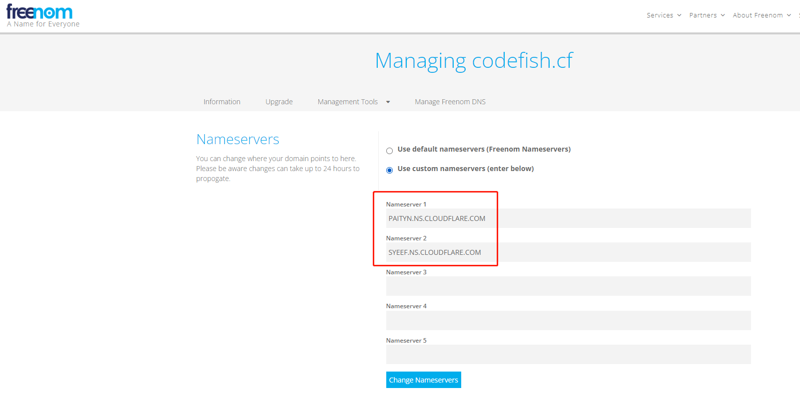

## 1 获取原地址IP

通过ping获取

```shell
[root@3yserver ~]# ping gsproj.github.io
PING gsproj.github.io (185.199.110.153) 56(84) bytes of data.
64 bytes from cdn-185-199-110-153.github.com (185.199.110.153): icmp_seq=1 ttl=54 time=36.1 ms
64 bytes from cdn-185-199-110-153.github.com (185.199.110.153): icmp_seq=2 ttl=54 time=36.0 ms
64 bytes from cdn-185-199-110-153.github.com (185.199.110.153): icmp_seq=3 ttl=54 time=35.9 ms
64 bytes from cdn-185-199-110-153.github.com (185.199.110.153): icmp_seq=4 ttl=54 time=35.9 ms
64 bytes from cdn-185-199-110-153.github.com (185.199.110.153): icmp_seq=5 ttl=54 time=38.3 ms
64 bytes from cdn-185-199-110-153.github.com (185.199.110.153): icmp_seq=6 ttl=54 time=36.1 ms
```

## 2 在CDN将IP地址和域名绑定


## 3 域名申请网站填写DNS解析地址



## 3 确保新域名能ping通，解析正常

```shell
[root@3yserver ~]# ping codefish.cf
PING codefish.cf (104.21.96.42) 56(84) bytes of data.
64 bytes from 104.21.96.42 (104.21.96.42): icmp_seq=1 ttl=59 time=2.63 ms
64 bytes from 104.21.96.42 (104.21.96.42): icmp_seq=2 ttl=59 time=2.64 ms
64 bytes from 104.21.96.42 (104.21.96.42): icmp_seq=3 ttl=59 time=2.73 ms
64 bytes from 104.21.96.42 (104.21.96.42): icmp_seq=4 ttl=59 time=2.71 ms
64 bytes from 104.21.96.42 (104.21.96.42): icmp_seq=5 ttl=59 time=2.62 ms
```

> PS: 此处IP不是185开头的IP，是因为cloudflare做了代理，不影响使用，可以通就可以

## 4 在Github添加域名

