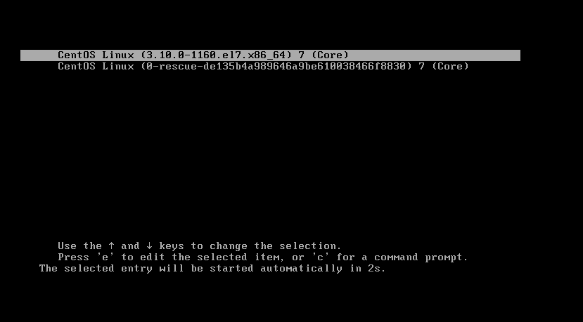
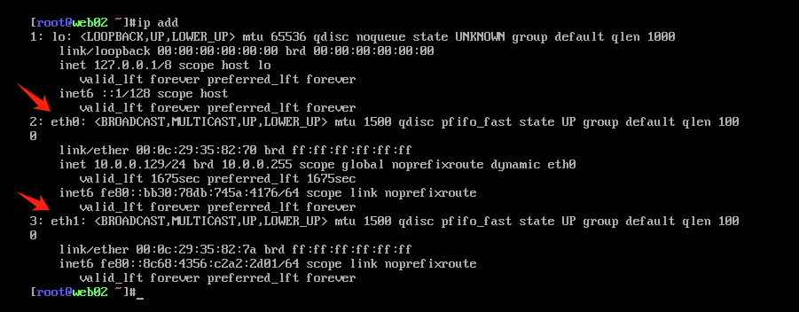

掌握如何将Centos的网卡名修改为eth命令格式

# 一、临时生效

为防止重启后网卡名乱变，统一改成eth0，eth1这种格式

**1、重启系统，在grab界面按E，编辑**



**2、修改启动项，添加**

```shell
net.ifnames=0 biosdevname=0
```


Ctrl + X保存退出，重启后网卡名已改名，由ens33改为eth0




**3、修改网卡配置文件，把网卡名修正**

```shell
cd /etc/sysconfig/network-scripts/
# 配置文件改名
mv ifcfg-ens33 ifcfg-eth0
# 内部的网络接口名称修改
vim ifcfg-eth0
```


所有网卡都要修改，改完后重启网络服务即可

```shell
systemctl restart network
```


# 二、永久生效

如需永久生效，在Centos中需要修改grub文件

```shell
vim /etc/default/grub 
...
GRUB_CMDLINE_LINUX="rd.lvm.lv=centos/root rd.lvm.lv=centos/swap rhgb quiet net.ifnames=0 biosdevname=0"
...
```

最后用`grub2-mkconfig`命令重新生成grub配置并更新内核

```shell
grub2-mkconfig -o /boot/grub2/grub.cfg 
```

配置完后重启

```shell
reboot
```


