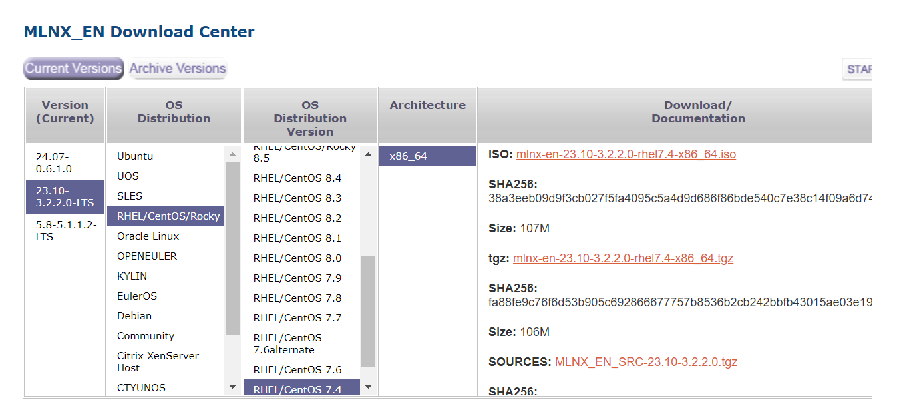

# Mellanox网卡安装驱动

文档作用：

​	在旧版本操作系统中（如Cenos7.4），部分网卡不能识别出来，需要手动安装驱动。


# 一、查看网卡

BMC界面查看安装了7张网卡，共13个网口


在系统中使用lspci也可以看到13个网口

```shell
[root@localhost ~]# lspci | grep Mellanox
04:00.0 Ethernet controller: Mellanox Technologies MT27800 Family [ConnectX-5]
04:00.1 Ethernet controller: Mellanox Technologies MT27800 Family [ConnectX-5]
08:00.0 Ethernet controller: Mellanox Technologies MT27710 Family [ConnectX-4 Lx]
08:00.1 Ethernet controller: Mellanox Technologies MT27710 Family [ConnectX-4 Lx]
2d:00.0 Ethernet controller: Mellanox Technologies MT27800 Family [ConnectX-5]
5b:00.0 Ethernet controller: Mellanox Technologies MT28841
5b:00.1 Ethernet controller: Mellanox Technologies MT28841
5c:00.0 Ethernet controller: Mellanox Technologies MT28841
5c:00.1 Ethernet controller: Mellanox Technologies MT28841
96:00.0 Ethernet controller: Mellanox Technologies MT28841
96:00.1 Ethernet controller: Mellanox Technologies MT28841
97:00.0 Ethernet controller: Mellanox Technologies MT28841
97:00.1 Ethernet controller: Mellanox Technologies MT28841
```

但是使用命令查看网口，只可以看到5个ens网口，有8个没有，需要手动安装驱动

```shell
[root@localhost ~]# ip add
1: lo: <LOOPBACK,UP,LOWER_UP> mtu 65536 qdisc noqueue state UNKNOWN qlen 1
2: ens19f0: <BROADCAST,MULTICAST,UP,LOWER_UP> mtu 1500 qdisc mq state UP qlen 1000
3: ens19f1: <BROADCAST,MULTICAST,UP,LOWER_UP> mtu 1500 qdisc mq state UP qlen 1000
4: ens21f0: <NO-CARRIER,BROADCAST,MULTICAST,UP> mtu 1500 qdisc mq state DOWN qlen 1000
5: ens21f1: <NO-CARRIER,BROADCAST,MULTICAST,UP> mtu 1500 qdisc mq state DOWN qlen 1000
6: ens12: <BROADCAST,MULTICAST,UP,LOWER_UP> mtu 1500 qdisc mq state UP qlen 1000
7: virbr0: <NO-CARRIER,BROADCAST,MULTICAST,UP> mtu 1500 qdisc noqueue state DOWN qlen 1000
8: virbr0-nic: <BROADCAST,MULTICAST> mtu 1500 qdisc pfifo_fast master virbr0 state DOWN qlen 
```


# 二、安装驱动

## 2.1 下载驱动

驱动下载地址：

>https://developer.nvidia.com/networking/ethernet-software

EN版本只包含网卡驱动，OFED版本既有驱动还有部分配套软件，建议下载OFED版本。


然后选择对应的系统和架构，下载安装包



查看操作系统版本

```shell
[root@localhost ~]# cat /etc/redhat-release 
CentOS Linux release 7.4.1708 (Core) 
```

## 2.2 安装驱动-EN

1、解压安装包

```shell
[root@localhost Downloads]# ls
mlnx-en-23.10-3.2.2.0-rhel7.4-x86_64.tgz
[root@localhost Downloads]# tar -vxf mlnx-en-23.10-3.2.2.0-rhel7.4-x86_64.tgz 
```

2、进入目录，执行安装程序

```shell
[root@localhost Downloads]# cd mlnx-en-23.10-3.2.2.0-rhel7.4-x86_64/
[root@localhost mlnx-en-23.10-3.2.2.0-rhel7.4-x86_64]# ls
common_installers.pl  common.pl  create_mlnx_ofed_installers.pl  distro  install  is_kmp_compat.sh  LICENSE  mlnx_add_kernel_support.sh  RPM-GPG-KEY-Mellanox  RPMS  RPMS_ETH  src  uninstall.sh
[root@localhost mlnx-en-23.10-3.2.2.0-rhel7.4-x86_64]# ./install 
Logs dir: /tmp/mlnx-en.55110.logs
General log file: /tmp/mlnx-en.55110.logs/general.log
Verifying KMP rpms compatibility with target kernel...
This program will install the mlnx-en package on your machine.
Note that all other Mellanox, OEM, OFED, RDMA or Distribution IB packages will be removed.
Those packages are removed due to conflicts with mlnx-en, do not reinstall them.

# 这里输入y即可
Do you want to continue?[y/N]:y
```

3、等安装完，需要执行提示命令，重新加载新驱动

```shell
/etc/init.d/mlnx-en.d restart
```

注意，重新加载驱动后，网卡名会变化，对应的网卡配置文件也要修改才行

```shell
# 如，ens19f0变为ens19f0np0
9: ens19f0np0: <BROADCAST,MULTICAST,UP,LOWER_UP> mtu 1500 qdisc mq state UP qlen 1000
```

4、重新查看网卡数量，可以看到变为13个，恢复正常。

```shell
9: ens19f0np0: <BROADCAST,MULTICAST,UP,LOWER_UP> mtu 1500 qdisc mq state UP qlen 1000
10: ens19f1np1: <BROADCAST,MULTICAST,UP,LOWER_UP> mtu 1500 qdisc mq state UP qlen 1000
11: ens21f0np0: <NO-CARRIER,BROADCAST,MULTICAST,UP> mtu 1500 qdisc mq state DOWN qlen 1000
12: ens21f1np1: <NO-CARRIER,BROADCAST,MULTICAST,UP> mtu 1500 qdisc mq state DOWN qlen 1000
13: ens12np0: <BROADCAST,MULTICAST,UP,LOWER_UP> mtu 1500 qdisc mq state UP qlen 1000
14: ens13f0np0: <NO-CARRIER,BROADCAST,MULTICAST,UP> mtu 1500 qdisc mq state DOWN qlen 1000
15: ens13f1np1: <NO-CARRIER,BROADCAST,MULTICAST,UP> mtu 1500 qdisc mq state DOWN qlen 1000
16: ens14f0np0: <NO-CARRIER,BROADCAST,MULTICAST,UP> mtu 1500 qdisc mq state DOWN qlen 1000
17: ens14f1np1: <NO-CARRIER,BROADCAST,MULTICAST,UP> mtu 1500 qdisc mq state DOWN qlen 1000
18: ens15f0np0: <NO-CARRIER,BROADCAST,MULTICAST,UP> mtu 1500 qdisc mq state DOWN qlen 1000
19: ens15f1np1: <NO-CARRIER,BROADCAST,MULTICAST,UP> mtu 1500 qdisc mq state DOWN qlen 1000
20: ens16f0np0: <NO-CARRIER,BROADCAST,MULTICAST,UP> mtu 1500 qdisc mq state DOWN qlen 1000
21: ens16f1np1: <NO-CARRIER,BROADCAST,MULTICAST,UP> mtu 1500 qdisc mq state DOWN qlen 1000
```


## 2.2 安装驱动-OFED

解压后执行安装程序

```shell
[root@localhost ~]# tar -vxf MLNX_OFED_LINUX-23.10-3.2.2.0-rhel7.4-x86_64
[root@localhost ~]# cd MLNX_OFED_LINUX-23.10-3.2.2.0-rhel7.4-x86_64/ 
[root@localhost MLNX_OFED_LINUX-23.10-3.2.2.0-rhel7.4-x86_64]# ./mlnxofedinstall
```

如果缺少依赖，按提示安装

```shell
General log file: /tmp/MLNX_OFED_LINUX.74618.logs/general.log
Error: One or more required packages for installing MLNX_OFED_LINUX are missing.
Please install the missing packages using your Linux distribution Package Management tool.
Run:
yum install tcl tk
```

然后继续安装，输入y即可

```shell
[root@localhost MLNX_OFED_LINUX-23.10-3.2.2.0-rhel7.4-x86_64]# ./mlnxofedinstall 
Logs dir: /tmp/MLNX_OFED_LINUX.75823.logs
General log file: /tmp/MLNX_OFED_LINUX.75823.logs/general.log
Verifying KMP rpms compatibility with target kernel...
This program will install the MLNX_OFED_LINUX package on your machine.
Note that all other Mellanox, OEM, OFED, RDMA or Distribution IB packages will be removed.
Those packages are removed due to conflicts with MLNX_OFED_LINUX, do not reinstall them.

Do you want to continue?[y/N]:y
```

安装完也一样重新加载驱动

```shell
Log File: /tmp/Fpnr9q8X6m
Real log file: /tmp/MLNX_OFED_LINUX.75823.logs/fw_update.log
Failed to update Firmware.
See /tmp/MLNX_OFED_LINUX.75823.logs/fw_update.log
To load the new driver, run:
/etc/init.d/openibd restart
```


