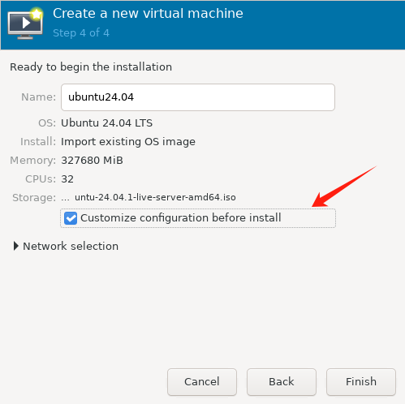
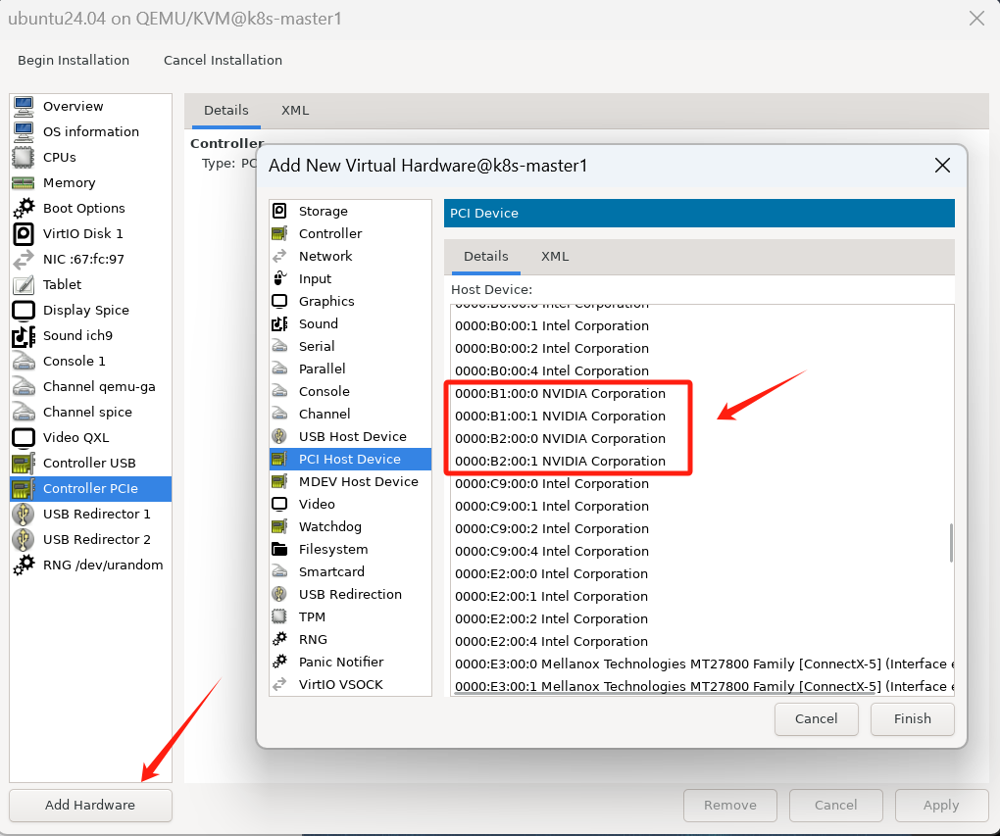

# 一、实现的效果

​	服务器共8张卡，6张留给物理机用，2张直通给虚拟机用

# 二、部署步骤

1、服务器在BIOS开启虚拟化，并确认OS支持vfio模块

>Ubuntu22.04 5.15.0-131-generic内核的vfio模块内建在内核中，lsmod是找不到的

```shell
(base) root@k8s-master1:~# cat /lib/modules/$(uname -r)/modules.builtin | grep vfio
kernel/drivers/vfio/vfio.ko
kernel/drivers/vfio/vfio_virqfd.ko
kernel/drivers/vfio/vfio_iommu_type1.ko
kernel/drivers/vfio/pci/vfio-pci-core.ko
kernel/drivers/vfio/pci/vfio-pci.ko

# lsmod 找不到，害我苦苦排查了好久
(base) root@k8s-master1:~# lsmod | grep vfio
(base) root@k8s-master1:~# 
```

2、服务器修改grub文件，开启iommu

```shell
# 编辑/etc/default/grub文件
...
GRUB_CMDLINE_LINUX_DEFAULT="quiet splash intel_iommu=on"	# 修改这一条
...
```

使grub生效

```shell
(base) root@k8s-master1:~# update-grub
Sourcing file `/etc/default/grub'
Sourcing file `/etc/default/grub.d/init-select.cfg'
Generating grub configuration file ...
Found linux image: /boot/vmlinuz-5.15.0-131-generic
Found initrd image: /boot/initrd.img-5.15.0-131-generic
Found linux image: /boot/vmlinuz-5.15.0-130-generic
Found initrd image: /boot/initrd.img-5.15.0-130-generic
Warning: os-prober will not be executed to detect other bootable partitions.
Systems on them will not be added to the GRUB boot configuration.
Check GRUB_DISABLE_OS_PROBER documentation entry.
done
```

然后重启服务器，重启之后可以用命令检查ioomu是否开启

```shell
(base) root@k8s-master1:~# dmesg | grep -i "iommu en" -A 3
[    2.640510] DMAR: IOMMU enabled
```

3、配置模块加载顺序，让nvidia驱动在vfio之后加载

```shell
(base) root@k8s-master1:~# cat /etc/modprobe.d/nvidia.conf 
softdep snd_hda_intel pre: vfio-pci
softdep nouveau pre: vfio-pci
softdep nvidia pre: vfio-pci
softdep nvidia* pre: vfio-pci
```

4、确定需要直通的两张显卡ID

```shell
(base) root@k8s-master1:/nvme/system_images# lspci -nnk | grep -i nvidia -A 3
...
... # 最后两张显卡的ID
b1:00.0 VGA compatible controller [0300]: NVIDIA Corporation Device [10de:2684] (rev a1)
	Subsystem: NVIDIA Corporation Device [10de:16f3]
	Kernel driver in use: nvidia
	Kernel modules: nvidiafb, nouveau, nvidia_drm, nvidia
b1:00.1 Audio device [0403]: NVIDIA Corporation Device [10de:22ba] (rev a1)
	Subsystem: NVIDIA Corporation Device [10de:16f3]
	Kernel driver in use: snd_hda_intel
	Kernel modules: snd_hda_intel
b2:00.0 VGA compatible controller [0300]: NVIDIA Corporation Device [10de:2684] (rev a1)
	Subsystem: NVIDIA Corporation Device [10de:16f3]
	Kernel driver in use: nvidia
	Kernel modules: nvidiafb, nouveau, nvidia_drm, nvidia
b2:00.1 Audio device [0403]: NVIDIA Corporation Device [10de:22ba] (rev a1)
	Subsystem: NVIDIA Corporation Device [10de:16f3]
	Kernel driver in use: snd_hda_intel
	Kernel modules: snd_hda_intel
```

其中的`b1:00.0`和`b1:00.1`这种就是其中一张显卡和它对应声卡的ID

5、配置直通

编辑配置文件

```shell
vim /etc/initramfs-tools/scripts/init-top/vfio.sh
```

内容如下：

```shell
#!/bin/sh
echo "vfio-pci" > /sys/bus/pci/devices/0000:b1:00.0/driver_override
echo "vfio-pci" > /sys/bus/pci/devices/0000:b1:00.1/driver_override
echo "vfio-pci" > /sys/bus/pci/devices/0000:b2:00.0/driver_override
echo "vfio-pci" > /sys/bus/pci/devices/0000:b2:00.1/driver_override
exit 0
```

使文件生效

```shell
# 先执行脚本
bash /etc/initramfs-tools/scripts/init-top/vfio.sh

# 再执行命令
update-initramfs -u
```

查看内容确认修改成功

```shell
(base) root@k8s-master1:~# cat /sys/bus/pci/devices/0000:b2:00.1/driver_override
vfio-pci
```

重启生效，可见到配置过的两张卡在nvidia-smi中已经看不到了

```shell
(base) root@k8s-master1:~# nvidia-smi 
Tue Feb 25 17:32:37 2025       
+-----------------------------------------------------------------------------------------+
| NVIDIA-SMI 550.54.14              Driver Version: 550.54.14      CUDA Version: 12.4     |
|-----------------------------------------+------------------------+----------------------+
| GPU  Name                 Persistence-M | Bus-Id          Disp.A | Volatile Uncorr. ECC |
| Fan  Temp   Perf          Pwr:Usage/Cap |           Memory-Usage | GPU-Util  Compute M. |
|                                         |                        |               MIG M. |
|=========================================+========================+======================|
|   0  NVIDIA GeForce RTX 4090        Off |   00000000:17:00.0 Off |                  Off |
|  0%   24C    P8             11W /  450W |   20876MiB /  24564MiB |      0%      Default |
|                                         |                        |                  N/A |
+-----------------------------------------+------------------------+----------------------+
|   1  NVIDIA GeForce RTX 4090        Off |   00000000:18:00.0 Off |                  Off |
|  0%   22C    P8              9W /  450W |       4MiB /  24564MiB |      0%      Default |
|                                         |                        |                  N/A |
+-----------------------------------------+------------------------+----------------------+
|   2  NVIDIA GeForce RTX 4090        Off |   00000000:31:00.0 Off |                  Off |
|  0%   23C    P8             11W /  450W |    2991MiB /  24564MiB |      0%      Default |
|                                         |                        |                  N/A |
+-----------------------------------------+------------------------+----------------------+
|   3  NVIDIA GeForce RTX 4090        Off |   00000000:32:00.0 Off |                  Off |
|  0%   34C    P2             56W /  450W |    1155MiB /  24564MiB |      0%      Default |
|                                         |                        |                  N/A |
+-----------------------------------------+------------------------+----------------------+
|   4  NVIDIA GeForce RTX 4090        Off |   00000000:98:00.0 Off |                  Off |
|  0%   23C    P8              9W /  450W |       4MiB /  24564MiB |      0%      Default |
|                                         |                        |                  N/A |
+-----------------------------------------+------------------------+----------------------+
|   5  NVIDIA GeForce RTX 4090        Off |   00000000:99:00.0 Off |                  Off |
|  0%   24C    P8             11W /  450W |       4MiB /  24564MiB |      0%      Default |
|                                         |                        |                  N/A |
+-----------------------------------------+------------------------+----------------------+
....
```

5、重新绑定驱动

>原来被nvidia驱动的两张显卡，绑定到vfio-pci后，并不会被直接接管，成为无驱动状态，需要手动重新绑定驱动。

绑定：

```shell
driverctl set-override 0000:b1:00.0 vfio-pci
driverctl set-override 0000:b1:00.1 vfio-pci
driverctl set-override 0000:b2:00.0 vfio-pci
driverctl set-override 0000:b2:00.1 vfio-pci
```

解绑

```shell
driverctl unset-override 0000:b1:00.0 vfio-pci
driverctl unset-override 0000:b1:00.1 vfio-pci
driverctl unset-override 0000:b2:00.0 vfio-pci
driverctl unset-override 0000:b2:00.1 vfio-pci
```

6、重新绑定后，可以查到这四个ID设备已经被`vfio-pci`接管

```shell
(base) root@k8s-master1:~# lspci -nnk | grep -i nvidia -A 3
...
b1:00.0 VGA compatible controller [0300]: NVIDIA Corporation Device [10de:2684] (rev a1)
	Subsystem: NVIDIA Corporation Device [10de:16f3]
	Kernel driver in use: vfio-pci
	Kernel modules: nvidiafb, nouveau, nvidia_drm, nvidia
b1:00.1 Audio device [0403]: NVIDIA Corporation Device [10de:22ba] (rev a1)
	Subsystem: NVIDIA Corporation Device [10de:16f3]
	Kernel driver in use: vfio-pci
	Kernel modules: snd_hda_intel
b2:00.0 VGA compatible controller [0300]: NVIDIA Corporation Device [10de:2684] (rev a1)
	Subsystem: NVIDIA Corporation Device [10de:16f3]
	Kernel driver in use: vfio-pci
	Kernel modules: nvidiafb, nouveau, nvidia_drm, nvidia
b2:00.1 Audio device [0403]: NVIDIA Corporation Device [10de:22ba] (rev a1)
	Subsystem: NVIDIA Corporation Device [10de:16f3]
	Kernel driver in use: vfio-pci
	Kernel modules: snd_hda_intel
c9:00.0 System peripheral [0880]: Intel Corporation Device [8086:09a2] (rev 04)
```

7、虚拟机中配置直通显卡

创建虚拟机时，勾选`Customize configuration before install`



把这四张英伟达设备添加进去



在虚拟机查看显卡设备是否正常加载

```shell
root@seuvm01:~/getinfo# lspci 
....
05:00.0 VGA compatible controller: NVIDIA Corporation AD102 [GeForce RTX 4090] (rev a1)
06:00.0 Audio device: NVIDIA Corporation AD102 High Definition Audio Controller (rev a1)
07:00.0 VGA compatible controller: NVIDIA Corporation AD102 [GeForce RTX 4090] (rev a1)
08:00.0 Audio device: NVIDIA Corporation AD102 High Definition Audio Controller (rev a1)
....
```

正常安装Nvidia显卡驱动即可使用

```shell
root@seuvm01:~/getinfo# nvidia-smi
Thu Feb 27 16:45:47 2025       
+-----------------------------------------------------------------------------------------+
| NVIDIA-SMI 550.54.14              Driver Version: 550.54.14      CUDA Version: 12.4     |
|-----------------------------------------+------------------------+----------------------+
| GPU  Name                 Persistence-M | Bus-Id          Disp.A | Volatile Uncorr. ECC |
| Fan  Temp   Perf          Pwr:Usage/Cap |           Memory-Usage | GPU-Util  Compute M. |
|                                         |                        |               MIG M. |
|=========================================+========================+======================|
|   0  NVIDIA GeForce RTX 4090        On  |   00000000:05:00.0 Off |                  Off |
|  0%   30C    P8             25W /  450W |       0MiB /  24564MiB |      0%      Default |
|                                         |                        |                  N/A |
+-----------------------------------------+------------------------+----------------------+
|   1  NVIDIA GeForce RTX 4090        On  |   00000000:07:00.0 Off |                  Off |
|  0%   32C    P8             30W /  450W |       0MiB /  24564MiB |      0%      Default |
|                                         |                        |                  N/A |
+-----------------------------------------+------------------------+----------------------+
                                                                                         
+-----------------------------------------------------------------------------------------+
| Processes:                                                                              |
|  GPU   GI   CI        PID   Type   Process name                              GPU Memory |
|        ID   ID                                                               Usage      |
|=========================================================================================|
|  No running processes found                                                             |
+-----------------------------------------------------------------------------------------+
```


# 三、参考资料

https://www.heiko-sieger.info/blacklisting-graphics-driver/


# 番外：virt-manager虚拟机配置桥接模式

1、宿主机：修改ubuntu22.04的网络配置文件，添加桥接网卡gsbr0

>注意：桥接网卡gsbr0是接到物理网卡eno1上的，只需要配置gsbr0的IP地址

```shell
# vim /etc/netplan/00-installer-config.yaml
network:
  ethernets:
    eno1:
      dhcp4: no
    eno2:
      dhcp4: true
    ens118f0np0:
      dhcp4: true
    ens118f1np1:
      dhcp4: true
  bridges:
    gsbr0:
      interfaces: [eno1]
      dhcp4: no
      routes:
        - to: default
          via: 15.1.10.254
      addresses: [15.1.10.202/24]
      nameservers:
        addresses: [223.5.5.5,8.8.8.8]
  version: 2
```

查看验证配置成功：

```shell
# 使配置生效
netplan apply

# 查看IP
(base) root@k8s-master1:~# ip add | grep 15.1.10
    inet 15.1.10.202/24 brd 15.1.10.255 scope global gsbr0
```

2、虚拟机：配置IP地址，跟桥接网口同网段

```shell
root@seuvm01:~/getinfo# cat /etc/netplan/00-installer-config.yaml 
network:
  ethernets:
    enp1s0:
      dhcp4: no
      addresses: [15.1.10.231/24]
      gateway4: 15.1.10.254
      nameservers:
        addresses: [223.5.5.5,8.8.8.8]
  version: 2
```

3、验证虚拟机网络，配置成功

```shell
# 网络配置文件生效
netplan apply

# 查看IP
root@seuvm01:~/getinfo# ip add
1: lo: <LOOPBACK,UP,LOWER_UP> mtu 65536 qdisc noqueue state UNKNOWN group default qlen 1000
    link/loopback 00:00:00:00:00:00 brd 00:00:00:00:00:00
    inet 127.0.0.1/8 scope host lo
       valid_lft forever preferred_lft forever
    inet6 ::1/128 scope host noprefixroute 
       valid_lft forever preferred_lft forever
2: enp1s0: <BROADCAST,MULTICAST,UP,LOWER_UP> mtu 1500 qdisc pfifo_fast state UP group default qlen 1000
    link/ether 52:54:00:15:ae:00 brd ff:ff:ff:ff:ff:ff
    inet 15.1.10.231/24 brd 15.1.10.255 scope global enp1s0
       valid_lft forever preferred_lft forever
    inet6 fe80::5054:ff:fe15:ae00/64 scope link 
       valid_lft forever preferred_lft forever
```


# 番外：JumpServer恢复锁定30分钟

```shell
root@r250-1:/opt# docker exec -it jms_core /bin/bash
root@jms_core:/opt/jumpserver# 
root@jms_core:/opt/jumpserver# 
root@jms_core:/opt/jumpserver# ls
CODE_OF_CONDUCT.md  Dockerfile	     Dockerfile-ee  README.md	     SECURITY.md  config.yml	      data  entrypoint.sh  poetry.lock	   readmes	 tmp  utils
CONTRIBUTING.md     Dockerfile-base  LICENSE	    README.zh-CN.md  apps	  config_example.yml  docs  jms		   pyproject.toml  requirements  ui
root@jms_core:/opt/jumpserver# python manage.py shell
python: can't open file '/opt/jumpserver/manage.py': [Errno 2] No such file or directory
root@jms_core:/opt/jumpserver# ls
CODE_OF_CONDUCT.md  Dockerfile	     Dockerfile-ee  README.md	     SECURITY.md  config.yml	      data  entrypoint.sh  poetry.lock	   readmes	 tmp  utils
CONTRIBUTING.md     Dockerfile-base  LICENSE	    README.zh-CN.md  apps	  config_example.yml  docs  jms		   pyproject.toml  requirements  ui
root@jms_core:/opt/jumpserver# cd apps/
root@jms_core:/opt/jumpserver/apps# ls
__init__.py  __pycache__  accounts  acls  assets  audits  authentication  common  i18n	jumpserver  labels  libs  manage.py  notifications  ops  orgs  perms  rbac  settings  static  templates  terminal  tickets  users
root@jms_core:/opt/jumpserver/apps# python manage.py shell
Python 3.11.11 (main, Jan 14 2025, 02:24:43) [GCC 10.2.1 20210110] on linux
Type "help", "copyright", "credits" or "license" for more information.
(InteractiveConsole)
>>> from django.core.cache import cache
>>> cache.delete_pattern('_LOGIN_BLOCK_*')
3
>>> cache.delete_pattern('_LOGIN_LIMIT_*')
5
>>> 

```

