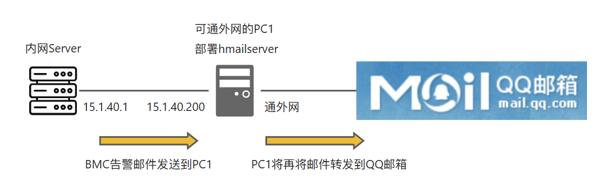
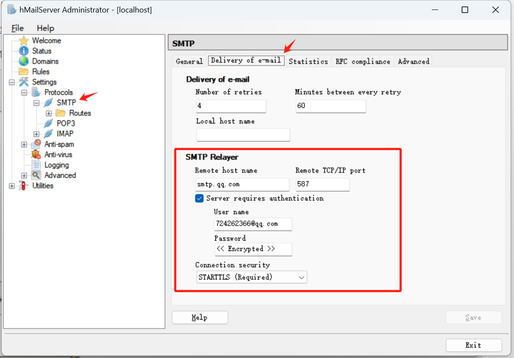
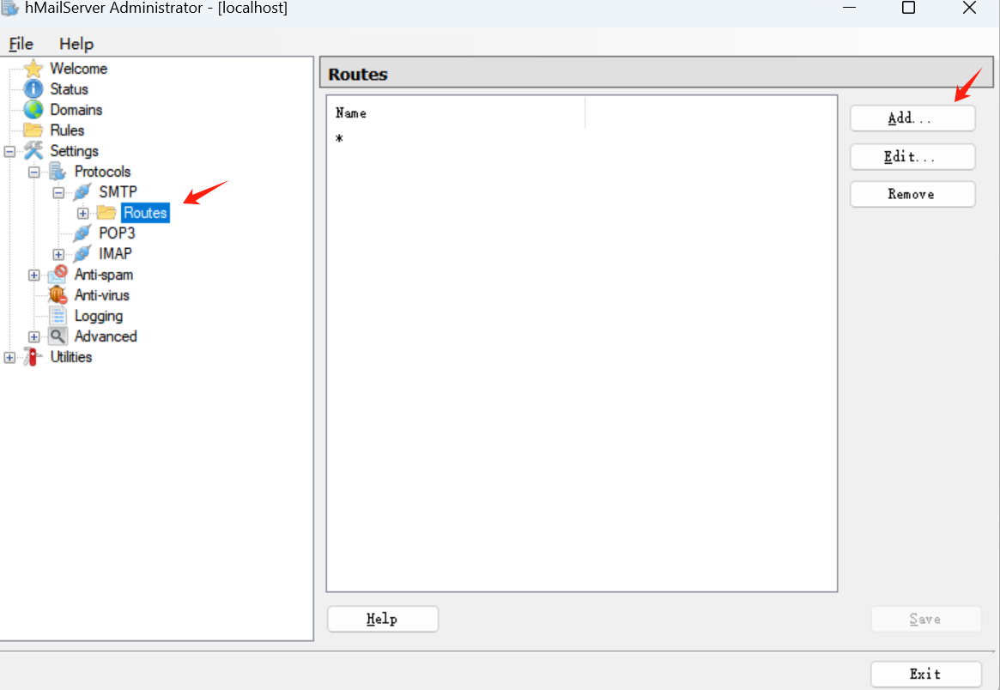
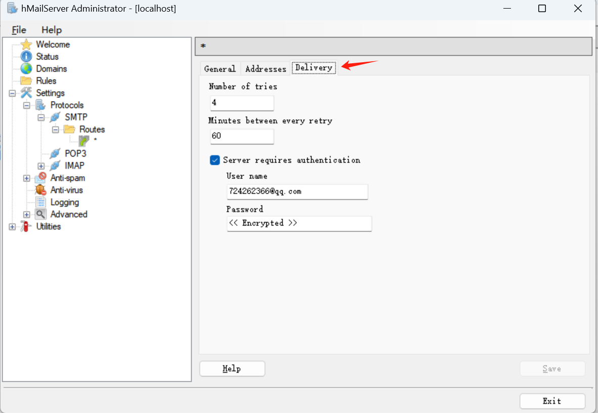
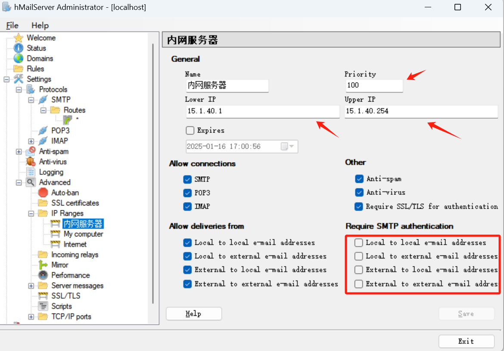

# hmailserver配置邮件中继转发

# 一、应用场景

在内网服务器BMC管理网段不能联网的情况下，配置邮件中继转发，将BMC告警邮件转发到QQ邮箱中。

**内网Server** ----25端口----> **PC1** -----587端口 + 验证-----> **QQ邮箱**

# 二、hmailserver配置

>在PC1 - windows系统配置

1、下载并安装hmailserver

链接：https://www.hmailserver.com/

2、打开软件，使用安装时创建的密码登录

3、配置SMTP转发：将QQ邮箱的SMTP服务信息填进去。

其中的密码要使用QQ邮箱的安全密码，而不是账号登录密码，端口使用587。

Settings - Protocols - SMTP - Delivery of e-mail

4、配置SMTP协议的路由

Settings - Protocols - SMTP - Routes 点击 Add 添加一条路由

新建的路由设置如下，其中Domian(*)代表转发内网过来的任意IP地址

再切换到”Delivery“标签，切记此处也要设置认证方式和认证密码！！

5、设置IP范围

Settings - Advanced - IP Ranges 添加一条规则”内网服务器“

规则设置如下，用于指定内网服务器IP

# 三、服务器BMC配置

1、配置SMTP发送邮件告警，内网服务器BMC与PC的hmailserver通过25端口通信，因此不需要设置验证

2、配置完测试邮件是否能发送成功

# 四、遇到的问题

问题一：SENT: 530 SMTP authentication is required

处理方案：是因为没有设置SMTP验证引起，按照2.3和2.4配置SMTP认证即可

问题二：RECEIVED: 503 Error: need EHLO and AUTH first !

处理方案：同样是认证方式配置有误，按照2.3和2.4配置SMTP认证即可

问题三：501 Mail from address must be same as authorization user

处理方案：发件人和收件人得保持一致，在3.1配置服务器BMC的邮件告警时，发件人要设置成和收件人一致的邮箱地址。
