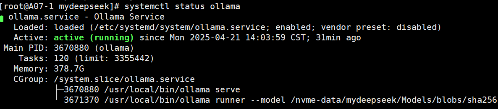
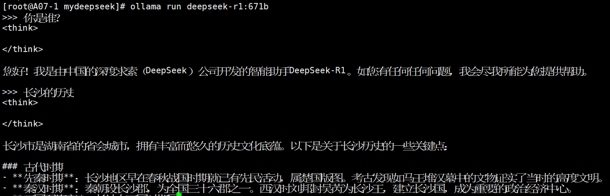
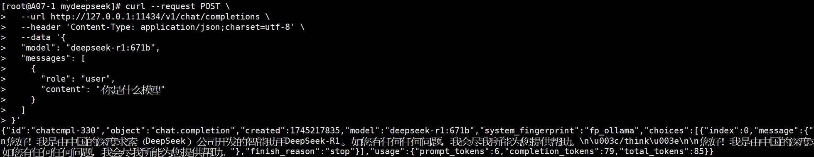
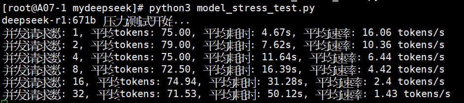
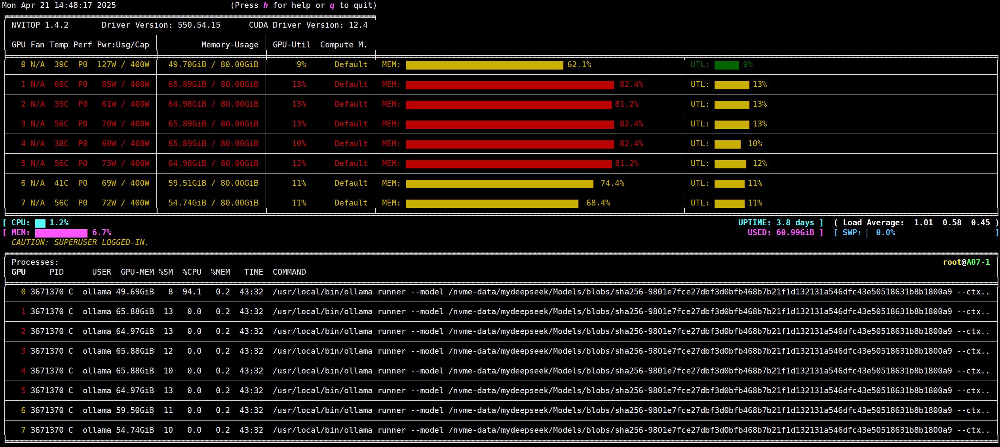

# 一、环境

| 配置项      | 配置                                         |
| ----------- | -------------------------------------------- |
| 系统        | Red Hat Enterprise Linux release 8.6 (Ootpa) |
| 内存        | 1024G                                        |
| GPU         | NVIDIA A800-SXM4-80GB  * 8                   |
| CPU         | Intel(R) Xeon(R) Platinum 8468 * 2           |
| CUDA版本    | 12.4                                         |
| GPU驱动版本 | 550.54.15                                    |

---

# 二、安装ollama框架

1、通过官网脚本安装

```shell
curl -fsSL https://ollama.com/install.sh | sh
```

2、设置环境变量（写到ollama服务配置文件中）

```shell
[root@A07-1 mydeepseek]# cat /etc/systemd/system/ollama.service 
[Unit]
Description=Ollama Service
After=network-online.target

[Service]
ExecStart=/usr/local/bin/ollama serve
User=ollama
Group=ollama
Restart=always
RestartSec=3
Environment="PATH=/usr/local/cuda/bin:/usr/local/sbin:/usr/local/bin:/usr/sbin:/usr/bin:/root/bin"
Environment="LD_LIBRARY_PATH=/usr/local/cuda/lib64"
Environment="OLLAMA_MODELS=/nvme-data/mydeepseek/Models"
Environment="OLLAMA_DEBUG=1"             
Environment="OLLAMA_LOAD_TIMEOUT=120m"   
Environment="OLLAMA_KEEP_ALIVE=-1"      
Environment="OLLAMA_SCHED_SPREAD=1" 
Environment="OLLAMA_NUM_PARALLEL=8"
Environment="OLLAMA_GPU_LAYER=cuda"
```

3、启动ollama服务

```shell
# 重新加载配置文件
systemctl daemon-reload
# 启动服务
systemctl start ollama
systemctl enable ollama
```

4、查看运行情况，确保运行正常



5、查看ollama版本

```shell
[root@A07-1 mydeepseek]# ollama -v
ollama version is 0.6.5
```

---

# 三、拉取deepseek模型并运行

1、拉取模型

>因为设置了环境变量，所以模型文件会拉取到对应的文件夹中。
>
>`OLLAMA_MODELS=/nvme-data/mydeepseek/Models`

```shell
ollama pull deepseek-r1:671b
```

2、拉取完，查看模型

```shell
[root@A07-1 mydeepseek]# ollama list
NAME                ID              SIZE      MODIFIED   
deepseek-r1:671b    739e1b229ad7    404 GB    2 days ago   
```

3、运行模型

```shell
nohup ollama run deepseek-r1:671b > run.out 2>&1 < /dev/null &
```

4、查看正在运行的模型

>需要确认`PROCESSOR`是`100% GPU`，如果是`100% CPU`说明运行得有问题，需要查看对应日志排查。

```shell
[root@A07-1 mydeepseek]# ollama ps
NAME                ID              SIZE      PROCESSOR    UNTIL   
deepseek-r1:671b    739e1b229ad7    552 GB    100% GPU     Forever  
```

---

# 四、访问deepseek模型

1、方法一：交互式访问大模型

再次`ollama run`模型，将进入交互式界面



2、方法二：API接口调用

ollama服务运行后会监听 `127.0.0.1:11434`，我们可以通过API接口访问运行后的模型实例。ollama的对话接口兼容openai接口，可以执行以下命令调用模型接口：

```shell
curl --request POST \
  --url http://127.0.0.1:11434/v1/chat/completions \
  --header 'Content-Type: application/json;charset=utf-8' \
  --data '{
  "model": "deepseek-r1:671b",
  "messages": [
    {
      "role": "user",
      "content": "长沙是什么地方？"
    }
  ]
}'
```

效果如下：



---

# 五、压测大模型

1、下载脚本：https://github.com/zhayujie/llm-eval-suite/blob/main/model_stress_test.py 

2、运行压测脚本

```shell
python3 model_stress_test.py
```



3、压测过程中可以使用`nvitop`查看GPU的使用情况

```shell
# 安装nvitop
pip install nvitop
# 执行
nvitop
```

