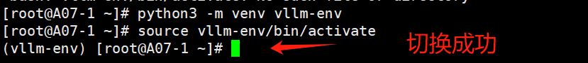
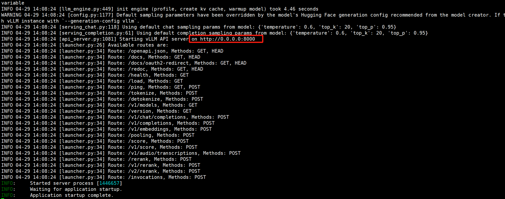
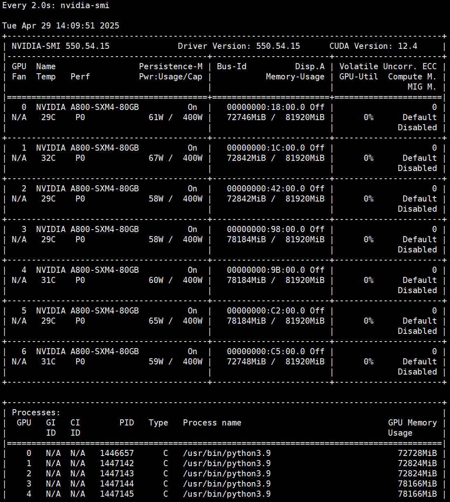
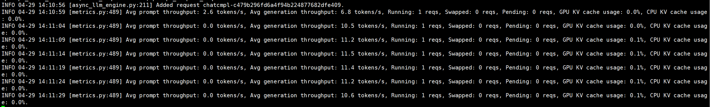

# VLLM部署Qwen3大模型

#  一、环境

| 配置项      | 配置                                         |
| ----------- | -------------------------------------------- |
| 系统        | Red Hat Enterprise Linux release 8.6 (Ootpa) |
| 内存        | 1024G                                        |
| GPU         | NVIDIA A800-SXM4-80GB  * 8                   |
| CPU         | Intel(R) Xeon(R) Platinum 8468 * 2           |
| CUDA版本    | 12.4                                         |
| GPU驱动版本 | 550.54.15                                    |

# 二、下载Qwen3大模型

使用魔塔社区下载，4月29日发布的最新Qwen3。

测试部署235B和32B的模型。

```shell
# 使用pip安装modelscope
pip install modelscope
# 下载235B模型
modelscope download --model Qwen/Qwen3-235B-A22B --local_dir /nvme-data/Models/Qwen3-235B-A22B/
# 下载32B模型
modelscope download --model Qwen/Qwen3-32B --local_dir /nvme-data/Models/Qwen3-32B/
```

# 三、安装VLLM

1、安装VLLM

```shell
pip install --upgrade pip
pip install "vllm>=0.8.5" 
```

2、切换到VLLM环境中

```shell
python3 -m venv vllm-env
source vllm-env/bin/activate
```

切换成功能看到命令行前面出现（vllm-env）



# 四、VLLM部署Qwen3

## 4.1 部署Qwen3-235B-A22B

>使用7张A800-80G

1、在vllm-env中设置环境变量

```shell
export VLLM_USE_MODELSCOPE=true
export VLLM_CACHE_ROOT="/nvme-data/Models"
export NCCL_CUMEM_ENABLE=0
export VLLM_HOST_IP=10.3.3.41
export NCCL_SOCKET_IFNAME=bond1    # 10.3.3.41的网卡名
export GLOO_SOCKET_IFNAME=bond1
export PYTORCH_CUDA_ALLOC_CONF=expandable_segments:True
```

2、运行Qwen3-235B-A22B大模型

因为服务器有1张卡坏了，用7张卡运行

```shell
CUDA_VISIBLE_DEVICES=0,1,2,3,4,5,6 vllm serve /nvme-data/Models/Qwen3-235B-A22B \
--host 0.0.0.0 \
--port 8000 \
--tensor-parallel-size 1 \
--pipeline-parallel-size 7 \
--gpu-memory-utilization 0.96 \
--block-size 16 \
--enforce-eager
```

运行成功的输出如下：



7张A800的显存占用情况



## 4.2 测试Qwen3-235B-A22B

1、使用`curl`命令测试

```shell
curl http://localhost:8000/v1/chat/completions   \
	-H "Content-Type: application/json"   \
	-d '{
    "model": "/nvme-data/Models/Qwen3-235B-A22B",
    "messages":[{"role":"user","content":"介绍一下大语言模型。"}],
    "max_tokens":1024
   }'
```

2、查看生成速度，只有10token/s，很低啊



> 也尝试了6张卡运行，勉强能跑，但输出只有7.1 tokens/s，更差
>
> ```shell
> export VLLM_ALLOW_LONG_MAX_MODEL_LEN=1
> CUDA_VISIBLE_DEVICES=0,1,2,3,4,5,6 vllm serve /nvme-data/Models/Qwen3-235B-A22B   --host 0.0.0.0 --port 8000   --tensor-parallel-size 2   --pipeline-parallel-size 3 --gpu-memory-utilization 0.98   --block-size 16 --max-model-len 4096  --enforce-eager
> ```

## 4.3 部署Qwen3-32B

>使用4张A800-80G

VLLM运行命令

```shell
(vllm-env) [root@A07-1 Models]# CUDA_VISIBLE_DEVICES=0,1,2,3 vllm serve /nvme-data/Models/Qwen3-32B \
>   --host 0.0.0.0 \
>   --port 8000 \
>   --tensor-parallel-size 4 \
>   --dtype float16 \
>   --max-model-len 8192 \
>   --gpu-memory-utilization 0.90 \
>   --swap-space 8GiB \
>   --disable-custom-all-reduce \
>   --disable-log-requests
```

## 4.4 测试Qwen3-32B

还是使用curl命令测试

```shell
curl http://localhost:8000/v1/chat/completions   -H "Content-Type: application/json"   -d '{
    "model": "/nvme-data/Models/Qwen3-32B",
    "messages":[{"role":"user","content":"三国演示第三回讲了那些事？说重点描述给我"}],
    "max_tokens":1024
   }'
```

这个生成速度还可以

```shell
INFO 04-30 15:12:19 [loggers.py:87] Engine 000: Avg prompt throughput: 2.1 tokens/s, Avg generation throughput: 12.2 tokens/s, Running: 1 reqs, Waiting: 0 reqs, GPU KV cache usage: 0.0%, Prefix cache hit rate: 25.0%
INFO 04-30 15:12:29 [loggers.py:87] Engine 000: Avg prompt throughput: 0.0 tokens/s, Avg generation throughput: 56.2 tokens/s, Running: 1 reqs, Waiting: 0 reqs, GPU KV cache usage: 0.1%, Prefix cache hit rate: 25.0%
INFO:     127.0.0.1:31562 - "POST /v1/chat/completions HTTP/1.1" 200 OK
INFO 04-30 15:12:39 [loggers.py:87] Engine 000: Avg prompt throughput: 0.0 tokens/s, Avg generation throughput: 34.0 tokens/s, Running: 0 reqs, Waiting: 0 reqs, GPU KV cache usage: 0.0%, Prefix cache hit rate: 25.0%
INFO 04-30 15:12:49 [loggers.py:87] Engine 000: Avg prompt throughput: 0.0 tokens/s, Avg generation thr
```

