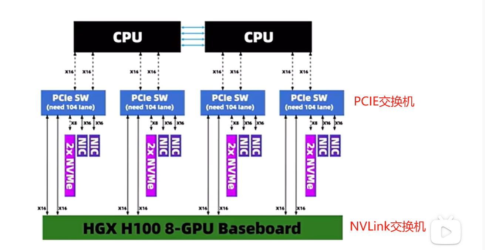

# 一、InfiniBand算力网络

## 1.1 技术背景

infiniband直译为“无限带宽”技术，是一个高性能计算的计算机网络通信标准。大致发展路线如下：

- 上世纪90年代：为了连接更多的外部设备，英特尔推出PCI总线，刚开始都用这个
- 1999年，FIO Developers Forum（IBM、康柏以及惠普）和NGIO Forum（英特尔、微软、SUN）进行了合并，创立了InfiniBand贸易协会，诞生的目的，就是为了取代PCI
- 2001年，从英特尔公司和伽利略技术公司离职的员工，在以色列创立了一家芯片公司Mellanox，2001年加入InifiniBand联盟，并推出首款InfiniBand产品
- 2002年，InfiniBand阵营突遭巨变，英特尔公司“临阵脱逃”，决定转向开发PCI Express，微软也退出了InfiniBand的开发。

- 2009年，TOP500中有181个采用infiniband，以太网仍是主流256个，Mellanox(麦洛斯)也在不断壮大，成为infiniband的引导者。
- 2010年，Mellanox和Voltaire公司合并，InfiniBand主要供应商只剩下Mellanox和QLogic。
- 2012年英特尔收购QLogic，再次回到infiniband赛道

- 2015年，TOP500中有257套采用infiniband，占比为51.4%，标志着infiniband战胜以太网，成为了超级计算机最首选的内部连接技术，Mellanox在infiniband中的市场占比高达80%

- 2015年至2019年，面对infiniband的挑战，以太网也不甘示弱，接连推出ROCE V1和ROCE V2，大幅缩小与infiniband的技术性能差距，结合本身固有的成本和兼容性优势，又反杀回来，25G以太网成为行业新宠，反杀infiniband

- 2019年，英伟达豪掷69亿美元，击败对手英特尔和微软，成功收购Mellanox，AIGC大模型崛起，整个社会对高性能计算和智能计算的需求发生了井喷。InfiniBand也基本变成了英伟达家的私有协议

目前网络性能这块主要是infiniband和高速以太网的缠斗

不差钱的选infiniband，性价比选高速以太网

>RDMA网络的两个分支，IB和ROCE
>
>前者价格贵，成本高，但是传输速率高，通信效率好
>
>ROCE网络差点，但它的硬件价格会便宜些
>
>如果是大规模生产型，不差钱的情况下，选IB
>
>小型或者实验室型，对时延没太多要求，选ROCE

## 1.2 RDMA协议

### 1.2.1 概念

infiniband率先引入RDMA（Remote Direct Memeory Access）远程直接数据存取协议

为了解决网络传输中服务器端数据处理的延迟而产生的

### 1.2.3 RDMA原理

传统Socket通信，数据要**层层打包**，从用户空间 --> 操作系统内核 ---> 硬件，对于CPU来说就是持续的**大开销**

RDMA直接绕开操作系统内核，直接让数据在应用层传递到网络接口

是一种高带宽、低延迟、低CPU消耗的网络互联协议，采用此协议的网络技术主要有四个，IB、ROCEV1/V2、IWARP，**主流常用**

**IB和ROCEV2**，ROCEV1已被弃用，IWARP也不常用，它们的架构如下：

## 1.3 infiniband的商用产品

英伟达：NVDIA Quantum-2 第七代infiniband架构 2021年，包括

Quantum-2系列交换机采用了紧凑型的1U设计，包括风冷和也冷版本，芯片制程工艺7纳米

64个400Gbps端口或者128个200Gpbs的端口，灵活搭配，提供总计51.2Tbps的双向吞吐量

ConnectX-7 infiniband适配器，支持PCIE GEN4和Gen5，具有多种外形规格，可以提供400Gpbs的单或双网络端口

## 1.4 网络拓扑示例

# 二、AI算力集群

如何规模化部署一个AI算力集群？主要由以下4部分组成：

1、集群网络：首选RDMA网络

2、算力服务器：DGX / HGX，如`NVIDIA HGX H100` ，或者其他算力服务器

3、操作系统：Linux操作系统 / Laxcus分布式操作系统

4、应用软件：AI大模型，向量数据库，其他辅助软件

# 三、液冷技术

## 3.1 浸没式液冷技术

是一种典型的直接接触型液冷，它是将发热的电子元件浸没在冷媒`冷却液`中，依靠液体流动循环带走热量。

浸没式液冷由于发热元件与冷媒全方位直接接触，散热效率相比于传统的散热方式`风冷`和`水冷`，它的散热效率更高些；

相对于`冷板`或`喷淋液冷`，它的噪音更低。

目前浸没式液冷技术主要分为：单相液冷和双相液态冷

浸没式液冷技术对比传统风冷技术的优势：

- 节能性更加极致：冷媒与发热器件直接接触，换热效率更高，且可实现全面自然冷却，系统PUE<1.05；
- 器件散热更加均匀：采用全浸没方式，服务器内部温度场更加均匀，器件可靠性更有保障；
- 无泄漏风险：采用绝缘、环保的冷却液体，即使发生泄露对基础设施硬件和外界环境均无任何风险；
- 噪声更低：服务器全部元器件均可通过液冷方式散热，内部实现无风扇设计，满载运行噪音<45dB；
- 功率密度大幅提升：单机柜功率密度可达60kW以上。

## 3.1 单相液冷和两相液冷

### 3.1.1 两相液冷技术

优势：

- 冷却液发生了相变，所以传热效率很高。

缺点：

- 相变过程中，冷却液蒸发为气态过程中会发生逃逸，所以对容器的密封性有一定的要求；
- 但是又不能太密封，防止冷却系统中断出现事故，所以需要设置一定的安全设施

### 3.1.2 单相液冷技术

优势：

- 单相液冷要求冷却液的沸点较高，这样冷却液挥发流失控制相对简单，与IT设备的元器件兼容性比较好，不需要频繁补充冷却液

缺点：

- 相对于两相液冷其散热效率要低一些

# 四、英伟达H100 GPU服务器

了解英伟达H100 GPU服务器

## 4.1 机型参数

型号：超微SYS-821GE-TNHR

英伟达H100加速卡服务器（8块卡），售价约260万 - 300万人民币一台

高度8u，进深 80cm，重量110公斤，四个人才能抬起

整机功率：约1万W

CPU：英特尔至强 Platinum 8468处理器 * 2 （四代铂金系列）

- 105M高速缓存
- 主频2.10GHz，睿频3.8Ghz
- 48核心

内存：32根64G DDR5内存条，一共2T内存

> 补充：内存与显存比例3：1最好
>
> 这里显存一共80G * 8 = 640G，刚好3：1

### 4.1.1 前面板

### 4.1.2 后面板

后面板主要包含：两个电源模块、网卡接口、风扇

如图所示：

> 中间部位的8张400G网卡：一块网卡对应一张GPU芯片处理的数据
>
> 旁边的一张400G网卡：用于连接存储网络
>
> 上方的两个千兆口：用于连接管理网络

包含网口的IO模组是可以拆卸的，整机最多支持12张PCIE5.0的X16插槽

拆卸出来是这样

### 4.1.3 GPU模组

取出H100模组，掰下，往外抽

GPU模块俯视图：

将GPU卡拆下，可以看到SXM接口，通过此种接口，将8块H100 GPU连到一个基板上，组成一个整体的H100模组

>GPU模组：
>
>实际并不大，只占用1U-2U的空间，因为考虑到散热才做成8U那么大

## 4.2 英伟达的GDS技术

GDS技术全称（GPU Direct Storage），数据能直接从存储设备传输到GPU中，再也不需要经过CPU和系统内存

优势：

- 提高数据传输的效率
- 降低延迟
- 提高训练数据的载入速度
- 提升大模型的训练性能

## 4.3 英伟达H100 GPU介绍

了解H100 GPU的参数，以及部分原理

### 4.3.1 GPU参数

作为A100（7纳米）的继承者，采用全新的Hopper架构，台积电4纳米工艺

H100 GPU参数，以及与A100的对比信息

| 参数                 | H100参数                    | A100参数    |
| -------------------- | --------------------------- | ----------- |
| 架构                 | Ampere                      | Hopper      |
| CUDA Cores（核心数） | 16896                       | 6912        |
| 工艺                 | 台积电4纳米                 | 台积电7纳米 |
| 晶体管数量           | 800亿                       | 540亿       |
| 显存                 | 80GB的HBM3高速缓存          | /           |
| 显存带宽             | SXM版本3TB/s，PCIE版本2TB/s | /           |
| INT8                 | 2000 TOPS                   | 624 TOPS    |
| FP16                 | 1000 TFLOPS                 | 312 TFLOPS  |
| TF32                 | 500 TFLOPS                  | 156 TFLOPS  |
| FP64                 | 60 TFLOPS                   | 19.5 TFLOPS |
| 功耗（TDP）          | 700W / 每颗GPU              | 400W        |
| 单颗GPU的尺寸        | 8cm x 15.2cm                | /           |

### 4.3.2  GPU协同工作原理

H100模组由8块H100 GPU芯片组成，那么他们是如何协同工作的？

通过底下的芯片，组成`NVLink`，它是一种GPU到GPU的高速互联技术，同样也是英伟达推出的，以这些芯片为桥梁，允许多个GPU之间进行高速通信。

目前是第四代NVLink技术，为每个GPU提供高达900GB/s的双向带宽。至多可以互联256个GPU芯片

NVSwitch技术图示

### 4.3.3 PCIE交换机

H100整机中，有一个模块叫做PCIE交换机，用于CPU和GPU之间的通信

PCIE交换机能将CPU和主板芯片所提供的PCIE通道 扩展为 更多的PCIE通道，从而允许连接更多的PCIE设备

这个型号的机子中有4块交换芯片

CPU不能直接通过NVLink与GPU通信，必须使用PCIE交换机作为中间连接，

- 数据先到PCIE交换机
- 再到NVLink交换机
- 再到GPU

层层转包，从而实现CPU与 GPU的通信

### 4.3.4 由PCI-E通道衍生的问题

#### 4.3.4.1 PCI-E通道带宽的问题

从超微服务器结构设计来看，所有的服务器外部设备，都必须通过这个PCIE交换机来与CPU通信，因此系统的带宽和延迟瓶颈，都有可能出现在PCI-E交换这个环节

带宽不够？此时PCIE交换机的作用就来了，在主板旁边，提供了两个直连CPU的PCI-E扩展口，可以通过扩展板连接

比如安装一张Riser卡（400G的IB卡）

#### 4.3.4.2 不同型号PCIE通道的坑

有些服务器配置一样，但是速度就是慢很多，就是因为PCIE X16通道只有4条，而超微的有8条！

