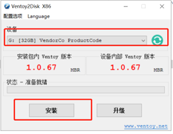

# 教程：Ventoy制作U盘启动器

此教程需在`Windows`电脑中操作

## 一、制作U盘启动器

1、解压`ventoy-1.0.67-windows.zip`压缩包，解压后的文件如图所示：

2、电脑插入U盘，选择运行`Ventoy2Disk.exe`程序，程序界面如图所示，在`设备`栏选择需要制作为启动器的U盘，点击`安装`

3、安装成功之后，U盘会变为`Ventoy设备`，在“我的电脑”中查看，可见如下图所示的存储设备

4、双击打开`Ventoy设备`，将`ISO镜像`文件直接拷贝进去（如常用的麒麟、统信系统的ISO镜像文件），可以一次性放入多个镜像文件

5、弹出U盘设备，U盘启动器制作完毕

## 二、使用U盘启动器

1、U盘插入长城电脑，开机按`F10`，选择启动项

2、进入Ventoy界面，键盘`上下方向键`选择需要安装的系统镜像，`回车键`进入系统安装界面

