# 华为USG6615F防火墙配置SSLVPN

# 一、需求

​	远程办公人员需要通过公网访问机房内网的服务器，需要在USG6615F防火墙上配置并开启SSL VPN功能。

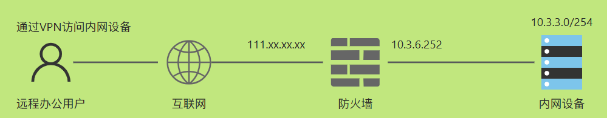

# 二、服务端配置

>配置前需要确认网络本身是通的，防火墙端口映射功能也应正常。

## 2.1 创建本地认证用户

>用于VPN登录和验证

1、新建安全组

按图示操作，创建管理员用户组`sslvpn_admin_usergroup`，点击确定。

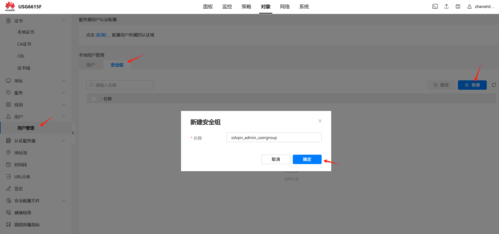

2、新建用户

切换到用户标签，创建用户`haris`，服务类型选择`SSL VPN`，并关联安全组`sslvpn_admin_usergroup`，点击确定。

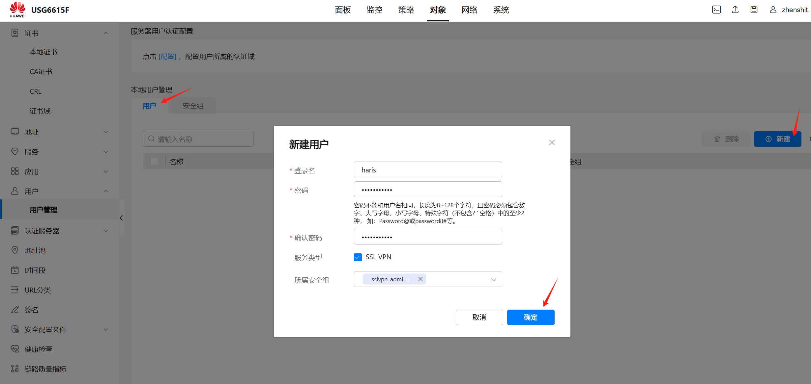

## 2.2 创建地址池

>VPN登录后分配的地址

按图示创建地址池，点击确定。

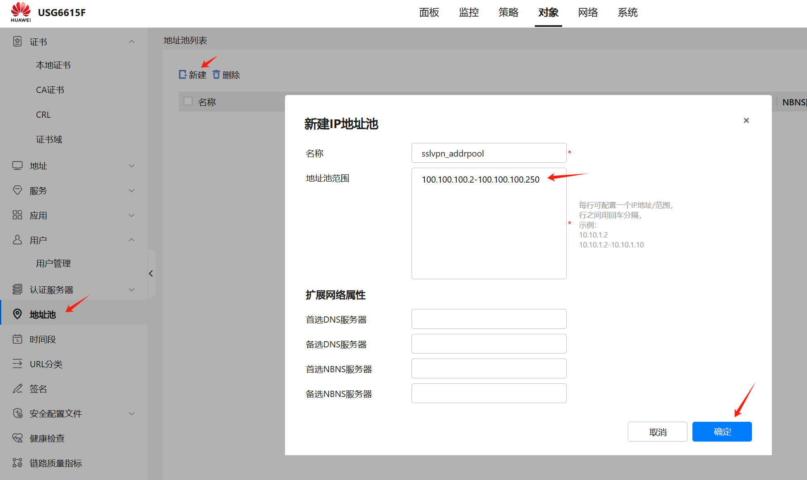

## 2.3 创建SSLVPN

1、网关配置

>我要用客户端连接VPN了，填什么地址和端口？用户认证方式是什么？都在这里配置。

在`网络`标签页中新建SSLVPN，填写网关地址、最大并发用户数等信息，点击下一步

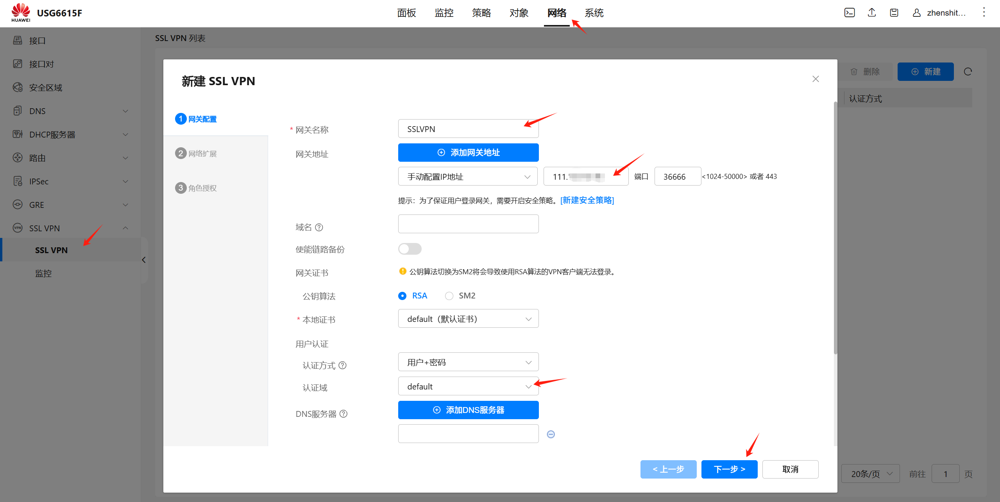

2、网络扩展

>VPN客户端连接后，客户机会获取什么IP，以及客户机能访问到那些内网IP/网段，都在这配置。

绑定`2.2节`创建的IP地址池，选择自适应路由模式，然后新建一个网络扩展资源。（网络扩展资源：内网设备的网段或IP地址），然后点击下一步。

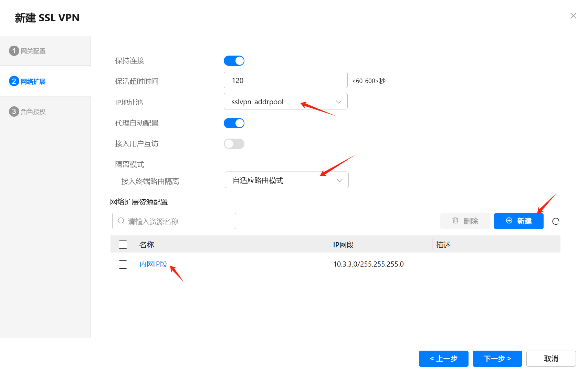

3、角色授权

>我的VPN客户端用户能访问那些资源？在这里配置

新建角色`haris`，关联`2.1节`创建的用户和安全组，添加可以访问的资源授权，点击确定。

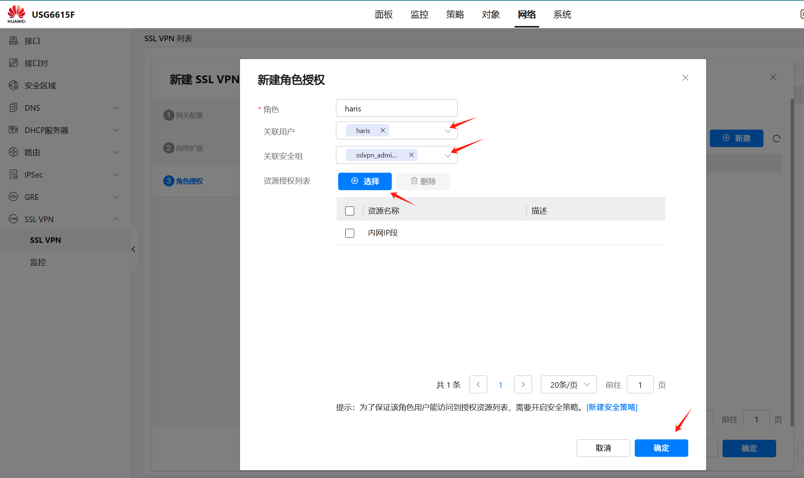

## 2.4 安全策略放通

>得在防火墙设置安全策略，允许公网的IP过来访问VPN服务

允许公网（untrust）来访问（local）的36666端口。

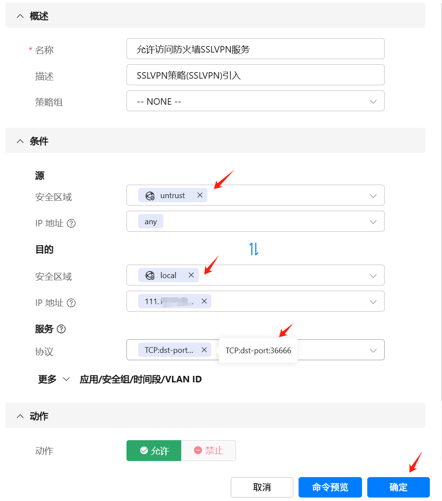

至此，SSLVPN的服务段配置已全部完成。

# 三、客户端配置和验证

1、下载VPN客户端并安装

UNI VPN，官网下载地址：https://www.leagsoft.com/doc/article/103107.html

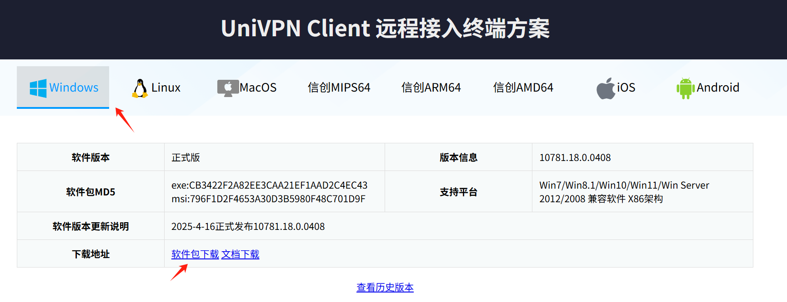

2、配置并登录VPN

新建VPN连接，填写VPN服务端的信息

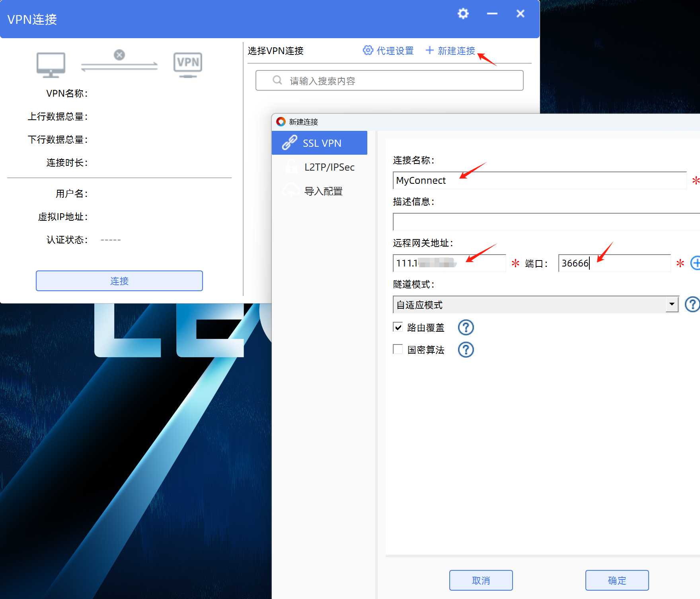

点击连接按钮，输入用户名和密码登录

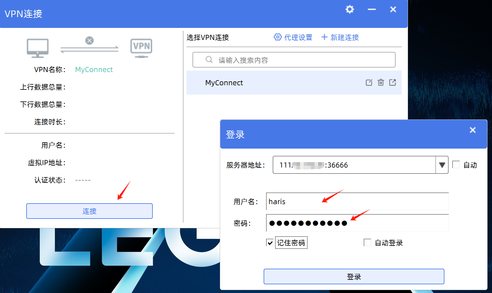

登录成功会弹个警告框，点击继续即可

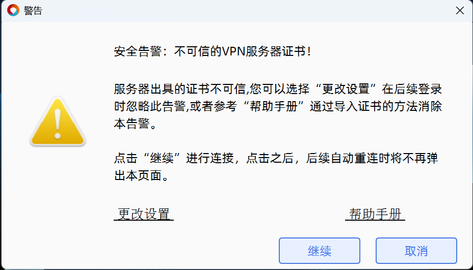

如下图所示，虚拟IP分配成功， 并且客户端成功ping通内网设备的IP，则配置成功

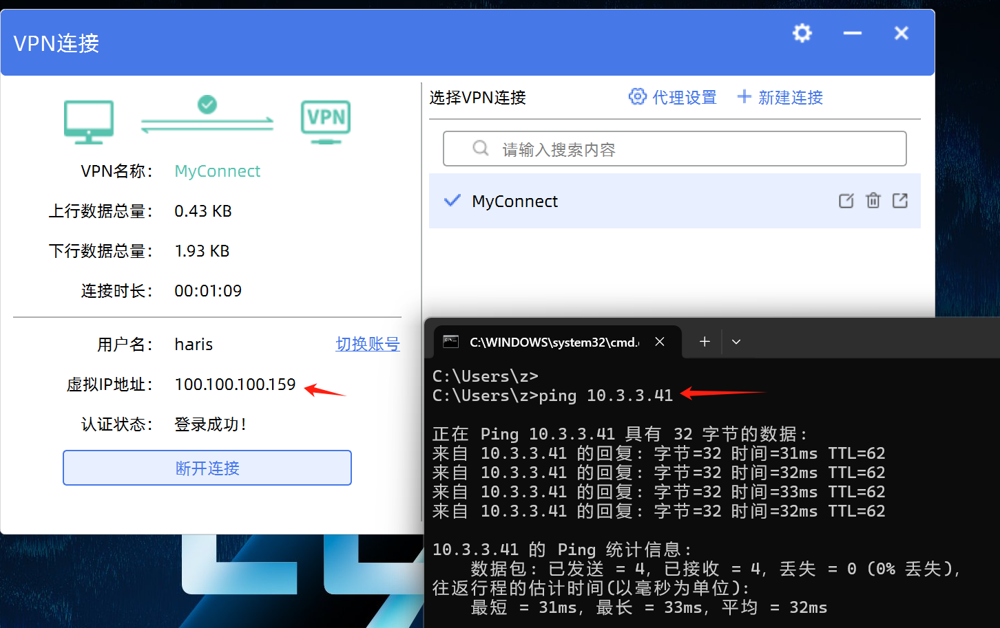

如果连接VPN成功、虚拟IP也分配到了，可还是不能访问到内网网段，需要看看防火墙是不是有策略拦截了，在里面放通即可。