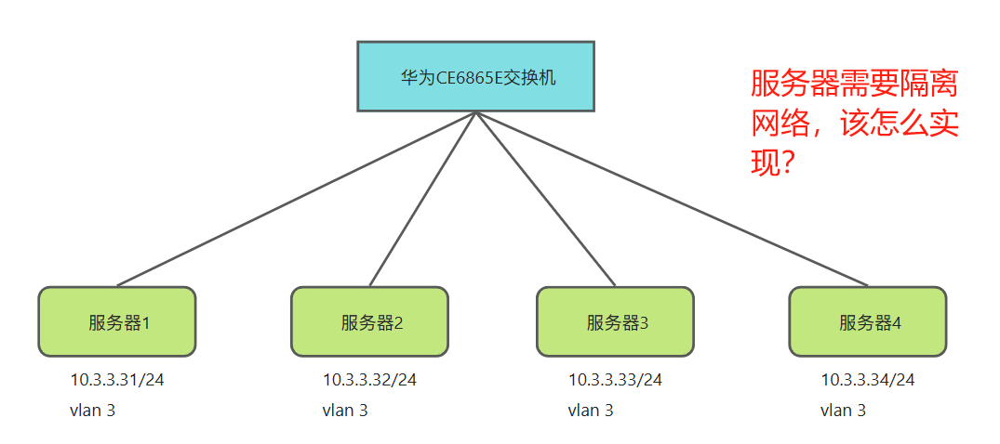
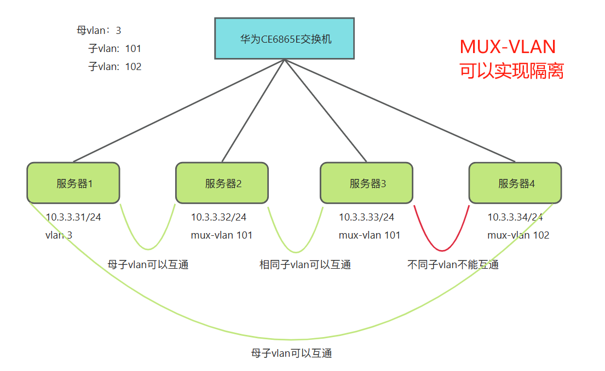

# 一、MUX-VLAN的作用

​	例如：局域网中有一批设备划分的Vlan相同，领导要求我们给这批设备做网络隔离，但是因为业务原因又不能改动原来的vlan，该怎么办呢？



这时候就能用到mux-vlan功能，通过在母vlan中划分子vlan，给局域网再做一次划分。



---

# 二、具体实现

1、交换机上创建vlan，并将vlan划到母vlan中。

>划分方式有两种
>
>- group方式，互通型VLAN，与母VLAN互通，且与其他相同子VLAN互通
>- Separate方式，隔离型VLAN，只能和母VLAN互通，与其他的都隔离

```shell
# 创建vlan
<CE6865E>sy
[~CE6865E]vlan 101
[~CE6865E]vlan 102

# 将新建的vlan划到母vlan中，采用互通型VLAN
vlan 3          
 mux-vlan       
 subordinate group 101 to 102
```

2、将对应接口划到子VLAN中

```shell
# 服务器1连接的对端网口
port default vlan 3
port mux-vlan enable vlan 3   # 其他子VLAN要与母VLAN互通，必须加上这一条

# 服务器2连接的对端网口
port default vlan 101
port mux-vlan enable vlan 101

# 服务器3连接的对端网口
port default vlan 101
port mux-vlan enable vlan 101

# 服务器4连接的对端网口
port default vlan 102
port mux-vlan enable vlan 102
```

3、提交并保存

```shell
commit、save
```

