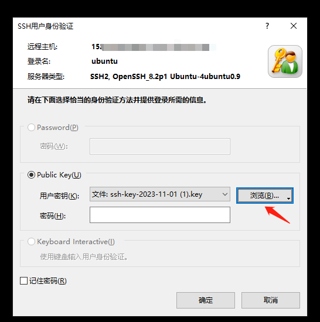
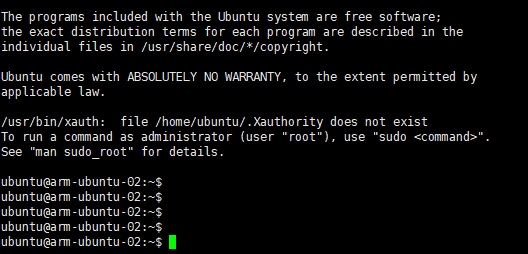

# 甲骨云服务器初始设置

​	Oracle Cloud的服务器刚创建完是不能直接使用的，需要做一系列设置方能使用第三方ssh工具登录

# 1 使用私钥文件登录

<font color=red>**在创建实例的时候**</font>，保存实例私钥，


使用xshell创建SSH登录会话


选择接受


输入默认用户（centos系统默认opc，ubuntu系统默认为ubuntu）


选择私钥进行连接



登录成功




# 2 修改ssh服务

```shell
# 1、切换到root用户
sudo su

# 2、关闭SElinux。否则修改sshd端口会报错没权限
setenforce 0
# 永久关闭
vim /etc/selinux/config
# 改成disabled
# This file controls the state of SELinux on the system.
# SELINUX= can take one of these three values:
#     enforcing - SELinux security policy is enforced.
#     permissive - SELinux prints warnings instead of enforcing.
#     disabled - No SELinux policy is loaded.
SELINUX=disabled
# SELINUXTYPE= can take one of these three values:
#     targeted - Targeted processes are protected,
#     minimum - Modification of targeted policy. Only selected processes are protected. 
#     mls - Multi Level Security protection.
SELINUXTYPE=targeted


# 2、编辑sshd_config文件
vim /etc/ssh/sshd_config

# 主要修改：
	Port：8822 # 防止简单端口扫描
	PermitRootLogin yes # 允许root登录
	PasswordAuthentication yes	# 允许使用密码登录

# 重启服务
systemctl restart ssh
```

# 3 iptables设置开放端口

oracle的ubuntu系统默认带了iptables，需要放开


执行命令

```shell
# 1、全部放开
sudo iptables -P INPUT ACCEPT
sudo iptables -P FORWARD ACCEPT
sudo iptables -P OUTPUT ACCEPT
sudo iptables -F

# 2、卸载iptalbes相关应用
apt-get purge netfilter-persistent

# 3、卸载oracle cloud监控程序
snap remove oracle-cloud-agent
iptables -L

# 3、重启
reboot
```

# 4、修改密码

```shell
echo "ubuntu:xxxxx" | chpasswd
echo "root:xxxxx" | chpasswd
history -c
```

