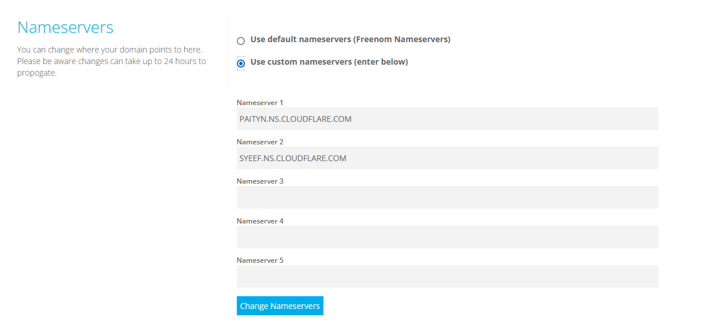
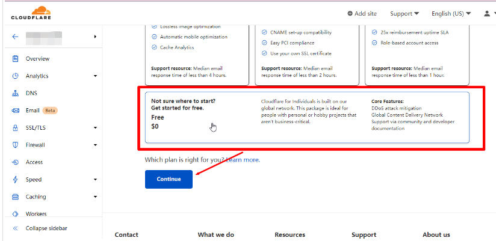

## 1 前言

​	本文介绍如何使用甲骨文（Oracle）的免费VPS部署V2Ray

甲骨文服务器申请地址：

https://www.oracle.com/cloud/free/

> c7 / 7q / F+


## 2 域名申请

<font color='red'>**！！本节使用Firefox浏览器操作！！**</font>

### 2.1 Firefox浏览器Gooreplacer插件设置

>防止freenom在订单提交阶段失败

安装完插件后，点击“配置规则”


规则配置

```python
重定向填写：
https://www.google.com/recaptcha
目标地址填写：
https://www.recaptcha.net/recaptcha
```


### 2.2 freenom域名申请

>freenom可以申请免费的域名，申请地址：
>
>https://www.freenom.com/en/index.html

- 登录，选择"注册一个新域名"

- 输入需要注册的域名名


- 选择免费域名，加入购物车


- 期限修改为12个月


- 勾选允许协议，点击完成


- 看到此界面，说明申请成功，如果申请失败，回到2.1检查Gooreplacer插件是否配置正常


- 查看我的域名


- 设置域名

  

- 添加域名解析


- 填写域名解析服务器

  ```python
  PAITYN.NS.CLOUDFLARE.COM
  SYEEF.NS.CLOUDFLARE.COM
  ```



## 3 域名解析配置（CDN）

>这里使用cloudflare

添加站点


选择免费的方案



添加VPS服务器地址


校验服务器是否生效：

>解析的IP不一致，是因为勾选了”代理“，不影响正常使用


## 4 VPS部署V2Ray

>参考：https://www.ioiox.com/archives/99.html

### 4.1 系统设置

#### SSH服务

切换至root创建密码

```shell
sudo -i
# 切换至 root 账号
passwd
# 修改密码
```

修改ssh配置

```shell
vi /etc/ssh/sshd_config
# 编辑 sshd_config

添加或修改Port 22222以确保SSH端口安全.
查找到#PermitRootLogin yes,去掉#注释符号.
查找到#PasswordAuthentication yes,去掉#注释符号.
查找到#ClientAliveInterval 0,去掉#注释符号,0改为30.
查找到#MaxSessions 10,去掉#注释符号.
```

重启ssh服务

```shell
systemctl restart sshd
# 重启 sshd 生效
```

#### 防火墙

关闭防火墙

```shell
systemctl stop firewalld
systemctl disable firewalld
```

#### 修改主机名

>甲骨文云的`CentOS 7`在使用`hostnamectl set-hostname`命令修改主机名时,重启服务器后依旧会恢复为 Web 端创建实例时所设置的名字.网上查找了各种方法都无效,最终找到了解决方案.

编辑修改`oci-hostname.conf`文件

```shell
vi /etc/oci-hostname.conf
```

将`PRESERVE_HOSTINFO=0`中的的值`0`修改为`1`

```shell
# This configuration file controls the hostname persistence behavior for Oracle Linux
# compute instance on Oracle Cloud Infrastructure (formerly Baremetal Cloud Services)
# Set PRESERVE_HOSTINFO to one of the following values
#   0 -- default behavior to update hostname, /etc/hosts and /etc/resolv.conf to 
#        reflect the hostname set during instance creation from the metadata service
#   1 -- preserve user configured hostname across reboots; update /etc/hosts and 
#           /etc/resolv.conf from the metadata service  
#   2 -- preserve user configured hostname across instance reboots; no custom  
#        changes to /etc/hosts and /etc/resolv.conf from the metadata service,
#        but dhclient will still overwrite /etc/resolv.conf
#   3 -- preserve hostname and /etc/hosts entries across instance reboots; 
#        update /etc/resolv.conf from instance metadata service
PRESERVE_HOSTINFO=0
```

使用`hostnamectl set-hostname`命令修改主机名即可.重启也不会失效.

```shell
hostnamectl set-hostname xxxxxx
```

#### 卸载相关程序

##### rpcbind

使用`netstat -ntlp`命令发现`rpcbind`监听了`111`端口,如担心安全可执行以下命令卸载禁用:

```shell
systemctl stop rpcbind
systemctl stop rpcbind.socket
systemctl disable rpcbind
systemctl disable rpcbind.socket 
```

##### oracle-cloud-agent

卸载甲骨文云官方后台监控程序

```shell
systemctl stop oracle-cloud-agent
systemctl disable oracle-cloud-agent
systemctl stop oracle-cloud-agent-updater
systemctl disable oracle-cloud-agent-updater
```


### 4.2 安装BBRPlus

>参考：https://www.ioiox.com/archives/63.html
>
>Oracle VPS部署BBR，按普通的方式安装，将导致BBR安装并重启机器后，服务器失联，需要安装特定的内核，并作一些列设置

#### 升级内核

更新 yum

```shell
yum -y update
```

查看内核

```shell
uname -r
# 内核版本 3.10.0-1062.12.1.el7.x86_64
```

手动下载`秋水 BBRPlus`版内核

```shell
wget https://raw.githubusercontent.com/chiakge/Linux-NetSpeed/master/bbrplus/centos/7/kernel-4.14.129-bbrplus.rpm
```

手动安装内核

```shell
yum -y install kernel-4.14.129-bbrplus.rpm
```

更新引导

```shell
grub2-mkconfig -o /boot/grub2/grub.cfg
grub2-mkconfig -o /boot/efi/EFI/centos/grub.cfg
```

列出系统开机启动项

```shell
sudo awk -F\' '$1=="menuentry " {print i++ " : " $2}' /boot/efi/EFI/centos/grub.cfg
```

设置新版内核默认启动项

```shell
grub2-set-default 0
```

重启

```shell
reboot
```

#### 开启 BBRPlus 及优化

下载秋水一键脚本`tcp.sh`,选择`7`开启`BBRPlus`加速.
等脚本退出后，再次`./tcp.sh`运行脚本,选择`10`优化，过程中需要重启。

```shell
wget -N --no-check-certificate "https://raw.githubusercontent.com/chiakge/Linux-NetSpeed/master/tcp.sh" && chmod +x tcp.sh && ./tcp.sh
```


### 4.3 安装V2Ray

在梯子服务器，执行一键搭建脚本

```shell
bash <(curl -sL https://gist.githubusercontent.com/JodenHe/815dd91277b722d36a860d39c2296083/raw/7f2b5ac0f8137b245d44741fc4a9f40cffa36755/v2Ray-install.sh)
```


BBR已经安装过，这里选n （笔者第一次在这选y直接安装BBR，结果服务器重启后失联，没法登录，后采用4.2小节的方式，先安装BBRPlus）


安装成功，可以使用链接配置V2RayN


## 5 v2Ray 客户端

参考：https://tlanyan.pp.ua/v2ray-clients-download/

笔者使用的windows客户端为：`V2rayN`, 安卓客户端为：`V2rayNG`


## 6 参考

https://toutyrater.github.io/

https://tlanyan.pp.ua/v2ray-clients-download/

https://baijiahao.baidu.com/s?id=1689185764130254565&wfr=spider&for=pc

https://www.ioiox.com/archives/99.html

https://blog.joden123.top/2022/02/20/proxy/v2ray-install/