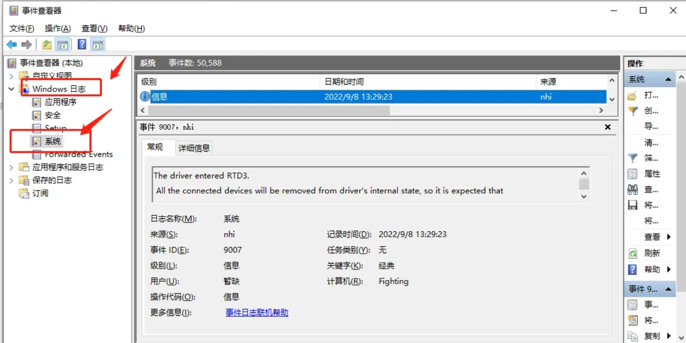
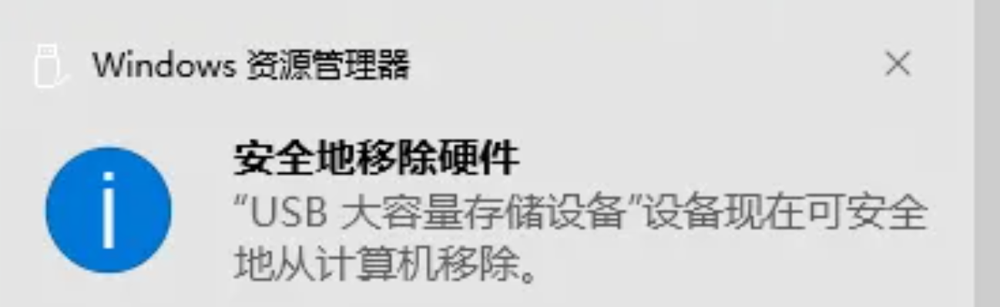

# 移动硬盘无法弹出的解决方法

当弹出移动硬盘的时候，容易遇到无法弹出的问题：

那么为了保护移动介质中的数据此时我们应该如何正常弹出设备呢？

1、此时应该在开始菜单下输入eventvwr命令打开事件查看器，如下图：

2、然后回车打开事件查看器，找到windows日志-系统，如下图：

3、然后在系统菜单下找到警告日志，右键属性，找到弹出移动介质报错的信息，定位弹出异常原因，如下图：

4、然后打开任务管理器，确认日志中提到的进程没有关联其他影响运行的进程，将进程结束，如下图：

5、再次进行移动介质的弹出操作，发现可以正常弹出移动介质设备了

本文转载自：https://blog.51cto.com/xiaozc/5662073