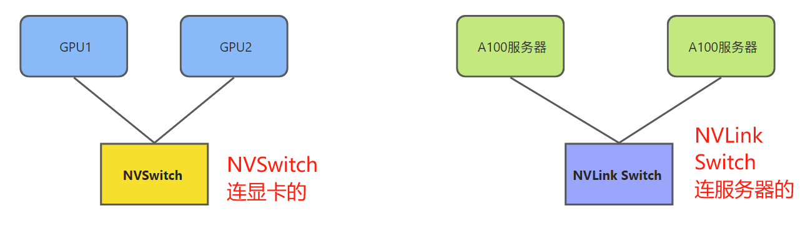
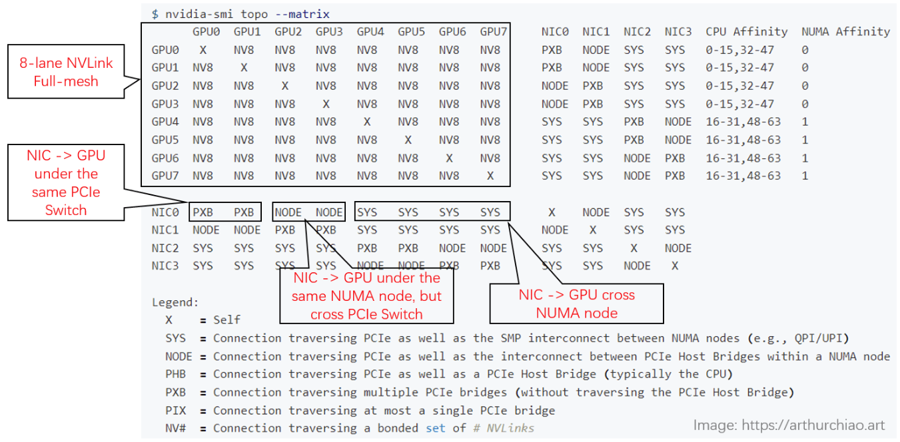
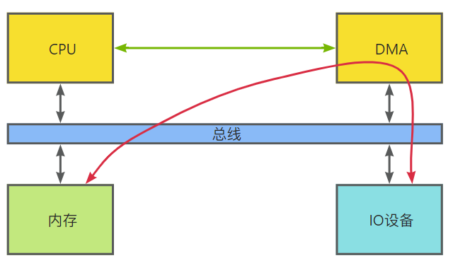
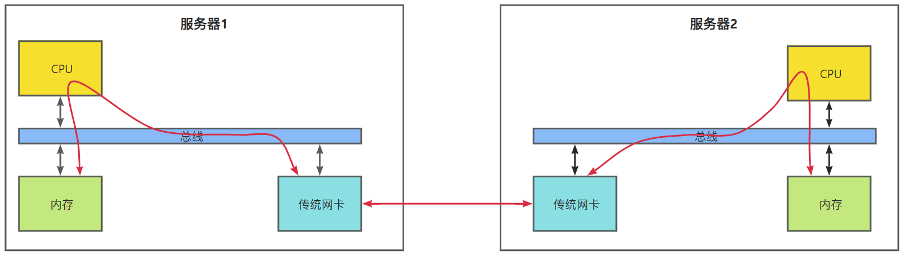
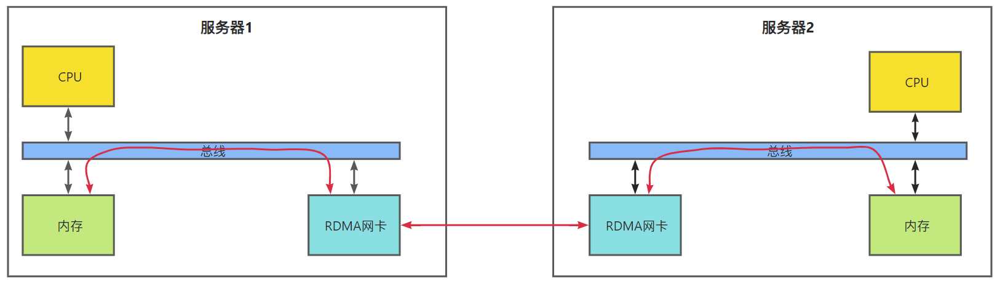
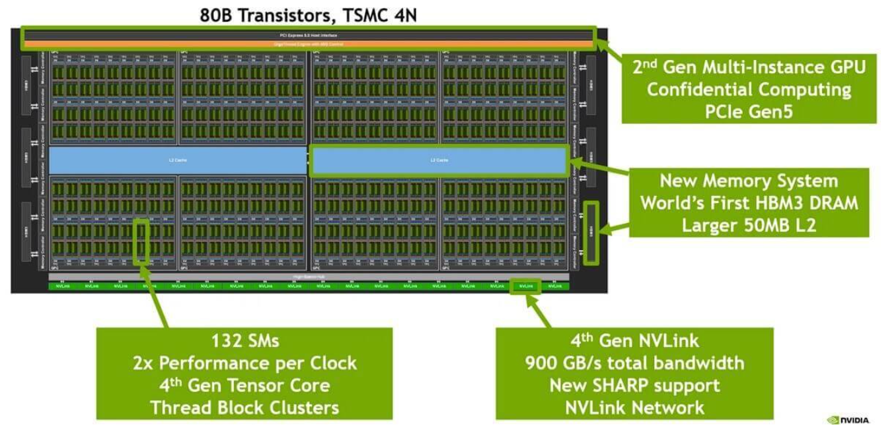
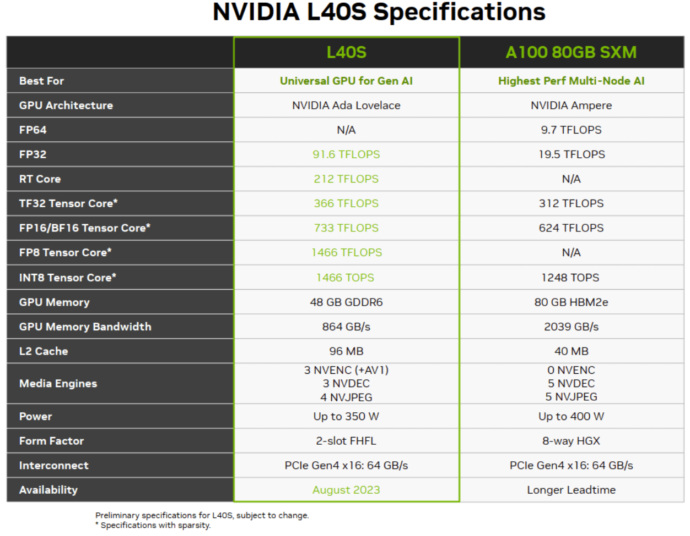
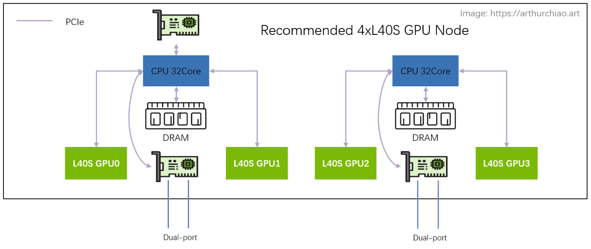
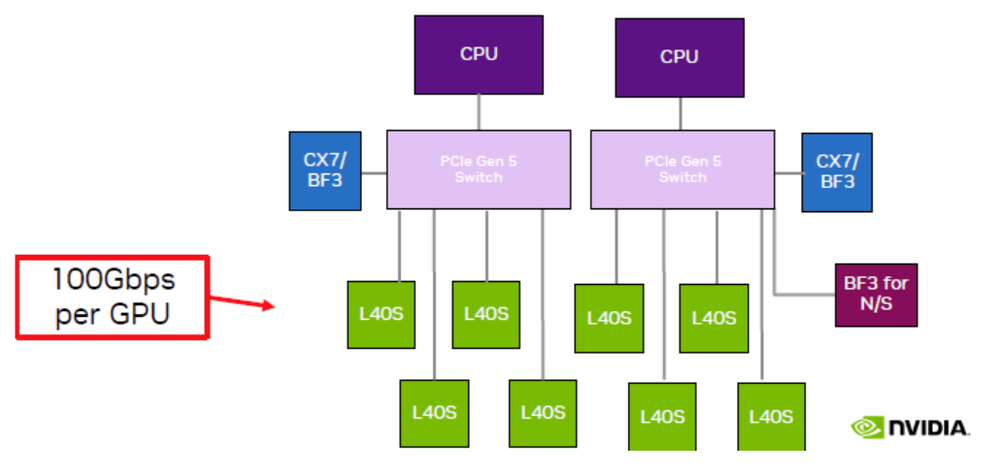

# 高性能GPU服务器硬件拓扑和集群组网

>转载自：http://arthurchiao.art/blog/gpu-advanced-notes-1-zh/#11-pcie-%E4%BA%A4%E6%8D%A2%E8%8A%AF%E7%89%87
>
>感谢原作者的分享！在此基础上改动为个人版本。

# 1 术语与基础

大模型训练一般都是用单机 8 卡 GPU 主机组成集群，机型包括 `8*{A100,A800,H100,H800}` 。 下面一台典型 8*A100 GPU 的主机内硬件拓扑：


需要重点理解的组成部件包括：

- PCIE交换芯片
- NVSwitch
- NVLink Switch
- HBM

本节将基于这张图来介绍一些概念和术语，有基础的可直接跳过。


## 1.1 PCIe 交换芯片

用于连接CPU、内存、存储（NVME）、GPU、网卡等**支持 PICe 的设备**，实现互联互通。

PCIe 目前有 5 代产品，最新的是 **`Gen5`**。


## 1.2 NVLink技术

### 1）定义

Wikipedia 上 [NVLink](https://en.wikipedia.org/wiki/NVLink) 上的定义：

> NVLink is a wire-based serial multi-lane near-range communications link developed by Nvidia. Unlike PCI Express, a device can consist of multiple NVLinks, and devices use mesh networking to communicate instead of a central hub. The protocol was first announced in March 2014 and uses a proprietary high-speed signaling interconnect (NVHS).

简单总结：同主机内多个GPU之间的一种高速互联方式，由NVSwitch连接同一主机内的多个GPU而构成。

1. 是一种短距离**通信链路**，能保证包的成功传输，提高性能，用于替代 PCIe；
2. 支持多 lane，链路带宽随 lane 数量线性增长；
3. 同一台 node 内的 GPU 通过 NVLink 以 **full-mesh** 方式（类似 spine-leaf）互联；
4. 是NVIDIA的专利技术。


### 2）NVLink技术演进

从2016年的第1代开始，到2022年已升级到第4 代。

图示为版本差异：主要区别是单条 NVLink 链路的 **lane 数量**以及每个 **lane 的带宽**（图中给的都是双向带宽）等：

![NVLink 演进。Image from: HotChips 2022 [1]](./../../img/image-20241012132051768.png)


### 3）NVLink总带宽的计算方式

- A100的双向带宽是600GB/s，单向带宽是300GB/s

```shell
# A100双向带宽的计算公式
# 一台8卡的A100服务器里总共有6个NVSwitch，每个NVSwitch中有两条lane，每条lane的速度是50GB/s,
2 lanes/NVSwitch * 6 NVSwitch * 50GB/s/lane = 600GB/s
```

- A800 被阉割了 4 条 lane，所以是双向带宽是400GB/s，单向带宽是200GB/s

```shell
8 lane * 50GB/s/lane = 400GB/s
```


### 4）监控NVLink带宽的方法

基于 DCGM 可以采集到实时 NVLink 带宽

![Metrics from dcgm-exporter [5]](./../../img/image-20241012132200770.png)


## 1.3 NVSwitch芯片

NVSwitch 是 NVIDIA 的一款**交换芯片**，封装在 GPU模组（module）上，用于**连接同一主机内GPU。**

如下图所示，为浪潮机器的真机图，左侧的8 个nvdia盒子就是 8 片 A100 GPU，而右侧的 6 块超厚散热片下面就是 NVSwitch 芯片。

![Inspur NF5488A5 NVIDIA HGX A100 8 GPU Assembly Side View. Image source: [2]](./../../img/image-20241012132323761.png)


## 1.4 NVLink Switch

>请注意，别和NVSwitch弄混淆了！

2022 年，NVIDIA 把NVSwitch芯片拿出来，做成了交换机，叫 NVLink Switch， 用来**跨主机连接 GPU 设备**。



## 1.5 HBM 

### 1）什么是HBM？

>美光副总裁暨计算与网络事业部计算产品事	业群总经理Praveen Vaidyanathan指出，芯片性能表现与存储器的频宽和容量成正相关，随着大语言模型（LLM）参数量增加，也需要更高频宽存储器，AI处理器才能顺利运行。

GDDR类型（传统）：（Graphics Double Data Rate）

- 在传统显卡中，GPU的显存采用GDDR类型，以平铺的方式封装在 GPU 周围，通过**较长的总线**与GPU相连。（单层设计，绕远路）
- GDDR6 的单芯片带宽通常在 14-18 Gbps 左右
- 功耗高，单芯片容量小，需要更高的频率来提高带宽，而且总线也长，需要更多能耗来驱动

HBM类型（新技术）：（High Bandwidth Memory）

- 可简单理解为多个DRAM透过先进封装堆叠起来，并且通过硅中介层（interposer）**与 GPU 直接连接**，减少了总线的长度和复杂性传输速度快，储存空间也更大。（多层设计，直连）
- HBM2 的带宽可以达到 256-512 GB/s 或更高。
- HBM 的能效更高，它的总线更宽，但工作频率较低，且通过堆叠设计缩短了显存和 GPU 之间的距离。这种设计显著降低了功耗。

HBM 的市场目前被 SK 海力士和三星等韩国公司垄断。


> 现在 CPU 也有用 HBM 的了，比如 [Intel Xeon CPU Max Series](https://www.intel.com/content/www/us/en/products/details/processors/xeon/max-series.html) 就自带了 64GB HBM2e。


### 2）HDM技术演进：

> From wikipedia [HBM](https://en.wikipedia.org/wiki/High_Bandwidth_Memory)

HBM已有5代：

| 版本  | Bandwidth       | Year | GPU                                                          |
| :---- | :-------------- | :--- | ------------------------------------------------------------ |
| HBM   | 128GB/s/package |      |                                                              |
| HBM2  | 256GB/s/package | 2016 | V100                                                         |
| HBM2e | ~450GB/s        | 2018 | `A100, ~2TB/s`; 华为 `Ascend 910B`                           |
| HBM3  | 600GB/s/site    | 2020 | H100, 3.35TB/s                                               |
| HBM3e | ~1TB/s          | 2023 | `H200`, [4.8TB/s](https://www.nvidia.com/en-us/data-center/h200/) |

![使用了 HBM 的近几代高端 NVIDIA GPU 显存带宽（双向），纵坐标是 TB/s。Image source: [3]](./../../img/image-20241012132627792.png)

- AMD MI300X 采用 192GB HBM3 方案，带宽 **`5.2TB/s`**；
- HBM3e 是 HBM3 的增强版，速度从 6.4GT/s 到 8GT/s。


## 1.6 带宽单位

大规模 GPU 训练的性能与数据传输速度有直接关系。这里面涉及到很多链路，比如 PCIe 带宽、内存带宽、NVLink 带宽、HBM 带宽、网络带宽等等。

- 网络习惯用 **`bits/second (b/s)`** 表示之外，并且一般说的都是**单向**（TX/RX）；
- 其他模块带宽基本用 `byte/sedond (B/s)` 或 `transactions/second (T/s)` 表示，并且一般都是**双向总带宽**。

比较带宽时注意区分和转换。


# 2 典型8卡A100/A800主机构成

## 2.1 主要部件

- 2 片 CPU（以及两边的内存[DRAM]，NUMA）
- 2 张网卡（用于连接存储、带内管理等）
- 4 个 PCIe Gen4 Switch 芯片（用于CPU与显卡连接）
- 6 个 NVSwitch 芯片（用于连接主机内的8块GPU）
- 8 个 GPU
- 8 个 GPU 专属网卡（GPU卡 - PCIE总线 - Infiniband网卡）

可参考下图构成：


### 1）存储网卡

通过 PCIe 直连 CPU，用途：

1. 从分布式存储读写数据，例如读训练数据，写checkpoint等。
2. 正常的 node 管理，ssh，监控采集等等。

官方推荐用 BF3 DPU。但其实只要带宽达标，用什么都行。组网经济点的话用 RoCE，追求最好的性能用 IB。


### 2）NVSwitch(删除)

8 个 GPU 通过 6 个 NVSwitch 芯片 full-mesh 连接，这个 full-mesh 也叫 **`NVSwitch fabric`**； 

full-mesh 里面的**每根线的带宽是 n \* bw-per-nvlink-lane**，比如：

A100 用的 NVLink3，每条lane的带宽是50GB/s

```shell
所以 full-mesh 里的每条线就是 12*50GB/s=600GB/s，注意这个是双向带宽，单向只有 300GB/s。
```

A800 是阉割版，12 lane 变成 8 lane

```shell
所以每条线 8*50GB/s=400GB/s，单向 200GB/s。
```


### 3）查看拓扑

使用`nvidia-smi topo`命令可以查看部件连接拓扑：

下面是一台 8*A800 机器上 **`nvidia-smi`** 显示的实际拓扑（网卡两两做了 bond，NIC 0~3 都是 bond）：



- GPU 之间（左上角区域）：都是 **`NV8`**，表示 **8 条 NVLink** 连接；

- NIC 之间：

  - 在同一片 CPU 上：**`NODE`**，表示**不需要跨 NUMA，但需要跨 PCIe 交换芯片**；
  - 不在同一片 CPU 上：**`SYS`**，表示**需要跨 NUMA**；

- GPU 和 NIC 之间：

  - 在同一片 CPU 上，且在同一个 PCIe Switch 芯片下面：**`PXB`**，表示**只需要跨 PCIe 交换芯片**；
  - 在同一片 CPU 上，且不在同一个 PCIe Switch 芯片下面：**`NODE`**，表示**需要跨 PCIe 交换芯片和 PCIe Host Bridge**；
  - 不在同一片 CPU 上：**`SYS`**，表示**需要跨 NUMA、PCIe 交换芯片，距离最远**；

  

## 2.2 GPU 训练集群组网

计算节点互联的网络架构：主要连接**计算网络**和**存储网络**


### 1）计算网络

GPU 网卡直连到叶层交换机（leaf），leaf 通过 full-mesh（点对点直连）的方式连接到脊层交换机（spine），形成跨主机 GPU 计算网络。

- 这个网络的目的是 GPU 与其他计算节点的 GPU交换数据；

- 服务器内部的GPU和存储网卡通过PCIe 交换芯片连接

  ```shell
  GPU <--> PCIe Switch <--> 存储网卡


### 2）存储网络

直连 CPU 的两张网卡，连接到另一张网络里，主要作用是读写数据，以及 SSH 管理等等。


### 3）RDMA概念

在了解RDMA之前，需要先了解DMA（全称为Direct Memory Access，即直接内存访问。意思是外设对内存的读写过程可以不用CPU参与而直接进行）

没有DMA的时候，外部设备读写内存需要绕道CPU走一圈。假设I/O设备为一个普通网卡，为了从内存拿到需要发送的数据，然后组装数据包发送到物理链路上，网卡需要通过总线告知CPU自己的数据请求。然后CPU将会把内存缓冲区中的数据复制到自己内部的寄存器中，再复制到I/O设备的存储空间中。如果数据量比较大，那么很长一段时间内CPU都会忙于搬移数据，而无法投入到其他工作中去。


CPU的最主要工作是计算，而不是进行数据复制，这种工作属于白白浪费了它的计算能力。为了给CPU“减负”，让它投入到更有意义的工作中去，后来人们设计了DMA机制：



可以看到总线上又挂了一个DMA控制器，它是专门用来读写内存的设备。有了它以后，当我们的网卡想要从内存中拷贝数据时，除了一些必要的控制命令外，整个数据复制过程都是由DMA控制器完成的。过程跟CPU复制是一样的，只不过这次是把内存中的数据通过总线复制到DMA控制器内部的寄存器中，再复制到I/O设备的存储空间中。CPU除了关注一下这个过程的开始和结束以外，其他时间可以去做其他事情。DMA控制器一般是和I/O设备在一起的，也就是说一块网卡中既有负责数据收发的模块，也有DMA模块。

好了，现在可以来学习RDMA了。

RDMA（Remote Direct Memory Access，远程直接内存访问）是一种高速网络互联技术，该技术主要设计目的是减少在数据传输过程中收发端的处理延迟以及资源消耗。RDMA技术使计算机能够直接访问远程计算机的内存，在内存层面进行数据传输而无需CPU频繁介入，从而显著增强网络通信性能。

传统网卡的通信方式：传统网络中，"服务器1给服务器2发消息"实际上做的是“把"服务器1内存中的一段数据，通过网络链路搬移到"服务器2的内存中”，而这一过程无论是发端还是收段，都需要CPU的指挥和控制，包括网卡的控制，中断的处理，报文的封装和解析等等。



使用RDMA网卡的通信方式：同样是把本端内存中的一段数据，复制到对端内存中，在使用了RDMA技术时，两端的CPU几乎不用参与数据传输过程（只参与控制面）。本端的网卡直接从内存的用户空间DMA拷贝数据到内部存储空间，然后硬件进行各层报文的组装后，通过物理链路发送到对端网卡。对端的RDMA网卡收到数据后，剥离各层报文头和校验码，通过DMA将数据直接拷贝到用户空间内存中。




### 3）RoCE vs. InfiniBand

不管是计算网络还是存储网络，都需要RDMA技术才能实现 AI 所需的高性能。RDMA**技术**的实现目前有**两种协议**选择：

- RoCEv2：公有云卖的 8 卡 GPU 主机基本都是这种网络；在性能达标的前提下，（相对）便宜；
- InfiniBand (IB)：同等网卡带宽下，性能比 RoCEv2 好 20% 以上，但是价格贵一倍。


## 2.3 数据链路带宽瓶颈分析


几个关键链路带宽都标在图上了，

1、同主机 GPU 之间：走 NVLink，双向 600GB/s，单向 **`300GB/s`**；

2、同主机 GPU 和自己的网卡之间：走 PICe Gen4 Switch 芯片，双向 64GB/s，单向 **`32GB/s`**；

3、跨主机 GPU 之间：需要通过网卡收发数据，这个就看网卡带宽了，

- `100Gbps=12.5GB/s`： 远低于PCIe Gen4 的单向带宽，所以跨机通信相比主机内通信性能要下降很多。
- `200Gbps==25GB/s`：已经**接近** PCIe Gen4 的单向带宽（推荐）。
- `400Gbps==50GB/s`：已经**超过** PCIe Gen4 的单向带宽。

因此在这种机型里，用 400Gbps 网卡作用不大，400Gbps 需要 PCIe Gen5 性能才能发挥出来。


# 3 典型8卡H100/H800主机构成

H系列的GPU按照主板规格（Board Form Factor）分为两种类型：

- PCIe Gen5
- SXM-5：性能更高一些


## 3.1 H100 芯片 layout

下面是一片 H100 GPU 芯片的内部结构：



- 台积电4nm工艺
- 采用第四代NVlink技术，最下面的绿色条是18条lane；NVLINK的双向总带宽900GB/s（18 * 50）
- 中间蓝色的是 L2 cache；
- 左右两侧是 **`HBM`** 芯片，即显存；

## 3.2 主机内硬件拓扑

跟 A100 8 卡机结构大致类似，区别：

1. NVSwitch 芯片从 6 个减少到了 4 个；真机图如下，


2.与 CPU 的互联从 PCIe Gen4 x16 升级到 **`PCIe Gen5 x16`**，双向带宽 **`128GB/s`**；


## 3.3 组网

与 A100 也类似，只是标配改成了 **`400Gbps`** 的 CX7 网卡， 否则网络带宽与 PCIe Switch 和 NVLink/NVSwitch 之间的差距更大了。


# 4 典型 `4*L40S/8*L40S` 主机

L40S 是今年（2023）即将上市的新一代“性价比款”多功能 GPU，**对标 A100**。 除了不适合训练基座大模型之外（后面会看到为什么），官方的宣传里它几乎什么都能干。 ~~价格的话，目前第三方服务器厂商给到的口头报价都是 A100 的 8 折左右~~。


## 4.1 L40S vs A100 配置及特点对比

L40S 最大的特点之一是 **time-to-market 时间短**，也就是从订货到拿到货周期比 A100/A800/H800 快很多。 这里面技术和非技术原因都有，比如：

- ~~不存在被美国禁售的功能~~（根据 2023.10 的新规定，已经禁售了），比如 **FP64 和 NVLink 都干掉了**；
- 使用 **`GDDR6`** 显存，不依赖 HBM 产能（及先进封装）；

价格便宜也有几方面原因，后面会详细介绍：

1. 大头可能来自 GPU 本身价格降低：因为去掉了一些模块和功能，或者用便宜的产品替代；
2. 整机成本也有节省：例如去掉了一层 PCIe Gen4 Swtich；不过相比于 4x/8x GPU，整机的其他部分都可以说送的了；


## 4.2 L40S 与 A100 性能对比

下面是一个官方标称性能对比：




具体场景的性能对比网上也有很多官方资料，这里就不列举了。简单来，

- 性能 1.2x ~ 2x（看具体场景）。
- 功耗：两台 L40S 和单台 A100 差不多


需要注意，**L40S 主机官方推荐的是单机 4 卡而不是 8 卡**（后面会介绍为什么）， 所以对比一般是用 `两台 4*L40S` vs `单台 8*A100`。另外，很多场景的性能提升有个 **大前提**：网络需要是 200Gbps RoCE 或 IB 网络，接下来介绍为什么。


## 4.3 L40S 攒机

### 推荐架构：`2-2-4`

相比于 A100 的 **`2-2-4-6-8-8`** 架构， 官方推荐的 L40S GPU 主机是 2-2-4 架构，一台机器物理拓扑如下：



最明显的变化是**去掉了 CPU 和 GPU 之间的 PCIe Switch 芯片**， 网卡和 GPU 都是直连 CPU 上自带的 PCIe Gen4 x16（64GB/s），

- 2 片 CPU（NUMA）
- 2 张双口 CX7 网卡（每张网卡 **`2\*200Gbps`**）
- 4 片 L40S GPU
- 另外，存储网卡只配 1 张（双口），直连在任意一片 CPU 上

这样**每片 GPU 平均 200Gbps 网络带宽**。


### 不推荐架构：`2-2-8`



如图，跟单机 4 卡相比，单机 8 卡需要引入两片 PCIe Gen5 Switch 芯片：

- 说是现在**PCIe Gen5 Switch 单片价格 1w 刀**（不知真假），一台机器需要 2 片；价格不划算；
- PCIe switch 只有一家在生产，产能受限，周期很长；
- 平摊到每片 GPU 的网络带宽减半；


## 4.4 组网

官方建议 4 卡机型，搭配 200Gbps RoCE/IB 组网。


## 4.5 数据链路带宽瓶颈分析


以同 CPU 下面的两种 L40S 为例，这里面有两条链路可选：

1. 直接通过 CPU 处理：`GPU0 <--PCIe--> CPU <--PCIe--> GPU1`
   - PCIe Gen4 x16 双向 64GB/s，单向 **`32GB/s`**；
   - **CPU 处理瓶颈？TODO**
2. 完全绕过 CPU 处理，**通过网卡去外面绕一圈再回来**：`GPU0 <--PCIe--> NIC <-- RoCe/IB Switch --> NIC <--PCIe--> GPU1`
   - PCIe Gen4 x16 双向 64GB/s，单向 **`32GB/s`**；
   - 平均每个 GPU 一个单向 200Gbps 网口，单向折算 **`25GB/s`**；
   - **需要 NCCL 支持**，官方说新版本 NCCL 正在针对 L40S 适配，默认行为就是去外面绕一圈回来；

第二种方式看着长了很多，但官方说其实比方式一还要快很多（这里还每太搞懂，CPU 那里是怎么处理的？）—— **前提是网卡和交换机配到位**：200Gbps RoCE/IB 网络。在这种网络架构下（网络带宽充足），

- **任何两片 GPU 的通信带宽和延迟都是一样的**，是否在一台机器内或一片 CPU 下面并不重要，集群可以**横向扩展**（scaling up，compared with scaling in）；
- GPU 机器成本降低；但其实对于那些对网络带宽要求没那么高的业务来说，是**把 NVLINK 的成本转嫁给了网络**，这时候必须要组建 200Gbps 网络，否则发挥不出 L40S 多卡训练的性能。

如果是方式二，同主机内 GPU 卡间的带宽瓶颈在网卡速度。即使网络是推荐的 2*CX7 配置，

- L40S： 200Gbps（网卡单向线速）
- A100： 300GB/s（NVLINK3 单向） == **`12x`**200Gbps
- A800： 200GB/s（NVLINK3 单向） == **`8x`**200Gbps

可以看到，**L40S 卡间带宽还是比 A100 NVLINK 慢了 12 倍**， 比 A800 NVLink 慢了 8 倍，所以**不适合数据密集交互的基础大模型训练**。


## 4.6 测试注意事项

如上，即便只测试单机 4 卡 L40S 机器，也需要搭配 200Gbps 交换机，否则卡间性能发挥不出来。


# 5 典型 `8*H20` GPU 服务器（2024 更新）

H20 是 2023 年发布，2024 年正式开始交付的 GPU。面向中国大陆市场，填补 A800/L40S 等等被禁之后的产品空缺。

## 5.1 显存：**`8\*96GB`**

```
$ nvidia-smi
+---------------------------------------------------------------------------------------+
| NVIDIA-SMI 535.161.03             Driver Version: 535.161.03   CUDA Version: 12.2     |
|-----------------------------------------+----------------------+----------------------+
| GPU  Name                 Persistence-M | Bus-Id        Disp.A | Volatile Uncorr. ECC |
| Fan  Temp   Perf          Pwr:Usage/Cap |         Memory-Usage | GPU-Util  Compute M. |
|                                         |                      |               MIG M. |
|=========================================+======================+======================|
|   0  NVIDIA H20                     On  | 00000000:04:00.0 Off |                    0 |
| N/A   24C    P0              72W / 500W |      0MiB / 97871MiB |      0%      Default |
|                                         |                      |             Disabled |
+-----------------------------------------+----------------------+----------------------+
|   1  NVIDIA H20                     On  | 00000000:23:00.0 Off |                    0 |
| N/A   24C    P0              71W / 500W |      0MiB / 97871MiB |      0%      Default |
|                                         |                      |             Disabled |
+-----------------------------------------+----------------------+----------------------+
...
+-----------------------------------------+----------------------+----------------------+
|   7  NVIDIA H20                     On  | 00000000:E4:00.0 Off |                    0 |
| N/A   24C    P0              72W / 500W |      0MiB / 97871MiB |      0%      Default |
|                                         |                      |             Disabled |
+-----------------------------------------+----------------------+----------------------+
```

GPU 最大功耗 `8*500W`。

## 5.2 卡间互联：NVLINK `x18 lanes = 900GB/s`

```
$ nvidia-smi topo -m
        GPU0    GPU1    GPU2    GPU3    GPU4    GPU5    GPU6    GPU7    NIC0    NIC1    CPU Affinity    NUMA Affinity   GPU NUMA ID
GPU0     X      NV18    NV18    NV18    NV18    NV18    NV18    NV18    SYS     SYS     0-95,192-287    0               N/A
GPU1    NV18     X      NV18    NV18    NV18    NV18    NV18    NV18    SYS     SYS     0-95,192-287    0               N/A
GPU2    NV18    NV18     X      NV18    NV18    NV18    NV18    NV18    SYS     SYS     0-95,192-287    0               N/A
GPU3    NV18    NV18    NV18     X      NV18    NV18    NV18    NV18    SYS     SYS     0-95,192-287    0               N/A
GPU4    NV18    NV18    NV18    NV18     X      NV18    NV18    NV18    NODE    NODE    96-191,288-383  1               N/A
GPU5    NV18    NV18    NV18    NV18    NV18     X      NV18    NV18    NODE    NODE    96-191,288-383  1               N/A
GPU6    NV18    NV18    NV18    NV18    NV18    NV18     X      NV18    PHB     PHB     96-191,288-383  1               N/A
GPU7    NV18    NV18    NV18    NV18    NV18    NV18    NV18     X      NODE    NODE    96-191,288-383  1               N/A
NIC0    SYS     SYS     SYS     SYS     NODE    NODE    PHB     NODE     X      PIX
NIC1    SYS     SYS     SYS     SYS     NODE    NODE    PHB     NODE    PIX      X
```

可以看到双向 **`18 lanes \* 50GB/s/lane= 900GB/s`**（单向 450GB/s）。 作为对比，`8*A800` NVLINK 是 8 lanes，见前面章节。


## 5.3 网络

这个看各服务器厂商怎么配了。下面是国内某家的 PCIe 和网卡信息：

```
$ lspci
00:00.0 Host bridge: Advanced Micro Devices, Inc. [AMD] Device 14a4 (rev 01)
c0:00.2 IOMMU: Advanced Micro Devices, Inc. [AMD] Device 149e (rev 01)
c0:01.1 PCI bridge: Advanced Micro Devices, Inc. [AMD] Device 14ab (rev 01)
c1:00.0 PCI bridge: Broadcom / LSI PEX890xx PCIe Gen 5 Switch (rev b0)           # <-- PCIe Gen5
c2:00.0 PCI bridge: Broadcom / LSI PEX890xx PCIe Gen 5 Switch (rev b0)
c3:00.0 3D controller: NVIDIA Corporation Device 2329 (rev a1)
c6:00.0 Ethernet controller: Mellanox Technologies MT2894 Family [ConnectX-6 Lx] # <-- Mellanox CX6
c6:00.1 Ethernet controller: Mellanox Technologies MT2894 Family [ConnectX-6 Lx]
...
```

RDMA：

```
$ ibstat
CA 'mlx5_0'
        CA type: MT4127
        Number of ports: 1
        Port 1:
                State: Down
                Physical state: Disabled
                Rate: 40
                Base lid: 0
                LMC: 0
                SM lid: 0
                Capability mask: 0x00010000
                Link layer: Ethernet
CA 'mlx5_1'
        CA type: MT4127
        Number of ports: 1
        Port 1:
                State: Down
                Physical state: Disabled
                Rate: 40
                Base lid: 0
                LMC: 0
                SM lid: 0
                Capability mask: 0x00010000
                Link layer: Ethernet
```


## 5.4 训练性能：`8*H20 vs 8*A800`

单机 8 卡训练性能（实测数据，但大家用的模型、框架、数据集等可能各不相同，因此这里的结果仅供参考）：

| GPU Node (NVLINK interconnect) | Throughput            |
| :----------------------------- | :-------------------- |
| 8*A800-80GB                    | **`~30`** samples/sec |
| **`8\*H20-96GB`**              | **`~21`** samples/sec |


相比 A800，H20 纸面算力阉割了一半左右 [6]，但在 NVLINK/cache 等地方补了一下，所以实际性能（只）下降了 1/3。


# 参考资料

1. [NVLink-Network Switch - NVIDIA’s Switch Chip for High Communication-Bandwidth SuperPODs](https://hc34.hotchips.org/), Hot Chips 2022
2. [ChatGPT Hardware a Look at 8x NVIDIA A100 Powering the Tool](https://www.servethehome.com/chatgpt-hardware-a-look-at-8x-nvidia-a100-systems-powering-the-tool-openai-microsoft-azure-supermicro-inspur-asus-dell-gigabyte/), 2023
3. [NVIDIA Hopper Architecture In-Depth](https://developer.nvidia.com/blog/nvidia-hopper-architecture-in-depth/), nvidia.com, 2022
4. [DGX A100 review: Throughput and Hardware Summary](https://www.microway.com/hpc-tech-tips/dgx-a100-review-throughput-and-hardware-summary/), 2020
5. [Understanding NVIDIA GPU Performance: Utilization vs. Saturation](http://arthurchiao.art/blog/understanding-gpu-performance/), 2023
6. [GPU Performance (Data Sheets) Quick Reference (2023)](http://arthurchiao.art/blog/gpu-data-sheets/)
