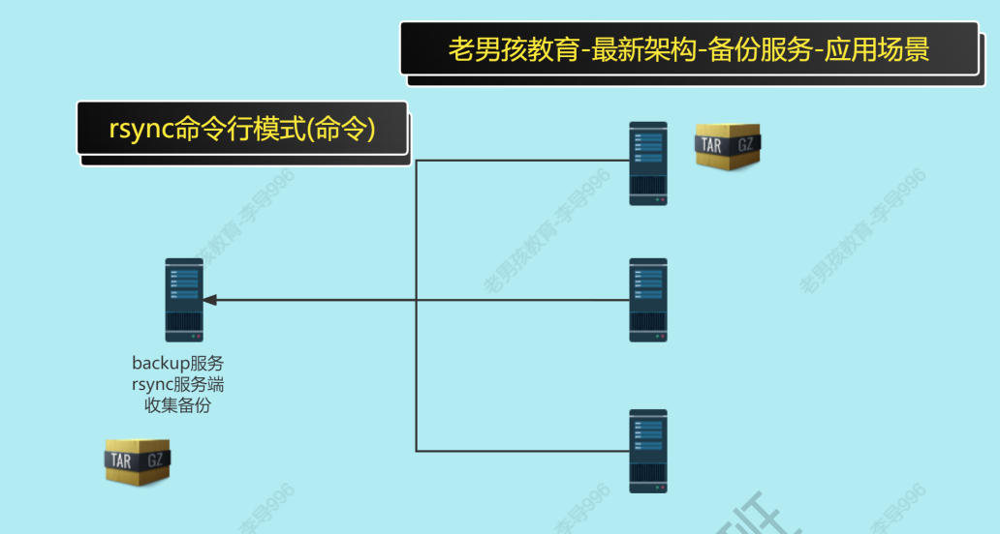

# 一、备份服务介绍

什么是备份服务？

- 定时/实时打包重要数据到备份服务器中

备份服务使用什么实现？

- 使用rsyncd服务，在不同主机之间传输数据


>虚拟机准备：
>
>一台存储服务器：nfs01	172.16.1.31/24
>
>一台备份服务器：backup01	172.16.1.41/24

## 1.1 rsync服务的特点

- rsync既是服务，也是命令
- 使用方便，具有多种模式
- 传输数据的时候是增量备份，比scp的全量备份效率高

## 1.2 rsync服务的企业应用场景

| 应用场景(业务场景)                            | 应用建议                                                   |
| --------------------------------------------- | ---------------------------------------------------------- |
| rsync作为命令使用                             | 临时拉取,推送数据.未来这个需求可以通过scp命令实现.         |
| 定时备份:rsync服务+定时任务                   | 定时备份,定期备份案例.(定时任务进行备份+通过rsync传输备份) |
| 实时同步:rsync服务+sersync/lsyncd实现实时同步 | 解决存储服务单点问题                                       |
| rsync服务与异地容灾                           | 找一个异地的服务器存放备份                                 |

> 单点问题: 同一个功能/同一个服务,只有1台节点.  




                                 |
| -P                       | 显示每rsync -av . root@10.0.0.31:/tmp/ --exclude=04 rsync -av . root@10.0.0.31:/mnt --exclude={04,05}个文件传输过程 (进度条) 断点续传 --partial --progress |
| --bwlimit                | 限速,注意不要与-z一起使用.                                   |
| --exclude --exclude-from | 排除                                                         |
| --delete                 | 目标目录与源目录保持一致的传输(高度保持2遍一致,实时同步)     |

## 2.1 rsync使用模式

| 模式                      | 应用场景                                    |
| ------------------------- | ------------------------------------------- |
| 本地模式(了解)            | 不推荐使用                                  |
| 远程模式                  | 传输数据(临时使用可以使用scp替代)           |
| rsync守护进程模式(daemon) | 传输数据(不需要密码),用于定时备份,定时同步. |

## 2.2 本地模式

```shell
rsync -a /etc/ /tmp/
```

>在rsync对于目录 /etc/ /etc 是有区别的.
>/etc /etc目录+目录的内容
>/etc/ /etc/目录下面的内容  

## 2.3 远程模式（常用）

1对1进行远程传输数据  

| 格式       |                           |                     |
| ---------- | ------------------------- | ------------------- |
| rsync -a   | 源文件                    | 目标                |
| 推送:rsync | /etc/hostname             | root@10.0.0.31:/tmp |
| 拉取:rsync | root@10.0.0.31:/etc/hosts | /opt/               |

案例：

```shell
#推送/etc/hostname 到10.0.0.31的/tmp/目录
rsync -a /etc/hostname root@10.0.0.31:/tmp
#推送/etc 目录及目录内容 到31的 /tmp下面
#推送第1次 全量
rsync -av /etc root@10.0.0.31:/tmp
#推送第2次 发现没有推送
rsync -av /etc root@10.0.0.31:/tmp
#创建文件再次推送
touch /etc/lidao.txt
rsync -av /etc root@10.0.0.31:/tmp
#通过scp推送 /etc 目录及目录内容 到31的 /opt下面
scp -r /etc/ root@10.0.0.31:/opt/
-r 递归传输
```

## 2.4 守护进程模式（常用）

配置和测试流程

### 2.4.1 检查是否安装

！在备份服务器中安装和配置！

```shell
检查安装 更新
yum install -y rsync
检查软件包内容
/etc/rsyncd.conf #配置文件
/usr/bin/rsync #命令
/usr/lib/systemd/system/rsyncd.service #systemctl对应
的配置文件.
```

| 软件包内容                             |                                       |
| -------------------------------------- | ------------------------------------- |
| /etc/rsyncd.conf                       | 配置文件(服务端配置文件,守护进程模式) |
| /usr/bin/rsync                         | rsync命令                             |
| /usr/lib/systemd/system/rsyncd.service | systemctl控制rsyncd服务的配置文件     |

### 2.4.2 进行配置

#### a) 配置文件详解


#### b) 服务端配置

```shell
[root@backup /oldboy]# cat /etc/rsyncd.conf
#created by oldboy 15:01 2009-6-5
##rsyncd.conf start##
fake super =yes
uid = rsync
gid = rsync
use chroot = no
max connections = 2000
timeout = 600
pid file = /var/run/rsyncd.pid
lock file = /var/run/rsync.lock
log file = /var/log/rsyncd.log
ignore errors
read only = false
list = false
#hosts allow = 10.0.0.0/24
#hosts deny = 0.0.0.0/32
auth users = rsync_backup
secrets file = /etc/rsync.password
#####################################
[data]
comment = www by old0boy 14:18 2012-1-13
path = data
```

#### c) 后续配置

```shell
#1.添加虚拟用户
useradd -s /sbin/nologin -M rsync
# 检查用户是否创建成功
[root@backup01[ ~]#id rsync
uid=1001(rsync) gid=1001(rsync) groups=1001(rsync)
#2.创建密码文件
密码文件格式: 用户名:密码
echo 'rsync_backup:123 ' >/etc/rsync.password
chmod 600 /etc/rsync.password
#3.共享目录与权限
mkdir /data/
chown rsync.rsync /data
```

#### d) 启动服务 

```shell
#启动服务
systemctl enable rsyncd
systemctl start rsyncd

#检查进程
ps -ef |grep rsync

#检查端口
ss -lntup |grep rsync
```

### 2.4.3 访问测试

| rsync守护进程模式客户端命令               |            |                              |
| ----------------------------------------- | ---------- | ---------------------------- |
| rsync -avz                                | /etc/hosts | rsync_backup@10.0.0.41::data |
| rsync_backup是服务端配置文件中的认证用户. |            |                              |
| data表示模块名字                          |            |                              |

#### a) 本地测试

```shell
[root@backup ~]# rsync -avz /etc/hostname
rsync_backup@10.0.0.41Վʦdata
Password:
sending incremental file list
hostname
sent 102 bytes received 43 bytes 41.43 bytes/sec
total size is 7 speedup is 0.05
[root@backup ~]# ll /data/
total 4
-rw-r--r-- 1 rsync rsync 7 Aug 16 16:02 hostname
```

#### b) 客户端测试

基本测试  

```shell
[root@nfs01 ~]# rsync -avz /etc/hosts rsync_backup@172.16.1.41::data
Password:
sending incremental file list
hosts
sent 214 bytes received 43 bytes 73.43 bytes/sec
total size is 329 speedup is 1.28
```

免密传输

```shell
# 创建密码文件
echo 123 >/etc/client.rsync
# 设置文件权限, password file must not be other-accessible
chmod 600 /etc/client.rsync
rsync -avz /etc/hosts rsync_backup@172.16.1.41::data --password-file=/etc/client.rsync
```


### 2.4.4 访问控制-安全措施

IP限制

```shell
# 配置文件修改
hosts allow  10.0.0.0/24 # 只准许指定的ip或网段访问.
hosts deny 0.0.0.0/32 # 拒绝  
```

速度限制

```shell
rsync -aP --bwlimit=500kb /tmp/1g 10.0.0.31:/mnt/
```

传输并排除

```shell
rsync -av . root@10.0.0.31:/tmp/ --exclude=04
rsync -av . root@10.0.0.31:/mnt --exclude={04,05}

# 通过文件内容进行排除
[root@backup /oldboy]# cat /tmp/paichu.txt
03
05
10
[root@backup /oldboy]# rsync -av . root@10.0.0.31:~ --exclude-from=/tmp/paichu.txt
```

保持源与目标数据一致  

```shell
rsync -avP --delete . root@10.0.0.31:/tmp/
```


