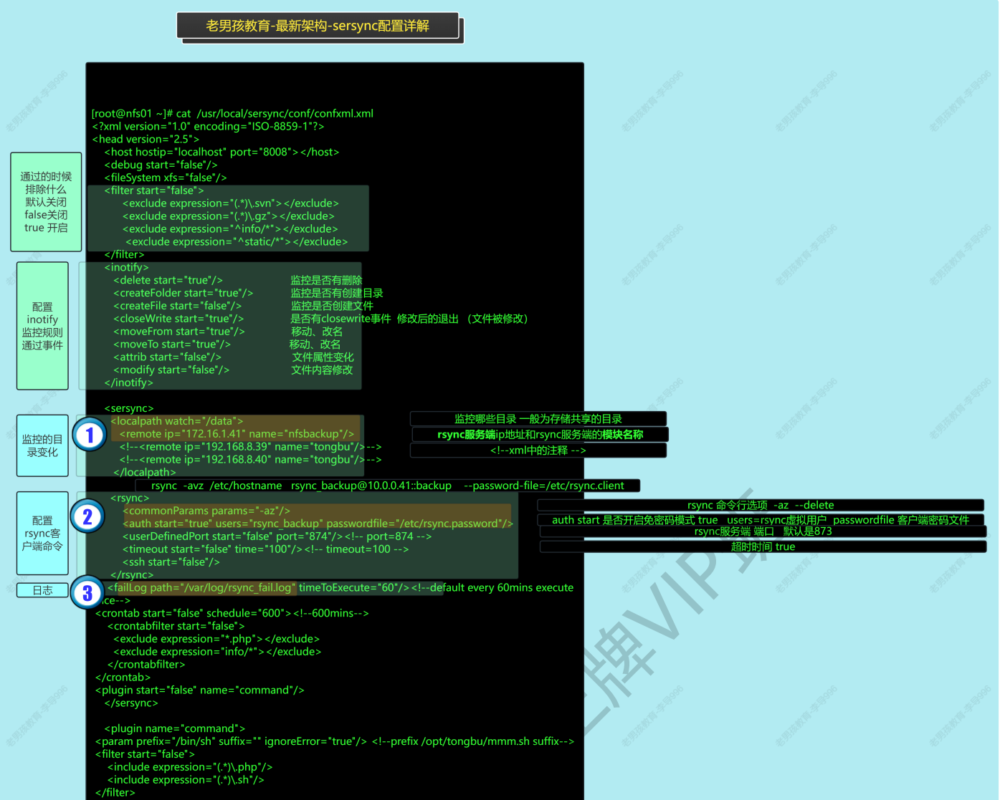

# 一、Sersync数据实时同步

## 1.1. sersync实时同步简介

>实时同步的3种方法：
>
>- inotify(bug需要书写脚本,不推荐使用.):是个命令监控指定目录是否发生变化.
>- sersync(国产开源,内置inotify+rsync命令,一个命令+一个配置文件) 推荐
>- lsyncd(目前一些公司在使用,课后研究.)  

实时同步架构如下：


sersync实时同步的原理:

- 实时同步通过inotify + rsync实现
- inotify监控目录，通过rsync把变化的文件推送走

## 1.2 配置Sersync

### 1.2.1 rysnc服务准备

备份服务器（作为服务端）

```shell
# 配置rsync服务端
[root@backup01[ /]#cat /etc/rsyncd.conf
...
[nfsbackup]
comment = 实时同步
path = /nfsbackup

# 创建目录
[root@backup01[ /]#mkdir /nfsbackup
[root@backup01[ /]#chown rsync.rsync /nfsbackup/
```

nfs服务器（作为客户端）

```shell
echo 123 > /etc/client.rsync
chmod 600 /etc/client.rsync

# 测试传输，可以推送成功
[root@nfs01[ /]#rsync -av /etc/hosts rsync_backup@172.16.1.41::nfsbackup --password-file=/etc/client.rsync
sending incremental file list
hosts

sent 247 bytes  received 43 bytes  580.00 bytes/sec
total size is 158  speedup is 0.54
```

### 1.2.2 sersync部署

在客户端（nfs）安装

```shell
# github下载sersync
https://github.com/wsgzao/sersync

# 解压
tar -vxf sersync2.5.4_64bit_binary_stable_final.tar.gz

# 创建第三方app专用存放路径
/app/tools/sersync/
/app/tools/sersync/bin/
/app/tools/sersync/conf/

# 把解压后的文件放进去
[root@nfs01[ /app/GNU-Linux-x86]#mv sersync2 /app/tools/sersync/bin/
[root@nfs01[ /app/GNU-Linux-x86]#mv confxml.xml /app/tools/sersync/conf/

# 设置软链接
[root@nfs01[ /app/tools/sersync/bin]#ln /app/tools/sersync/bin/sersync2 -s /bin
```

修改配置文件config.xml

```shell
<sersync>
	<localpath watch="/data/">
		<remote ip="172.16.1.41" name="nfsbackup"/>
...
 	<rsync>
 		<commonParams params="-az"/>
 		<auth start="true" users="rsync_backup" passwordfile="/etc/client.rsync"/>
...
	<failLog path="/var/log/rsync_fail_log.sh" timeToExecute="60"/><!--default every 60mins execute once-->
...
```

参考如下：


配置文件的详细解析：



启动sersync

```shell
[root@nfs01[ /data]#sersync2 -rdo /app/tools/sersync/conf/confxml.xml
set the system param
execute：echo 50000000 > /proc/sys/fs/inotify/max_user_watches
execute：echo 327679 > /proc/sys/fs/inotify/max_queued_events
parse the command param
option: -r      rsync all the local files to the remote servers before the sersync work
option: -d      run as a daemon
option: -o      config xml name：  /app/tools/sersync/conf/confxml.xml
daemon thread num: 10
parse xml config file
host ip : localhost     host port: 8008
daemon start，sersync run behind the console
use rsync password-file :
user is rsync_backup
passwordfile is         /etc/client.rsync
config xml parse success
please set /etc/rsyncd.conf max connections=0 Manually
sersync working thread 12  = 1(primary thread) + 1(fail retry thread) + 10(daemon sub threads)
Max threads numbers is: 22 = 12(Thread pool nums) + 10(Sub threads)
please according your cpu ，use -n param to adjust the cpu rate
------------------------------------------
rsync the directory recursivly to the remote servers once
working please wait...
execute command: cd /data && rsync -az -R --delete ./ rsync_backup@172.16.1.41::nfsbackup --password-file=/etc/client.rsync >/dev/null 2>&1
run the sersync:
watch path is: /data
```

接入nfs服务

```shell
[root@nfs01[ /app/tools/sersync/bin]#cat /etc/exports
/data/  172.16.1.0/24(rw)	# 用这个
/nfsdata/       172.16.1.0/24(rw,all_squash,anonuid=1999,anongid=1999)
```

web服务器挂载nfs盘

```shell
[root@web01[ /]#mount -t nfs 172.16.1.31:/data /upload
```

### 1.2.3 联调

测试实时同步情况

```shell
# web01创建
[root@web01[ /upload]#>web01.data

# backup实时同步
Every 2.0s: tree -F /nfsbackup  
/nfsbackup
└── web01.data

# web01删除
[root@web01[ /upload]#rm web01.data -fr

# backup实时同步
Every 2.0s: tree -F /nfsbackup                                                                 
/nfsbackup
```


