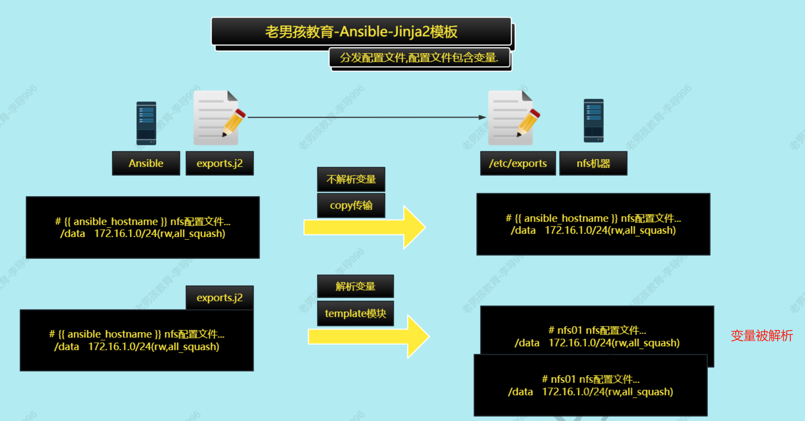

# Ansible集群自动化维护（三）

主要内容：Ansible流程控制和调试方法

# 1 流程控制

流程控制分为

- handler
- when
- loop/with_items  

## 1.1 handler触发器

应用场景：

- 一般用于分发配置文件的时候.
- 如果配置文件发生变化则重启服务,如果没有变化则重启  

案例01：没有使用触发器，无论下发文件有没有改变，都需要重启服务

```shell
- hosts: backup
  tasks:
  - name: 分发配置文件
    copy:
    src: files/exports
    dest: /etc/exports
    backup: yes
  - name: 重启服务
    systemd:
    name: nfs
    state: reloaded
```

使用触发器之后

```shell
[root@mn01[ /server/scripts/playbook]#cat 10-handler.yml
- hosts: backup01
  gather_facts: no
  tasks:
    - name: 分发配置文件
      copy:
        src: /server/files/exports
        dest: /etc/exports
        backup: yes
      notify:
        - 重启服务
  handlers:
    - name: 重启服务
      systemd:
        name: nfs
        state: reloaded
```

执行效果：

- 下发下去的文件识别“有改变”，则触发handler重启服务。
- 如文件没有改变，则不触发重启服务的handler

```shell
[root@mn01[ /server/scripts/playbook]#ansible-playbook 10-handler.yml
 _________________
< PLAY [backup01] >
...
 _______________
< TASK [分发配置文件] >
 ---------------
        \   ^__^
         \  (oo)\_______
            (__)\       )\/\
                ||----w |
                ||     ||

changed: [172.16.1.41]
 ________________________
< RUNNING HANDLER [重启服务] >
 ------------------------
        \   ^__^
         \  (oo)\_______
            (__)\       )\/\
                ||----w |
                ||     ||

changed: [172.16.1.41]
...
```

## 1.2 when判断

作用：

- 用于给ans运行的task(模块)设置条件,满足或不满足条件在运行对应的模块.

应用建议：

- when进行判断,一般与变量一起使用.
- when条件一般与facts变量或register变量一起使用  

### 1.2.1 单个条件

案例：只想在web01上执行软件安装操作（以Debug msg方式模拟）

```shell
[root@mn01[ /server/scripts/playbook]#cat 11-when.yml
- hosts: all
  tasks:
    - name: 只有web01安装软件（输出信息）
      debug:
        msg: "这是web01，正在安装软件"
      when: ansible_hostname == "web01"
      
```

执行效果：

```shell
[root@mn01[ /server/scripts/playbook]#ansible-playbook 11-when.yml
 ____________
< PLAY [all] >
 ------------
...
 ________________________
< TASK [Gathering Facts] >
...
ok: [172.16.1.41]
ok: [172.16.1.7]
ok: [172.16.1.31]
 __________________________
< TASK [只有web01安装软件（输出信息）] >
 --------------------------
        \   ^__^
         \  (oo)\_______
            (__)\       )\/\
                ||----w |
                ||     ||

ok: [172.16.1.7] => {
    "msg": "这是web01，正在安装软件"
}
skipping: [172.16.1.31]
skipping: [172.16.1.41]
...
```

> 扩展1：
>
> ```shell
> # 也可以做系统方面的判断，如
> 	  when: ansible_distribution == "CentOS"
> # 具体参数，可以通过以下命令获取
> [root@mn01[ /server/scripts/playbook]#ansible web01 -m setup | grep ansible
> "ansible_facts": {
>     "ansible_all_ipv4_addresses": [
>     "ansible_all_ipv6_addresses": [
>     "ansible_apparmor": {
>     "ansible_architecture": "x86_64",
>     "ansible_bios_date": "11/12/2020",
>     "ansible_bios_version": "6.00",
>     "ansible_cmdline": {
>     "ansible_date_time": {
>     "ansible_default_ipv4": {
>     "ansible_default_ipv6": {},
>     "ansible_device_links": {
>     "ansible_devices": {
>     "ansible_distribution": "CentOS",
>     "ansible_distribution_file_parsed": true,
>     "ansible_distribution_file_path": "/etc/redhat-release",
>     "ansible_distribution_file_variety": "RedHat",
>     "ansible_distribution_major_version": "7",
>     "ansible_distribution_release": "Core",
>     "ansible_distribution_version": "7.9",
> ...
> ```
> 

>扩展2：
>
>```shell
>when中使用的符号
>== 等于
>!= 不等于
>is match(web)
>ansible_hostname is match("web|backup") #类似于grep,正则.
>ansible_hostname is not match("web|backup") #取反,排除.
>```

### 1.2.3 多个条件

当存在多个条件时，可以使用and和or

```shell
# 方法一
when: #条件1 条件2 同时成立 相当于使用and.
  - ansible_distribution == "CentOS"
  - ansible_hostname is match("web|backup")
  
# 方法二：
when: ansible_distribution == "CentOS" and ansible_hostname is match("web|backup")
```


## 1.3 循环

### 1.3.1 循环单个变量

循环的两种方式：

- with_items
- loops

常用于批量创建用户、文件夹、重启服务等

案例01：批量启动服务，rpcbind然后nfs

```shell
- hosts: backup01
  gather_facts: false
  tasks:
    - name: restared rpcbind and nfs
      systemd:
        name: "{{ item }}"
        state: restarted
      loop:	# 或者with_items
        - rpcbind
        - nfs
```

执行效果：

```she
[root@mn01[ /server/scripts/playbook]#ansible-playbook 12-loop.yml
 _________________
< PLAY [backup01] >
 -----------------
 _________________________________
< TASK [restared rpcbind and nfs] >
 ---------------------------------
changed: [172.16.1.41] => (item=rpcbind)
changed: [172.16.1.41] => (item=nfs)
 ____________
...
```

### 1.3.2 循环多个变量

循环多个变量的例子：批量添加用户

```shell
[root@mn01[ /server/scripts/playbook]#cat 13-loop-adduser.yml
- hosts: backup01
  tasks:
    - name: 批量添加用户
      user:
        name: "{{ item.name }}"
        uid: "{{ item.uid }}"
        state: present
      with_items:
        - { name: 'user01', uid: 2020 }
        - { name: 'user02', uid: 2021 }
        - { name: 'user03', uid: 2022 }
```

执行效果：

```shell
[root@mn01[ /server/scripts/playbook]#ansible-playbook 13-loop-adduser.yml
 _________________
< PLAY [backup01] >
 -----------------
 ________________________
< TASK [Gathering Facts] >
 ------------------------
ok: [172.16.1.41]
 _______________
< TASK [批量添加用户] >
 ---------------
changed: [172.16.1.41] => (item={u'name': u'user01', u'uid': 2020})
changed: [172.16.1.41] => (item={u'name': u'user02', u'uid': 2021})
changed: [172.16.1.41] => (item={u'name': u'user03', u'uid': 2022})
...
```


# 2 剧本调试

分为：

- 剧本单步执行：如何检查语法
- tag标签：如何运行指定task
- 忽略错误 ：如中间发生错误是否往后继续

## 2.1 检查语法和单步执行

选项如下：

- <font color=blue>**-C**</font> --check 模拟运行,不作出改变,一些变量可能会提示报错,因为-C没有真正运行剧本.
- <font color=blue>**--syntax-check**</font> 只做语法检查,不运行.
- <font color=blue>**-step**</font> 单步运行. y执行这个task,n忽略这个task,c自动运行  

## 2.2 tag标签

以部署nfs服务的playbool为例，剧本中打上了几处tags，代码如下：

```shell
[root@mn01[ /server/scripts/playbook]#cat 14-deploy-nfs.yml
# 服务端
- hosts: backup01
  tasks:
    - name: 01. 安装服务
      yum:
        name: nfs-utils, rpcbind
        state: present
      # 打标签tag
      tags:
        - 01.install
    - name: 02. 修改配置文件
      lineinfile:
        path: /etc/exports
        line: "/backup-nfs 172.16.1.0/24(rw, all_squash)"
        create: true
      tags:
        - 02.conf
    - name: 03. 创建共享目录并修改所有者
      file:
        path: /backup-nfs
        owner: nfsnobody
        group: nfsnobody
        state: directory
      tags:
        - 03.dir
    - name: 04. 启动服务
      systemd:
        name: "{{ item }}"
        state: started
        enabled: yes
      loop:
        - rpcbind
        - nfs
      tags:
        - 04.start_srv


# 客户端
- hosts: web01
  tasks:
    - name: 01. 部署nfs-utils
      yum:
        name: nfs-utils
        state: present
    - name: 02. 挂载nfs
      mount:
        src: 172.16.1.41:/backup-nfs
        path: /ans-upload
        fstype: nfs
        state: mounted
```

在运行剧本的时候，可以通过：

- -t 运行指定的标签,如果多个标签通过","分割

```shell
[root@mn01[ /server/scripts/playbook]#ansible-playbook -t 02.conf 14-deploy-nfs.yml
 _________________
< PLAY [backup01] >
 -----------------
...
ok: [172.16.1.41]
 ___________________
< TASK [02. 修改配置文件] >
 -------------------
ok: [172.16.1.41]
 ______________
< PLAY [web01] >
 --------------
 ________________________
< TASK [Gathering Facts] >
 ------------------------
...
```

- --skip-tags 排除指定的tags,如果多个标签通过","分割  

```shell
[root@mn01[ /server/scripts/playbook]#ansible-playbook --skip-tags 01.install,02.conf 14-deploy-nfs.yml
 _________________
< PLAY [backup01] >
 -----------------
 ________________________
< TASK [Gathering Facts] >
 ------------------------
ok: [172.16.1.41]
 _________________________
< TASK [03. 创建共享目录并修改所有者] >
 -------------------------
ok: [172.16.1.41]
 _________________
< TASK [04. 启动服务] >
 -----------------
 ______________
< PLAY [web01] >
 --------------
 ________________________
< TASK [Gathering Facts] >
 ------------------------
ok: [172.16.1.7]
 ________________________
< TASK [01. 部署nfs-utils] >
 ------------------------
ok: [172.16.1.7]
 __________________
< TASK [02. 挂载nfs] >
 ------------------
ok: [172.16.1.7]
```

- --list-tags显示剧本中所有的tags标签  

```she
[root@mn01[ /server/scripts/playbook]#ansible-playbook --list-tags 14-deploy-nfs.yml

playbook: 14-deploy-nfs.yml

  play #1 (backup01): backup01  TAGS: []
      TASK TAGS: [01.install, 02.conf, 03.dir, 04.start_srv]

  play #2 (web01): web01        TAGS: []
      TASK TAGS: []
```

## 2.3 忽略错误

运行剧本的时候，可能存在**因为重复运行导致的错误提示**，这些提示并非是真的错误，比如：目录已经存在，用

户已经存在。在这种情况下,我们可以通过使用`ignore_errors`忽略错误，让剧本可以继续运行。

```shell
- hosts: backup01
  ignore_errors: true
  tasks:
    - name: 批量添加用户
    ...
```


# 3 Jinjia2模板

应用场景：

在进行配置文件或普通文件的分发时，如果需要对文件中使用的变量进行解析，则需要使用jinja2文件，如`nginx.conf.j2`文件需要使用template模块进行分发。图示如下：



## 3.1 基本使用

案例: 分发motd文件，motd文件中包含ans变量(目标文件是/etc/motd)

motd文件

```shell
[root@mn01[ /server/scripts/playbook]#cat templates/motd.j2
#######################################
welcome to oldboy elastic linux system
操作需谨慎,删根弹指间.
主机名: {{ ansible_hostname }}
ip地址: {{ ansible_default_ipv4.address }}
内存大小: {{ ansible_memtotal_mb }}
CPU数量: {{ ansible_processor_vcpus }}
核心总数: {{ ansible_processor_cores }}
发行版本: {{ ansible_distribution }}
```

剧本分发，分别使用templates和copy两种方法

```she
[root@mn01[ /server/scripts/playbook]#cat 15-changemotd.yml
- hosts: all
  gather_facts: yes
  tasks:
    - name: template分发motd文件
      template:
        src: templates/motd.j2
        dest: /etc/motd
        backup: yes
    - name: copy分发motd文件
      copy:
        src: templates/motd.j2
        dest: /tmp/motd
        backup: yes
```

查看执行结果：

```shell
# 剧本执行
[root@mn01[ /server/scripts/playbook]#ansible-playbook 15-changemotd.yml
 ____________
< PLAY [all] >
 ------------
 ________________________
< TASK [Gathering Facts] >
 ------------------------
ok: [172.16.1.41]
ok: [172.16.1.31]
ok: [172.16.1.7]
 _________________________
< TASK [template分发motd文件] >
 -------------------------
ok: [172.16.1.7]
ok: [172.16.1.41]
ok: [172.16.1.31]
 _____________________
< TASK [copy分发motd文件] >
 ---------------------
ok: [172.16.1.31]
ok: [172.16.1.7]
ok: [172.16.1.41]
 ____________
< PLAY RECAP >
 ------------
...

# 目标机器/etc/motd，得到解析
[root@mn01[ /server/scripts/playbook]#ansible all -m shell -a  "cat /etc/motd"
172.16.1.41 | CHANGED | rc=0 >>
#######################################
welcome to oldboy elastic linux system
操作需谨慎,删根弹指间.
主机名: backup01
ip地址: 10.0.0.41
内存大小: 1980
CPU数量: 1
核心总数: 1
发行版本: CentOS
172.16.1.31 | CHANGED | rc=0 >>
#######################################
welcome to oldboy elastic linux system
操作需谨慎,删根弹指间.
主机名: nfs01
ip地址: 10.0.0.31
内存大小: 1980
CPU数量: 1
核心总数: 1
发行版本: CentOS
172.16.1.7 | CHANGED | rc=0 >>
#######################################
welcome to oldboy elastic linux system
操作需谨慎,删根弹指间.
主机名: web01
ip地址: 10.0.0.7
内存大小: 1980
CPU数量: 1
核心总数: 1
发行版本: CentOS

# 目标机器/tmp/motd
[root@mn01[ /server/scripts/playbook]#ansible all -m shell -a  "cat /tmp/motd"
172.16.1.41 | CHANGED | rc=0 >>
#######################################
welcome to oldboy elastic linux system
操作需谨慎,删根弹指间.
主机名: {{ ansible_hostname }}
ip地址: {{ ansible_default_ipv4.address }}
内存大小: {{ ansible_memtotal_mb }}
CPU数量: {{ ansible_processor_vcpus }}
核心总数: {{ ansible_processor_cores }}
发行版本: {{ ansible_distribution }}
172.16.1.31 | CHANGED | rc=0 >>
#######################################
welcome to oldboy elastic linux system
操作需谨慎,删根弹指间.
主机名: {{ ansible_hostname }}
ip地址: {{ ansible_default_ipv4.address }}
内存大小: {{ ansible_memtotal_mb }}
CPU数量: {{ ansible_processor_vcpus }}
核心总数: {{ ansible_processor_cores }}
发行版本: {{ ansible_distribution }}
172.16.1.7 | CHANGED | rc=0 >>
#######################################
welcome to oldboy elastic linux system
操作需谨慎,删根弹指间.
主机名: {{ ansible_hostname }}
ip地址: {{ ansible_default_ipv4.address }}
内存大小: {{ ansible_memtotal_mb }}
CPU数量: {{ ansible_processor_vcpus }}
核心总数: {{ ansible_processor_cores }}
发行版本: {{ ansible_distribution }}
```

## 3.2 条件判断（未实践）

根据主机名或ip或其他条件，生成不同的配置文件

  ```shell
/tmp/keepalived.conf
lb01
lb02
配置文件内容
/tmp/keepalived.conf
web01 配置文件内容
state MASTER
/tmp/keepalived.conf
backup 配置文件内容
state BACKUP

[root@m01 /server/scripts/playbook]# cat 15.jinja2-if.yml
- hosts: all
tasks:
- name: 分发配置文件
template:
src: templates/keepalived.conf.j2
dest: /tmp/keepalived.conf
[root@m01 /server/scripts/playbook]# tree templates/
templates/
├── keepalived.conf.j2
└── motd.j2
0 directories, 2 files
[root@m01 /server/scripts/playbook]# cat
templates/keepalived.conf.j2
#this is keepalived.conf

state 主节点

state 备节点

  ```

## 3.3 循环语句（未实践）

```shell
配置文件 server.conf web服务器的/tmp/目录下
10.0.0.5
10.0.0.6
10.0.0.7
10.0.0.8
10.0.0.9
10.0.0.10


  10.0.0.{{ ip }}



  10.0.0.{{ ip }}




  10.0.0.{{ ip }}

```


