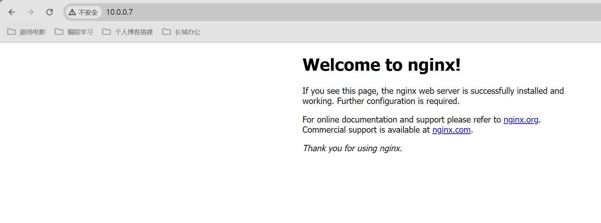
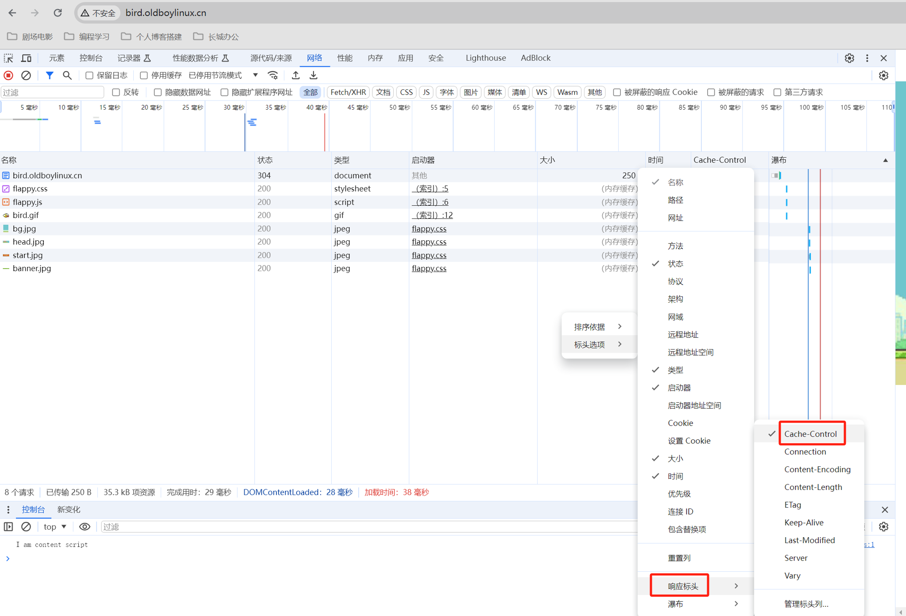
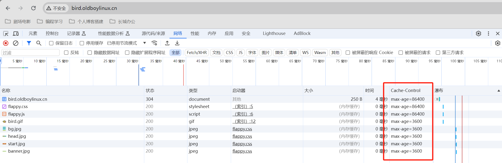

# Web集群（二）

# 一、Nginx处理用户请求流程

思考问题：之前搭建的cxk.oldboylinux.cn网站,使用域名访问或ip访问都是没有问

题的.如果把配置文件名game.cxk.oldboylinux.cn.conf使用域名或ip访问或怎么样?  

答案：

- 域名访问网站没有任何问题.
- 使用ip访问则显示静态页面,另外一个网站了  

域名访问正常：


IP访问异常



为什么是这样？它的详细原理是什么。

## 1.1 详细原理

使用域名访问网站的流程图示如下：


### 1.1.1 正常流程步骤

1、DNS解析：cxk.oldboylinux.cn --> 10.0.0.7

2、连接80端口：TCP三次握手与网站80端口建立连接

3、发送HTTP请求报文：

```shell
GET /index.html
HOST: cxk.oldboylinux.cn
User-Agent: Chrome/xxx
```

4、nginx处理：

- http请求，http区域处理
- 不同server{}区域（子配置文件）处理
  - 端口
  - 域名：用户请求的域名与子配置文件server_name进行匹配  
  - 匹配成功,就让对应的子配置文件(server{})处理
  - 根据子配置文件的,root,location规则,index进行处理查找文件.
  - 把找到的文件发回给用户  

5、HTTP响应报文：

- 状态码：200 ok
- server信息
- 其他信息
- 文件内容

6、客户收到文件，浏览器解析，进行展示

### 1.1.2 请求域名不存在的流程

对于没有正确匹配到请求域名的访问：

- 没有配置/指定默认的虚拟主机（子配置文件）
  - 把子配置文件按字母排序，返回第一个

- 配置了默认站点让用户访问
  - 返回default_server设置的默认站点

此流程只适应于没有配置过虚拟主机的域名，如果域名已经配置过server{}，只是

没有找到对应的文件，则还是会返回404


# 二、虚拟主机

在第一章中老师提到`虚拟主机`，它到底是什么？

- 一个虚拟主机：相当于是一个网站，在nginx中通过`server{}`区域实现
- 虚拟主机有**不同的类型**，配置也相同

## 2.1 概述和分类

虚拟主机的类型和介绍

| 虚拟主机的分类                             | 说明                        | 应用场景                                                     |
| ------------------------------------------ | --------------------------- | ------------------------------------------------------------ |
| <font color=red>基于域名的虚拟主机 </font> | 不同**域名**访问不同的站点. | 生产环境**最常用**的.                                        |
| 基于端口的虚拟主机                         | 不同**端口**访问不同的站点. | 保护,设置特殊端口.1024以上 8888 18888                        |
| 基于IP的虚拟主机                           | 不同**IP**访问不同的站点.   | 保护,用户只能通过某个ip连接进来. 用来限制网站只能通过指定的ip进行访问内网ip,vpn ip. |

## 2.2 基于域名的虚拟主机

顾名思义：通过不同域名访问不同的主机

案例：创建bird.oldboylinux.cn网站，站点目录`/app/code/bird/`，书写配置文件.  

>思考：
>
>1.完成后不创建站点目录进行访问看看报什么错误.
>
>2.创建站点目录后再访问看看报什么错误.
>
>3.创建首页文件和内容,访问看看显示什么  
>
>补充思考：
>
>访问一个完全没配置过虚拟主机的域名会怎样？

书写配置：

```shell
# 创建子配置文件
[root@web01[ /etc/nginx/conf.d]#cat bird.oldboylinux.cn.conf
server {
  listen 80;
  server_name bird.oldboylinux.cn;
  root /app/code/bird;
  location / {
    index index.html;
  }
}

# 重新加载服务
[root@web01[ /etc/nginx/conf.d]#systemctl reload nginx

# windows客户端做hosts解析
...
```

测试：

- 完成后不创建站点目录进行访问看看报什么错误？
  - 404错误
- 创建站点目录后再访问看看报什么错误
  - 403错误
- 创建首页文件和内容,访问看看显示什么 
  - 正常显示
- 访问一个完全没配置过虚拟主机的域名会怎样
  - hosts设置，`10.0.0.7 test.oldboylinux.cn`
  - 访问显示bird的页面，说明`1.1.2`小节流程有效


>本地测试域名的小技巧(linux)  
>
>- curl -v -H "Host: cxk.oldboylinux.cn" http://10.0.0.7/index.html
>- -H修改请求头里面的内容  

  

## 2.3 基于端口的虚拟主机

顾名思义：根据不同的端口，访问不同的网站

案例：

```shell
# 创建live网站，并将端口改为81
[root@web01[ /etc/nginx/conf.d]#cat live.oldboylinux.cn.conf
server {
  listen 81;
  server_name live.oldboylinux.cn;
  root /app/code/live;
  location / {
    index index.html;
  }
}

# 添加网页文件
[root@web01[ /app/code/live]#tree /app/code/live/
/app/code/live/
└── index.html
```

测试访问：

命令：

```shell
[root@web01[ /app/code/live]#curl -v -H "Host: live.oldboylinux.cn" http://10.0.0.7:81/index.html
* About to connect() to 10.0.0.7 port 81 (#0)
*   Trying 10.0.0.7...
* Connected to 10.0.0.7 (10.0.0.7) port 81 (#0)
> GET /index.html HTTP/1.1
> User-Agent: curl/7.29.0
> Accept: */*
> Host: live.oldboylinux.cn
>
< HTTP/1.1 200 OK
< Server: nginx/1.26.0
< Date: Tue, 07 May 2024 07:58:07 GMT
< Content-Type: text/html
< Content-Length: 252
< Last-Modified: Tue, 07 May 2024 07:54:57 GMT
< Connection: keep-alive
< ETag: "6639de51-fc"
< Accept-Ranges: bytes
<
<!DOCTYPE html>
<html lang="en">
<head>
    <meta charset="UTF-8">
    <meta name="viewport" content="width=device-width, initial-scale=1.0">
    <title>Live Show</title>
</head>
<body>
    <h1>Welcome to Live Show Page</h1>
</body>
</html>
* Connection #0 to host 10.0.0.7 left intact
```

浏览器


## 2.4 基于IP的虚拟主机

搭建mimi网站,端口是8888,只能通过172.16.1.7内网访问  

<font color=red>在listen字段需要绑定IP</font>

```shell
# 创建虚拟主机
[root@web01[ /etc/nginx/conf.d]#cat mi.oldboylinux.cn.conf
server {
  listen 172.16.1.7:8888;
  server_name mi.oldboylinux.cn;
  root /app/code/mi;
  location / {
    index index.html;
  }
}

# 添加网页文件
[root@web01[ /app/code]#tree /app/code/mi/
/app/code/mi/
└── index.html
```

测试访问

```shell
# 172网段访问成功
[root@web01[ /etc/nginx/conf.d]#curl -v -H "Host: mi.oldboylinux.cn" http://172.16.1.7:8888/index.html
* About to connect() to 172.16.1.7 port 8888 (#0)
*   Trying 172.16.1.7...
* Connected to 172.16.1.7 (172.16.1.7) port 8888 (#0)
。...
<!DOCTYPE html>
<html lang="en">
<head>
    <meta charset="UTF-8">
    <meta name="viewport" content="width=device-width, initial-scale=1.0">
    <title>Mi Mi Small Mi</title>
</head>
<body>
    <h1>年青人的第一个MI页面</h1>
</body>
</html>
* Connection #0 to host 172.16.1.7 left intact

# 10网段访问失败
[root@web01[ /etc/nginx/conf.d]#curl -v -H "Host: mi.oldboylinux.cn" http://10.0.0.7:8888/index.html
* About to connect() to 10.0.0.7 port 8888 (#0)
*   Trying 10.0.0.7...
* Connection refused
* Failed connect to 10.0.0.7:8888; Connection refused
* Closing connection 0
curl: (7) Failed connect to 10.0.0.7:8888; Connection refused
```


# 三、Nginx日志

主要内容：

- 如何给每个虚拟主机指定自己独立的错误日志  
- 如何给每个虚拟主机指定自己独立的访问日志  

## 3.1 概述

错误日志和访问日志的定义

| 日志     | 使用建议                                        | 定义                             | 使用       |
| -------- | ----------------------------------------------- | -------------------------------- | ---------- |
| 错误日志 | 发生故障的时候可以查看,4xx,5xx                  | 通过错误级别指定                 | error_log  |
| 访问日志 | 记录着用户什么时候访问 网站哪些页面,客户端信息. | 通过log_format定义访问日志的格式 | access_log |

## 3.2 错误日志

指定错误日志的位置和错误日志级别

```shell
格式:
	error_log 文件名 级别
```

错误日志级别

| 级别   | 定义                   |
| ------ | ---------------------- |
| debug  | 记录调试信息           |
| info   | 记录一般信息           |
| notice | 记录不影响操作的信息   |
| warn   | 记录警告信息           |
| error  | 记录错误信息           |
| crit   | 记录严重的错误信息     |
| alert  | 记录必须立即处理的信息 |
| emerg  | 记录紧急的信息         |

> debug: 未来主要用于调试使用，短时间开启，在网站访问量较大时别开

案例：给每个虚拟主机指定自己独立的错误日志  

```shell
[root@web01[ /etc/nginx/conf.d]#cat cxk.oldboylinux.cn.conf
server {
  listen 80;
  server_name cxk.oldboylinux.cn;
  root /app/code/cxk;
  # 设置错误日志
  error_log /var/log/nginx/cxk.oldboylinux.cn-error.log notice;
  location / {
    index index.html;
  }
}
```

**<font color=red>注意：</font>**如开启独立错误日志，需要把nginx.conf里面的error_log注释

```shell
[root@web01[ /etc/nginx/conf.d]#cat /etc/nginx/nginx.conf

user  nginx;
worker_processes  auto;

#error_log  /var/log/nginx/error.log notice;
pid        /var/run/nginx.pid;
...
```

## 3.2 访问日志

### 3.2.1 日志格式配置

辅助我们进行分析，如网站访问量，ip，pv，访问日志设置的格式

```she
log_format 格式名字 格式.....;
```

 访问日志格式

| Ngx访问日志格式(ngx内置变量) | 说明                                                         |
| ---------------------------- | ------------------------------------------------------------ |
| $remote_addr                 | 客户端ip地址                                                 |
| $remote_user                 | 用户名(空,进行认证用户)                                      |
| $time_local                  | 时间 30/Aug/2022:14:44:27 +0800                              |
| $request                     | 请求报文的起始行(请求方法 URI HTTP/1.1)                      |
| $status                      | http状态码                                                   |
| $body_bytes_sent             | 响应给客户的文件的大小,响应报文的主体大小(文件大小) 单位字节 |
| $http_referer                | 从哪里跳转,访问到这个网站的. 网站运营分析                    |
| $http_user_agent             | 客户端代理(浏览器)                                           |
| $http_x_forwarded_for        | XFF头,负载中使用,记录用户真实的ip地址.                       |

日志格式配置

```shell
[root@web01[ /var/log/nginx]#cat /etc/nginx/nginx.conf
...
http {
...
    log_format  main  '$remote_addr - $remote_user [$time_local] "$request" '
                      '$status $body_bytes_sent "$http_referer" '
                      '"$http_user_agent" "$http_x_forwarded_for"';

#    access_log  /var/log/nginx/access.log  main;
...
}
```

### 3.2.2 访问日志配置

access_log指定日志，使用对应格式

```shell
access_log 日志位置 格式
```

案例：给每个虚拟主机指定自己独立的访问日志  

```shell
[root@web01[ /etc/nginx/conf.d]#cat cxk.oldboylinux.cn.conf
server {
  listen 80;
  server_name cxk.oldboylinux.cn;
  error_log  /var/log/nginx/cxk.oldboylinux.cn-error.log notice;
  access_log /var/log/nginx/cxk.oldboylinux.cn-access.log main;
  root /app/code/cxk;
  location / {
    index index.html;
  }
}
```

**<font color=red>注意：</font>**如开启独立错误日志，需要把nginx.conf里面的access_log注释

```shell
[root@web01[ /etc/nginx/conf.d]#cat /etc/nginx/nginx.conf
...
#    access_log  /var/log/nginx/access.log  main;
```

查看效果

```shell
[root@web01[ /etc/nginx/conf.d]#tree /var/log/nginx/
/var/log/nginx/
├── access.log
├── cxk.oldboylinux.cn-access.log
├── cxk.oldboylinux.cn-error.log
└── error.log
```

### 3.2.3 访问日志其他选项

了解即可，未来根据需要进行配置

| access_log       | 说明                                             |
| ---------------- | ------------------------------------------------ |
| 访问日志进行压缩 | gzip需要通过zcat/zless/zgrep查看                 |
| 进行缓存         | buffer = 32k 先把日志写入到内存中,定期写入到磁盘 |
| 定义刷新时间     | flush =10s                                       |

配置如下：

```shell
[root@web01[ /etc/nginx]#cat conf.d/cxk.oldboylinux.cn.conf
server {
  listen 80;
  server_name cxk.oldboylinux.cn;
  root /app/code/cxk;
  error_log  /var/log/nginx/cxk.oldboylinux.cn-error.log notice;
  access_log /var/log/nginx/cxk.oldboylinux.cn-access.log main gzip buffer=32k flush=10s;
  location / {
    index index.html;
  }
}
```


# 四、Location规则

通过两个案例来了解location规则

## 4.1 location概述

ngx的location规则，也叫**路由规则**

- 在ngx用于匹配用户请求中的uri，ngx对用户请求中的uri进行判断.
- 如果用户请求的uri是xxxx,则做xxxx.  

> **URI和URL的区别**
>
> URL：网址 https://nginx.org/en/docs/
>
> URI：/en/docs/
>
> 
>
> 对比：http://www.baidu.com/lidao/lidao.avi
>
> URI：/lidao/lidao.avi 域名后面的内容
>
> URL: http://www.baidu.com/lidao/lidao.avi 网址
>
> 
>
> 对比：http://www.baidu.com
>
> URI: / 域名后面的内容
>
> URL: http://www.baidu.com 网址  

location规则说明

| location规则                    | 说明                                                         |
| ------------------------------- | ------------------------------------------------------------ |
| ⭐location / {xxxx}              | 默认规则,保底,location规则在进行匹配的时候,其他的规则都匹配失败了,这时候匹 配默认的规则. |
| ⭐location /image/ {}            | 用于匹配请求的uri (路径) cxk.oldboylinux.cn/image/lidao.txt ✅ |
| ⭐location ~ \. (jpg\|jpeg)$ {}  | 支持正则,区分大小写 cxk.oldboylinux.cn/lidao/lidao.jpg       |
| ⭐location ~* \. (jpg\|jpeg)$ {} | 支持正则,不区分大小写 cxk.oldboylinux.cn/lidao/lidao.jpg     |
| location ^~ /lidao/             | 不支持正则,仅仅匹配普通字符,很少使用,优先.                   |
| location = /50x.html            | 不支持正则,精确匹配,使用较少.                                |
| location @名字 {}               | 命名的location一般用于return/error_log 跳转.                 |

location匹配优先级

| 优先级 | 符号    |
| ------ | ------- |
| 1      | =       |
| 2      | ^~      |
| 3      | ~、~*   |
| 4      | /image/ |
| 5      | /       |

## 4.2 location案例1

案例：搭建大型直播购物网站  

```shell
要求：
域名:buy.oldboylinux.cn
站点目录:/app/code/buy/ 首页文件index.html
后台管理页面:/app/code/buy/admin/index.html
要求后台页面（admin）只能内网访问:172.16.1.0/24网段
```

配置虚拟主机：

```shell
[root@web01[ /etc/nginx/conf.d]#cat buy.oldboylinux.cn.conf
server {
  listen 80;
  server_name buy.oldboylinux.cn;
  root /app/code/buy;
  error_log  /var/log/nginx/buy.oldboylinux.cn-error.log notice;
  access_log /var/log/nginx/buy.oldboylinux.cn-access.log main;

  location / {
    index index.html;
  }

  #buy.oldboylinux.cn/admin/
  #uri: /admin/

  # 后台页面特殊配置
  location /admin {
    # 准许172.16.1.0/24网段访问
    allow 172.16.1.0/24
    # 拒绝其他所有
    deny all
  }
}
```

添加网页文件

```shell
[root@web01[ /app/code/buy]#echo "buy web site" > index.html
[root@web01[ /app/code/buy]#echo "admin web site" > admin/index.html
[root@web01[ /app/code/buy]#tree /app/code/buy/
/app/code/buy/
├── admin
│   └── index.html
└── index.html
```

测试访问

```shell
# 10网段访问主页面 --- OK
[root@web01[ /app/code]#curl -v -H "Host: buy.oldboylinux.cn" http://10.0.0.7:80/index.html
* About to connect() to 10.0.0.7 port 80 (#0)
...
< HTTP/1.1 200 OK
...
buy web site

# 10网段访问admin页面 --- ERROR
[root@web01[ /app/code]#curl -v -H "Host: buy.oldboylinux.cn" http://10.0.0.7:80/admin/index.html
* About to connect() to 10.0.0.7 port 80 (#0)
...
< HTTP/1.1 403 Forbidden

# 172网段访问admin页面 --- OK
[root@web01[ /app/code]#curl -v -H "Host: buy.oldboylinux.cn" http://172.16.1.7:80/admin/index.html
* About to connect() to 10.0.0.7 port 80 (#0)
...
< HTTP/1.1 200 OK
...
admin web site
```

## 4.3 location案例2

案例：搭建bird小鸟飞飞网站，给网站加速，设置缓存，网站中html、js、css结

尾的文件缓存1天，图片缓存1小时 。

>缓存了解：
>
>基本配置浏览器访问并没有缓存  

配置：

```shell
[root@web01[ /app/code/bird]#cat /etc/nginx/conf.d/bird.oldboylinux.cn.conf
server {
  listen 80;
  server_name bird.oldboylinux.cn;
  root /app/code/bird;
  location / {
    index index.html;
  }

  # uri包含 .html或者.js或者.css 缓存1天
  location ~* \.(html|js|css)$ {
    expires 1d;
    #expires max;
  }

  # uri包含 .jpg或.jpge或.png或.gif或.bmp 缓存1小时
  location ~* \.(jpg|jpeg|png|gif|bmp)$ {
    expier 1h;
  }
}
```

网页内容

```shell
# 下载flyppy bird
https://gitee.com/rc-wei/JS-Flappy-Bird/repository/archive/master.zip

# 导入
[root@web01[ /app/code/bird]#tree .
.
├── flappy.css
├── flappy.js
├── img
│   ├── banner.jpg
│   ├── bg.jpg
│   ├── bird.gif
│   ├── down.gif
│   ├── down_mod.png
│   ├── down_pipe.png
│   ├── head.jpg
│   ├── start.jpg
│   ├── up.gif
│   ├── up_mod.png
│   └── up_pipe.png
├── index.html
└── README.md
```

测试访问正常


chrome浏览器F12开启缓存查看



缓存生效



## 4.4 location案例3

```shell
server {
    listen 80;
    server_name l.oldboylinux.cn;
    default_type text/html;

    location / {
      return 200 "location /\n";
    }
    location = /index.html {
      return 200 "location =/\n";
    }
    location ~ /index.html {
      return 200 "location ~/\n";
    }
    location ^~ /index.html {
      return 200 "location ^~\n";
    }
}
```

以上的访问优先级是什么？

```shell
location = / {
[ configuration A ]
}
location / {
[ configuration B ]
}
location /documents/ {
[ configuration C ]
}
location ^~ /images/ {
[ configuration D ]
}
location ~* \.(gif|jpg|jpeg)$ {
[ configuration E ]
}
```

测试访问

```shell
“/” 						A
“/index.html” 				B
“/documents/document.html” 	C
“/images/1.gif” 			D
“/documents/1.jpg” 			E
```


