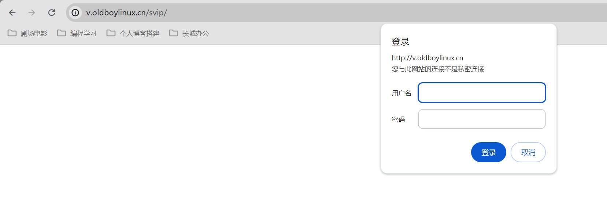
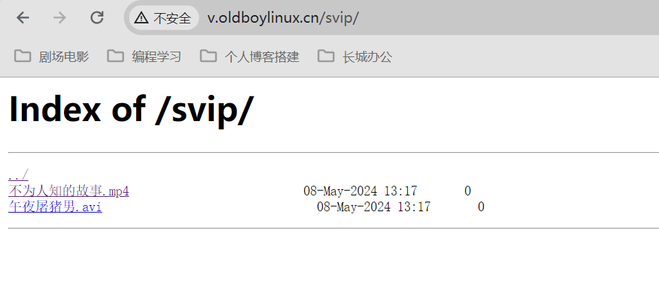
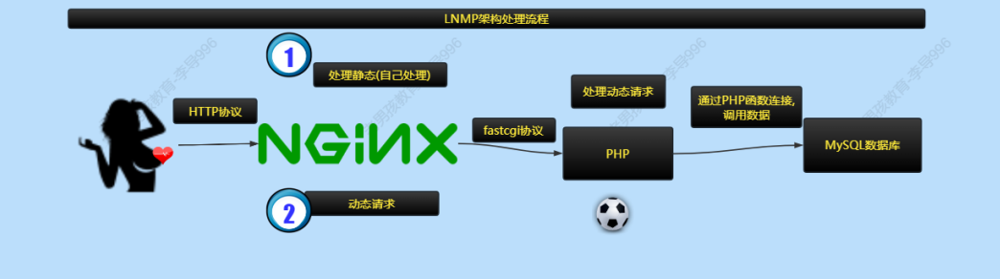
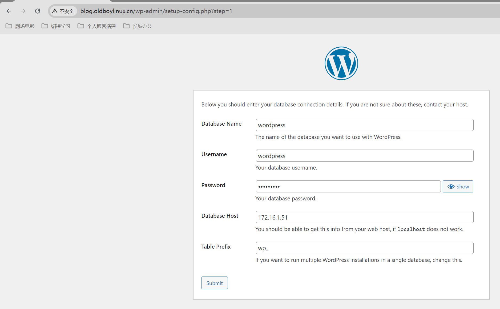
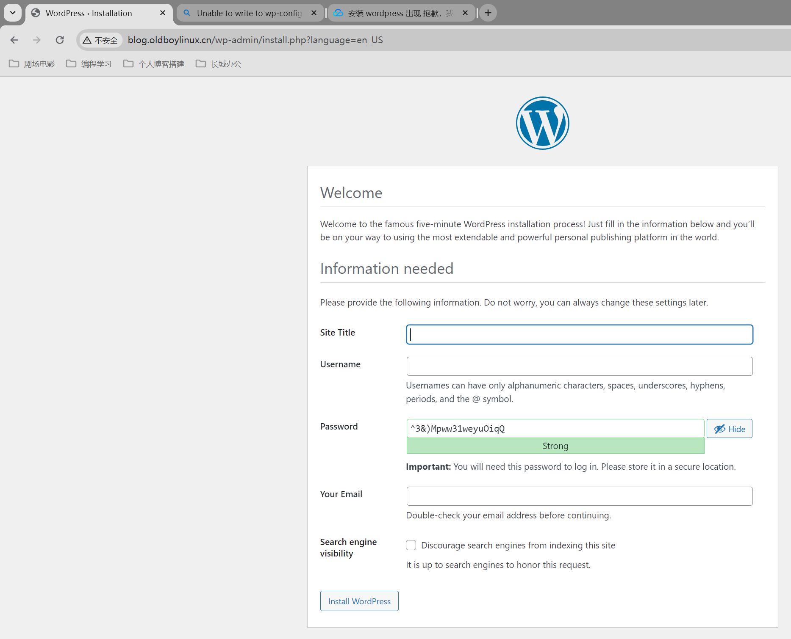

# Web集群（三）

今日内容：

1、搭建高检视频下载站点

2、动态网站架构（部署一份开发的PHP代码）

# 一、搭建高清视频下载站点

目标：提供网页目录结构，类似：清华大学开源软件镜像站

要求：

1. 浏览器打开后，显示目录结构(如上图)。
2. 增加svip功能
3. 增加统计功能,统计nginx服务的状态,访问情况

## 1.1 站点基本配置

配置要求：

- 域名:v.oldboylinux.cn
- 站点目录: /app/code/v/
- touch 几个文件即可  
- 自动索引功能（列表站点目录的功能），首页文件不存在

其中自动索引功能需要用到autoindex模块

| 使用方法                  | 功能                                                         |
| ------------------------- | ------------------------------------------------------------ |
| autoindex on ;            | 开启目录索引功能(显示站点目录下的文件的列表,首页文件不存在.) |
| autoindex_localtime on;   | 显示本地时间.                                                |
| autoindex_exact_size off; | 是否显示精确的文件的大小. off表示以人类可读形式显示大小      |

配置如下：

```shell
[root@web01[ /etc/nginx/conf.d]#cat v.oldboylinux.cn.conf
server {
  listen 80;
  server_name v.oldboylinux.cn;
  root /app/code/v;
  error_log  /var/log/nginx/v.oldboylinux.cn-error.log notice;
  access_log /var/log/nginx/v.oldboylinux.cn-access.log main;
  charset utf8;		# 字符集
  autoindex on;		
  autoindex_localtime on;
  autoindex_exact_size off;
  location / {
    index index.html;
  }
}
```

准备文件

```shell
[root@web01[ /app/code/v]#ls
苍老师教学.avi  葫芦娃.avi
```

reload服务，设置hosts访问


## 1.2 增加VIP认证功能

需求：

- 增加一个svip目录,里面创建文件.
- 增加认证功能(用户名和密码).
- 只要用户访问的路径中包含VIP资源，提示输入密码

认证功能，需要使用到auth_basic模块  

```shell
auth_basic "请输入密码:"; #输出提示,根据不同浏览器,可能不显示.
auth_basic_user_file conf/htpasswd; #指定用户名,密码文件
```

实现：创建密码文件

```shell
# 1、安装httpd-tools工具
[root@web01[ /]# yum install -y httpd-tools

# 2、创建用户文件-c, -b为明文密码追加
[root@web01[ /]#htpasswd -bc /etc/nginx/user lidao996 redhat123
Adding password for user lidao996

# 用户文件追加用户
[root@web01[ /]#htpasswd -b /etc/nginx/user oldboy redhat123
Adding password for user oldboy

# 修改用户文件权限
[root@web01[ /]#chmod 600 /etc/nginx/user
[root@web01[ /]#chown nginx.nginx /etc/nginx/user
```

虚拟主机配置文件修改：

```shell
[root@web01[ /etc/nginx/conf.d]#cat v.oldboylinux.cn.conf
server {
  listen 80;
  server_name v.oldboylinux.cn;
  root /app/code/v;
  error_log  /var/log/nginx/v.oldboylinux.cn-error.log notice;
  access_log /var/log/nginx/v.oldboylinux.cn-access.log main;
  charset utf8;
  autoindex on;
  autoindex_localtime on;
  autoindex_exact_size off;

  location / {
    index index.html;
  }
  
  # 新增认证功能
  location /svip/ {
    auth_basic "请输入密码: ";
    auth_basic_user_file /etc/nginx/user;
  }
}
```

检查语法

```she
[root@web01[ /app/code/v]#nginx -t
nginx: the configuration file /etc/nginx/nginx.conf syntax is ok
nginx: configuration file /etc/nginx/nginx.conf test is successful
```

创建svip目录

```shell
[root@web01[ /app/code/v]#ls -l
total 0
drwxr-xr-x. 2 root root 66 May  8 13:17 svip
-rw-r--r--. 1 root root  0 May  8 13:02 苍老师教学.avi
-rw-r--r--. 1 root root  0 May  8 13:02 葫芦娃.avi
[root@web01[ /app/code/v]#ls svip/
不为人知的故事.mp4  午夜屠猪男.avi
```

浏览器访问，提示输入密码



密码正确，访问成功



## 1.3 增加统计功能 

要求：

1. 显示nginx状态信息，未来用于监控nginx
2. 熟练使用状态模块

显示nginx的状态信息，需要用到stub_status模块

### 1.3.1 统计功能配置

配置文件追加status模块

```shell
[root@web01[ /app/code/v]#cat /etc/nginx/conf.d/v.oldboylinux.cn.conf
server {
...
  location /svip/ {
    auth_basic "请输入密码: ";
    auth_basic_user_file /etc/nginx/user;
  }
  
  # status模块
  location /status {
    stub_status;
  }
}
```

浏览器访问


### 1.3.2 状态模块指标说明

| ngx状态模块中的指标说明 | 说明                                | 说明         |
| ----------------------- | ----------------------------------- | ------------ |
| Active connections      | 当前已经建立的连接数(est)和等待数量 | 体现:ngx并发 |
| server accepts          | 已经接收到客户端的连接总数.         |              |
| handled                 | 服务端已经处理的连接.               |              |
| requests                | 客户端发出请求的总数.               |              |
| reading                 | 正在读取的请求头连接数量            |              |
| writing                 | 正在进行的响应的连接数量            |              |
| waiting                 | 排队数量                            | 排队情况     |

### 1.3.3 网页压力测试

在mn01使用ab工具做网页压力测试

```shell
[root@mn01[ ~]#ab -n 9999999 -c 3 -H Host:v.oldboylinux.cn http://10.0.0.7/
This is ApacheBench, Version 2.3 <$Revision: 1430300 $>
Copyright 1996 Adam Twiss, Zeus Technology Ltd, http://www.zeustech.net/
Licensed to The Apache Software Foundation, http://www.apache.org/

Benchmarking 10.0.0.7 (be patient)
```

查看网页nginx状态信息，请求处理不断增多

```shell
Active connections: 2 
server accepts handled requests
 158568 158568 158597 
Reading: 0 Writing: 1 Waiting: 1 
```

## 1.4 nginx模块小结

目前接触到的一些nginx模块

| 模块         | 核心指令                                     | 重要程度 |
| ------------ | -------------------------------------------- | -------- |
| 目录索引模块 | autoindex on;                                | ※        |
| 认证功能模块 | auth_basic_user_file;                        | ※        |
| 访问控制模块 | allow, deny                                  | ※※※      |
| 状态模块     | stub_status                                  | ※※※※※    |
| ngx核心模块  | root, location, err_log, server_name, listen | ※※※※※    |
| ngx日志模块  | access_log_format                            | ※※※※     |


# 二、动态网站架构

案例：部署一份开发的php代码（wordpress网站）

要求：开发书写了一个php代码发给我们部署

1. 测试能否直接部署到nginx中？
2. 需要什么服务，是什么原理？
3. 准备服务并测试。
4. 部署代码。  

## 2.1 概述

了解什么是动态、静态网站

| 网站架构 | 说明与特点                                                   | 性能                                                         | 一句话说明                                     |
| -------- | ------------------------------------------------------------ | ------------------------------------------------------------ | ---------------------------------------------- |
| 静态网站 | 网站仅仅包含:html、css样式、js脚本、图片、视频...等ngx可以直接处理的静态资源. | 只需要web服务器即可；nginx,可以承受较 高的访问量；不支持动态的功能，如：注册,、论。静态网站功能单一 | 浏览器端解析(客户端解析),服务 端仅仅负责发送.  |
| 动态网站 | 动态网站一般是通过开发语言实现如:java、php、python、Golang等 | 动态资源页面需要服务器进行处理，如nginx+php/tomcat+数据库，处理后把结果返回给用户. | 动态请求需要服务端进行处理与解 析,把结果给用户 |

如何区分静态资源和动态资源

- 通过url可以初步判断网站的类型
- url中包含`&`或`?`一般都是动态网站  

## 2.2 常见动态网站架构

常见架构如下：

- PHP: LNMP(LEMP), LAMP, WNMP/WAMP (P--->PHP,W--->Windows,A--->Apache)
- Java: LNMT(Tomcat,Jetty,Weblogic,Jboss)
- Python: LNMP(Python,uwsgi)
- Golang: LNMG(Golang)
- C/C++: LNM?........  

LNM是什么意思？

- Linux 系统
- Nginx Web服务 Engine X
- MySQL/MariaDB 数据库  

也有LAMP和WNMP：

- LAMP A ---> apache 							 目前很少使用
- WNMP/WAMP W ---> Windows 		一般开发使用  

## 2.3 LNMP架构细节

### 2.3.1 LNMP流程图

Nginx处理静态请求流程


Nginx处理动态请求流程



### 2.3.2 数据库

数据库基本概念: 库,表,字段,记录 知晓所属关系即可.  

库：database，相当于一个excel文件

表：table，相当于excel文件中的一个sheet（表格）

字段：列，字段名字（某列的名字）

记录：行，某个数据


实操：

创建数据库服务器 10.0.0.51/172.16.1.51

#### a) 安装 

安装mariadb数据库

```shell
# 1.安装
yum install -y mariadb-server
#mariadb-server 服务端
#mariadb 客户端

# 2.启动服务
systemctl enable mariadb
systemctl start mariadb

# 3.检查进程状态
ss -lntup |grep mysql
ps -ef |grep mysql
```

数据库安全配置

```shell
# 刚安装后运行，首次运行即可，用于设置root密码,清理用户和清理临时库.
[root@db01[ ~]#mysql_secure_installation

# 输入当前密码，没有，直接回车
Enter current password for root (enter for none):回
车

# 设置密码，交互输入
Set root password? [Y/n] Y设置密码
New password: 输入密码
Re-enter new password: 再次输入
Password updated successfully!
Reloading privilege tables...
... Success!

# 删除数据库中的匿名用户(没有用户名的用户,容易导致安全问题)
Remove anonymous users? [Y/n] Y 

# 是否禁止root远程登录
Disallow root login remotely? [Y/n] Y 

# 是否删除test测试用的数据库
Remove test database and access to it? [Y/n] Y 

# 是否更新权限信息表
Reload privilege tables now? [Y/n] Y 
```

进入数据库内部

```shell
# 使用帐号密码进入
[root@db01[ ~]#mysql -uroot -predhat123
# 将出现交互文字
Welcome to the MariaDB monitor.  Commands end with ; or \g.
Your MariaDB connection id is 10
Server version: 5.5.68-MariaDB MariaDB Server

Copyright (c) 2000, 2018, Oracle, MariaDB Corporation Ab and others.

Type 'help;' or '\h' for help. Type '\c' to clear the current input statement.

MariaDB [(none)]>	
```

#### b) 数据库查找-基本

```shell
# 查看所有的数据库
MariaDB [(none)]> show databases;
+--------------------+
| Database           |
+--------------------+
| information_schema |
| mysql              |
| performance_schema |
+--------------------+
3 rows in set (0.00 sec)

# 查看库里的表
MariaDB [(none)]> show tables from mysql;
+---------------------------+
| Tables_in_mysql           |
+---------------------------+
| columns_priv              |
| db                        |
| event                     |
| func                      |
| general_log               |
...

# 从表里查找字段（user、host）
MariaDB [(none)]> select user,host from mysql.user;
+------+-----------+
| user | host      |
+------+-----------+
| root | 127.0.0.1 |
| root | ::1       |
| root | localhost |
+------+-----------+
3 rows in set (0.00 sec)
```

#### c) 创建数据库

```shell
创建数据库(熟练)
create database lidao;
创建用户(会用,会改) 未来通过用户管理数据库.
#创建用户,进行授权
grant all on lidao.* to 'lidao'@'localhost' identified by 'redhat123';
grant all on lidao.* to 'lidao'@'172.16.1.%' identified by 'redhat123';
# grant 所有权限 on 数据库.* to '用户名'@'白名单'
```

#### d) 删除数据库

```shell
# 删除数据库
drop database lidao;
# 删除用户
drop user 'lidao'@'172.16.1.%' ;
drop user 'lidao'@'localhost' ;
```

#### e) 创建wordpress数据库

创建

```shell
MariaDB [(none)]> create database wordpress;
Query OK, 1 row affected (0.00 sec)

MariaDB [(none)]> grant all on wordpress.* to 'wordpress'@'localhost' identified by 'redhat123';
Query OK, 0 rows affected (0.00 sec)

MariaDB [(none)]> grant all on wordpress.* to 'wordpress'@'172.16.1.%' identified by 'redhat123';
Query OK, 0 rows affected (0.00 sec)
```

测试

```shell
# 本地连接
[root@db01[ ~]#mysql -uwordpress -predhat123
Welcome to the MariaDB monitor.  Commands end with ; or \g.
...
MariaDB [(none)]> 

# 远程连接，web01 --> db01
[root@web01[ /app/code/v]#mysql -uwordpress -predhat123 -h 172.16.1.51
Welcome to the MariaDB monitor.  Commands end with ; or \g.
...
MariaDB [(none)]>
```

> 补充：
>
> 程序代码怎么连接数据库？
>
> - 通过数据库相关的配置文件设置

### 2.3.2 PHP


#### a) 安装

<font color=red>在web01操作</font>

案例选择php 7.x，在生产环境中，需要根据开发书写代码环境准备即可.  

```shell
# 配置yum源
[root@web01[ /]#cat /etc/yum.repos.d/php.repo
[webtatic-php]
name = php Repository
baseurl = http://us-east.repo.webtatic.com/yum/el7/x86_64
enabled = 1
gpgcheck = 0

# 安装
yum install -y php72w php72w-cli php72w-common php72w-devel php72w-embedded php72w-gd php72w-mcrypt php72w-mbstring php72w-pdo php72w-xml php72w-fpm php72w-mysqlnd php72w-opcache php72w-pecl-memcached php72w-pecl-redis php72w-pecl-mongodb

# 启动服务
[root@web01[ /]#systemctl enable nginx php-fpm
Created symlink from /etc/systemd/system/multi-user.target.wants/php-fpm.service to /usr/lib/systemd/system/php-fpm.service.
[root@web01[ /]#systemctl start nginx php-fpm

# 查看进程状态
[root@web01[ /]#ss -lntup | grep php
tcp    LISTEN     0      128    127.0.0.1:9000                  *:*                   users:(("php-fpm",pid=3789,fd=9),("php-fpm",pid=3788,fd=9),("php-fpm",pid=3787,fd=9),("php-fpm",pid=3786,fd=9),("php-fpm",pid=3785,fd=9),("php-fpm",pid=3784,fd=7))

[root@web01[ /]#ps -ef | grep php
root       3784      1  0 19:04 ?        00:00:00 php-fpm: master process (/etc/php-fpm.conf)
apache     3785   3784  0 19:04 ?        00:00:00 php-fpm: pool www
apache     3786   3784  0 19:04 ?        00:00:00 php-fpm: pool www
apache     3787   3784  0 19:04 ?        00:00:00 php-fpm: pool www
apache     3788   3784  0 19:04 ?        00:00:00 php-fpm: pool www
apache     3789   3784  0 19:04 ?        00:00:00 php-fpm: pool www
root       3805   1866  0 19:04 pts/0    00:00:00 grep --color=auto php
```

#### b) php用户设置

php用户与nginx统一，统一为nginx

```shell
# 修改php配置文件
[root@web01[ /]#egrep -n '^user|^group' /etc/php-fpm.d/www.conf
8:user = nginx
10:group = nginx
```

### 2.3.3 nginx配置

配置信息如下

```shell
server {
  listen 80;
  server_name blog.oldboylinux.cn;
  root /app/code/blog;
  error_log /var/log/nginx/blog-error.log notice;
  access_log /var/log/nginx/blog-access.log main;
  location / {
    index index.php;
  }
  location ~ \.php$ {
  fastcgi_pass 127.0.0.1:9000;
  fastcgi_index index.php;
  fastcgi_param SCRIPT_FILENAME
  $document_root$fastcgi_script_name;
  include fastcgi_params;
}

```

### 2.3.4 部署wordpress

ngxin虚拟主机

```shell
[root@web01[ /app/code]#cat /etc/nginx/conf.d/blog.oldboylinux.cn.conf
server {
  listen 80;
  server_name blog.oldboylinux.cn;
  root /app/code/blog;
  error_log /var/log/nginx/blog-error.log notice;
  access_log /var/log/nginx/blog-access.log main;
  location / {
    index index.php;
  }
  location ~ \.php$ {
    fastcgi_pass 127.0.0.1:9000;
    fastcgi_index index.php;
    fastcgi_param SCRIPT_FILENAME $document_root$fastcgi_script_name;
    include fastcgi_params;
  }
}
```

浏览器访问：http://blog.oldboylinux.cn，进入配置页面


设置数据库信息



遇到不能写入wp-config.php文件的问题


创建该文件，把内容粘贴进去

```shell
[root@web01[ /app/code/blog]#cat wp-config.php
<?php
/**
 * The base configuration for WordPress
 *
...
```

再点击Run the installation，会来到welcome界面



设置博客标题、账户、密码等信息


设置完，在进入，来到登陆界面


登录后的界面


## 2.4 LNMP排错与调试方法

### 2.4.1 测试nginx + php静态页面

仍以blog虚拟主机为载体，设置如下php文件作为网站内容

```shell
[root@web01[ /app/code/blog]#cat info.php
<?php
phpinfo();
?>
```

访问：http://blog.oldboylinux.cn/info.php


### 2.4.2 测试ngxin + php动态页面

配置界面

```shell
[root@web01[ /app/code/blog]#cat info.php
<?php
// 数据库地址
$db_host='172.16.1.51';
// 数据库用户名
$db_user='wordpress';
$db_pass='redhat123';
$link_id=mysqli_connect($db_host,$db_user,$db_pass);
if($link_id){
  echo "mysql successful by oldboy lidao996!\n" ;
}else{
  echo "connection failed!\n" ;
}
?>
```

测试

